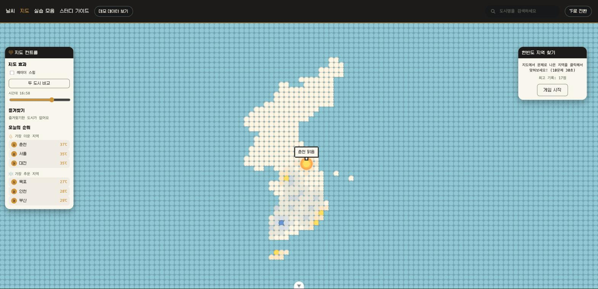

# skala-vue — 픽셀 날씨 대시보드

Vue.js 강의 4일 과정의 종합과제 저장소입니다. 하루 단위로 새로 만든 게 아니라, **1일차 정적 Mockup을 3일에 걸쳐 이어서 발전시킨 하나의 결과물**입니다.

🔗 **배포 페이지**: https://wodnjs2020136144.github.io/skala-vue/

실제 프로젝트 코드는 [`skala-vue/`](./skala-vue) 폴더 안에 있습니다.

## 진행 과정 요약

| 일차 | 단계 | 내용 |
|---|---|---|
| 1일차 (7/31) | 날씨 Mockup | `v-for`/`v-if`로 도시별 날씨 카드 정적 렌더링, 검색창 양방향 바인딩 |
| 2일차 (8/3) | Composition API + 컴포넌트 분리 | `computed`/`watch`/`watchEffect`로 검색·필터링 반응형화, 4개 컴포넌트로 분리 |
| 3일차 (8/4) | Router · Pinia · Axios | 목록↔상세 라우팅, Pinia로 ℃/℉ 전역 상태 관리, OpenWeatherMap 실시간 API 연동 |
| 4일차 (8/5) | 마무리 + 부가 실습 | Element Plus, Modern JS 정리 + (부가) 픽셀 지도 페이지, 드래그 가능한 창, 미니게임 등 |

각 날짜의 상세 작업 기록(요구사항/사고 과정/트러블슈팅/결과)은 [`skala-vue/docs/reports/`](./skala-vue/docs/reports)에 있습니다.

## 화면

| 날씨 목록 (검색·정렬·요약 통계) | 픽셀 지도 (호버 말풍선·지도 컨트롤 패널) |
|---|---|
|  |  |

## 주요 기능

- **날씨 목록/검색/상세**: 도시별 실시간 날씨를 카드로 보여주고, 검색으로 필터링, 클릭하면 상세 페이지로 이동
- **℃/℉ 단위 전환**: Pinia 전역 상태로 관리되어 목록·상세 어디서나 동일하게 반영
- **실시간 API 연동**: OpenWeatherMap API + Axios, 로딩/에러 상태 처리, API Key 없이도 볼 수 있는 데모 데이터 모드
- **레트로 LED 픽셀 컨셉의 날씨 지도**: 한반도를 도트 매트릭스로 표현한 인터랙티브 지도 — 커서를 따라가는 파동/눌림 효과, 클릭 시 폭발 이펙트, 드래그로 옮길 수 있는 정보창·게임창, 지도를 게임판으로 쓰는 "한반도 지역 찾기" 미니게임 포함

## 기술 스택

Vue 3 (Composition API, `<script setup>`) · Vite · Vue Router · Pinia · Axios · Element Plus

## 로컬에서 실행하기

```bash
cd skala-vue
npm install
cp .env.example .env   # VITE_OPENWEATHER_API_KEY에 OpenWeatherMap API Key 입력
npm run dev
```

API Key 없이 둘러보고 싶다면, 상단 내비게이션의 "데모 데이터 보기" 토글을 켜면 실제 API 호출 없이 더미 날씨 데이터로 모든 화면을 확인할 수 있습니다.

## 빌드

```bash
cd skala-vue
npm run build
```

## 체크리스트 대비 구현 메모

- **4개 컴포넌트 분리**: `BaseDashboardCard.vue` / `SearchBar.vue` / `WeatherCard.vue`는 강의안 파일명 그대로 존재합니다. 다만 이 셋을 조립하는 "부모" 역할은 `WeatherParent.vue`라는 별도 파일이 아니라 `src/views/WeatherHomeView.vue`가 맡고 있습니다(Vue Router 도입 이후 목록 화면이 라우트 뷰가 되면서 자연스럽게 뷰 파일이 그 역할을 흡수했습니다).
- **Element Plus**: 실제 서비스 화면에서는 상세 페이지 로딩 상태(`ElSkeleton`, `WeatherDetailView.vue`)에 적용했습니다. 나머지 화면은 프로젝트 초반부터 이어온 커스텀 레트로 픽셀 테마를 유지하려고 의도적으로 기본 Element Plus 스타일을 덜 썼습니다. Element Plus 컴포넌트(`el-card`/`el-button`/`ElMessage`/`ElMessageBox` 등)는 `src/components/practices/elementplus/`의 실습 챌린지 3종에서 더 폭넓게 다룹니다.
- **API Key 노출**: 정적 사이트(클라이언트 전용 SPA)라 `VITE_OPENWEATHER_API_KEY`가 빌드 결과물(JS 번들)에 그대로 포함되어 배포 사이트에서 확인 가능합니다. 서버가 없는 구조상 불가피한 제약이며, OpenWeatherMap 무료 티어 키라 리스크가 크지 않다고 판단해 그대로 뒀습니다(`src/services/weatherApi.js` 코드 주석에도 명시).

## 4일간 트러블슈팅 요약

전체 상세 기록은 [`skala-vue/docs/reports/`](./skala-vue/docs/reports)에 날짜별로 있고, 그중 반복적으로 배운 것들만 추립니다.

- **한글(IME) 입력 깨짐**: 1일차 검색창에서 `@input`만 쓰면 조합 중인 한글이 중간에 끊겨 보이는 문제가 있었습니다 — `v-model`이 내부적으로 IME composition을 올바르게 처리해준다는 걸 확인하고 이를 활용했습니다.
- **Vue SFC 간 로직 재사용의 한계**: `<script setup>` 안의 함수는 다른 컴포넌트에서 바로 import할 수 없습니다. 지도 페이지의 날씨 파티클 애니메이션을 아이콘 컴포넌트와 공유하려다 이 제약에 부딪혀, 계산 로직을 `src/utils/`의 순수 JS 모듈로 뽑아내는 리팩터링을 먼저 거쳤습니다.
- **Vue 반응형과 rAF 애니메이션의 충돌**: 지도 위 커서 파동·줌 애니메이션처럼 매 프레임 값이 바뀌는 상태를 `ref`로 관리하면, 도트 수천 개짜리 `v-for` 전체가 매 프레임 다시 diff되어 눈에 띄게 느려졌습니다 — 애니메이션 프레임 값은 의도적으로 반응형 밖에서 순수 JS 변수로 관리하고 `style.setProperty`로 DOM에 직접 반영하는 방식으로 바꿔 해결했습니다.
- **"스타일 쓰기 → 같은 프레임에 레이아웃 읽기" 강제 리플로우**: 지도 줌 애니메이션이 유독 느리다는 피드백을 받고 원인을 추적한 결과, 매 프레임 `transform`을 쓴 직후 `getBoundingClientRect()`를 무조건 다시 호출하고 있었습니다. 포인터 조작이 실제로 필요할 때만 지연 계산하도록 바꿔 해결했습니다(자세한 내용은 `docs/reports/day4.md` 참고).
- **`clip-path`가 자기 자신의 가상 요소도 함께 자른다는 점**: 말풍선 꼬리(`::before`/`::after`)를 박스 바깥에 그렸는데, 같은 엘리먼트에 걸어둔 `clip-path`가 그 가상 요소까지 통째로 잘라버려 꼬리가 전혀 안 보이는 버그가 있었습니다. 클리핑이 필요한 "몸통"과 클리핑되면 안 되는 "꼬리"를 서로 다른 엘리먼트로 분리해 해결했습니다.
- **모바일 실기기에서만 보이는 문제들**: 데스크톱 브라우저로는 iOS Safari의 상시 하단 바(홈 인디케이터 영역)가 UI를 가리는 문제나, 좁은 화면에서 게임 줌이 과해지는 문제를 재현할 수 없었습니다 — 사용자가 실기기 스크린샷으로 알려준 뒤에야 `env(safe-area-inset-bottom)`과 컨테이너 실측 크기 기반 줌 상한으로 고칠 수 있었습니다.

## 셀프 코드 리뷰

- **컴포넌트가 한 가지 역할만 하고 있나요?** 대체로 그렇지만 `WeatherMapView.vue`는 지도·정보창·게임창·팝업을 한 파일에서 관리해 상대적으로 큽니다(다만 지도 자체의 렌더링/인터랙션 로직은 `KoreaMapDots.vue`로 분리돼 있어 뷰 파일은 주로 "배치·상태 연결"만 담당합니다).
- **굳이 반응형으로 안 만들어도 되는 걸 반응형으로 만들지 않았나요?** 오히려 반대 방향으로 신경 썼습니다 — 지도의 파동/줌처럼 매 프레임 바뀌는 애니메이션 값은 일부러 `ref`를 쓰지 않고 순수 JS 변수 + `style.setProperty`로 직접 다뤄, 도트 수천 개짜리 그리드가 매 프레임 반응형 재계산에 걸리지 않게 했습니다.
- **API 요청 중·실패 상황을 사용자가 알 수 있게 처리했나요?** 날씨 목록/상세/지도 세 곳 모두 `isLoading`/`loadError` 패턴을 일관되게 적용해 로딩 문구·에러 문구를 보여줍니다.
- **변수·함수 이름만 보고 무엇을 하는지 알 수 있나요?** 대체로 의도가 드러나는 이름을 쓰려고 했지만, `WeatherParent.vue`처럼 강의안 문서상 이름과 실제 파일명이 어긋난 부분이 있었습니다(이번에 이 README로 대응관계를 보완했습니다).
