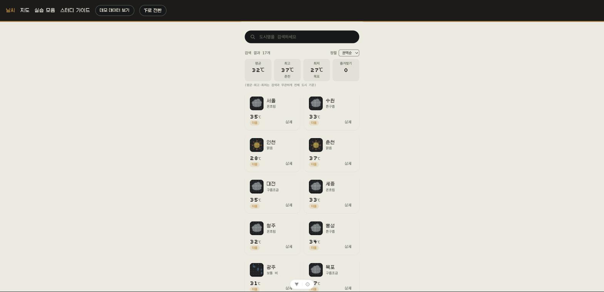

# skala-vue

Vue.js 강의 종합과제 — 픽셀/레트로 LED 전광판 컨셉의 날씨 대시보드입니다. 저장소 전체
소개, 4일간 트러블슈팅 요약, 셀프 코드 리뷰는 [상위 폴더의 README](../README.md)를
참고하세요.

🔗 **배포 페이지**: https://wodnjs2020136144.github.io/skala-vue/



## 로컬 실행

```bash
npm install
cp .env.example .env   # VITE_OPENWEATHER_API_KEY에 OpenWeatherMap API Key 입력
npm run dev
```

API Key가 없다면 상단 내비게이션의 "데모 데이터 보기" 토글로 실제 API 호출 없이 더미 데이터로 둘러볼 수 있습니다.

## 프로젝트 구조

```
src/
├── views/                     # 라우트 단위 페이지
│   ├── WeatherHomeView.vue    # 날씨 목록 · 검색 · 정렬
│   ├── WeatherDetailView.vue  # 도시 상세 날씨
│   ├── WeatherMapView.vue     # 픽셀 지도 + 드래그 창 + 미니게임
│   └── practices/             # 1~4일차 실습 페이지
├── components/
│   ├── UnitToggler.vue        # ℃/℉ 전환 (Navigation Bar)
│   └── practices/weather/     # 날씨 카드·검색바·지도 도트 등 재사용 컴포넌트
├── stores/                    # Pinia — configStore(단위), favoritesStore, demoStore, searchStore
├── services/weatherApi.js     # OpenWeatherMap Axios 연동 + 더미 데이터
├── composables/                # useDraggable, useRegionGame 등
└── router/index.js            # 목록↔상세 라우팅, 지연 로딩, Catch-all
```

## 주요 기능

- **날씨 목록/검색/상세** — `v-for`+`:key`로 카드 렌더링, 검색어로 `computed` 필터링, 클릭 시 상세 페이지로 라우팅
- **℃/℉ 단위 전환** — Pinia `configStore`(`state.unit`/`getters.unitSymbol`/`actions.toggleUnit`)로 앱 전역에서 일관되게 반영
- **Axios 실시간 연동** — OpenWeatherMap 현재 날씨 API, 로딩/에러 상태 처리
- **레트로 픽셀 지도** (`/map`) — 한반도를 도트 매트릭스로 표현, 커서 파동/눌림 인터랙션, 클릭 시 폭발 이펙트, 헤더를 드래그해 옮길 수 있는 정보창·게임창, 지도 자체가 게임판이 되는 "한반도 지역 찾기" 미니게임(제한시간 안에 지역을 찾아 클릭)
- **Element Plus / Modern JS** — `ElSkeleton` 등 UI 컴포넌트, 구조분해·전개 연산자·옵셔널 체이닝을 코드 전반에 활용

## 실습 기록

일자별 작업 기록(요구사항/사고 과정/트러블슈팅/결과)은 [`docs/reports/`](./docs/reports)에 있습니다. 챕터별 이론 정리는 [`docs/vue-study-guide.md`](./docs/vue-study-guide.md)(앱 실행 후 `/study-guide` 경로에서도 렌더링되어 보입니다)에 있습니다.

## 그 외 명령어

```bash
npm run build   # 프로덕션 빌드
npm run preview # 빌드 결과 로컬 미리보기
npm run lint    # ESLint
npm run format  # Prettier
```
