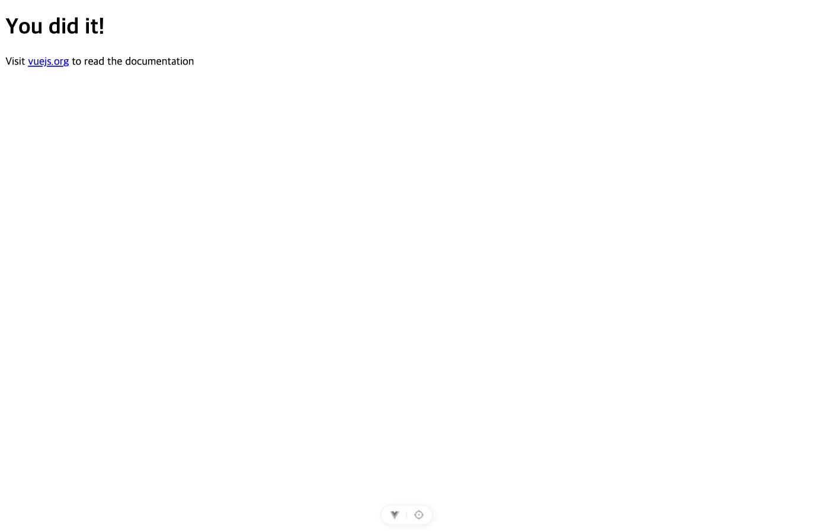
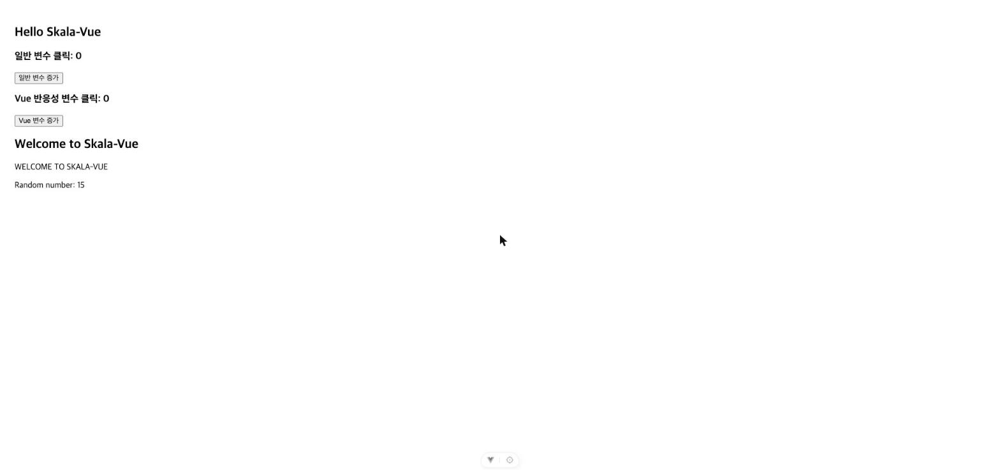
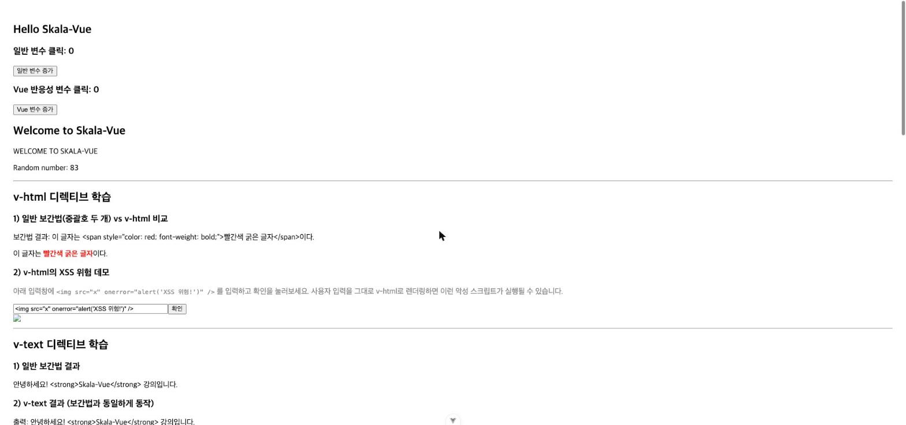
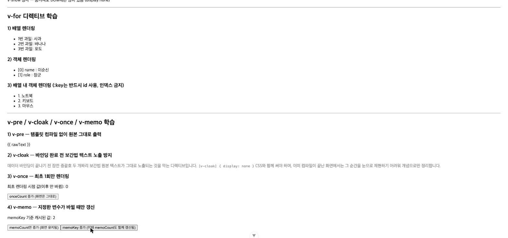
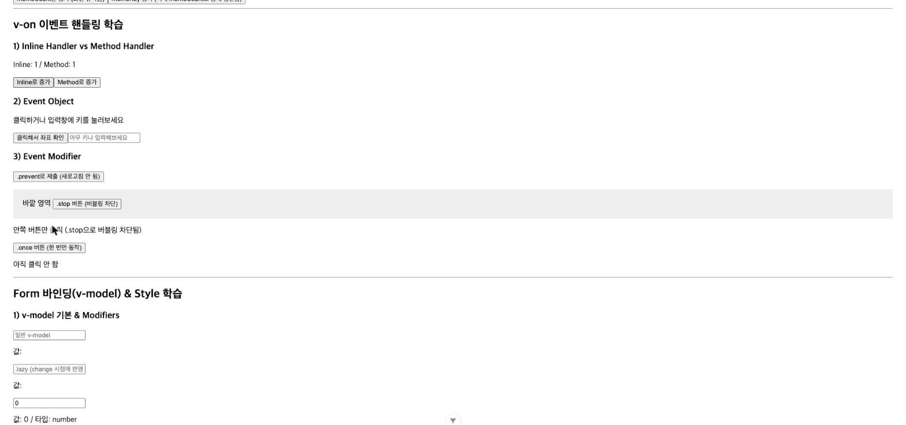
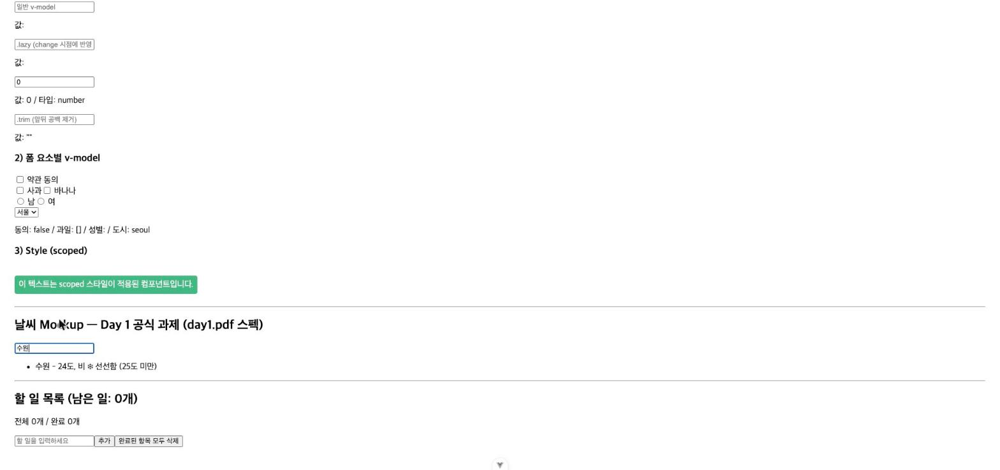
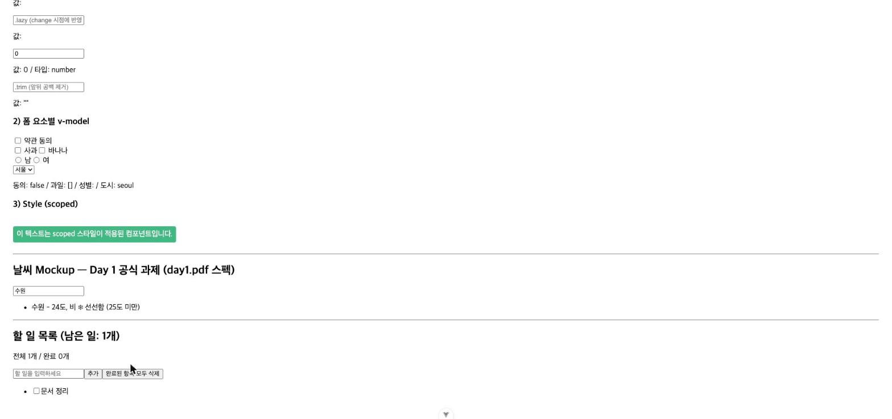

# Vue.js 실습 기록 - Day 1

- 과정명: Full-Stack Engineering - Frontend-framework: Vue.js (강병호)
- 날짜: 2026-07-31
- 오늘 목표: 개발환경 구성 및 프로젝트 실행 확인, 강의자료(1~4장) 정리
- **Day 1 공식 실습 강의안**: `pdf/day1.pdf` (DreamIT Biz, 2026-07-31(금) 09:00~18:00, 8교시, 이론 50%·실습 50%) — 실제 진행/제출 기준은 이 문서를 따름. 상세 스펙은 [vue-practice-exercises.md](../vue-practice-exercises.md)의 "Day 1 공식 실습" 섹션 참고.

> 이 문서는 실습 중 진행한 작업을 요구사항 → 사고 과정 → 해결 과정 → 트러블슈팅 → 결과 → 느낀점 순서로 기록합니다. 최종 종합 보고서는 [final-report.md](./final-report.md)를 참고하세요.

---

## 1. skala-vue 프로젝트 실행

**요구사항**
- 스캐폴딩되어 있는 `skala-vue` 프로젝트(Vue 3 + Vite)의 의존성을 설치하고 로컬 개발 서버를 정상적으로 띄운다.

**사고 과정**
- `package.json`을 확인한 결과 `vue`, `vue-router`, `pinia`가 핵심 의존성이고, `oxlint` + `eslint`를 함께 쓰는 이중 린트 구성임을 확인.
- 일반적인 `npm install` → `npm run dev` 순서로 진행하면 될 것으로 예상.

**해결 과정**
1. `npm install` 실행
2. `npm run dev`로 Vite 개발 서버를 백그라운드 실행
3. Chrome으로 `http://localhost:5173` 접속하여 화면 확인

**트러블슈팅**
- **문제**: `npm install` 실행 시 `ERESOLVE unable to resolve dependency tree` 에러 발생.
  - 원인: devDependencies의 `oxlint@~1.74.0`과 `eslint-plugin-oxlint`가 요구하는 peer dependency `oxlint@~1.73.0` 버전이 서로 충돌.
- **해결**: `npm install --legacy-peer-deps`로 peer dependency 검증을 완화하여 설치 진행. (린트 도구 간의 마이너 버전 차이라 실제 개발/실행에는 영향 없음을 확인)

**결과**
- 의존성 253개 패키지 정상 설치, 취약점(vulnerability) 0건.
- `npm run dev` 실행 시 Vite 개발 서버가 정상 기동, 브라우저에서 기본 스캐폴딩 화면("You did it!")이 콘솔 에러 없이 렌더링됨을 스크린샷으로 확인.



**느낀점**
- `create-vue`로 스캐폴딩만 해둔 프로젝트라도 툴체인 버전(oxlint 등) 간 미세한 충돌이 발생할 수 있다는 것을 알게 됨. `--legacy-peer-deps`가 만능 해결책은 아니지만, 이번처럼 린트 도구 간 마이너 버전 차이일 때는 실제 런타임에 영향이 없어 빠르게 진행하는 것이 합리적이라고 판단.

---

## 2. 강의자료(PDF) 학습 가이드 및 실습 가이드 문서화

**요구사항**
- 오늘 진행하는 Vue.js 강의 PDF(`pdf/1) Full-stack Engineering_3.Frontend-framework_Vue.js_강병호_0729-1-158.pdf`, 158페이지)를 읽고, 필요한 부분을 정리한 학습 가이드 md 문서를 `docs/` 디렉토리에 작성.
- 실습(`[실습]`, `Code Challenge`) 관련 내용은 별도 md 문서로 분리해서 이후 실습 시 참고할 수 있도록 정리.
- 이 문서 구조를 `CLAUDE.md`에도 반영하여 향후 세션에서도 활용 가능하게 함.

**사고 과정**
- 158페이지 PDF는 텍스트로 직접 읽기엔 분량이 많아, `pypdf`로 텍스트를 추출한 뒤 Explore 서브에이전트 2개를 순차로 활용해 전체 내용을 챕터별로 구조화하는 방식을 선택.
- 탐색 중 PDF 파일명(`0729-1-158`)이 암시하는 대로, 실제 내용은 전체 10개 챕터 커리큘럼 중 **1~4장(Vue.js 시작하기 / Vue 문법 / Composition API / Vue Component)까지만** 포함되어 있음을 확인. 5장(Vue Router) 이후는 이후 별도 자료로 제공될 것으로 판단.
- 실습 내용을 살펴보니 "날씨(Weather) 대시보드"라는 하나의 예제가 2장(Mockup) → 3장(Composition API 적용) → 4장(컴포넌트 분리)으로 점진적으로 발전하는 연속 실습 구조임을 파악.

**해결 과정**
1. `docs/vue-study-guide.md` 작성: 1~4장 이론(Vue 개요/MVVM/Virtual DOM, 전체 Directive, Composition API의 ref/reactive/computed/watch, Component의 Lifecycle/Props·Emits/Slot 등)을 챕터 순서로 정리하고 핵심 코드 스니펫을 포함.
2. `docs/vue-practice-exercises.md` 작성: `[실습]`/`Code Challenge` 항목만 페이지 번호와 함께 분리 정리, "날씨" 실습 3단계의 연속성을 표로 명시.
3. `CLAUDE.md`에 "강의자료 및 실습 가이드" 섹션을 추가하여 두 문서의 위치·용도, PDF가 1~4장까지만 커버한다는 사실, 날씨 실습의 점진적 발전 구조를 안내.

**트러블슈팅**
- 없음 (텍스트 추출과 문서 구조화 자체는 큰 이슈 없이 진행됨). 다만 PDF가 예상과 달리 4장에서 끝난다는 점을 처음에 인지하지 못해, 탐색 에이전트의 보고를 통해 뒤늦게 확인함 → 향후 자료를 확인할 때는 페이지 수와 목차를 먼저 대조하는 습관이 필요하다고 느낌.

**결과**
- `skala-vue/docs/vue-study-guide.md`, `skala-vue/docs/vue-practice-exercises.md` 생성 완료.
- `CLAUDE.md`에 강의자료 안내 섹션 반영 완료.

**느낀점**
- 방대한 강의자료를 그대로 두기보다 이론/실습을 분리해서 정리해두니, 앞으로 실습할 때 어떤 요구사항이었는지 바로 찾아볼 수 있어 효율적일 것 같다. 특히 "날씨" 예제가 여러 장에 걸쳐 이어지는 구조라는 걸 미리 파악해둔 것이 앞으로의 실습 흐름을 이해하는 데 도움이 될 것으로 예상.

---

## 3. 실습 기록 체계 구축 (보고서 자동화)

**요구사항**
- 4일간 누적되는 실습 전 과정(요구사항, 사고 과정, 해결 과정, 트러블슈팅, 결과, 느낀점)을 매 작업마다 자동으로 기록하여 최종 보고서 작성에 활용할 수 있도록 문서 체계를 구축.

**사고 과정**
- 하루 분량이 길어질 수 있으므로 일자별 파일(day1~day4)로 분리하고, 4일차 종료 후 참고할 최종 종합 보고서(final-report.md) 템플릿을 별도로 둔다.
- 매번 사용자가 "기록해줘"라고 요청하지 않아도 실습 작업이 끝날 때마다 자동으로 남기도록, 이 규칙을 `CLAUDE.md`에 명시해 세션이 바뀌어도 지켜지도록 함.

**해결 과정**
1. `docs/reports/day1.md`(본 파일), `day2.md`, `day3.md`, `day4.md` 생성.
2. `docs/reports/final-report.md` 템플릿 생성.
3. `CLAUDE.md`에 "실습 기록 규칙" 섹션 추가.

**트러블슈팅**
- 없음.

**결과**
- 4일치 기록 파일과 최종 보고서 템플릿, 그리고 이를 지속시키는 `CLAUDE.md` 규칙이 갖춰짐.

**느낀점**
- 실습과 기록을 분리하지 않고 작업 흐름에 자연스럽게 포함시켜두면, 나중에 보고서를 몰아서 작성할 때 겪는 "그때 왜 이렇게 했더라?" 하는 기억 소실 문제를 줄일 수 있을 것 같다.

---

## 4. 스크린샷 관리 체계 구축

**요구사항**
- 최종 보고서 제출 시 스크린샷도 함께 필요하므로, 실습 결과 화면 캡처를 체계적으로 저장하고 각 기록 항목과 연결할 방법이 필요.

**사고 과정**
- 일자별 폴더(`docs/reports/images/day{N}/`)로 분리하고, 각 day{N}.md의 기록 항목 순서와 일치하는 순번을 파일명에 붙이면 나중에 추적하기 쉬울 것으로 판단.

**해결 과정**
1. `docs/reports/images/day1/` 폴더 생성.
2. 이미 촬영해둔 `npm run dev` 확인 스크린샷을 `01-dev-server-running.jpg`로 저장.
3. 위 "1. skala-vue 프로젝트 실행" 항목의 결과 섹션에 이미지 링크 삽입.
4. `CLAUDE.md`에 스크린샷 저장 위치/네이밍 규칙 추가.

**트러블슈팅**
- 없음.

**결과**
- 스크린샷 저장 체계 구축 완료, 첫 스크린샷이 기록에 연결됨.

**느낀점**
- 텍스트 기록과 스크린샷을 같은 항목 번호로 연결해두면, 보고서를 최종 작성할 때 "이 결과가 어떤 화면이었는지" 따로 찾아 헤맬 필요가 없어질 것 같다.

---

## 5. day1.pdf(공식 실습 강의안) 분석 및 GitHub 저장소 준비 필요성 확인

**요구사항**
- 강사가 매일 제공하는 `day{N}.pdf`(오늘은 `day1.pdf`)가 최종 제출 시 따라야 할 공식 커리큘럼이므로, 이를 읽고 기존에 정리해둔 158p 교재 기반 가이드/실습 문서와 비교 분석하여 차이점을 반영해야 함.

**사고 과정**
- `day1.pdf`(16페이지)를 pdf skill로 텍스트 추출해 전체 내용을 확인.
- 158p 교재와 겹치는 이론(디렉티브, ref/reactive, computed/watch 등)도 있었지만, **최종 제출 방식(GitHub Fork/Clone, 저장소명 `skala-vue`, commit+push 요구)**, **날씨 Mockup의 정확한 데이터/라벨 문구/검색 구현 방식(`:value`+`@input`, `v-model` 아님)**, **Lab 1~3 및 카운터·할 일 목록 종합실습**, **완료 항목 삭제 등 홈워크** 등 기존 문서에 전혀 없던 내용을 다수 발견.
- 특히 GitHub 저장소 요구사항을 확인하고, 현재 로컬 프로젝트(`study_to_vuejs`, `skala-vue`)가 git 저장소로 전혀 초기화되어 있지 않다는 것을 `git status` 확인으로 검증.

**해결 과정**
1. `docs/vue-practice-exercises.md`에 "Day 1 공식 실습(`day1.pdf` 기준)" 섹션을 신설하여 정확한 스펙(데이터/라벨/검색 구현 방식)과 Lab 1~3, 카운터·할일목록 종합실습, 홈워크 3종을 반영. 158p 교재 원본 요구사항과 다른 부분은 각주로 구분 표시.
2. `docs/vue-study-guide.md`에 `day1.pdf`의 심화 설명(MVVM/Virtual DOM 비유, v-if vs v-show 실무 기준, `toRefs`, watch 디바운스 패턴, `reactive` 재할당 위험에 대한 실무 권고)을 관련 절에 보강.
3. `CLAUDE.md`에 "158p 교재는 이론 원전, `day{N}.pdf`가 실제 진행/제출 기준"이라는 우선순위 규칙과, 새 `day{N}.pdf`를 받을 때의 처리 워크플로(읽기 → 비교 분석 → 수정 방안 제시 → 승인 후 반영)를 명시.
4. 이 항목(GitHub 저장소 준비)을 별도 트러블슈팅으로 기록하고, 사용자에게 GitHub Fork/Clone 진행 여부를 확인 후 다음 단계(로컬 git 초기화 및 remote 연결)를 진행하기로 함.

**트러블슈팅**
- **문제**: `day1.pdf`는 최종 제출을 위해 `https://github.com/bottletiger/skala-vue`를 Fork/Clone한 저장소(이름 `skala-vue`)에 commit/push하는 것을 요구하는데, 현재 로컬 `skala-vue` 프로젝트는 git 저장소로 전혀 초기화되어 있지 않음(`git status` 시 `fatal: not a git repository`).
- **원인**: 지금까지는 로컬 스캐폴딩만 진행했고 GitHub 연동 작업은 아직 하지 않았기 때문.
- **해결**: 이 작업은 사용자의 GitHub 계정으로 Fork를 떠야 하는 부분이라 Claude가 대신 실행할 수 없음. 사용자가 GitHub에서 Fork를 완료하고 저장소 URL을 알려주면, 그 시점에 로컬 `git init`/`remote add`/최초 커밋을 진행하기로 함 (다음 실습 단계에서 처리 예정).

**결과**
- `vue-practice-exercises.md`, `vue-study-guide.md`, `CLAUDE.md`에 `day1.pdf` 기준 내용 반영 완료.
- GitHub 저장소 미준비 상태를 명확히 인지했고, 다음 조치(Fork 후 로컬 git 연동)가 필요한 상태로 남겨둠.

**느낀점**
- 이론 교재와 실제 진행 강의안이 항목 범위·구현 방식에서 미묘하게 다를 수 있다는 것을 확인했다. 처음부터 "어느 자료가 최종 기준인지" 우선순위를 명확히 해두지 않았다면, 나중에 서로 다른 스펙(예: 검색을 `v-model`로 할지 `:value`+`@input`으로 할지)으로 헷갈렸을 것 같다. 또한 제출 형식(GitHub 저장소)까지 미리 확인해두어, 실습이 다 끝난 뒤에야 "저장소가 없다"는 걸 알게 되는 상황을 피할 수 있었다.

> 이후 사용자 확인 결과, 이 분반은 git/GitHub 제출이 아닌 **Slack에 PDF로 제출**하는 방식이며, `day1.pdf`의 GitHub 안내는 이 분반에는 적용되지 않는다는 것이 확인되었다. 다만 형상관리 목적으로 별도 GitHub Private 저장소를 두기로 했으며, 이 작업은 사용자의 git 전역 설정(`user.name`/`user.email`) 완료 후 이어서 진행하기로 했다.
>
> **[중간 해결]** 사용자가 `git config --global user.name "hwangjaewon"`, `user.email "wgikimi11@gmail.com"`을 설정 완료. 이후 `study_to_vuejs/`에서 전체 파일을 `git add` → 최초 커밋(`8108bf7`) → `gh repo create skala-vue --private --source=. --remote=origin`으로 GitHub Private 저장소 생성 → `git push -u origin main`으로 push까지 완료.
>
> **[최종 정정]** 사용자가 강사로부터 받은 종합과제 체크리스트(`docs/checklist.md`)를 공유했고, 이를 통해 **실제 제출 방식은 Slack PDF가 아니라 본인 GitHub 계정의 Public 저장소 제출**이 맞다는 것이 확인됐다. 앞서 "Slack 제출"이라고 판단했던 것은 착오였다. 이에 따라 `gh repo edit wodnjs2020136144/skala-vue --visibility public`으로 저장소를 Public으로 전환했고, 로그인 세션 없는 `curl` 요청으로 200 응답을 받아 비로그인 접근이 가능함을 확인했다(체크리스트가 요구하는 "시크릿 창 확인"과 동등한 검증). 이로써 Day 1 체크리스트의 "오늘 작업분 커밋 & 푸시"와 사전 준비 항목("Public 저장소 생성", "로그인 없이 확인")이 모두 완료됨.

---

## 6. 학습환경구성 — 반응성 데이터(Reactivity) Example 구현 (교재 p.50~52)

**요구사항**
- 158p 교재의 "학습환경구성" 절(p.50~52)에 나온 반응형 데이터 예제를 실제로 구현한다: `App.vue`를 비우고 별도 컴포넌트를 불러오는 구조로 바꾸고, 일반 변수(`normalCount`)와 `ref` 반응형 변수(`vueCount`)의 동작 차이를 버튼 클릭으로 비교하는 `SampleOne.vue`를 작성한다.

**사고 과정**
- 교재는 두 단계(App.vue 비우기 → 샘플 컴포넌트로 채우기)로 나눠 설명하지만, 실질적으로는 바로 `SampleOne`을 import하는 최종 형태로 한 번에 작성하는 것이 효율적이라고 판단.
- 컴포넌트 경로는 교재 지시대로 `src/components/practices/basic/SampleOne.vue`로 맞춰, 앞으로 이어질 다른 Directive 연습들도 같은 `practices/` 폴더 구조 아래 쌓이도록 함.
- 기존 스캐폴딩 기본 화면("You did it!")은 이 실습에서 더 이상 필요 없으므로 교체 대상으로 판단(요청 범위 내 수정이므로 CLAUDE.md의 "정밀한 수정" 원칙에 위배되지 않음).

**해결 과정**
1. `skala-vue/src/components/practices/basic/SampleOne.vue` 신규 생성 — 교재 코드 그대로 `let normalCount = 0`(일반 변수)과 `const vueCount = ref(0)`(반응형 변수)를 두고, 각각 버튼 클릭 시 증가시키는 템플릿 작성.

   #### `src/components/practices/basic/SampleOne.vue`
   ```vue
   <script setup>
   import { ref } from 'vue'
   // 1. 일반 변수 (화면이 실시간으로 바뀌지 않음)
   let normalCount = 0
   // 2. 반응성 변수 (화면이 실시간으로 바뀜)
   const vueCount = ref(0)
   </script>
   <template>
     <div class="practice-section">
       <h2>Hello Skala-Vue</h2>
       <h3>일반 변수 클릭: {{ normalCount }}</h3>
       <button @click="normalCount++">일반 변수 증가</button>
       <br />
       <h3>Vue 반응성 변수 클릭: {{ vueCount }}</h3>
       <button @click="vueCount++">Vue 변수 증가</button>
     </div>
   </template>
   ```

2. `skala-vue/src/App.vue`를 수정해 `SampleOne`을 import하고 화면에 배치.

   #### `src/App.vue` (당시 버전)
   ```vue
   <script setup>
   import SampleOne from './components/practices/basic/SampleOne.vue'
   </script>

   <template>
     <div style="padding: 20px">
       <SampleOne />
     </div>
   </template>

   <style scoped></style>
   ```

3. 기존 실행 중이던 `npm run dev` 프로세스가 살아있어 별도 재기동 없이 HMR로 자동 반영됨을 확인.
4. 브라우저에서 "일반 변수 증가" 버튼과 "Vue 변수 증가" 버튼을 각각 여러 번 클릭해 동작 차이를 직접 검증.

**트러블슈팅**
- 없음. 다만 검증 중 흥미로운 관찰: "일반 변수 증가" 버튼만 여러 번 눌렀을 때는 화면 숫자가 즉시 바뀌지 않다가, 이후 "Vue 변수 증가" 버튼(반응형)을 눌러 컴포넌트가 다시 렌더링되는 순간 그동안 누적된 `normalCount` 값이 한꺼번에 화면에 반영되는 것을 확인함 — 이는 버그가 아니라 교재가 강조하는 정확한 학습 포인트(반응형이 아닌 변수는 값 자체는 바뀌어도 Vue가 그 변경을 감지하지 못해 자동 리렌더링을 트리거하지 않는다는 것)임.

**결과**
- `http://localhost:5173`에서 "Hello Skala-Vue" 제목과 두 카운터 버튼이 정상 렌더링됨, 콘솔 에러 없음.
- 일반 변수는 자체 클릭만으로는 화면이 갱신되지 않고, 반응형 변수가 갱신을 트리거할 때에야 최신 값이 반영되는 현상을 실제로 확인.


**느낀점**
- "반응형 변수만 화면을 다시 그린다"는 개념을 텍스트로 읽을 때보다, 일반 변수 값이 뒤늦게 화면에 '따라잡히는' 모습을 직접 눈으로 보니 Vue의 반응성 시스템이 정확히 무엇을 추적하고 무엇을 추적하지 않는지 훨씬 명확하게 이해됐다.

---

## 7. JavaScript in Text Interpolation Example 구현 (교재 p.53)

**요구사항**
- 158p 교재 p.53의 예제를 구현: Text Interpolation(`{{ }}`) 안에서 단순 변수 출력뿐 아니라 `.toUpperCase()` 같은 메서드 호출, 문자열 결합, `Math.random()` 같은 JavaScript 표현식이 그대로 동작하는 것을 확인하는 `SampleTwo.vue`를 작성.

**사고 과정**
- `SampleOne`과 같은 `components/practices/basic/` 폴더에 나란히 두어 이후에도 같은 규칙으로 실습 컴포넌트를 쌓아가기로 함.
- 교재 원본 코드는 사용하지도 않는 `ref`를 import하고 있었는데, 이 컴포넌트는 반응형 상태가 전혀 없으므로 해당 import는 넣지 않음 — 그대로 넣으면 ESLint의 미사용 import 경고가 발생하기 때문.
- `App.vue`에는 `SampleOne` 아래에 `SampleTwo`를 이어 붙여, 한 화면에서 두 예제를 동시에 확인할 수 있게 구성.

**해결 과정**
1. `skala-vue/src/components/practices/basic/SampleTwo.vue` 생성 — `welcomeMessage` 문자열을 그대로 출력, 대문자 변환, 1~100 사이 랜덤 숫자를 문자열과 결합해 출력.

   #### `src/components/practices/basic/SampleTwo.vue`
   ```vue
   <script setup>
   const welcomeMessage = 'Welcome to Skala-Vue'
   </script>
   <template>
     <div class="practice-section">
       <h2>{{ welcomeMessage }}</h2>
       <p>{{ welcomeMessage.toUpperCase() }}</p>
       <p>{{ 'Random number: ' + Math.ceil(Math.random() * 100) }}</p>
     </div>
   </template>
   ```

2. `skala-vue/src/App.vue`에 `SampleTwo` import 및 템플릿에 배치 추가.

   #### `src/App.vue` (당시 버전)
   ```vue
   <script setup>
   import SampleOne from './components/practices/basic/SampleOne.vue'
   import SampleTwo from './components/practices/basic/SampleTwo.vue'
   </script>

   <template>
     <div style="padding: 20px">
       <SampleOne />
       <SampleTwo />
     </div>
   </template>

   <style scoped></style>
   ```

3. 브라우저에서 HMR로 자동 반영된 화면을 확인.

**트러블슈팅**
- 없음.

**결과**
- "Welcome to Skala-Vue" 제목, "WELCOME TO SKALA-VUE"(대문자 변환), "Random number: 15"(새로고침마다 다른 값)가 정상 출력됨을 확인.



**느낀점**
- Text Interpolation이 단순 값 출력을 넘어 임의의 JS 표현식을 허용한다는 걸 직접 실행해보니, `{{ }}` 안에 로직을 얼마나 넣어도 되는지에 대한 감이 생겼다. 다만 실무에서는 복잡한 로직은 `computed`로 빼는 게 낫다는 점도 자연스럽게 다시 떠올랐다.

---

## 8. Code Challenge — Vue Directive 구현 (교재 p.75)

**요구사항**
- `vue-practice-exercises.md`에 정리해둔 2장 "Code Challenge — Vue Directive" 항목을 구현: `v-html`(XSS 위험 포함), `v-text`, `v-bind`(기본/축약형/클래스 바인딩/스타일 바인딩), `v-if`/`v-else-if`/`v-else`/`v-show`, `v-for`(배열/객체/배열 내 객체), `v-pre`/`v-cloak`/`v-once`/`v-memo`를 각각 동작을 확인할 수 있는 실습 컴포넌트로 작성.

**사고 과정**
- 디렉티브 종류가 많아 하나의 거대한 컴포넌트보다는 `components/practices/directives/` 폴더 아래 디렉티브 그룹별로 파일을 나누는 것이 이후 참고하거나 재사용하기 편할 것으로 판단(`VHtmlDemo`, `VTextDemo`, `VBindDemo`, `VIfShowDemo`, `VForDemo`, `MiscDirectivesDemo`).
- `v-html`의 XSS 위험은 교재가 강조하는 핵심 포인트이므로, 실제로 `` 페이로드를 입력해서 스크립트가 실행되는 것을 직접 재현하는 데모로 구현하기로 함(단, 실제 페이지 이동 대신 `alert()`로 안전하게 구성).
- `v-cloak`은 이미 컴파일이 끝난 SPA 화면에서는 그 순간(바인딩 완료 전 잠깐)을 재현하기 어려워, 라이브 데모 대신 개념 설명 문구로 대체하기로 함.

**해결 과정**
1. `VHtmlDemo.vue`: 보간법 vs `v-html` 비교, 입력창에 HTML을 입력해 `v-html`로 렌더링하는 XSS 데모 작성.

   #### `src/components/practices/directives/VHtmlDemo.vue`
   ```vue
   <script setup>
   import { ref } from 'vue'

   // 1) 일반 보간법 vs v-html 비교
   const rawHtmlData = '이 글자는 <span style="color: red; font-weight: bold;">빨간색 굵은 글자</span>이다.'

   // 2) v-html의 XSS 위험 데모 (alert로 안전하게 구성)
   const inputValue = ref('')
   const message = ref('')
   function showMessage() {
     message.value = inputValue.value
   }
   </script>

   <template>
     <div class="practice-section">
       <h2>v-html 디렉티브 학습</h2>

       <h3>1) 일반 보간법(중괄호 두 개) vs v-html 비교</h3>
       <p>보간법 결과: {{ rawHtmlData }}</p>
       <p v-html="rawHtmlData"></p>

       <h3>2) v-html의 XSS 위험 데모</h3>
       <p style="color: #888">
         아래 입력창에 <code>&lt;img src="x" onerror="alert('XSS 위험!')" /&gt;</code> 를 입력하고
         확인을 눌러보세요. 사용자 입력을 그대로 v-html로 렌더링하면 이런 악성 스크립트가 실행될 수
         있습니다.
       </p>
       <input v-model="inputValue" placeholder="HTML을 입력해보세요" style="width: 320px" />
       <button @click="showMessage">확인</button>
       <div v-html="message"></div>
     </div>
   </template>
   ```

2. `VTextDemo.vue`: 보간법과 `v-text`가 동일하게 동작하는 것과 `v-html`과의 차이 비교.

   #### `src/components/practices/directives/VTextDemo.vue`
   ```vue
   <script setup>
   const content = '안녕하세요! <strong>Skala-Vue</strong> 강의입니다.'
   </script>

   <template>
     <div class="practice-section">
       <h2>v-text 디렉티브 학습</h2>

       <h3>1) 일반 보간법 결과</h3>
       <p>{{ content }}</p>

       <h3>2) v-text 결과 (보간법과 동일하게 동작)</h3>
       <p v-text="'출력: ' + content"></p>

       <h3>3) v-html 결과 비교 (HTML로 해석됨)</h3>
       <p v-html="content"></p>
     </div>
   </template>
   ```

3. `VBindDemo.vue`: 기본 바인딩(`:href`, `:src`, `:disabled`), 클래스 바인딩(객체/배열 구문), 스타일 바인딩(객체 구문) 작성.

   #### `src/components/practices/directives/VBindDemo.vue`
   ```vue
   <script setup>
   import { ref } from 'vue'

   // 1) 기본 바인딩
   const dynamicUrl = 'https://vuejs.org/'
   const logoImgSrc = 'https://vuejs.org/images/logo.png'
   const isButtonDisabled = ref(true)

   // 2) 클래스 바인딩
   const isWarning = ref(false)
   const themeClass = ref('bg-dark')

   // 3) 스타일 바인딩
   const textColor = ref('purple')
   const boxWidth = ref(150)
   </script>

   <template>
     <div class="practice-section">
       <h2>v-bind 디렉티브 학습</h2>

       <h3>1) 기본 바인딩 (축약형 :)</h3>
       <a :href="dynamicUrl" target="_blank" rel="noopener">Vue 공식 사이트로 이동</a>
       <br />
       
       <br />
       <button :disabled="isButtonDisabled">동의해야 클릭 가능</button>
       <button @click="isButtonDisabled = !isButtonDisabled">잠금 토글</button>

       <h3>2) 클래스 바인딩 (객체/배열 구문)</h3>
       <p :class="{ 'text-danger': isWarning }">경고 상태: {{ isWarning }}</p>
       <button @click="isWarning = !isWarning">경고 토글</button>
       <div :class="[themeClass, isWarning ? 'border-red' : 'border-gray']">다중 클래스 조합 박스</div>

       <h3>3) 스타일 바인딩 (객체 구문)</h3>
       <p :style="{ color: textColor, fontWeight: 'bold' }">색상이 실시간으로 바뀌는 텍스트</p>
       <button @click="textColor = textColor === 'purple' ? 'blue' : 'purple'">색상 토글</button>
       <br />
       <label>박스 가로 크기(px): <input type="number" v-model.number="boxWidth" step="50" /></label>
       <div :style="{ backgroundColor: '#42b883', width: boxWidth + 'px', height: '60px' }">
         가로 {{ boxWidth }}px 박스
       </div>
     </div>
   </template>

   <style scoped>
   .text-danger {
     color: red;
     font-weight: bold;
   }
   .bg-dark {
     background-color: #333;
     color: white;
     padding: 15px;
   }
   .border-red {
     border: 3px solid red;
   }
   .border-gray {
     border: 3px solid #ccc;
   }
   </style>
   ```

4. `VIfShowDemo.vue`: 점수에 따른 `v-if`/`v-else-if`/`v-else` 등급 분기, `v-if` vs `v-show` 토글 비교.

   #### `src/components/practices/directives/VIfShowDemo.vue`
   ```vue
   <script setup>
   import { ref } from 'vue'
   const score = ref(85)
   const open = ref(true)
   </script>

   <template>
     <div class="practice-section">
       <h2>v-if / v-else-if / v-else / v-show 학습</h2>

       <h3>1) 점수 등급 분기 (v-if / v-else-if / v-else)</h3>
       <label>점수: <input type="number" v-model.number="score" /></label>
       <div v-if="score >= 90" style="color: green; font-weight: bold">합격 등급: A</div>
       <div v-else-if="score >= 80" style="color: blue">합격 등급: B</div>
       <div v-else-if="score >= 70" style="color: orange">합격 등급: C</div>
       <div v-else style="color: red; font-weight: bold">불합격</div>

       <h3>2) v-if vs v-show</h3>
       <button @click="open = !open">토글 (현재: {{ open }})</button>
       <p v-if="open">v-if 상자 — 조건이 거짓이면 DOM에서 완전히 사라짐</p>
       <p v-show="open">v-show 상자 — 숨겨져도 DOM에는 남아 있음 (display:none)</p>
     </div>
   </template>
   ```

5. `VForDemo.vue`: 배열/객체/배열-내-객체 3가지 렌더링 패턴, `:key`는 반드시 `id` 사용.

   #### `src/components/practices/directives/VForDemo.vue`
   ```vue
   <script setup>
   import { ref } from 'vue'
   const fruits = ref(['사과', '바나나', '포도'])
   const user = ref({ name: '이순신', role: '장군' })
   const items = ref([
     { id: 1, name: '노트북' },
     { id: 2, name: '키보드' },
     { id: 3, name: '마우스' },
   ])
   </script>

   <template>
     <div class="practice-section">
       <h2>v-for 디렉티브 학습</h2>

       <h3>1) 배열 렌더링</h3>
       <ul>
         <li v-for="(fruit, index) in fruits" :key="index">{{ index + 1 }}번 과일: {{ fruit }}</li>
       </ul>

       <h3>2) 객체 렌더링</h3>
       <ul>
         <li v-for="(value, key, index) in user" :key="key">[{{ index }}] {{ key }} : {{ value }}</li>
       </ul>

       <h3>3) 배열 내 객체 렌더링 (:key는 반드시 id 사용, 인덱스 금지)</h3>
       <ul>
         <li v-for="item in items" :key="item.id">{{ item.id }}. {{ item.name }}</li>
       </ul>
     </div>
   </template>
   ```

6. `MiscDirectivesDemo.vue`: `v-pre`(원본 텍스트 유지), `v-cloak`(개념 설명), `v-once`(최초 1회 렌더링), `v-memo`(지정 변수 기준 캐시) 작성.

   #### `src/components/practices/directives/MiscDirectivesDemo.vue`
   ```vue
   <script setup>
   import { ref } from 'vue'
   const rawText = '{{ 이 글자는 컴파일되지 않고 그대로 보입니다 }}'
   const onceCount = ref(0)
   const memoCount = ref(0)
   const memoKey = ref(0)
   </script>

   <template>
     <div class="practice-section">
       <h2>v-pre / v-cloak / v-once / v-memo 학습</h2>

       <h3>1) v-pre — 템플릿 컴파일 없이 원본 그대로 출력</h3>
       <p v-pre>{{ rawText }}</p>

       <h3>2) v-cloak — 바인딩 완료 전 보간법 텍스트 노출 방지</h3>
       <p style="color: #888">
         데이터 바인딩이 끝나기 전 잠깐 중괄호 두 개짜리 보간법 원본 텍스트가 그대로 노출되는 것을
         막는 디렉티브입니다. <code>[v-cloak] &#123; display: none &#125;</code> CSS와 함께 써야 하며,
         이미 컴파일이 끝난 화면에서는 그 순간을 눈으로 재현하기 어려워 개념으로만 정리합니다.
       </p>

       <h3>3) v-once — 최초 1회만 렌더링</h3>
       <p v-once>최초 렌더링 시점 값(이후 안 바뀜): {{ onceCount }}</p>
       <button @click="onceCount++">onceCount 증가 (화면은 그대로)</button>

       <h3>4) v-memo — 지정한 변수가 바뀔 때만 갱신</h3>
       <p v-memo="[memoKey]">memoKey 기준 캐시된 값: {{ memoCount }}</p>
       <button @click="memoCount++">memoCount만 증가 (화면 유지됨)</button>
       <button @click="memoKey++">memoKey 증가 (이때 memoCount도 함께 갱신됨)</button>
     </div>
   </template>
   ```

7. `App.vue`에 6개 컴포넌트를 모두 import하여 순서대로 배치.

   #### `src/App.vue` (최종본)
   ```vue
   <script setup>
   import SampleOne from './components/practices/basic/SampleOne.vue'
   import SampleTwo from './components/practices/basic/SampleTwo.vue'
   import VHtmlDemo from './components/practices/directives/VHtmlDemo.vue'
   import VTextDemo from './components/practices/directives/VTextDemo.vue'
   import VBindDemo from './components/practices/directives/VBindDemo.vue'
   import VIfShowDemo from './components/practices/directives/VIfShowDemo.vue'
   import VForDemo from './components/practices/directives/VForDemo.vue'
   import MiscDirectivesDemo from './components/practices/directives/MiscDirectivesDemo.vue'
   </script>

   <template>
     <div style="padding: 20px">
       <SampleOne />
       <SampleTwo />
       <hr />
       <VHtmlDemo />
       <hr />
       <VTextDemo />
       <hr />
       <VBindDemo />
       <hr />
       <VIfShowDemo />
       <hr />
       <VForDemo />
       <hr />
       <MiscDirectivesDemo />
     </div>
   </template>

   <style scoped></style>
   ```

8. 브라우저에서 각 섹션을 스크롤하며 확인하고, XSS 데모/v-once/v-memo는 실제로 클릭·입력해 동작을 검증.

**트러블슈팅**
- **문제**: 처음 작성 시 Vite가 `[plugin:vite:vue] Error parsing JavaScript expression: Unterminated string constant`로 빌드 실패.
  - 원인: `MiscDirectivesDemo.vue`와 `VHtmlDemo.vue`의 설명 문구에서 "중괄호 두 개짜리 보간법 문법"을 화면에 그대로 보여주려고 `{{ '{{ }}' }}` 같은 형태로 작성했는데, Vue 템플릿 컴파일러가 문자열 리터럴 내부의 `}}`를 보간법의 닫는 괄호로 먼저 인식해버려 표현식이 깨짐.
  - 해결: 리터럴 중괄호를 흉내 내는 트릭 대신, "중괄호 두 개(보간법)"처럼 말로 풀어 쓰는 방식으로 문구를 수정해 문제를 회피.
- **문제**: XSS 데모에서 `onerror="alert('XSS 위험!')"`가 포함된 ``를 입력하고 확인 버튼을 눌렀더니 브라우저 네이티브 `alert` 다이얼로그가 떠서 브라우저 자동화 도구(스크린샷/클릭)가 5초간 응답 없이 멈춤.
  - 원인: 네이티브 JS `alert()`는 페이지를 완전히 블로킹하는 모달이라 자동화 도구가 다음 명령을 실행할 수 없었음.
  - 해결: 사용자에게 직접 브라우저에서 다이얼로그를 닫아달라고 요청 후 재개. (교훈: 이후 XSS 데모류를 다시 시연할 때는 `alert` 대신 화면에 문구를 표시하는 방식으로 바꾸는 것이 자동화 친화적이라는 점을 기록해 둠 — 다만 이번엔 사용자가 직접 상호작용하며 확인하는 실습이라 alert 자체가 교육적으로 더 실감났음.)

**결과**
- 6개 디렉티브 실습 컴포넌트 모두 정상 렌더링, 콘솔 에러 없음.
- XSS 데모에서 입력한 `` 스크립트가 실제로 실행되어 alert가 뜸(교재가 경고하는 위험을 직접 재현) → 닫은 후에는 `src="x"`가 깨진 이미지 아이콘으로 표시됨.
- `v-once`는 버튼을 여러 번 눌러도 화면 값이 0으로 고정, `v-memo`는 `memoCount`만 증가시킬 때는 화면이 그대로였다가 `memoKey`를 증가시키자 그 시점의 누적된 `memoCount` 값(2)이 한꺼번에 반영됨 — 지정한 키가 바뀔 때만 갱신된다는 것을 확인.




**느낀점**
- XSS 데모를 직접 실행해보니 "왜 사용자 입력을 `v-html`에 그대로 넣으면 안 되는지"가 훨씬 와닿았다. 텍스트로만 읽었을 때보다 실제로 alert가 뜨는 걸 보는 게 경각심을 훨씬 크게 만든다는 걸 느꼈다.
- `v-once`/`v-memo`처럼 "언제 다시 그리는가"를 제어하는 디렉티브들은 값 자체보다 렌더링 타이밍을 이해해야 하는데, 버튼을 눌러가며 값이 "언제 화면에 반영되는지" 직접 관찰하니 개념이 명확해졌다.
- 템플릿 안에서 리터럴 중괄호를 표현하려던 시도가 컴파일 에러로 이어진 경험을 통해, Vue 템플릿 문법 설명 자체를 템플릿 안에 넣을 때는 항상 이스케이프 문제를 조심해야 한다는 걸 배웠다.

---

## 9. Code Challenge — Vue Event Handling 구현 (교재 p.87)

**요구사항**
- `v-on` Inline Handler vs Method Handler, Event Object(좌표/키보드 속성), Event Modifier(`.prevent`/`.stop`/`.once`)를 확인할 수 있는 실습 컴포넌트를 작성한다.

**사고 과정**
- 별도 파일(`VOnEventDemo.vue`)로 분리해 기존 디렉티브 데모들과 같은 `directives/` 폴더에 둔다.
- `.stop`은 버블링 차단을 시각적으로 보여줘야 하므로, "바깥 영역 클릭"과 "안쪽 버튼 클릭" 로그를 서로 다른 문구로 구분해 실제로 버블링이 막혔는지 눈으로 확인할 수 있게 구성.

**해결 과정**
1. `VOnEventDemo.vue` 생성 — Inline/Method Handler 비교, Event Object 좌표·키 로그, `.prevent`(폼 제출 막기)/`.stop`(버블링 차단)/`.once`(1회만 실행) 데모 작성.

   #### `src/components/practices/directives/VOnEventDemo.vue`
   ```vue
   <script setup>
   import { ref } from 'vue'

   // 1) Inline Handler vs Method Handler
   const inlineCount = ref(0)
   const methodCount = ref(0)
   function increment() {
     methodCount.value++
   }

   // 2) Event Object
   const eventLog = ref('클릭하거나 입력창에 키를 눌러보세요')
   function logClick(e) {
     eventLog.value = `클릭 좌표: (${e.clientX}, ${e.clientY}) / target: ${e.target.tagName}`
   }
   function logKey(e) {
     eventLog.value = `누른 키: ${e.key} / ctrl: ${e.ctrlKey} / shift: ${e.shiftKey}`
   }

   // 3) Event Modifier
   const formLog = ref('')
   function submitForm() {
     formLog.value = '.prevent 덕분에 새로고침 없이 이 함수만 실행됨'
   }

   const bubbleLog = ref('')
   function outerClick() {
     bubbleLog.value = '바깥 상자 클릭'
   }
   function innerClick() {
     bubbleLog.value = '안쪽 버튼만 클릭 (.stop으로 버블링 차단됨)'
   }

   const onceLog = ref('아직 클릭 안 함')
   function onceClick() {
     onceLog.value = '한 번만 실행됨 (.once) — 다시 눌러도 안 바뀜'
   }
   </script>

   <template>
     <div class="practice-section">
       <h2>v-on 이벤트 핸들링 학습</h2>

       <h3>1) Inline Handler vs Method Handler</h3>
       <p>Inline: {{ inlineCount }} / Method: {{ methodCount }}</p>
       <button @click="inlineCount++">Inline로 증가</button>
       <button @click="increment">Method로 증가</button>

       <h3>2) Event Object</h3>
       <p>{{ eventLog }}</p>
       <button @click="logClick">클릭해서 좌표 확인</button>
       <input @keyup="logKey" placeholder="아무 키나 입력해보세요" />

       <h3>3) Event Modifier</h3>
       <form @submit.prevent="submitForm">
         <button type="submit">.prevent로 제출 (새로고침 안 됨)</button>
       </form>
       <p>{{ formLog }}</p>

       <div @click="outerClick" style="padding: 20px; background: #eee">
         바깥 영역
         <button @click.stop="innerClick">.stop 버튼 (버블링 차단)</button>
       </div>
       <p>{{ bubbleLog }}</p>

       <button @click.once="onceClick">.once 버튼 (한 번만 동작)</button>
       <p>{{ onceLog }}</p>
     </div>
   </template>
   ```

2. `App.vue`에 `VOnEventDemo` import 및 배치 추가.
3. 브라우저에서 Inline/Method 버튼을 각각 클릭해 둘 다 정상 증가하는지, `.stop` 버튼 클릭 시 바깥 영역 클릭 로그가 뜨지 않고 안쪽 로그만 뜨는지 확인.

**트러블슈팅**
- 없음.

**결과**
- Inline/Method 두 카운터 모두 정상 증가(각각 1로 표시)했고, `.stop` 버튼 클릭 시 "안쪽 버튼만 클릭" 로그만 표시되어(바깥 로그로 덮이지 않음) 버블링이 실제로 차단됨을 확인.



**느낀점**
- `.stop`이 버블링을 막는다는 걸 텍스트로 아는 것과, 실제로 바깥 클릭 로그가 안 뜨는 걸 확인하는 것 사이에 체감 차이가 컸다. 이벤트 전파는 눈에 안 보이는 개념이라 직접 로그를 찍어보는 게 특히 유용했다.

---

## 10. Code Challenge — Vue Form/Style 구현 (교재 p.97)

**요구사항**
- `v-model` 기본 동작과 Modifiers(`.lazy`/`.number`/`.trim`), 폼 요소별 `v-model`(checkbox/radio/select), Scoped Style을 확인할 수 있는 실습 컴포넌트를 작성한다.

**사고 과정**
- Event Handling 데모와 짝을 이루는 내용이라 같은 `directives/` 폴더에 `VModelFormStyleDemo.vue`로 작성.
- Modifier별로 값이 어떻게 다르게 반영되는지 한눈에 비교할 수 있도록 4개의 입력창(일반/`.lazy`/`.number`/`.trim`)을 나란히 배치.

**해결 과정**
1. `VModelFormStyleDemo.vue` 생성 — v-model 기본/lazy/number/trim 비교, checkbox(단일/다중)·radio·select 폼 요소별 바인딩, scoped 스타일이 적용된 하이라이트 텍스트 작성.

   #### `src/components/practices/directives/VModelFormStyleDemo.vue`
   ```vue
   <script setup>
   import { ref } from 'vue'

   // 1) v-model 기본 & Modifiers
   const textValue = ref('')
   const lazyText = ref('')
   const numberValue = ref(0)
   const trimText = ref('')

   // 2) 폼 요소별 v-model
   const agree = ref(false)
   const fruits = ref([])
   const gender = ref('')
   const city = ref('seoul')
   </script>

   <template>
     <div class="practice-section">
       <h2>Form 바인딩(v-model) & Style 학습</h2>

       <h3>1) v-model 기본 & Modifiers</h3>
       <input v-model="textValue" placeholder="일반 v-model" />
       <p>값: {{ textValue }}</p>

       <input v-model.lazy="lazyText" placeholder=".lazy (change 시점에 반영)" />
       <p>값: {{ lazyText }}</p>

       <input v-model.number="numberValue" placeholder=".number (문자열→숫자 변환)" />
       <p>값: {{ numberValue }} / 타입: {{ typeof numberValue }}</p>

       <input v-model.trim="trimText" placeholder=".trim (앞뒤 공백 제거)" />
       <p>값: "{{ trimText }}"</p>

       <h3>2) 폼 요소별 v-model</h3>
       <label><input type="checkbox" v-model="agree" /> 약관 동의</label>
       <br />
       <label><input type="checkbox" value="사과" v-model="fruits" /> 사과</label>
       <label><input type="checkbox" value="바나나" v-model="fruits" /> 바나나</label>
       <br />
       <label><input type="radio" value="남" v-model="gender" /> 남</label>
       <label><input type="radio" value="여" v-model="gender" /> 여</label>
       <br />
       <select v-model="city">
         <option value="seoul">서울</option>
         <option value="busan">부산</option>
       </select>
       <p>동의: {{ agree }} / 과일: {{ fruits }} / 성별: {{ gender }} / 도시: {{ city }}</p>

       <h3>3) Style (scoped)</h3>
       <p class="highlight">이 텍스트는 scoped 스타일이 적용된 컴포넌트입니다.</p>
     </div>
   </template>

   <style scoped>
   .highlight {
     color: white;
     background-color: #42b883;
     padding: 8px;
     border-radius: 4px;
     display: inline-block;
   }
   </style>
   ```

2. `App.vue`에 `VModelFormStyleDemo` import 및 배치 추가.
3. 브라우저에서 checkbox/radio/select를 각각 조작해 바인딩된 값이 화면 하단 요약(`동의: ... / 과일: ... / 성별: ... / 도시: ...`)에 올바르게 반영되는지 확인.

**트러블슈팅**
- 없음.

**결과**
- 4가지 `v-model` 변형이 모두 정상 동작, scoped 스타일(초록 배경 하이라이트)도 해당 컴포넌트에만 적용됨을 확인.

**느낀점**
- 같은 `v-model` 디렉티브라도 폼 요소 종류(checkbox 단일/다중, radio, select)에 따라 담기는 자료형이 불리언/배열/문자열로 달라진다는 걸 직접 값 출력으로 비교하니 헷갈리지 않게 정리됐다.

---

## 11. [실습] 날씨 Mockup — Day 1 공식 과제 구현 (`day1.pdf` 스펙)

**요구사항**
- `day1.pdf`가 규정한 정확한 스펙으로 날씨 Mockup을 구현한다: 지정된 데이터(`city_01` 등 id 포함), `v-for`+`:key`(id 사용, 인덱스 금지), 25도 기준 `v-if` 라벨(🔥 더움/❄ 선선함), 검색은 `v-model`이 아닌 `:value`+`@input`으로 수동 구현하고 한글 IME 입력이 깨지지 않는지 확인.

**사고 과정**
- 교재 원본(158p, p.98)의 날씨 Mockup과 `day1.pdf`의 요구사항이 데이터·검색 구현 방식에서 달랐던 점을 이전에 분석해뒀으므로, `day1.pdf` 스펙을 그대로 따르고 별도 컴포넌트(`WeatherMockup.vue`)로 분리해 `practices/weather/` 폴더에 둔다 — 이후 3장/4장에서 이 컴포넌트가 Composition API 적용, 컴포넌트 분리로 계속 발전할 예정이므로 전용 폴더를 미리 만들어둠.
- `:value`+`@input` 방식은 `v-model`의 내부 구현 원리와 동일하므로, `e.target.value`를 그대로 받아 반영하는 함수로 작성하면 한글 조합 중간 상태도 깨지지 않을 것으로 예상.

**해결 과정**
1. `WeatherMockup.vue` 생성 — `weatherList`를 `day1.pdf` 지정 데이터 그대로 선언, `:key="city.id"`로 `v-for` 렌더링, `computed`로 검색어 필터링, `:value`+`@input`으로 검색창 구현, 온도 25도 기준 `v-if`/`v-else` 라벨 작성.

   #### `src/components/practices/weather/WeatherMockup.vue`
   ```vue
   <script setup>
   import { ref, computed } from 'vue'

   // day1.pdf 스펙: 정확히 지정된 데이터, id 형식 city_01 등
   const weatherList = ref([
     { id: 'city_01', name: '서울', temp: 28, status: '맑음' },
     { id: 'city_02', name: '수원', temp: 24, status: '비' },
     { id: 'city_03', name: '부산', temp: 26, status: '구름' },
   ])

   // day1.pdf 스펙: v-model이 아니라 :value + @input으로 수동 양방향 처리 (한글 IME 확인용)
   const searchQuery = ref('')
   function handleSearchInput(e) {
     searchQuery.value = e.target.value
   }

   const filteredList = computed(() =>
     weatherList.value.filter((city) => city.name.includes(searchQuery.value)),
   )
   </script>

   <template>
     <div class="practice-section">
       <h2>날씨 Mockup — Day 1 공식 과제 (day1.pdf 스펙)</h2>

       <input
         :value="searchQuery"
         @input="handleSearchInput"
         placeholder="도시명을 검색하세요 (한글 입력 테스트)"
       />

       <ul>
         <li v-for="city in filteredList" :key="city.id">
           {{ city.name }} - {{ city.temp }}도, {{ city.status }}
           <span v-if="city.temp >= 25">🔥 더움 (25도 이상)</span>
           <span v-else>❄ 선선함 (25도 미만)</span>
         </li>
       </ul>
     </div>
   </template>
   ```

2. `App.vue`에 `WeatherMockup` import 및 배치 추가.
3. 브라우저에서 검색창에 "수원"을 한글로 직접 타이핑해 IME 조합 중 글자가 깨지지 않고 목록이 실시간으로 필터링되는지 확인.

**트러블슈팅**
- 없음.

**결과**
- 초기 상태에서 서울(🔥 더움)/수원(❄ 선선함)/부산(🔥 더움) 3개 카드가 온도 기준 라벨과 함께 정상 출력됨.
- 검색창에 "수원"을 입력하니 한글이 깨지지 않고 정확히 "수원" 카드만 필터링되어 표시됨.



**느낀점**
- 158p 교재 원본과 `day1.pdf`의 요구사항이 미묘하게 달랐던 부분(검색 구현 방식)을 사전에 정리해두지 않았다면, `v-model`로 편하게 구현하고 넘어갔을 텐데 실제 채점 기준에 맞는 `:value`+`@input` 방식으로 정확히 구현할 수 있었다. 두 자료를 비교 분석해둔 것이 실제로 도움이 됐다.

---

## 12. 8교시 종합실습 — 카운터 & 할 일 목록 + 과제(완료 삭제/개수 표시) 구현

**요구사항**
- `day1.pdf`의 8교시 종합실습(카운터·할 일 목록)과 과제 1·2(완료된 항목 모두 삭제 버튼, 전체/완료 개수 표시)를 구현한다.

**사고 과정**
- 종합실습 기본 Todo 앱과 과제로 요구되는 확장 기능(삭제 버튼, 개수 computed)이 사실상 하나의 연속된 기능이므로, 별도로 나누지 않고 `TodoListDemo.vue` 하나에 기본 기능과 과제 확장 기능을 함께 구현.
- "완료된 항목 모두 삭제"는 `todos.value`를 `done`이 `false`인 것만 남기는 `filter`로 재할당하면 충분하다고 판단.

**해결 과정**
1. `TodoListDemo.vue` 생성 — 할 일 추가/체크, `remaining`(남은 일) computed, `clearCompleted`로 완료 항목 삭제, `totalCount`/`doneCount` computed로 전체·완료 개수 표시.

   #### `src/components/practices/basic/TodoListDemo.vue`
   ```vue
   <script setup>
   import { ref, computed } from 'vue'

   const todos = ref([])
   const text = ref('')
   let nextId = 1

   function addTodo() {
     if (text.value.trim() === '') return
     todos.value.push({ id: nextId++, title: text.value, done: false })
     text.value = ''
   }

   // 과제 1: 완료된 항목 모두 삭제
   function clearCompleted() {
     todos.value = todos.value.filter((t) => !t.done)
   }

   const remaining = computed(() => todos.value.filter((t) => !t.done).length)

   // 과제 2: 전체 개수 / 완료 개수
   const totalCount = computed(() => todos.value.length)
   const doneCount = computed(() => todos.value.filter((t) => t.done).length)
   </script>

   <template>
     <div class="practice-section">
       <h2>할 일 목록 (남은 일: {{ remaining }}개)</h2>
       <p>전체 {{ totalCount }}개 / 완료 {{ doneCount }}개</p>

       <input v-model="text" @keyup.enter="addTodo" placeholder="할 일을 입력하세요" />
       <button @click="addTodo">추가</button>
       <button @click="clearCompleted">완료된 항목 모두 삭제</button>

       <ul>
         <li v-for="todo in todos" :key="todo.id">
           <input type="checkbox" v-model="todo.done" />
           <span :class="{ done: todo.done }">{{ todo.title }}</span>
         </li>
       </ul>
     </div>
   </template>

   <style scoped>
   .done {
     text-decoration: line-through;
     color: gray;
   }
   </style>
   ```

2. `App.vue`에 `TodoListDemo` import 및 배치 추가(6번째 실습 파일부터 이어지는 마지막 섹션).
3. 브라우저에서 "장보기 작성", "문서 정리" 두 항목을 추가 → "장보기 작성"만 체크 → "완료된 항목 모두 삭제" 클릭 → 체크한 항목만 사라지고 "문서 정리"는 남는지 확인.

**트러블슈팅**
- 없음.

**결과**
- 항목 추가 시 "전체 2개 / 완료 0개"로 정상 집계, "장보기 작성"을 체크한 뒤 삭제 버튼을 누르자 해당 항목만 제거되고 "문서 정리"만 남음(남은 일 1개로 갱신).



**느낀점**
- `computed`로 파생된 값(전체/완료/남은 개수)들이 배열이 바뀔 때마다 서로 다른 필터 조건으로 각자 알아서 재계산되는 걸 보니, 하나의 원본 상태(`todos`)에서 여러 파생 지표를 뽑아내는 패턴이 실무에서 왜 유용한지 체감됐다.

---

## 13. 종합과제 체크리스트 반영 및 제출 방식 최종 정정

**요구사항**
- 사용자가 강사로부터 받은 4일치 종합과제 체크리스트 전문을 전달. 이를 `docs/checklist.md`로 문서화하고, 기존 문서들의 제출 방식 서술을 이 체크리스트 기준으로 정정한다.

**사고 과정**
- 체크리스트에 "GitHub Public 저장소 제출"이 명시되어 있어, 이전에 판단했던 "Slack PDF 제출"이 착오였음을 인지. 자료 간 우선순위를 `checklist.md`(최우선) > `day{N}.pdf` > 158p 이론 교재 순으로 재정립해야 향후 혼동을 막을 수 있다고 판단.
- 체크리스트에 날짜가 명시되어 있어(1일차 7/31, 2일차 8/3, 3일차 8/4, 4일차 8/5), 기존에 "챕터 순서 = day 순서"로 느슨하게 대응시켰던 것과 달리, 실제로는 2일차에 Composition API + 컴포넌트 분리가 함께 이뤄지고 3일차에 Router/Pinia/Axios가 새로 추가된다는 걸 재확인 — day2~4.md의 목표도 이에 맞춰 갱신 필요.
- OpenWeatherMap API Key 발급은 회원가입이 필요한 작업이라 Claude가 대신 할 수 없으므로, 사용자에게 직접 안내만 하기로 함.

**해결 과정**
1. `skala-vue/docs/checklist.md` 신규 생성 — 체크리스트 전문을 그대로 문서화하고 "최우선 기준 자료"임을 명시.

   #### `docs/checklist.md` (신규 문서, 전체 체크리스트 보관 — 본문 생략, 실제 내용은 해당 파일 참고)

2. GitHub 저장소 공개 설정 변경:
   ```bash
   gh repo edit wodnjs2020136144/skala-vue --visibility public --accept-visibility-change-consequences
   ```
3. 로그인 없는 요청으로 접근 가능 여부 확인:
   ```bash
   curl -s -o /dev/null -w "%{http_code}\n" "https://github.com/wodnjs2020136144/skala-vue"
   # → 200
   ```
4. `CLAUDE.md`에 자료 우선순위(체크리스트 > day{N}.pdf > 158p 교재)와 정정된 제출 방식(GitHub Public), OpenWeatherMap 안내를 반영.
5. `vue-practice-exercises.md`, `day1.md`(본 항목 포함)의 "Slack 제출" 관련 서술을 GitHub Public 제출로 정정.

**트러블슈팅**
- **문제**: 이전 세션에서 "이 분반은 Slack PDF 제출"이라고 판단해 `CLAUDE.md`/`day1.md`/`vue-practice-exercises.md`/`final-report.md`에 그 내용을 반영해뒀는데, 실제로는 GitHub Public 저장소 제출이 맞는 것으로 확인됨.
- **원인**: 사용자의 초기 발화("우리 분반은 git을 사용하지 않고...")를 그대로 받아들여 문서에 반영했으나, 이후 공식 체크리스트를 받아보니 실제 제출 방식은 GitHub였음. 사용자 본인도 초기엔 정확한 제출 방식을 몰랐던 것으로 보임.
- **해결**: 체크리스트를 최우선 기준 자료로 격상시키고, 관련 문서의 서술을 모두 GitHub Public 저장소 제출로 정정. 이미 만들어뒀던 GitHub 저장소(당시 Private)를 Public으로 전환.

**결과**
- `docs/checklist.md` 생성 완료.
- GitHub 저장소가 Public으로 전환되고 비로그인 접근이 가능함을 확인 (curl 200 응답).
- `CLAUDE.md`, `vue-practice-exercises.md`, `day1.md`의 제출 방식 서술 정정 완료.

**느낀점**
- 사용자가 전달한 정보라도 잠정적인 것일 수 있다는 걸 배웠다 — "Slack 제출이다"라는 말을 곧이곧대로 문서에 박아 넣었는데, 나중에 공식 체크리스트로 뒤집혔다. 앞으로는 이런 종류의 확정 정보(제출 방식처럼 되돌리기 번거로운 것)는 "현재까지 확인된 바로는"이라는 식으로 유보적으로 기록해두는 게 더 안전했을 것 같다. 다행히 형상관리용으로 미리 만들어둔 저장소가 있어서 Private→Public 전환만으로 빠르게 대응할 수 있었다.
