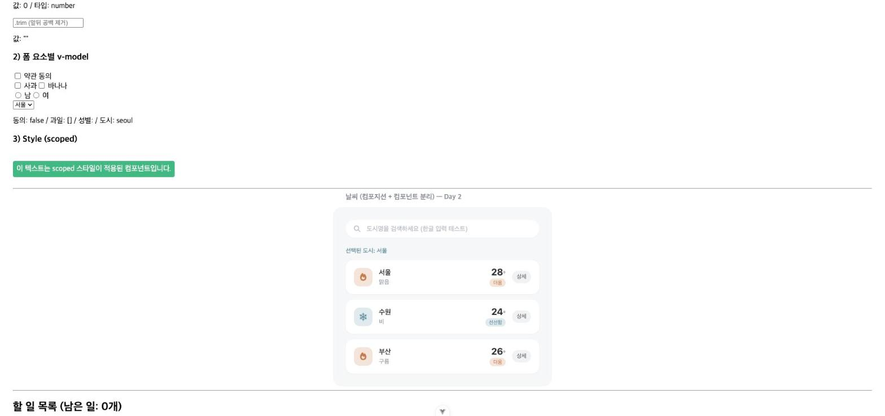
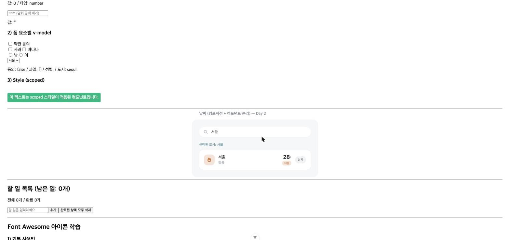

# Vue.js 실습 기록 - Day 2

- 과정명: Full-Stack Engineering - Frontend-framework: Vue.js (강병호)
- 날짜: 2026-08-03
- 오늘 목표 (`docs/checklist.md` 2일차 기준): 2단계「컴포지션」+ 3단계「컴포넌트 분리」
  - 반응형 상태 3종 — `searchQuery`·`selectedCityInfo`·`weatherList`
  - `computed`로 `filteredWeatherList` (검색어 포함 필터링)
  - `watch(selectedCityInfo)`·`watchEffect(searchQuery)` 각각 콘솔 로그
  - 검색어 비면 원본 출력 / 일치하면 결과 출력
  - 기능은 유지한 채 4개 파일로 분리: `WeatherParent.vue`·`BaseDashboardCard.vue`(+slot)·`SearchBar.vue`·`WeatherCard.vue`
  - `SearchBar`는 props 수신 + `update-query` emit / `WeatherCard`는 `select-card`·`click-detail` emit
  - 오늘 작업분 커밋 & 푸시

> 이 문서는 실습 중 진행한 작업을 요구사항 → 사고 과정 → 해결 과정 → 트러블슈팅 → 결과 → 느낀점 순서로 기록합니다. 최종 종합 보고서는 [final-report.md](./final-report.md)를 참고하세요.

---

## 1. 날씨 앱 Composition API 적용 + 4개 컴포넌트 분리

**요구사항**
- `docs/checklist.md` 2일차 스펙대로, 1일차의 단일 파일 `WeatherMockup.vue`를 반응형 상태 3종(`weatherList`·`searchQuery`·`selectedCityInfo`) + `computed`/`watch`/`watchEffect`를 갖춘 구조로 발전시키고, 기능은 그대로 둔 채 `WeatherParent`·`BaseDashboardCard`(+slot)·`SearchBar`·`WeatherCard` 4개 컴포넌트로 분리한다.

**사고 과정**
- `day2.pdf`가 아직 제공되지 않아(폴더 확인 완료), `checklist.md`와 158p 교재 3~4장(`vue-practice-exercises.md`에 이미 정리된 스펙)을 기준으로 진행하기로 함.
- 1일차 카드 디자인(테라코타/블루그레이 톤다운 팔레트)을 그대로 유지한 채 마크업만 컴포넌트 경계에 맞춰 쪼개는 방향으로 결정 — 디자인을 다시 만들 필요 없이 스타일 블록을 소유 컴포넌트별로 이동.
- `WeatherCard`가 요구하는 `click-detail` emit은 158p 교재 4장 원본 스펙(상세보기 → `window.alert`)을 그대로 재사용하기로 함. 카드 자체 클릭(`select-card`)과 상세 버튼 클릭(`click-detail`)이 서로 간섭하지 않도록 상세 버튼에 `@click.stop` 적용.
- 기존 `WeatherMockup.vue`는 1일차 스냅샷이 이미 `day1.md`에 코드로 보존되어 있으므로, 실 파일은 새 구조로 완전히 교체(삭제 후 재작성)하기로 함 — 두 버전을 나란히 남겨두는 것은 불필요한 중복이라 판단.

**해결 과정**
1. `WeatherCard.vue` 신규 생성 — `city` prop을 받아 카드 UI를 그리고, 카드 클릭 시 `select-card`, "상세" 버튼 클릭 시(`@click.stop`) `click-detail`을 emit.

   #### `src/components/practices/weather/WeatherCard.vue`
   ```vue
   <script setup>
   defineProps({
     city: {
       type: Object,
       required: true,
     },
   })

   const emit = defineEmits(['select-card', 'click-detail'])
   </script>

   <template>
     <li class="city-card" @click="emit('select-card', city)">
       <div class="city-card__badge" :class="city.temp >= 25 ? 'is-warm' : 'is-cool'">
         <FontAwesomeIcon :icon="city.temp >= 25 ? 'fire' : 'snowflake'" />
       </div>
       <div class="city-card__info">
         <p class="city-card__name">{{ city.name }}</p>
         <p class="city-card__status">{{ city.status }}</p>
       </div>
       <div class="city-card__temp-block">
         <p class="city-card__temp">{{ city.temp }}<span class="city-card__unit">°</span></p>
         <span class="city-card__label" :class="city.temp >= 25 ? 'is-warm' : 'is-cool'">
           {{ city.temp >= 25 ? '더움' : '선선함' }}
         </span>
       </div>
       <button class="city-card__detail-btn" @click.stop="emit('click-detail', city)">상세</button>
     </li>
   </template>

   <style scoped>
   .city-card {
     display: flex;
     align-items: center;
     gap: 14px;
     background: #ffffff;
     border-radius: 16px;
     padding: 16px 18px;
     box-shadow: 0 1px 3px rgba(20, 20, 30, 0.05);
     cursor: pointer;
   }
   .city-card__badge {
     width: 40px;
     height: 40px;
     border-radius: 12px;
     display: flex;
     align-items: center;
     justify-content: center;
     font-size: 16px;
     flex-shrink: 0;
   }
   .city-card__badge.is-warm { background: #f5e4db; color: #c97b4a; }
   .city-card__badge.is-cool { background: #e1eaee; color: #6e97a6; }
   .city-card__info { flex: 1; min-width: 0; }
   .city-card__name { margin: 0; font-size: 15px; font-weight: 600; color: #2e3238; }
   .city-card__status { margin: 2px 0 0; font-size: 13px; color: #9ba1a8; }
   .city-card__temp-block { text-align: right; }
   .city-card__temp { margin: 0; font-size: 20px; font-weight: 700; color: #2e3238; line-height: 1; }
   .city-card__unit { font-size: 13px; font-weight: 500; color: #9ba1a8; }
   .city-card__label { display: inline-block; margin-top: 4px; font-size: 11px; padding: 2px 8px; border-radius: 999px; }
   .city-card__label.is-warm { background: #f5e4db; color: #c97b4a; }
   .city-card__label.is-cool { background: #e1eaee; color: #6e97a6; }
   .city-card__detail-btn { border: none; background: #f1f2f4; color: #6b7076; font-size: 12px; padding: 6px 10px; border-radius: 999px; cursor: pointer; flex-shrink: 0; }
   .city-card__detail-btn:hover { background: #e7e9ec; }
   </style>
   ```

2. `SearchBar.vue` 신규 생성 — `query` prop을 받아 표시하고, 입력 시 `update-query`를 emit(day1.pdf 스펙대로 `v-model` 대신 `:value`+`@input` 유지).

   #### `src/components/practices/weather/SearchBar.vue`
   ```vue
   <script setup>
   defineProps({
     query: {
       type: String,
       default: '',
     },
   })

   const emit = defineEmits(['update-query'])

   function handleInput(e) {
     emit('update-query', e.target.value)
   }
   </script>

   <template>
     <div class="search-bar">
       <FontAwesomeIcon icon="magnifying-glass" class="search-bar__icon" />
       <input
         class="search-bar__input"
         :value="query"
         @input="handleInput"
         placeholder="도시명을 검색하세요 (한글 입력 테스트)"
       />
     </div>
   </template>

   <style scoped>
   .search-bar { display: flex; align-items: center; gap: 10px; background: #ffffff; border-radius: 999px; padding: 10px 16px; box-shadow: 0 1px 2px rgba(20, 20, 30, 0.04); }
   .search-bar__icon { color: #b7bcc4; font-size: 14px; }
   .search-bar__input { border: none; outline: none; flex: 1; font-size: 14px; color: #3a3f45; background: transparent; }
   .search-bar__input::placeholder { color: #b7bcc4; }
   </style>
   ```

3. `BaseDashboardCard.vue` 신규 생성 — `search`/`list` 두 개의 named slot을 가진 재사용 컨테이너로, 1일차 카드 외곽 스타일(배경/패딩/둥근모서리)을 이전.

   #### `src/components/practices/weather/BaseDashboardCard.vue`
   ```vue
   <script setup>
   // 이 슬롯 안에 배치되는 콘텐츠(SearchBar, WeatherCard 등)는 시각적으로는 이 컴포넌트 내부에 있지만,
   // 스크립트 스코프(변수·함수)는 이 컴포넌트를 사용하는 부모(WeatherParent)에 그대로 소속된다.
   </script>

   <template>
     <div class="dashboard-card">
       <div class="dashboard-card__search">
         <slot name="search" />
       </div>
       <div class="dashboard-card__list">
         <slot name="list" />
       </div>
     </div>
   </template>

   <style scoped>
   .dashboard-card {
     max-width: 420px;
     margin: 0 auto;
     padding: 28px;
     background: #f6f7f8;
     border-radius: 20px;
     font-family: -apple-system, BlinkMacSystemFont, 'Segoe UI', 'Pretendard', sans-serif;
   }
   .dashboard-card__list { margin-top: 20px; }
   </style>
   ```

4. `WeatherParent.vue` 신규 생성 — 반응형 상태 3종을 소유하고, `computed`/`watch`/`watchEffect`를 정의하며, `BaseDashboardCard`의 슬롯에 `SearchBar`/`WeatherCard` 목록을 배치.

   #### `src/components/practices/weather/WeatherParent.vue`
   ```vue
   <script setup>
   import { ref, computed, watch, watchEffect } from 'vue'
   import BaseDashboardCard from './BaseDashboardCard.vue'
   import SearchBar from './SearchBar.vue'
   import WeatherCard from './WeatherCard.vue'

   const weatherList = ref([
     { id: 'city_01', name: '서울', temp: 28, status: '맑음' },
     { id: 'city_02', name: '수원', temp: 24, status: '비' },
     { id: 'city_03', name: '부산', temp: 26, status: '구름' },
   ])
   const searchQuery = ref('')
   const selectedCityInfo = ref(null)

   const filteredWeatherList = computed(() =>
     weatherList.value.filter((city) => city.name.includes(searchQuery.value)),
   )

   watch(selectedCityInfo, (newVal) => {
     console.log('[watch] 선택된 도시:', newVal)
   })

   watchEffect(() => {
     console.log('[watchEffect] 검색어 변경:', searchQuery.value)
   })

   function handleUpdateQuery(value) {
     searchQuery.value = value
   }
   function handleSelectCard(city) {
     selectedCityInfo.value = city
   }
   function handleClickDetail(city) {
     window.alert(`${city.name}: ${city.status}, ${city.temp}도`)
   }
   </script>

   <template>
     <div class="weather-parent">
       <h2 class="weather-parent__title">날씨 (컴포지션 + 컴포넌트 분리) — Day 2</h2>

       <BaseDashboardCard>
         <template #search>
           <SearchBar :query="searchQuery" @update-query="handleUpdateQuery" />
         </template>
         <template #list>
           <p v-if="selectedCityInfo" class="weather-parent__selected">
             선택된 도시: {{ selectedCityInfo.name }}
           </p>
           <ul v-if="filteredWeatherList.length > 0" class="city-list">
             <WeatherCard
               v-for="city in filteredWeatherList"
               :key="city.id"
               :city="city"
               @select-card="handleSelectCard"
               @click-detail="handleClickDetail"
             />
           </ul>
           <p v-else class="empty-state">검색 결과가 없습니다.</p>
         </template>
       </BaseDashboardCard>
     </div>
   </template>

   <style scoped>
   .weather-parent__title { max-width: 420px; margin: 0 auto 12px; font-size: 15px; font-weight: 600; color: #8a8f98; letter-spacing: 0.2px; }
   .weather-parent__selected { margin: 0 0 12px; font-size: 13px; color: #6e97a6; font-weight: 500; }
   .city-list { list-style: none; margin: 0; padding: 0; display: flex; flex-direction: column; gap: 12px; }
   .empty-state { text-align: center; color: #9ba1a8; font-size: 13px; margin-top: 24px; }
   </style>
   ```

5. 기존 `WeatherMockup.vue` 삭제, `App.vue`에서 `import WeatherMockup ...` → `import WeatherParent ...`, `<WeatherMockup />` → `<WeatherParent />`로 교체.
6. 브라우저에서 카드 클릭(select-card), 상세 버튼(click-detail → alert), 한글 검색을 각각 실제로 조작해 검증하고, 콘솔에서 `watch`/`watchEffect` 로그가 찍히는지 확인.

**트러블슈팅**
- **문제**: "상세" 버튼 클릭 시 뜨는 `window.alert()`가 브라우저를 블로킹해 자동화 클릭 명령이 30초 타임아웃으로 실패함(1일차 XSS 데모 때와 동일한 유형의 이슈 재발생).
- **원인**: 네이티브 `alert()`는 모달로 페이지 전체를 멈추게 해서, 자동화 도구의 다음 명령이 응답을 받지 못함.
- **해결**: 사용자에게 직접 알림창을 닫아달라고 요청 후 재개. 닫힌 뒤 확인해보니 "선택된 도시: 서울" 표시가 그대로 유지되어 있어, 수원의 상세 버튼 클릭이 `select-card`를 트리거하지 않고(`@click.stop` 정상 동작) `click-detail`만 독립적으로 발생했음을 확인.

**결과**
- 4개 컴포넌트로 분리된 후에도 1일차와 동일한 카드 UI가 정상 렌더링됨.
- 카드 클릭 → "선택된 도시: 서울" 텍스트 갱신 확인.
- 상세 버튼 클릭 → `alert` 정상 표시, `select-card`와 독립적으로 동작(버블링 차단 확인).
- 콘솔에 `[watchEffect] 검색어 변경: 서` → `서울` (타이핑마다), `[watch] 선택된 도시: Proxy(Object)`가 정상 기록됨.
- 검색어 "서울" 입력 시 카드 목록이 서울 1건으로 필터링됨.




**느낀점**
- 기존에 잘 동작하던 단일 파일 컴포넌트를 4개로 쪼개는 작업은 로직 자체를 새로 짜는 것보다 "어떤 상태와 스타일을 누가 소유할 것인가"를 결정하는 게 핵심이었다. `BaseDashboardCard`의 슬롯 안에 있는 콘텐츠라도 스크립트 스코프는 `WeatherParent`에 속한다는 4장 교재의 개념이, 실제로 emit 체인(`WeatherCard → WeatherParent`)을 짜보니 훨씬 명확하게 이해됐다.
- `alert()` 기반 상세보기가 두 번째로 자동화를 멈추게 한 것을 보니, 이후 실습에서 알림성 UI가 필요하면 처음부터 화면 내 토스트/텍스트 표시로 설계하는 게 낫겠다는 판단이 든다. 다만 교재 원본 스펙을 그대로 재현하는 것이 이번 실습의 목적이었으므로 이번엔 유지했다.

---

<!--
아래 형식을 복사해서 작업 단위마다 항목을 추가합니다.

## N. (작업 제목)

**요구사항**
-

**사고 과정**
-

**해결 과정**
1. (파일을 작성/수정하는 단계라면, 그 아래 파일 경로 + 코드 블록을 바로 넣는다)

#### 파일 경로
```vue

```

**트러블슈팅**
- 문제:
- 원인:
- 해결:
(문제가 없었다면 "없음"으로 기록)

**결과**
-

**느낀점**
-

---
-->
