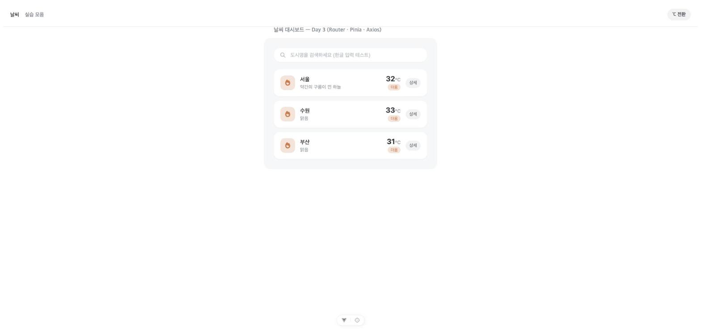
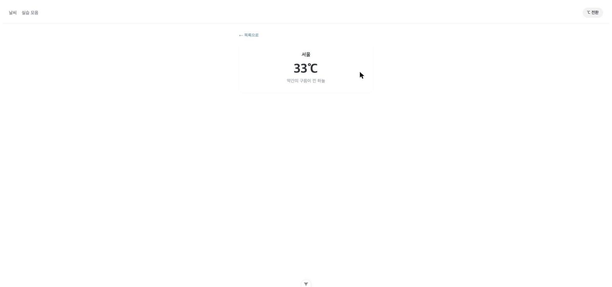
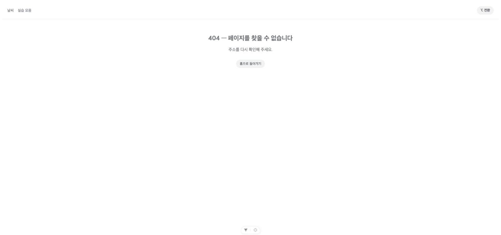

# Vue.js 실습 기록 - Day 3

- 과정명: Full-Stack Engineering - Frontend-framework: Vue.js (강병호)
- 날짜: 2026-08-04
- 오늘 목표 (`docs/checklist.md` 3일차 기준): 4단계「Router·Pinia·Axios」
  - Router — 목록↔상세 라우팅, 지연 로딩, Catch-all Route
  - Pinia `configStore` — `state.unit` / `getters.unitSymbol`(℃·℉) / `actions.toggleUnit`
  - `UnitToggler.vue`를 Navigation Bar 옆에 배치, 메인·상세 양쪽 적용
  - 온도 변환은 `computed`로 — `Math.round((rawTemp * 9) / 5 + 32)`
  - Axios로 OpenWeatherMap 실제 데이터 교체 + 로딩·에러 처리
  - 오늘 작업분 커밋 & 푸시
  - (사전 준비) OpenWeatherMap API Key는 1일차에 미리 가입해뒀어야 함 — 아직이면 지금 발급 필요

> 이 문서는 실습 중 진행한 작업을 요구사항 → 사고 과정 → 해결 과정 → 트러블슈팅 → 결과 → 느낀점 순서로 기록합니다. 최종 종합 보고서는 [final-report.md](./final-report.md)를 참고하세요.
>
> 참고: 실제로는 계획보다 하루 앞당겨 8/3에 진행함(2일차와 같은 날).

---

## 1. Router · Pinia · Axios 도입 — 목록/상세 라우팅, ℃·℉ 토글, 실제 API 연동

**요구사항**
- `docs/checklist.md` 3일차 스펙대로, Day2까지의 날씨 앱에 Vue Router(목록↔상세, 지연 로딩, Catch-all), Pinia `configStore`(온도 단위 토글), Axios(OpenWeatherMap 실데이터 + 로딩/에러 처리)를 추가한다.

**사고 과정**
- OpenWeatherMap API Key를 사용자가 채팅으로 전달해줘서, git에 노출되지 않도록 `skala-vue/.env`(`VITE_OPENWEATHER_API_KEY=...`)에 저장하고 `.gitignore`에 `.env`를 추가. 팀원이 참고할 수 있도록 값이 없는 `.env.example`도 함께 생성.
- 라우팅을 도입하면서 기존에 `App.vue`에 일렬로 쌓아뒀던 실습 데모 컴포넌트들(SampleOne~FontAwesomeDemo)을 어떻게 할지 고민 — 이 데모들은 "종합과제(날씨 앱)"와 무관한 챕터별 학습 기록이므로, 별도 `PracticesView.vue`로 옮기고 `/practices` 경로로 분리하기로 결정. `App.vue`는 내비게이션 바 + `<RouterView>`를 가진 셸로 재구성.
- Day2의 `WeatherParent.vue`가 사실상 "종합과제 앱의 홈 화면"이므로, 별도 컴포넌트로 남겨두지 않고 `src/views/WeatherHomeView.vue`로 승격시켜 라우트에 직접 연결. `BaseDashboardCard`/`SearchBar`/`WeatherCard`는 그대로 재사용.
- 온도 데이터는 도시 3곳(서울/수원/부산)에 대해 OpenWeatherMap의 `q=Seoul,KR` 같은 영문+국가코드 쿼리로 조회해야 해서, 기존 하드코딩 데이터 대신 `{ id, name, query }` 메타데이터 목록(`CITY_LIST`)과 이를 사용하는 `fetchCurrentWeather()` 함수를 `src/services/weatherApi.js`에 분리.
- 더움/선선함 배지 판정(`temp >= 25`)은 화면 표시 단위(℃/℉)와 무관하게 항상 섭씨 원본 기준으로 유지해야 의미가 맞아서, `WeatherCard`에는 원본 `temp`(배지 판정용)와 `displayTemp`+`unitSymbol`(표시용)을 함께 내려주는 방식으로 설계.
- 온도 변환 공식은 체크리스트가 지정한 `Math.round((rawTemp * 9) / 5 + 32)`를 그대로 사용.

**해결 과정**
1. `.env`/`.env.example`/`.gitignore` 설정 (API Key 보호).
2. `axios` 패키지 설치(`npm install --save --legacy-peer-deps axios` — 기존과 동일한 oxlint peer dependency 충돌로 플래그 필요).
3. `src/services/weatherApi.js` 신규 생성 — 도시 메타데이터와 OpenWeatherMap 호출 함수.

   #### `src/services/weatherApi.js`
   ```js
   import axios from 'axios'

   const API_KEY = import.meta.env.VITE_OPENWEATHER_API_KEY
   const BASE_URL = 'https://api.openweathermap.org/data/2.5/weather'

   export const CITY_LIST = [
     { id: 'city_01', name: '서울', query: 'Seoul,KR' },
     { id: 'city_02', name: '수원', query: 'Suwon,KR' },
     { id: 'city_03', name: '부산', query: 'Busan,KR' },
   ]

   export function findCityById(id) {
     return CITY_LIST.find((city) => city.id === id)
   }

   export async function fetchCurrentWeather(city) {
     const { data } = await axios.get(BASE_URL, {
       params: { q: city.query, appid: API_KEY, units: 'metric', lang: 'kr' },
     })
     return {
       id: city.id,
       name: city.name,
       temp: Math.round(data.main.temp),
       status: data.weather[0].description,
     }
   }
   ```

4. `src/stores/configStore.js` 신규 생성 — Pinia setup 스토어(기존 `counter.js`와 동일한 함수형 패턴).

   #### `src/stores/configStore.js`
   ```js
   import { ref, computed } from 'vue'
   import { defineStore } from 'pinia'

   export const useConfigStore = defineStore('config', () => {
     const unit = ref('metric') // 'metric'(섭씨) | 'imperial'(화씨)
     const unitSymbol = computed(() => (unit.value === 'metric' ? '℃' : '℉'))
     function toggleUnit() {
       unit.value = unit.value === 'metric' ? 'imperial' : 'metric'
     }
     return { unit, unitSymbol, toggleUnit }
   })
   ```

5. `src/components/UnitToggler.vue` 신규 생성 — 내비게이션 바에 배치할 단위 토글 버튼.

   #### `src/components/UnitToggler.vue`
   ```vue
   <script setup>
   import { useConfigStore } from '../stores/configStore'
   const configStore = useConfigStore()
   </script>

   <template>
     <button class="unit-toggler" @click="configStore.toggleUnit">
       {{ configStore.unitSymbol }} 전환
     </button>
   </template>

   <style scoped>
   .unit-toggler {
     border: none;
     background: #f1f2f4;
     color: #3a3f45;
     font-size: 13px;
     font-weight: 600;
     padding: 8px 14px;
     border-radius: 999px;
     cursor: pointer;
   }
   .unit-toggler:hover {
     background: #e7e9ec;
   }
   </style>
   ```

6. `WeatherCard.vue`를 수정해 `displayTemp`/`unitSymbol`이 있으면 우선 표시하고, 없으면 기존 `temp`/`°`로 폴백하도록 온도 표시 부분만 변경(배지 판정용 `city.temp` 로직은 그대로 유지).

   #### `src/components/practices/weather/WeatherCard.vue` (변경 부분)
   ```html
   <div class="city-card__temp-block">
     <p class="city-card__temp">
       {{ city.displayTemp ?? city.temp }}<span class="city-card__unit">{{
         city.unitSymbol ?? '°'
       }}</span>
     </p>
     <span class="city-card__label" :class="city.temp >= 25 ? 'is-warm' : 'is-cool'">
       {{ city.temp >= 25 ? '더움' : '선선함' }}
     </span>
   </div>
   ```

7. `src/views/WeatherHomeView.vue` 신규 생성 — Day2의 `WeatherParent.vue`를 계승하되, `onMounted`에서 `Promise.all`로 3개 도시 날씨를 조회하고 로딩/에러 상태를 관리. `computed`로 화씨 변환한 `displayWeatherList`를 만들어 `WeatherCard`에 전달. "상세" 버튼 클릭 시 `router.push`로 상세 페이지 이동.

   #### `src/views/WeatherHomeView.vue`
   ```vue
   <script setup>
   import { ref, computed, watch, watchEffect, onMounted } from 'vue'
   import { useRouter } from 'vue-router'
   import BaseDashboardCard from '../components/practices/weather/BaseDashboardCard.vue'
   import SearchBar from '../components/practices/weather/SearchBar.vue'
   import WeatherCard from '../components/practices/weather/WeatherCard.vue'
   import { useConfigStore } from '../stores/configStore'
   import { CITY_LIST, fetchCurrentWeather } from '../services/weatherApi'

   const router = useRouter()
   const configStore = useConfigStore()

   const weatherList = ref([])
   const searchQuery = ref('')
   const selectedCityInfo = ref(null)
   const isLoading = ref(true)
   const loadError = ref('')

   async function loadWeatherList() {
     isLoading.value = true
     loadError.value = ''
     try {
       weatherList.value = await Promise.all(CITY_LIST.map((city) => fetchCurrentWeather(city)))
     } catch (err) {
       loadError.value = '날씨 정보를 불러오지 못했습니다. API Key와 네트워크 상태를 확인해 주세요.'
       console.error('[WeatherHomeView] 날씨 조회 실패:', err)
     } finally {
       isLoading.value = false
     }
   }

   onMounted(loadWeatherList)

   const filteredWeatherList = computed(() =>
     weatherList.value.filter((city) => city.name.includes(searchQuery.value)),
   )

   const displayWeatherList = computed(() =>
     filteredWeatherList.value.map((city) => ({
       ...city,
       displayTemp:
         configStore.unit === 'imperial' ? Math.round((city.temp * 9) / 5 + 32) : city.temp,
       unitSymbol: configStore.unitSymbol,
     })),
   )

   watch(selectedCityInfo, (newVal) => {
     console.log('[watch] 선택된 도시:', newVal)
   })
   watchEffect(() => {
     console.log('[watchEffect] 검색어 변경:', searchQuery.value)
   })

   function handleUpdateQuery(value) {
     searchQuery.value = value
   }
   function handleSelectCard(city) {
     selectedCityInfo.value = city
   }
   function handleClickDetail(city) {
     router.push({ name: 'weather-detail', params: { id: city.id } })
   }
   </script>
   <!-- template/style은 Day2 WeatherParent.vue와 동일한 카드 레이아웃 + 로딩/에러 분기 추가 -->
   ```

8. `src/views/WeatherDetailView.vue` 신규 생성 — 라우트 파라미터(`id`)로 도시를 조회해 단건 날씨를 표시, `computed`로 온도 변환.

   #### `src/views/WeatherDetailView.vue`
   ```vue
   <script setup>
   import { ref, computed, onMounted, watch } from 'vue'
   import { useRouter } from 'vue-router'
   import { useConfigStore } from '../stores/configStore'
   import { findCityById, fetchCurrentWeather } from '../services/weatherApi'

   const props = defineProps({ id: { type: String, required: true } })
   const router = useRouter()
   const configStore = useConfigStore()

   const weather = ref(null)
   const isLoading = ref(true)
   const loadError = ref('')

   async function loadDetail() {
     const city = findCityById(props.id)
     if (!city) {
       loadError.value = '존재하지 않는 도시입니다.'
       isLoading.value = false
       return
     }
     isLoading.value = true
     loadError.value = ''
     try {
       weather.value = await fetchCurrentWeather(city)
     } catch (err) {
       loadError.value = '날씨 정보를 불러오지 못했습니다. API Key와 네트워크 상태를 확인해 주세요.'
       console.error('[WeatherDetailView] 날씨 조회 실패:', err)
     } finally {
       isLoading.value = false
     }
   }

   onMounted(loadDetail)
   watch(() => props.id, loadDetail)

   const displayTemp = computed(() => {
     if (!weather.value) return null
     return configStore.unit === 'imperial'
       ? Math.round((weather.value.temp * 9) / 5 + 32)
       : weather.value.temp
   })
   </script>
   ```

9. `src/views/NotFoundView.vue`, `src/views/PracticesView.vue` 신규 생성 (Catch-all 페이지, 기존 실습 데모 이전).
10. `src/router/index.js` 갱신 — 4개 라우트 모두 동적 `import()`(지연 로딩)로 등록, `/:pathMatch(.*)*`로 Catch-all 처리.

    #### `src/router/index.js`
    ```js
    import { createRouter, createWebHistory } from 'vue-router'

    const router = createRouter({
      history: createWebHistory(import.meta.env.BASE_URL),
      routes: [
        { path: '/', name: 'weather-home', component: () => import('../views/WeatherHomeView.vue') },
        {
          path: '/weather/:id',
          name: 'weather-detail',
          component: () => import('../views/WeatherDetailView.vue'),
          props: true,
        },
        { path: '/practices', name: 'practices', component: () => import('../views/PracticesView.vue') },
        { path: '/:pathMatch(.*)*', name: 'not-found', component: () => import('../views/NotFoundView.vue') },
      ],
    })

    export default router
    ```

11. `src/App.vue`를 내비게이션 바(`RouterLink` 2개 + `UnitToggler`) + `<RouterView>`로 재구성, 기존 `WeatherParent.vue`는 삭제.

    #### `src/App.vue`
    ```vue
    <script setup>
    import { RouterLink, RouterView } from 'vue-router'
    import UnitToggler from './components/UnitToggler.vue'
    </script>

    <template>
      <nav class="app-nav">
        <div class="app-nav__links">
          <RouterLink to="/" class="app-nav__link">날씨</RouterLink>
          <RouterLink to="/practices" class="app-nav__link">실습 모음</RouterLink>
        </div>
        <UnitToggler />
      </nav>
      <RouterView />
    </template>
    ```

12. 브라우저에서 홈(실데이터 로딩) → 단위 토글(℃/℉) → 상세 이동(단위 유지 확인) → 존재하지 않는 경로(Catch-all) → `/practices` 이동까지 전 구간 검증.

**트러블슈팅**
- 없음. (axios 설치 시 발생한 oxlint peer dependency 충돌은 이전에 이미 겪은 것과 동일한 패턴이라 `--legacy-peer-deps`로 바로 해결)

**결과**
- 홈 화면에서 실제 OpenWeatherMap 데이터(서울 32℃ "약간의 구름이 낀 하늘", 수원 33℃ "맑음", 부산 31℃ "맑음")가 정상 로딩됨.
- 단위 토글 클릭 시 32℃→90℉ 등 `Math.round((rawTemp*9)/5+32)` 공식대로 정확히 변환되고, 상세 페이지로 이동해도 같은 단위(Pinia 전역 상태)가 유지됨.
- 존재하지 않는 경로(`/no-such-page`) 접근 시 Catch-all 라우트로 404 안내 화면이 정상 표시됨.
- 기존 실습 데모들은 `/practices` 경로로 문제없이 이전 확인, 콘솔 에러 없음.





**느낀점**
- Pinia 스토어 하나로 "단위" 상태를 관리해두니, 완전히 다른 라우트(홈/상세)를 오가도 상태가 자연스럽게 유지되는 걸 직접 보고 나서야 "왜 전역 상태 관리가 필요한가"가 실감 났다. 컴포넌트 props로 내려줬다면 라우트 전환마다 다시 초기화됐을 것이다.
- 실제 외부 API를 붙이고 나니, 하드코딩된 mock 데이터일 때는 신경 쓰지 않았던 로딩/에러 상태 처리가 왜 필수인지 체감됐다. 네트워크가 실패할 수 있다는 전제를 깔고 화면을 설계하는 습관이 붙는 것 같다.
- 기존 실습 데모들을 `/practices`로 몰아넣고 날씨 앱을 홈으로 승격시킨 구조 변경은 체크리스트가 직접 요구한 건 아니었지만, 종합과제와 학습용 데모를 명확히 분리해두니 저장소를 처음 보는 사람도 뭐가 "진짜 제출물"인지 헷갈리지 않을 것 같다.

---

<!--
아래 형식을 복사해서 작업 단위마다 항목을 추가합니다.

## N. (작업 제목)

**요구사항**
-

**사고 과정**
-

**해결 과정**
1. (파일을 작성/수정하는 단계라면, 그 아래 파일 경로 + 코드 블록을 바로 넣는다)

#### 파일 경로
```vue

```

**트러블슈팅**
- 문제:
- 원인:
- 해결:
(문제가 없었다면 "없음"으로 기록)

**결과**
-

**느낀점**
-

---
-->
