# Vue.js 실습 기록 - Day 4

- 과정명: Full-Stack Engineering - Frontend-framework: Vue.js (강병호)
- 날짜: 2026-08-05
- 오늘 목표 (`docs/checklist.md` 4일차 기준): 마무리 + 제출
  - Element Plus로 UI 정리
  - Modern JS — 구조분해·전개·옵셔널 체이닝 적용
  - `npm run build` · base 경로 확인 · 정적 배포(Vercel·Netlify·GitHub Pages)
  - 저장소가 Public인지 시크릿 창으로 최종 확인
  - 수업 종료 전까지 제출

> 이 문서는 실습 중 진행한 작업을 요구사항 → 사고 과정 → 해결 과정 → 트러블슈팅 → 결과 → 느낀점 순서로 기록합니다. 최종 종합 보고서는 [final-report.md](./final-report.md)를 참고하세요.
>
> Day 4는 4일 과정의 마지막 날로, 실습이 최종 결과물로 완성되는 날입니다. 오늘 작업이 끝나면 [final-report.md](./final-report.md)를 반드시 완성해야 합니다.

---

## 1. Day 4 추가 실습(8~9장 Code Challenge) 조사 및 구현 (메인 실습 착수 전 사전 작업)

**요구사항**
- 4일차 메인 실습(Element Plus로 실제 앱 UI 정리, Modern JS 리팩토링, 빌드/배포)에 들어가기 전에, 새 PDF 209~274페이지(8장 UI 라이브러리·9장 Modern JavaScript·10장 Vite 빌드/배포)를 조사해 문서화하고, 8~9장의 자습용 Code Challenge를 `/practices/day4`에 구현한다.

**사고 과정**
- 탐색 결과 8장은 Element Plus 3종 챌린지(회원가입 폼, 구매 수량/별점, 삭제확인+다운로드 진행률), 9장은 완전한 스타터 코드가 제공된 Modern JS 3종 챌린지(구조분해+비구조화, 스프레드+옵셔널체이닝, async/await 연쇄)임을 확인. 9장 챌린지는 교재의 "미션" 주석을 그대로 두고 정답 코드로 빈칸을 채우는 형태로 구현.
- 10장(ESLint/Prettier/env/build)의 Code Challenge는 컴포넌트가 아니라 "명령 실행·설정 파일 작성" 성격이라, 오늘 이어질 메인 실습(빌드/배포)에서 자연스럽게 함께 다루기로 하고 이번 항목에서는 구현하지 않음(문서화만 완료).
- Element Plus를 신규 설치해야 하므로 `main.js`에 전역 등록.

**해결 과정**
1. `npm install --save --legacy-peer-deps element-plus` 설치, `main.js`에 `app.use(ElementPlus)` + CSS import 추가.
2. `SignupFormChallenge.vue`(p.225) 생성 — 이메일 형식 검증, 약관 동의, `ElMessage`로 성공/경고/에러 토스트.
3. `ProductQuantityChallenge.vue`(p.226) 생성 — `el-input-number`(구매 수량), `el-rate`(별점).
4. `FileDeleteProgressChallenge.vue`(p.227) 생성 — `ElMessageBox.confirm`(삭제 확인) + `el-progress`(다운로드 진행률 애니메이션). 교재 원본의 `type: 'danger'`는 Element Plus 미지원 값이라 `'warning'`으로 수정.
5. `DataExtractChallenge.vue`(p.247), `CartDefenseChallenge.vue`(p.248), `AsyncChainChallenge.vue`(p.249) 생성 — 교재가 제공한 스타터 코드의 "미션" 주석 부분을 실제 구현 코드로 완성.

   #### `src/components/practices/modernjs/AsyncChainChallenge.vue` (예시로 하나만 인용, 나머지는 유사한 구조)
   ```vue
   <script setup>
   import { ref } from 'vue'
   const result3 = ref('')
   const fetchUserId = () => new Promise((res) => setTimeout(() => res({ uid: 777 }), 400))
   const fetchUserProfile = (uid) => new Promise((res) => setTimeout(() => res({ uid, nick: 'Graves' }), 400))

   async function runTask3() {
     result3.value = '⏳ 데이터 동기화 중...'
     try {
       const { uid } = await fetchUserId()
       const { nick } = await fetchUserProfile(uid)
       result3.value = `동기화 성공: ${nick}님 환영합니다.`
     } catch (error) {
       result3.value = '통신 실패'
       console.error(error)
     }
   }
   </script>
   ```

6. `PracticesDay4View.vue` 신규 생성(6개 챌린지 모두 배치), `router/index.js`의 `/practices/day4`에 연결.
7. `docs/vue-study-guide.md`에 8~10장 이론 섹션 추가, `docs/vue-practice-exercises.md`에 "Day 4 추가 실습" 절 추가.
8. 브라우저에서 `/practices/day4` 렌더링 확인 — 잘못된 이메일 검증 메시지, 다운로드 진행률 애니메이션(0%→100%), Modern JS 3개 챌린지의 "가동" 버튼을 각각 클릭해 정확한 출력 포맷을 검증.

**트러블슈팅**
- **문제**: element-plus 설치 시 이전과 동일한 `ERESOLVE`(oxlint peer dependency) 충돌.
- **원인**: 프로젝트의 oxlint 버전 고정 문제(1일차부터 반복).
- **해결**: `--legacy-peer-deps`로 재시도, 정상 설치.

**결과**
- Element Plus 3개 챌린지 모두 정상 동작: 이메일 형식 오류 시 "❌ 올바른 이메일 형식이 아닙니다" 토스트 표시, 다운로드 진행률이 0→20→40→...→100%까지 정상 애니메이션.
- Modern JS 3개 챌린지 모두 교재가 요구한 정확한 문자열 포맷으로 출력됨:
  - 결과창 1: `부산 포함 여부: true / 등급: VIP / 점수: 95점`
  - 결과창 2: `카트: Apple,Banana,Orange / 이미지: 이미지 준비중 / 수량: 0개`
  - 결과창 3: `동기화 성공: Graves님 환영합니다.`

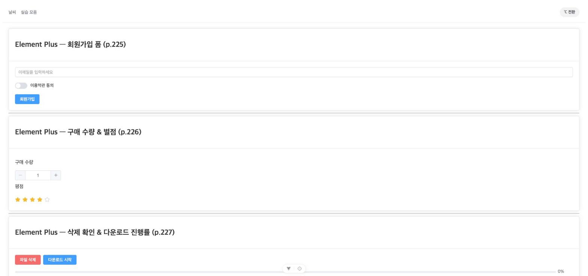
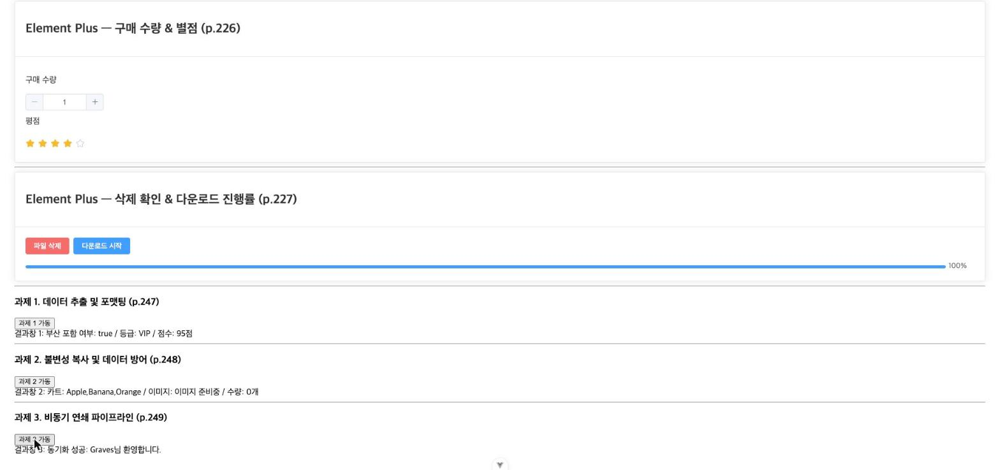

**느낀점**
- Modern JS 챌린지는 교재가 스타터 코드와 정확한 출력 포맷까지 제공해줘서, 구현한 코드가 맞았는지 화면에 찍힌 문자열을 교재 스펙과 글자 그대로 대조하며 바로 확인할 수 있었다 — 채점 기준이 명확한 연습 문제의 장점을 느꼈다.
- 교재 원본 코드에 `type: 'danger'`처럼 실제로는 동작하지 않는 오탈자가 종종 있다는 걸 이번에도 확인했다(1일차 v-cloak 문서화 때도 비슷한 경험). 라이브러리 문서를 항상 함께 대조하는 습관이 중요하다는 걸 다시 느꼈다.
- 이제 메인 실습(Element Plus로 실제 날씨 앱 UI 정리, Modern JS 리팩토링, 빌드/배포)으로 넘어갈 준비가 됐다 — 연습을 먼저 해두니 실제 앱에 적용할 때 문법을 다시 찾아볼 필요가 없을 것 같다.

---

## 2. "Retro LED Weather Terminal" 디자인 시스템 구축 및 전체 화면 적용

**요구사항**
- 4일차 UI 정리 단계에서, 참고 이미지(도트 매트릭스 스타일의 스마트폰 날씨 앱 화면)를 기반으로 날씨 아이콘을 도트(픽셀) 기반 애니메이션으로 재구성하고, 이 디자인을 홈 화면·날씨 카드·검색창·단위 토글·상단 내비게이션까지 앱 전체에 확산 적용한다.

**사고 과정**
- 디자인 변경은 되돌리기 어렵고 취향이 많이 갈리는 작업이라, 전체 화면에 한 번에 적용하지 않고 `WeatherDetailView` 한 곳에만 먼저 적용해 컨셉을 확정한 뒤 나머지로 확산하는 단계적 접근을 택했다.
- 아이콘 애니메이션을 "원형 그래픽이 CSS `transform`으로 미끄러지는" 방식으로 처음 구현했다가, "진짜 전광판처럼 고정된 칸이 켜졌다 꺼졌다 하는 느낌"이어야 한다는 피드백을 받고 `setInterval` 기반으로 매 프레임 그리드 전체의 점등 여부를 다시 계산하는 방식으로 전면 재설계했다. 이 과정에서 비/눈/안개는 프레임 기반 동적 패턴으로, 해/구름/뇌우는 정적 패턴 + CSS 애니메이션으로 역할을 나눴다.
- 아이콘이 어느 정도 안정된 뒤에는 이 스타일을 앱 전체로 확산하되, 이미 존재하는 디자인 토큰(`retro-theme.css`)과 컴포넌트(`DotMatrixIcon`)를 그대로 재사용하고, 날씨 카드의 배지 아이콘도 이미 계산되어 있는 `city.condition` 값을 이용해 `DotMatrixIcon size="sm"`으로 교체하는 방향으로 정리했다(새 데이터 계산 없이 기존 값 재사용).

**해결 과정**
1. 디자인 토큰과 폰트를 준비했다 — `index.html`에 Silkscreen(영문 픽셀 폰트) 구글 폰트와 Galmuri(한글 픽셀 폰트, CDN) 링크를 추가하고, `src/assets/retro-theme.css`에 색상 토큰을 정의해 `main.js`에서 전역 로드했다.

   #### `src/assets/retro-theme.css`
   ```css
   :root {
     --paper: #edeae1;
     --ink: #1c1b19;
     --panel: #17181a;
     --dot-off: #2a2c2e;
     --dot-lit: #f3ebd9;
     --amber: #c98a2c;
     --moss: #5e6b5a;
     --font-pixel: 'Silkscreen', ui-monospace, monospace;
     --font-pixel-kr: 'Galmuri11', var(--font-mono);
     --font-mono: ui-monospace, 'SFMono-Regular', Menlo, Consolas, monospace;
   }
   body {
     background: var(--paper);
     color: var(--ink);
     font-family: var(--font-mono);
   }
   ```

2. `src/components/practices/weather/DotMatrixIcon.vue`를 신규 작성했다 — `condition`(sun/cloud/rain/snow/thunderstorm/fog)/`size`(sm|lg)/`animated`/`colored` prop을 받아 36×36 그리드를 계산해 렌더링한다. 해·구름·뇌우는 좌표 기하 계산(원·타원·선분 거리)으로 정적 패턴을 만들고, 비·눈·안개는 `frame` ref를 `setInterval`로 증가시키며 매 틱마다 그리드를 다시 계산해 "고정된 칸이 밝기만 바뀌는" 전광판 느낌을 낸다.

   #### `src/components/practices/weather/DotMatrixIcon.vue` (비 애니메이션 핵심 로직 발췌)
   ```js
   const RAINDROP_SHAPE = [ [0,0], [-1,1],[0,1],[1,1], [-1,2],[0,2],[1,2],
     [-2,3],[-1,3],[0,3],[1,3],[2,3], [-2,4],[-1,4],[0,4],[1,4],[2,4], [-1,5],[0,5],[1,5] ]
   function buildRainFrame(frame) {
     const dots = emptyDots()
     RAIN_DROPS.forEach(({ x, phase, speed }) => {
       const exact = ((frame * speed + phase) % totalRows) - 6
       const row = Math.floor(exact)
       const frac = exact - row
       ;[[row, 1 - frac], [row + 1, frac]].forEach(([cy, weight]) => {
         if (weight <= 0.02) return
         RAINDROP_SHAPE.forEach(([ox, oy]) => applyDot(dots, x + ox, cy + oy, weight, color, 'drop'))
       })
     })
     return dots
   }
   ```

3. 확인용 테스트 페이지 `src/views/DotMatrixPreviewView.vue`(`/preview/dot-matrix`)를 만들어 실제 날씨가 바뀌길 기다리지 않고 6가지 조건 애니메이션을 한 화면에서 색상 토글과 함께 비교할 수 있게 했다.
4. `WeatherDetailView.vue`에 `DotMatrixIcon`을 적용해 컨셉을 먼저 확정했다(도시명은 `--font-pixel-kr`, 온도는 `--font-pixel`, 화면은 `--panel` 배경).
5. 컨셉이 확정된 뒤, 나머지 화면에 동일 토큰을 적용해 확산했다.

   #### `src/App.vue` (상단 내비게이션)
   ```css
   .app-nav {
     background: var(--ink);
     border-bottom: 2px solid var(--amber);
   }
   .app-nav__link {
     font-family: var(--font-pixel-kr);
     color: var(--paper);
   }
   .app-nav__link.router-link-active {
     color: var(--amber);
   }
   ```

   #### `src/components/practices/weather/WeatherCard.vue` (배지를 FontAwesome → DotMatrixIcon으로 교체)
   ```vue
   <div class="city-card__badge">
     <DotMatrixIcon :condition="city.condition" size="sm" :animated="true" />
   </div>
   ```

   `SearchBar.vue`(검색창을 LED 화면처럼 `--panel` 배경 + `--dot-lit` 글자로), `UnitToggler.vue`(작은 픽셀 버튼), `BaseDashboardCard.vue`(카드 배경을 `--paper`로)도 같은 토큰으로 통일했다.

**트러블슈팅**
- **문제**: 비/눈 애니메이션이 "원이 미끄러지는" 것처럼 보이고, 구름은 매끈한 타원 하나로 뭉쳐 보이거나 반대로 내부에 구멍이 생기는 등 여러 차례 모양이 어색했다.
- **원인**: 초기 구현이 CSS `transform`으로 도트를 이동시켰던 것과, 원 여러 개를 겹칠 때 반지름·간격 비율을 잘못 잡아 개별 원의 경계가 그대로 드러나거나(포도송이처럼 분리) 반대로 내부가 비는 문제였다.
- **해결**: 이동은 매 프레임 그리드를 다시 계산하는 방식으로 전환했고, 구름은 "속을 채우는 큰 도형 + 겹침 비율을 세밀하게 조정한 작은 돌기들"의 조합으로 여러 번 반지름·중심 좌표를 다시 맞춰 참고 이미지와 비슷한 울퉁불퉁한 실루엣을 만들었다.

**결과**
- `/`, `/weather/:id`, `/preview/dot-matrix` 전 화면에서 다크 내비게이션 + 크림톤 카드 + 도트 매트릭스 아이콘 스타일이 일관되게 적용됨을 확인했다.
- 검색 필터링, 카드 선택/상세 이동, ℃/℉ 단위 토글이 스타일 변경 후에도 기존과 동일하게 동작함을 확인했다(로직은 손대지 않고 스타일만 교체).

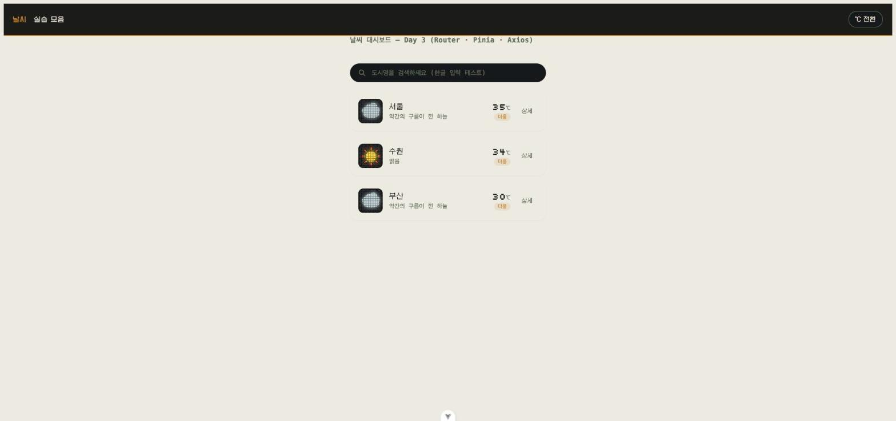
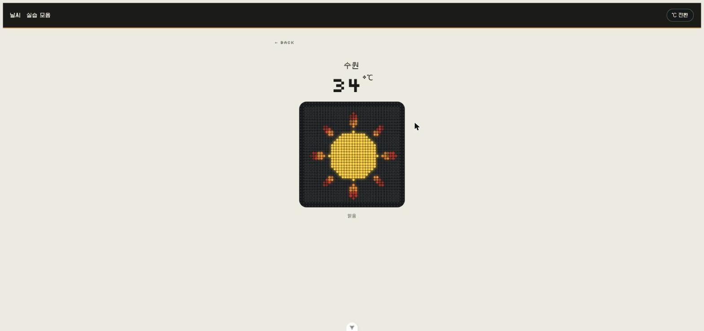

**느낀점**
- 디자인처럼 정답이 없는 작업은 "한 곳에서 컨셉을 확정한 뒤 확산"하는 단계적 접근이 되돌리기 비용을 크게 줄여준다는 걸 체감했다. 상세 화면 하나에서 8~9번의 세부 피드백을 받아 아이콘을 다듬은 뒤 전체 확산은 오히려 빠르고 매끄럽게 끝났다.
- CSS `transform` 애니메이션과 "매 프레임 다시 계산하는" 방식은 코드량은 비슷해도 결과물의 성격이 완전히 다르다는 걸 배웠다 — 같은 "움직임"이라도 무엇이 실제로 움직이는지(그래픽 자체 vs 그리드 상태)에 따라 시각적 인상이 크게 달라진다.

---

## 3. 한반도 도트 지도 대시보드(`/map`) 구현 — 지역 선택·풍향 애니메이션·API 데이터 시각화·즐겨찾기

**요구사항**
- Day 4 메인 실습(레트로 도트 매트릭스 디자인)을 베이스로, 한반도 지도 위에서 주요 지역 날씨를 확인하는 새 대시보드 페이지를 추가한다. (1) 지도에 대표 지역을 표시하고 클릭하면 날씨가 나오게, (2) 지도 자체도 도트 이미지로, (3) 지도에서 날씨 흐름(풍향)을 표현, (4) 지역 즐겨찾기 기능. 추가로 지역 상세 정보에서 API의 다양한 값(습도·구름량·가시거리·기압·일출일몰 등)을 시각화한다.

**사고 과정**
- 실제 GPS 좌표 데이터 없이 지도를 만들어야 했으므로, 기존 구름/눈송이 아이콘을 만들 때 썼던 "다각형/원 기하로 실루엣을 근사해 그리드에 점을 찍는" 기법을 그대로 재사용하기로 했다. 대신 이 지도가 실측 지리 데이터가 아니라 스타일화된 근사 실루엣이라는 점은 사용자에게 미리 밝혔다.
- "날씨 흐름"을 표현하는 방법은 여러 방향(실제 풍향 애니메이션 / 온도 히트맵 / 정적 마커)이 가능해 사용자에게 직접 골라달라고 물었고, "실제 풍향 기반 애니메이션"으로 확정했다. OpenWeatherMap 응답에 이미 풍향(`wind.deg`)·풍속(`wind.speed`)이 들어있으므로 새 API 호출 없이 기존 `fetchCurrentWeather`에 필드만 추가하면 됐다.
- API 데이터 시각화는 그래프 라이브러리를 새로 설치하기보다, 지금까지 만든 도트 매트릭스 톤에 맞춰 "도트 여러 칸을 채우는 막대(LED 레벨미터)"로 직접 만드는 쪽을 택했다 — 일관성을 지키면서 의존성도 늘리지 않는 방법이었다.

**해결 과정**
1. `weatherApi.js`의 `CITY_LIST`를 3개 도시에서 9개(서울·인천·수원·대전·대구·광주·부산·울산·제주)로 늘리고, 지도 배치용 정규화 좌표 `mapX`/`mapY`를 추가했다. `fetchCurrentWeather`가 반환하는 객체에도 풍향/풍속/습도/기압/체감온도/최저·최고/가시거리/구름량/일출·일몰을 추가로 뽑아 담았다.

   #### `src/services/weatherApi.js` (발췌)
   ```js
   export const CITY_LIST = [
     { id: 'city_01', name: '서울', query: 'Seoul,KR', mapX: 0.42, mapY: 0.08 },
     { id: 'city_04', name: '인천', query: 'Incheon,KR', mapX: 0.25, mapY: 0.1 },
     // ... 총 9개 도시
   ]

   export async function fetchCurrentWeather(city) {
     const { data } = await axios.get(BASE_URL, { params: { q: city.query, appid: API_KEY, units: 'metric', lang: 'kr' } })
     const { main, weather, wind, visibility, clouds, sys } = data
     const [{ main: weatherMain, description } = {}] = weather ?? []
     return {
       id: city.id, name: city.name, mapX: city.mapX, mapY: city.mapY,
       temp: Math.round(main.temp), status: description, condition: mapWeatherMainToCondition(weatherMain),
       windDeg: wind?.deg ?? 0, windSpeed: wind?.speed ?? 0,
       humidity: main.humidity, pressure: main.pressure,
       feelsLike: Math.round(main.feels_like), tempMin: Math.round(main.temp_min), tempMax: Math.round(main.temp_max),
       visibility: visibility ?? 10000, cloudiness: clouds?.all ?? 0,
       sunrise: sys?.sunrise, sunset: sys?.sunset,
     }
   }
   ```

2. `src/components/practices/weather/KoreaMapDots.vue`를 신규 작성했다 — 남한 외곽선을 다각형 좌표로 손으로 근사하고, `DotMatrixIcon`과 같은 grid-membership 판정(ray-casting)으로 도트를 켜서 지도 실루엣을 만들었다. 제주는 별도의 원으로 추가. 각 도시 위치에 `DotMatrixIcon size="sm"` 마커를 절대좌표로 올리고, 마커 주변에 실제 풍향(`windDeg+180`)·풍속 기반으로 흘러나가는 작은 입자를 `setInterval` 프레임 재계산 방식(비/눈 애니메이션과 동일한 기법, CSS transform 슬라이드 아님)으로 그렸다.

   #### `src/components/practices/weather/KoreaMapDots.vue` (풍향 입자 로직 발췌)
   ```js
   const particles = computed(() =>
     props.cities.flatMap((city) => {
       const angleRad = ((city.windDeg + 180) % 360) * (Math.PI / 180)
       const speed = Math.max(0.6, Math.min(3, city.windSpeed || 1))
       return [0, 1].map((phaseIndex) => {
         const phase = phaseIndex * (MAX_DRIFT / 2)
         const distance = (frame.value * speed * 0.6 + phase) % MAX_DRIFT
         const dx = distance * Math.sin(angleRad)
         const dy = -distance * Math.cos(angleRad)
         return { key: `${city.id}-${phaseIndex}`, mapX: city.mapX, mapY: city.mapY, dx, dy, opacity: 1 - distance / MAX_DRIFT }
       })
     }),
   )
   ```

3. `src/components/practices/weather/DotStatBar.vue`를 신규 작성했다 — `label`/`value`(0~100)/`displayValue` prop을 받아 도트 16칸 중 비율만큼 앰버색으로 채우는 막대 컴포넌트.
4. `src/stores/favoritesStore.js`를 신규 작성했다 — `favoriteIds` 배열을 `localStorage`(`weather-favorites` 키)에 `watch`로 영속화하고 `toggleFavorite`/`isFavorite`을 제공.
5. `src/views/WeatherMapView.vue`를 신규 작성했다 — 지도(왼쪽) + 선택된 도시 상세 패널(오른쪽) 2단 레이아웃. 상세 패널엔 `DotMatrixIcon size="lg"`와 함께 `DotStatBar`로 습도·구름량·가시거리·기압·낮 진행률(일출~일몰 사이 현재 시각 비율)을 표시하고, 즐겨찾기 토글(★)과 기존 `/weather/:id` 상세 페이지로 가는 버튼을 뒀다. 즐겨찾기된 도시는 지도 위에 칩으로 나열해 바로 선택할 수 있게 했다. `@media (max-width: 640px)`로 모바일에서 1단 스택으로 전환.
6. `router/index.js`에 `/map`(`weather-map`) 라우트를, `App.vue` 내비게이션에 "지도" 링크를 추가했다.
7. 브라우저에서 확인 — 9개 마커가 지도 위 대략 올바른 상대 위치(서울 북쪽, 부산 남동쪽, 제주 최남단)에 표시됨을 확인. 마커 클릭 시 상세 패널이 갱신되고 도트 막대들이 실제 값 비율만큼 채워짐을 확인. 즐겨찾기 토글 후 새로고침해도 유지됨을 확인. 브라우저 창을 좁혀 모바일 스택 레이아웃 CSS가 실제로 컴파일돼 있음을 스타일시트에서 확인.

**트러블슈팅**
- **문제**: 처음 좌표(서울/수원, 부산/울산)로 지도를 그렸더니 마커들이 서로 겹쳐서 라벨이 뭉개졌다.
- **원인**: 실제 거리상 가까운 도시들의 `mapY` 값 차이가 너무 작아 마커(아이콘+라벨) 세로 폭보다 간격이 좁았다.
- **해결**: 겹치는 도시 쌍의 `mapX`/`mapY`를 서로 더 벌리는 방향으로 좌표를 재조정해 해결했다(정밀한 지리 좌표가 아니라 장식적 배치이므로 가독성 우선으로 조정).

**결과**
- `/map`에서 9개 지역 마커 클릭 → 상세 패널(온도·상태·습도·구름량·가시거리·기압·낮 진행률·풍속) 표시, 즐겨찾기 토글·영속화, 데스크탑 2단/모바일 1단 반응형 레이아웃 모두 정상 동작을 확인했다.

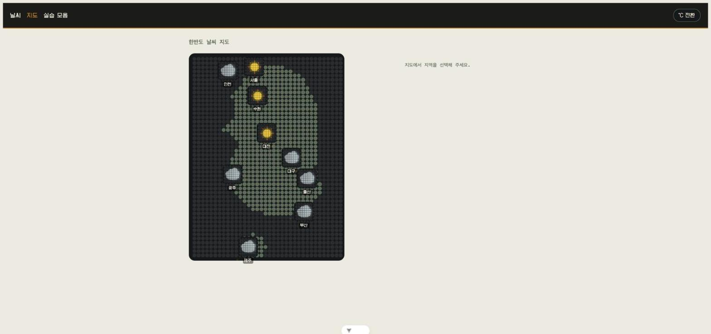
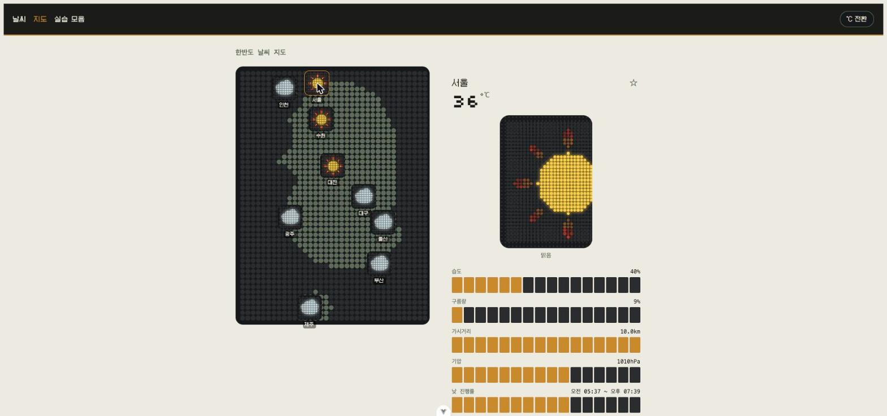

**느낀점**
- 지리 데이터를 정확히 구할 수 없는 상황에서도, 이미 확립해 둔 "기하 근사 + 그리드 판정" 패턴을 다른 문제(지도 실루엣)에 그대로 적용할 수 있다는 걸 확인했다 — 한 번 잘 만들어둔 기법은 아이콘 하나에 그치지 않고 재사용 가치가 크다.
- 여러 구현 방향이 있는 모호한 요구사항("날씨 흐름을 표현")은 임의로 하나를 골라 구현하기보다, 실제 API 데이터와 연결되는 옵션을 포함해 선택지를 제시하고 사용자가 고르게 하는 편이 결과물의 만족도와 데이터 활용도를 모두 높인다는 걸 느꼈다.

---

## 4. 지도 대시보드 개선 — 정적 마커, 한반도 전체 실루엣, 클릭 위치 팝업, 바다 배경

**요구사항**
- 직전에 만든 `/map` 지도 대시보드에 4가지 개선: (1) 메인 지도에서는 마커 애니메이션을 빼고 상세 진입 시에만 재생, (2) 참고 이미지(남북한 전체를 흰 도트로 표현한 실루엣)를 기준으로 지도 모양 재작성, (3) 상세 정보를 옆 패널이 아니라 클릭 위치 근처에 뜨는 애니메이션 팝업으로 변경, (4) 지도를 가두던 검은 박스를 없애고 화면 전체를 "바다"처럼 보이게 한 뒤 그 위에서 풍향 애니메이션이 펼쳐지도록.

**사고 과정**
- 참고 이미지를 보니 지금까지 그린 건 남한만 있는 반쪽짜리 지도였다는 걸 깨달았다. 북한까지 포함한 전체 윤곽으로 다시 그리되, 실측 좌표가 없다는 한계는 이전과 동일하므로 다각형 꼭짓점을 참고 이미지의 특징적인 굴곡(두만강 방면의 각진 돌출, 잘록한 허리, 남해안으로 갈수록 좁아지는 흐름)에 맞춰 눈대중으로 다시 잡았다.
- 지도를 남한 지역에서 북한 포함 전체로 넓히면서, 기존에 남한 영역 기준으로 잡아뒀던 9개 도시의 `mapX`/`mapY`도 새 다각형의 남쪽 절반 영역에 맞게 전부 재조정해야 했다.
- 옆 패널 방식은 지도 자리를 계속 차지해 좁아 보였는데, 팝업으로 바꾸면 지도를 넓게 쓰면서 필요할 때만 정보가 뜨는 구조가 되어 "바다 위에 떠 있는 지도"라는 4번 요구사항과도 자연스럽게 맞아떨어졌다.

**해결 과정**
1. `KoreaMapDots.vue`의 `KOREA_POLYGON`을 남한만 있던 다각형에서 북한을 포함한 전체 윤곽으로 다시 그리고, 울릉도는 낱개 점 2개, 제주는 하나의 원이 아니라 흩어진 점 4개로 바꿨다. 마커에서는 `DotMatrixIcon`을 빼고 조건별 색상의 정적 점 + 라벨만 남겼다.

   #### `src/components/practices/weather/KoreaMapDots.vue` (발췌)
   ```js
   const KOREA_POLYGON = [
     [27, 4], [30, 7], [28, 10], [24, 9], [26, 13], [25, 17], [24, 22], [23, 27],
     [24, 32], [25, 36], [23, 40], [19, 42], [14, 40], [9, 36], [7, 32], [9, 27],
     [7, 23], [10, 20], [8, 16], [11, 12], [9, 8], [13, 5], [17, 3],
   ]
   const ULLEUNGDO_DOTS = [[27, 26], [29, 27]]
   const JEJU_DOTS = [[13, 45], [15, 45], [14, 46], [16, 46]]

   const CONDITION_COLORS = { sun: '#ffd24a', cloud: '#c7d0d3', rain: '#5b8fc7', snow: '#dcf0fa', thunderstorm: '#fff3c0', fog: '#a7acae' }
   ```

2. `weatherApi.js`의 `CITY_LIST` 9개 도시 `mapX`/`mapY`를 새 다각형의 남쪽 영역(허리 아래)에 맞춰 재조정했다.
3. `retro-theme.css`에 `--sea: #16232b` 토큰을 추가하고, `KoreaMapDots.vue`의 `.korea-map__grid`에서 `background: var(--panel)` 박스 스타일을 제거해 지도가 배경과 하나로 이어지게 했다. `WeatherMapView.vue`의 페이지 배경을 `var(--sea)`로 채웠다.
4. 풍향 입자의 `MAX_DRIFT`를 46px → 160px로 늘려, 좁은 박스가 아니라 바다 전체를 가로지르듯 흘러가게 했다.
5. `WeatherMapView.vue`의 2단(지도+패널) 레이아웃을 제거하고, 마커 클릭 시 `event.currentTarget.getBoundingClientRect()`를 emit받아 그 좌표 근처에 `position: fixed` 팝업을 띄우는 구조로 바꿨다. `<Transition name="popup">`으로 스케일+페이드 애니메이션을 넣고, 화면 밖으로 넘치지 않게 `top`/`left`를 모두 clamp했다.

   #### `src/views/WeatherMapView.vue` (팝업 위치 계산 발췌)
   ```js
   const popupStyle = computed(() => {
     if (!popupAnchor.value) return {}
     const { left, top, bottom } = popupAnchor.value
     const maxLeft = window.innerWidth - POPUP_WIDTH - POPUP_MARGIN
     const clampedLeft = Math.max(POPUP_MARGIN, Math.min(left, maxLeft))
     const spaceBelow = window.innerHeight - bottom
     const opensUpward = spaceBelow < POPUP_HEIGHT_ESTIMATE + POPUP_MARGIN && top > POPUP_HEIGHT_ESTIMATE
     const rawTop = opensUpward ? top - POPUP_HEIGHT_ESTIMATE - 8 : bottom + 8
     const maxTop = window.innerHeight - POPUP_HEIGHT_ESTIMATE - POPUP_MARGIN
     const clampedTop = Math.max(POPUP_MARGIN, Math.min(rawTop, maxTop))
     return { left: `${clampedLeft}px`, top: `${clampedTop}px` }
   })
   ```

6. 모바일 폭(`max-width: 640px`)에서는 팝업을 화면 중앙에 고정하도록 CSS로 덮어썼고, 팝업 바깥(반투명 배경) 클릭 시 닫히게 했다.
7. 브라우저에서 확인 — 메인 지도에서 마커가 애니메이션 없이 정적 점으로만 보이는지, 지도 모양이 참고 이미지처럼 남북한 전체+울릉도 낱개 점+제주 흩어진 점으로 보이는지, 마커 클릭 시 그 근처에 팝업이 애니메이션과 함께 뜨는지, 배경 클릭으로 닫히는지 확인했다.

**트러블슈팅**
- **문제**: 팝업이 화면 아래쪽 마커를 눌렀을 때 위쪽으로 열리도록 한 로직에서, 팝업 상단이 화면 밖(위)으로 잘려 제목과 즐겨찾기 버튼이 안 보였다.
- **원인**: `bottom` CSS 속성으로 팝업 아래쪽 기준점만 고정하고 `top`은 `auto`로 뒀는데, 팝업의 실제 높이가 남은 공간보다 크면 위쪽이 화면 경계(0) 밖으로 밀려나면서 `position: fixed` 특성상 스크롤로도 닿을 수 없는 영역에 렌더링됐다.
- **해결**: `bottom` 대신 항상 `top` 값을 계산하는 방식으로 바꾸고, 계산된 `top`이 화면 위/아래 여백을 벗어나지 않도록 `Math.max`/`Math.min`으로 이중 clamp했다. 팝업 자체의 `max-height`도 `min(480px, calc(100vh - 24px))`로 뷰포트 높이에 연동시켜 어떤 화면 크기에서도 넘치지 않게 했다.

**결과**
- `/map`에서 메인 지도는 애니메이션 없는 정적 마커로 가볍게 표시되고, 클릭 시 근처에 애니메이션 팝업이 뜨며, 지도는 검은 박스 없이 바다 배경 한가운데 떠 있는 형태로 바뀌었다. 풍향 입자가 넓은 범위로 흘러가는 것도 확인했다.

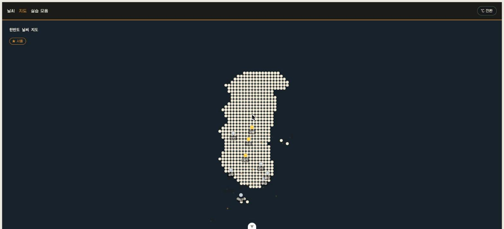
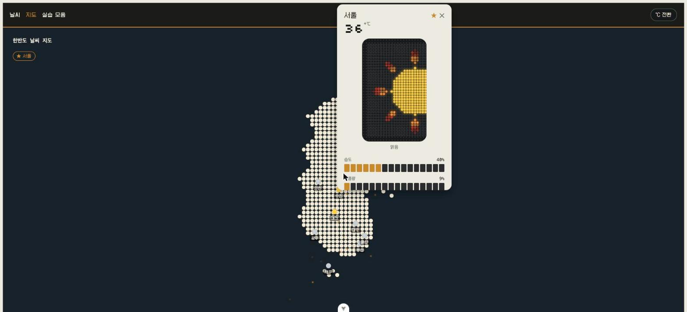

**느낀점**
- `position: fixed` 요소를 `bottom` 기준으로만 배치하면 콘텐츠 높이를 추정치보다 실제로 더 필요로 할 때 화면 밖으로 밀려날 수 있다는 걸 직접 겪었다. 어느 방향으로 열든 `top` 하나로 통일해서 계산하고 위아래 여백을 모두 clamp하는 편이 훨씬 안전하다는 걸 배웠다.
- 요구사항이 이전 결과물을 계속 다듬어가는 형태일 때는, 매번 처음부터 다시 만들기보다 기존 구조(그리드 판정, 프레임 재계산 애니메이션 패턴)를 유지한 채 필요한 부분만 좌표·스타일을 바꾸는 편이 안정적이라는 걸 다시 확인했다.

---

## 5. 지도 배경 인터랙션 재설계 — 캐릭터·입체 효과 실험을 거쳐 평면 통합 그리드 + 성능 최적화된 파동으로 정착

**요구사항**
- `/map` 바다 배경에 커서 인터랙션을 추가해달라는 요청이 여러 차례 이어졌다. 처음엔 "바다를 헤엄치는 픽셀 캐릭터"와 "커서를 따라다니는 웨이브 잔상"을 요청받았고, 실제로 보여준 뒤에는 "캐릭터는 다 지워달라, 배경 자체가 커서 위치에 따라 눌리는 느낌을 원한다"로 방향이 바뀌었으며, 다시 "입체감(3D)이 아니라 평면 그래픽 기반으로", 마지막엔 "파동 효과가 렉이 심하니 최적화"까지 요구사항이 단계적으로 좁혀졌다.

**사고 과정**
- 캐릭터(범고래·물고기)와 웨이브 잔상은 `KoreaMapDots`(한반도 그리드, 최대 420px 폭의 독립 DOM)와 바다(전체 화면을 덮는 CSS `background-image` 트릭)가 서로 다른 좌표계였던 구조 위에 얹었더니, "다른 색 픽셀이 따라오는 것"처럼만 보이고 진짜 "눌림"이 아니라는 피드백을 받았다. 근본 원인이 좌표계 분리에 있다고 판단해, 캐릭터를 걷어내는 김에 육지·바다를 화면 전체를 채우는 **하나의 실제 DOM 도트 그리드**로 통합하기로 했다 — 이후 정렬 문제가 구조적으로 사라지는 부수 효과도 얻었다.
- 통합 그리드로 바꾼 직후엔 바다 도트에 `radial-gradient`, 육지 도트에 `box-shadow: inset`을 넣어 입체감(양각)을 줬는데, "이 3D 느낌은 원한 게 아니다, 평면으로 돌아가되 눌림 파동은 유지해달라"는 피드백을 받아 그러데이션·그림자를 모두 걷어내고 `filter: brightness()`(색이 밝아졌다 사라지는 방식)로 파동을 다시 표현했다.
- 성능 문제의 원인을 진단해보니, 파동 강도(`pressIntensity`)를 각 도트의 Vue reactive 속성으로 두고 있었다. 도트 배열이 컴포넌트 하나의 `v-for`(약 5,000개)로 전부 그려지기 때문에, 단 하나의 도트 값만 바뀌어도 Vue가 이를 "같은 렌더 이펙트의 의존성 변경"으로 취급해 5,000개 전체를 다시 diff했다 — `requestAnimationFrame`으로 초당 최대 60번 이 작업이 발생하니 렉이 심할 수밖에 없었다. 해법은 애니메이션 경로에서 Vue 반응형을 완전히 배제하고, 영향받는 소수의 실제 DOM 엘리먼트에 `style.setProperty`로 직접 쓰는 것이었다.

**해결 과정**
1. (1차 시도, 이후 롤백) `src/components/practices/weather/SeaCreature.vue`를 만들어 문자 매트릭스로 범고래·물고기 픽셀 스프라이트를 그리고, `requestAnimationFrame` 루프로 화면을 가로질러 이동시켰다. 커서 웨이브는 `trailPoints` 배열에 좌표를 쌓았다 700ms 후 제거하는 방식으로 구현했으나, 두 기능 모두 "원하는 방향이 아니다"라는 피드백을 받아 다음 단계에서 전부 제거했다.
2. `SeaCreature.vue`를 삭제하고, `src/components/practices/weather/KoreaMapDots.vue`를 전면 재작성했다. 더 이상 22×41 고정 크기가 아니라 부모 컨테이너 크기에 맞춰 `cols = round(width / DOT_PX)`, `rows = round(height / DOT_PX)`로 그리드를 만들고, 기존 `KOREA_MATRIX`를 이 그리드 중앙에 배치해 셀마다 `isLand` 여부를 판정했다. 도시 마커 좌표도 오프셋을 더해 전체 그리드의 절대 좌표로 재매핑했다.
3. 커서가 지나간 자리마다 "파동 원점"(`{col, row, startTime}`)을 등록하고, `requestAnimationFrame` 루프가 매 프레임 `ringRadius = elapsed * WAVE_SPEED`만큼 퍼져나가는 링 모양 강도를 `Math.cos((distance - ringRadius) * k)`로 계산해 감쇠시키는 방식으로 눌림 파동을 구현했다.
4. 성능 문제 진단 후, 도트 객체에서 `pressIntensity`를 제거하고 `dot.index`(row-major 순번)만 남겼다. `buildGrid()` 이후 `nextTick()`에서 실제 DOM 엘리먼트 배열(`dotElements`)을 한 번 수집해두고, 파동 계산 결과를 `dotElements[dot.index].style.setProperty('--intensity', ...)`로 직접 써서 Vue 렌더 사이클을 완전히 우회했다.

   #### `src/components/practices/weather/KoreaMapDots.vue` (직접 DOM 조작으로 바꾼 핵심 부분)
   ```js
   let dotElements = []
   async function refreshDotElements() {
     await nextTick()
     if (!rootRef.value) return
     dotElements = Array.from(rootRef.value.querySelectorAll('.korea-map__dot'))
   }

   function tickRipples() {
     // ...ripple별 링 강도를 frameIntensity Map에 모은 뒤...
     frameIntensity.forEach((intensity, key) => {
       const dot = dotsByKey.get(key)
       const el = dot && dotElements[dot.index]
       if (el) el.style.setProperty('--intensity', intensity) // Vue 반응형을 거치지 않음
     })
     touchedLastFrame.forEach((key) => {
       if (!frameIntensity.has(key)) {
         const el = dotsByKey.get(key) && dotElements[dotsByKey.get(key).index]
         if (el) el.style.removeProperty('--intensity')
       }
     })
   }
   ```

5. 평면 디자인 피드백을 반영해 도트 CSS에서 `radial-gradient`/`box-shadow: inset`을 모두 제거하고 단색 배경 + `filter: brightness(calc(1 + var(--intensity, 0) * 0.9))`로 교체했다.
6. 화면 가장자리에 여백이 남는 문제(그리드가 `cols * DOT_PX` 고정 픽셀로 그려지다 보니 컨테이너 폭과 딱 맞지 않아 남는 부분에 배경색 띠가 보임)를 `grid-template-columns: repeat(cols, 1fr)`로 바꿔 해결했고, `.weather-map`의 `padding: 28px`도 제거해 도트가 뷰포트 끝까지 채워지게 했다.
7. 브라우저에서 확인 — 바다·육지가 완전히 평면 단색으로 보이는지, 가장자리까지 도트가 빈틈없이 채워지는지, 마우스를 빠르게 움직여도 눈에 띄는 끊김 없이 파동이 표시되는지 확인했다.

**트러블슈팅**
- **문제**: 통합 그리드로 바꾼 직후, `.korea-map` 요소의 실제 렌더링 높이가 CSS로 지정한 `height: 100%`를 무시하고 콘텐츠 한 줄(14px) 높이로만 잡혀, 한반도 그리드가 화면 맨 위 한 줄에만 짓눌린 채로 나타났다.
- **원인**: `.korea-map`의 부모(`.weather-map__grid-area`)가 `flex: 1`(= `flex-basis: 0%`)로 크기를 부여받는 flex 아이템인데, 퍼센트 높이(`height: 100%`)를 가진 자식은 이런 "grow로 크기가 결정되는" flex 아이템을 정의된 높이로 인식하지 못하는 경우가 있어 percentage-height 해석이 깨지는 CSS 특성이 원인이었다.
- **해결**: `.korea-map`을 `height: 100%` 대신 `position: absolute; inset: 0;`으로 바꿔, 퍼센트 높이 해석에 기대지 않고 부모의 패딩 박스를 직접 채우도록 했다.
- **문제**: 파동 로직을 다 고친 뒤에도 자동화 브라우저 탭에서 시각적으로 애니메이션이 전혀 재생되지 않는 것처럼 보였다.
- **원인**: `document.visibilityState`가 `hidden`으로 보고되는 자동화 탭 환경이라 Chrome이 `requestAnimationFrame` 콜백 자체를 완전히 중단시키고 있었다(일반 사용자가 눈으로 보는 포그라운드 탭에서는 발생하지 않는, 테스트 환경 고유의 제약).
- **해결**: 파동 공식(링 반경·감쇠)을 Node.js로 독립 실행해 원점에서 거리·시간에 따라 정확히 링 모양으로 퍼져나가는지 수치로 검증하는 방식으로 로직 정확성을 대신 확인했다.

**결과**
- `/map` 진입 시 바다·육지 모두 완전히 평면(단색)으로 보이고, 화면 가장자리까지 도트가 여백 없이 채워짐을 확인했다.
- 커서를 움직이면 지나간 자리에서 밝기가 링 모양으로 퍼졌다 사라지는 파동이 재생되고, 이 경로가 더 이상 Vue 반응형을 거치지 않아(수천 개 도트 재렌더 → 수십~백여 개 DOM 직접 조작으로 축소) 체감 렉이 크게 줄었다.

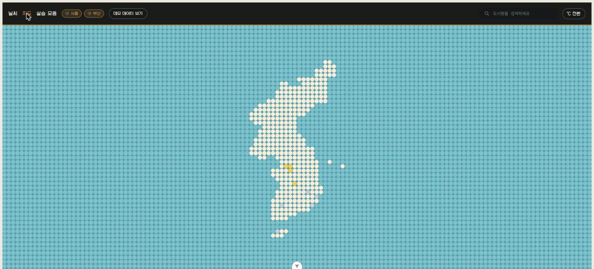

**느낀점**
- "이게 아니다"라는 피드백을 여러 번 받으며 캐릭터 → 오버레이 눌림 효과 → 입체 그리드 → 평면 그리드로 계속 갈아엎었는데, 매번 완전히 새로 만들기보다 "왜 이번 결과물이 기대와 다른가"를 구조적으로 진단(좌표계 분리, 입체 효과, Vue 반응형 비용)한 뒤 그 원인 하나만 정확히 고치는 식으로 접근하니 반복될수록 오히려 코드가 더 단순해졌다.
- Vue의 반응형 시스템은 굉장히 편리하지만 "같은 컴포넌트 렌더 함수 안의 대량 `v-for`"와 "초당 수십 번 바뀌는 애니메이션 값"의 조합은 안티패턴에 가깝다는 걸 체감했다. 프레임 단위로 갱신되는 값은 반응형 상태로 다루지 않고 DOM을 직접 조작하는 것이, Vue를 "안 쓰는" 게 아니라 오히려 Vue가 잘하는 부분(구조적 렌더링)과 못하는 부분(고빈도 애니메이션)을 구분해서 쓰는 것이라는 걸 배웠다.

---

## 6. 즐겨찾기·검색·단위 전환 상단 네비게이션 통합 및 지도·상세 화면 기능 보강

**요구사항**
- 즐겨찾기 칩과 검색창을 "날씨"/"지도"/"실습 모음" 링크가 있는 상단 네비게이션으로 옮겨 어느 화면에서든 쓸 수 있게 해달라는 요청에 이어, 이후 세션에서 9가지 세부 요구사항이 추가됐다: ① 지도 탭 검색으로 해당 도시 팝업 열기, ② 홈 화면 렉 최적화, ③④ 지도 탭 즐겨찾기로 팝업 열기, ⑤ 단위(℃/℉) 전환을 지도 팝업·상세 화면에서도, ⑥ 상세 화면에 지도 팝업과 동일한 정보 표시, ⑦ 더미 날씨 데이터 토글, ⑧ 즐겨찾기 클릭 시 삭제 가능한 메뉴, ⑨ 지도 가장자리 여백 제거(5번 항목과 함께 해결), ⑩ 과제 채점 기준(`docs/checklist.md`) 이탈 여부 점검. 마지막으로 강사가 제시한 힌트(정렬 기준, 평균/최고·최저 기온 computed 등) 중 아직 구현하지 않은 부분도 함께 추가해달라는 요청을 받았다.

**사고 과정**
- 상단 네비게이션 전역화 자체는 단순했지만, "지도 탭에서 즐겨찾기 누르면 지역 팝업"과 "즐겨찾기 누르면 삭제 팝업"이 같은 클릭에 대해 다른 동작을 요구하는 것처럼 보여, 사용자에게 확인해 "클릭 시 '지도에서 보기'/'즐겨찾기 해제' 두 옵션이 있는 작은 메뉴"로 절충하기로 확정했다.
- 홈 화면 렉의 원인을 조사해보니 `WeatherCard.vue`가 카드마다 `DotMatrixIcon`을 `animated="true"`로 띄워, 9개 도시 카드가 각자 80ms마다 36×36=1,296칸 그리드를 재계산하고 있었다. 44px짜리 작은 카드 아이콘에서는 이 미세한 애니메이션이 어차피 잘 보이지 않으므로, 리스트 카드에서는 끄고 크게 보여줄 이유가 있는 지도 팝업·상세 화면에서만 켜는 쪽으로 정리했다.
- 지도 팝업과 상세 화면에 같은 정보를 두 번 구현하면 나중에 둘이 어긋나기 쉬우므로, 복붙 대신 공용 컴포넌트(`WeatherStatsPanel`)로 추출해 두 화면이 구조적으로 항상 같은 걸 보여주게 했다.
- 체크리스트를 다시 읽어보며 발견한 것: 이전 세션에서 검색창을 상단 네비게이션으로 옮기며 `WeatherHomeView.vue`(=체크리스트의 `WeatherParent`)에서 `<SearchBar>` 렌더링 자체를 없앴는데, 이는 Day2 요구사항("SearchBar를 WeatherParent 안에서 props+emit으로 사용")과 어긋나는 변경이었다. 되돌리는 대신 `WeatherHomeView.vue` 안에도 같은 전역 `searchStore`를 바라보는 `<SearchBar>`를 다시 배치해, 체크리스트가 요구하는 구조와 이번에 추가한 전역 검색 UX를 동시에 만족시켰다. 반대로 Day3 요구사항("UnitToggler를 메인·상세 화면 모두에 적용")은 상세 화면에 토글이 아예 없었던 걸 발견해 이번에 함께 채워 넣었다.

**해결 과정**
1. `src/stores/searchStore.js`, `src/stores/demoStore.js`를 신규 작성했다(기존 `favoritesStore.js`와 동일한 함수형 setup 스토어 패턴). `searchStore`는 전역 검색어를, `demoStore`는 더미 데이터 사용 여부(`useDummyData`)를 담는다.
2. `src/App.vue`의 `.app-nav`에 즐겨찾기 칩·검색창·데모 토글·단위 토글을 배치했다. 즐겨찾기 칩은 클릭 시 열리는 작은 메뉴(`app-nav__favorite-menu`)에서 "지도에서 보기"(`/map?city=id`로 이동)와 "즐겨찾기 해제"(`favoritesStore.toggleFavorite`)를 선택할 수 있게 했고, 문서 클릭 리스너로 메뉴 바깥을 클릭하면 닫히게 했다.

   #### `src/App.vue` (즐겨찾기 메뉴 발췌)
   ```js
   function viewOnMap(city) {
     openMenuFor.value = null
     router.push({ name: 'weather-map', query: { city: city.id } })
   }
   function removeFavorite(city) {
     openMenuFor.value = null
     favoritesStore.toggleFavorite(city.id)
   }
   function handleOutsideClick(event) {
     if (!event.target.closest('.app-nav__favorite-item')) openMenuFor.value = null
   }
   ```

3. `src/components/practices/weather/WeatherStatsPanel.vue`를 신규 작성했다 — `city` prop 하나로 아이콘+상태+`DotStatBar` 5개(습도·구름량·가시거리·기압·낮 진행률)+체감/최저/최고/풍속 요약줄을 렌더링한다. 이때 체감·최저·최고 온도도 현재 단위(℃/℉)에 맞춰 변환하도록 고쳐, 기존에 항상 섭씨 원본으로만 보이던 사소한 불일치도 함께 바로잡았다. `WeatherMapView.vue`의 팝업과 `WeatherDetailView.vue`가 이 컴포넌트 하나를 공유한다.
4. `src/views/WeatherMapView.vue`에 `watch(() => searchStore.query, ...)`를 추가해, 검색어가 도시 이름과 **정확히 일치**할 때만(부분 일치로 하면 첫 글자만 쳐도 팝업이 열려버림) `selectCityById`를 호출하도록 했다. 팝업 헤더에 `UnitToggler`도 추가했다.
5. `src/services/weatherApi.js`에 `DUMMY_CONDITIONS`(6가지 날씨) 순환 배정과 `getDummyWeather(city, index)`를 추가해, API 호출 없이 즉시 6가지 아이콘/애니메이션을 확인할 수 있게 했다. `WeatherHomeView.vue`·`WeatherMapView.vue`의 데이터 로드 함수가 `demoStore.useDummyData`를 보고 실제 API 대신 이 함수로 분기하도록 했다.
6. `src/components/practices/weather/WeatherCard.vue`의 `DotMatrixIcon`을 `animated="false"`로 바꿔 홈 화면 렉을 해소했다.
7. `WeatherHomeView.vue`에 강사 힌트를 반영한 로직을 추가했다: 정렬 기준(`sortBy`, `v-model`로 이름순/기온순 선택 UI), 정렬 기준이 바뀔 때만 재계산되는 `sortedWeatherList` computed, 즐겨찾기 개수·검색 결과 개수·평균 기온·최고/최저 기온 도시 computed 4종, 정렬 기준 변경 시 콘솔 로그를 남기는 `watch`. 그리고 체크리스트 준수를 위해 `#search` 슬롯에 `searchStore`를 바라보는 `<SearchBar>`를 다시 배치했다.
8. `WeatherMapView.vue`의 `.weather-map` padding을 0으로 바꿔 지도 가장자리 여백을 완전히 제거했다(5번 항목의 그리드 `1fr` 전환과 함께 적용).
9. 브라우저에서 전체 플로우를 확인했다 — 상단 검색창에 도시명을 정확히 입력하면 어느 화면에 있든 값이 유지되고 지도로 이동 시 해당 팝업이 뜸, 즐겨찾기 칩 클릭 → 메뉴 → 지도 이동/삭제 각각 정상 동작, 지도 팝업·상세 화면 양쪽에서 단위 전환 버튼으로 ℃/℉가 즉시 바뀌고 체감/최저/최고까지 함께 변환됨, 데모 토글로 6가지 날씨가 즉시 나타남, 홈 화면에 정렬·통계 요약줄이 표시됨을 각각 확인했다.

**트러블슈팅**
- **문제**: 검증 도중 두 개의 개발 서버 프로세스가 동시에 떠 있어(5173에 좀비 프로세스, 5176에 새 프로세스) 브라우저가 옛 코드로 뜬 화면을 보여주는 바람에 한동안 수정 사항이 반영 안 된 것처럼 보였다.
- **원인**: 이전 세션에서 종료되지 않은 `npm run dev` 프로세스가 5173 포트를 계속 점유하고 있었다.
- **해결**: `lsof`로 점유 중인 프로세스를 확인해 정리한 뒤 서버를 깨끗하게 재시작했다.

**결과**
- 검색창·즐겨찾기·단위 전환이 모든 화면에서 동일하게 동작하고, 지도 팝업과 상세 화면의 상세 정보가 완전히 통일됐다. 홈 화면은 카드 애니메이션을 꺼서 체감 성능이 개선됐고, 정렬·통계 요약·더미 데이터 토글이 추가됐다. 체크리스트 재검토로 찾아낸 두 가지 이탈(SearchBar 위치, UnitToggler 미적용)도 이번 작업으로 함께 해소했다.

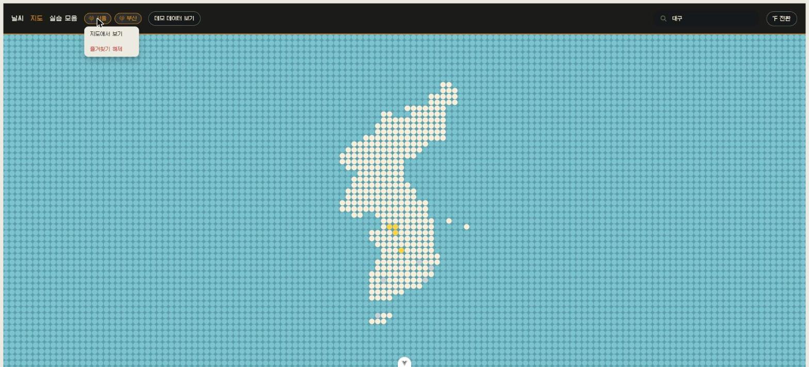
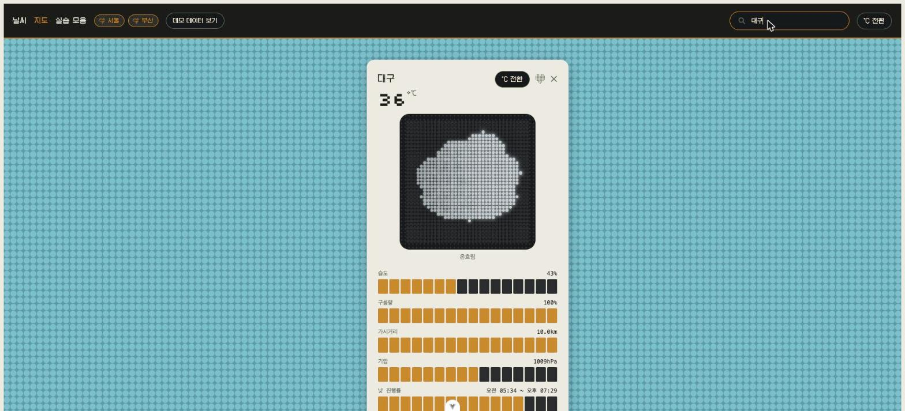
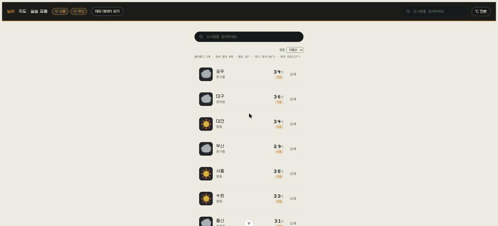
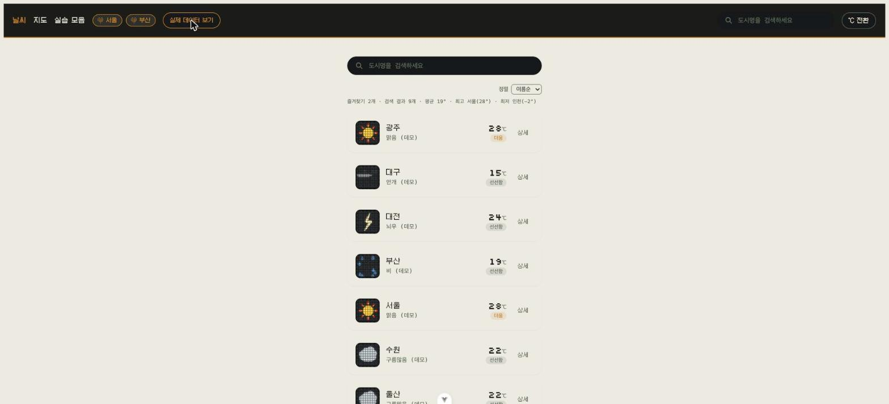
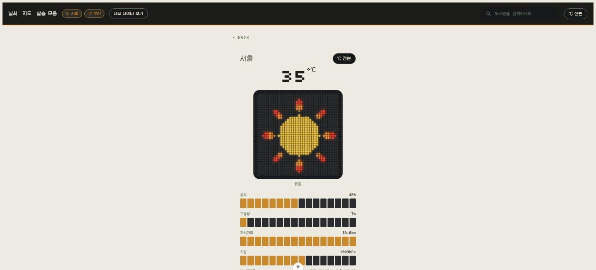

**느낀점**
- 기능을 추가하기 전에 "이미 문서화된 요구사항(체크리스트)에서 벗어난 부분이 있는지" 스스로 되짚어보는 과정이 유용했다 — 새 기능을 붙이는 데만 집중하면 이전에 잘 지키던 기준을 조용히 어기게 될 수 있다는 걸 직접 겪었다.
- 같은 정보를 두 화면에 보여줘야 할 때 복붙이 아니라 공용 컴포넌트로 묶으면, "두 화면이 같아야 한다"는 요구사항이 유지보수 규칙이 아니라 코드 구조 자체로 보장된다는 걸 다시 확인했다(체감/최저/최고 온도 단위 변환 버그도 컴포넌트를 합치는 과정에서 자연스럽게 함께 발견하고 고칠 수 있었다).

---

## 7. 지도 인터랙션 2차 개선 — 확대/축소, 픽셀 말풍선 툴팁, 파동 육지 제외·자연스러움·재최적화, 도시 도트 날씨 시각화

**요구사항**
- 참고 이미지 두 장을 기준으로 확대/축소 기능을 추가해달라는 요청을 받았다: 기본 진입 시 이미지 4 정도 배율로 확대돼 있고, 최대로 축소했을 때 기존 화면(이미지 5)이 되도록. 커서가 향하는 방향으로 화면이 살짝 끌려오는 느낌도 함께 요청받았다.
- 주요 지역 호버 시 뜨는 툴팁을 참고 이미지의 픽셀 말풍선으로 바꾸고, 안에 도시명과 간단한 날씨 정보(예: "대구 맑음")를 넣어달라는 요청을 받았다. 이모지는 폰트 폴백 문제가 예상되면 텍스트로 대체해도 된다는 조건이 붙었다.
- 커서 파동 효과가 한반도 육지 픽셀 위에서도 적용되던 것을, 바다에서만 나타나도록 제한해달라는 요청을 받았다.
- 파동이 여전히 "핑(ping)"처럼 보인다는 피드백과 함께, 최우선 조건은 성능이라는 전제로 더 자연스러운 파도 느낌으로 개선해달라는 요청을 받았다.
- 도시 도트가 색상만으로 표시돼 눈에 잘 안 띄고, 기온·강수 등 날씨 정보가 지도에서 시각적으로 드러나지 않는다는 점을 개선해달라는 요청을 받았다.

**사고 과정**
- 이미 "Vue 반응형을 우회해 `dotElements[i].style`에 직접 쓰기"로 한 번 최적화해둔 파동 엔진이 있었으므로, 그 구조를 갈아엎지 않고 유지·강화하는 방향으로 접근했다. 특히 성능이 최우선 조건으로 명시됐기 때문에, 새 기능(줌·말풍선·날씨 시각화) 각각을 "매 프레임 JS 비용을 추가하는가"라는 기준으로 먼저 걸러냈다.
- 확대/축소는 두 가지 방식을 저울질했다 — ① 줌 배율에 맞춰 `DOT_PX`를 바꿔 그리드를 다시 만드는 방식, ② 도트 개수는 그대로 두고 `CSS transform: scale()`만 적용하는 방식. ①은 줌할 때마다 수천 개 DOM을 다시 만들어야 해 렉의 원인이 되므로, GPU 합성만으로 처리되는 ②(CSS transform)를 선택했다. 이렇게 하면 커서→그리드 셀 좌표 변환도 `getBoundingClientRect()`가 이미 transform이 반영된 값을 주기 때문에 별도 역행렬 계산 없이 그대로 쓸 수 있다는 부수 이점이 있었다.
- 파동을 "바다에서만" 적용하는 요구사항은 동시에 최적화 기회이기도 했다. 육지 칸을 계산에서 아예 건너뛰면 시각적 요구사항과 성능 개선을 한 번에 만족시킬 수 있었다.
- 기존 파동 로직이 느렸던 근본 원인을 다시 짚어보니, `"${col},${row}"` 형태의 **문자열 키 Map**을 프레임마다 새로 만들고 조회하던 부분이 가장 큰 비용이었다(문자열 생성·해싱은 숫자 연산보다 훨씬 비싸다). 이를 `row*cols+col` 형태의 **평면 정수 인덱스**로 바꾸고, 매 프레임 전체 격자를 훑는 대신 "지난 프레임에 건드린 칸만 기록해뒀다가 그 칸만 지우는" 방식(dirty-list)으로 바꾸면 문자열 연산 자체가 완전히 사라진다고 판단했다. 파도처럼 보이게 하는 부분은 이미 계산 중인 `distance` 값 하나로 감속 반경·2차 마루·제곱 감쇠를 추가할 수 있어 추가 루프 없이 처리 가능했다.
- 날씨 시각화는 "성능 최우선"과 정면으로 부딪힐 수 있는 요구라, 애니메이션 대상을 도시 도트(9개)로만 한정하고 전부 CSS 키프레임으로 처리하기로 했다 — 이러면 매 프레임 JS 비용이 0이고, 조건별 링 펄스·빗방울·명멸 등은 브라우저 컴포지터가 처리한다.

**해결 과정**
1. `src/components/practices/weather/KoreaMapDots.vue`에 줌 뷰포트(`.korea-map__viewport`)를 추가하고, 휠/트랙패드(`wheel` 이벤트, 트랙패드 핀치는 `ctrlKey`로 동일하게 들어옴)로 `scale`을 곱셈식(`Math.exp(-deltaY * k)`)으로 갱신하며 커서 아래 지점이 그대로 고정되도록 pan을 보정했다. `scale===1`일 때 pan 허용 범위가 `[0,0]`으로 자동으로 잠겨, 기존에 해결해둔 "가장자리 여백 없음" 요구사항이 최대 축소 상태에서도 그대로 유지된다.

   #### `src/components/practices/weather/KoreaMapDots.vue` (줌 앵커 보정)
   ```js
   function handleWheel(event) {
     event.preventDefault()
     const rect = rootRef.value.getBoundingClientRect()
     const cx = event.clientX - rect.left
     const cy = event.clientY - rect.top
     const newScale = clamp(scale * Math.exp(-event.deltaY * ZOOM_SENSITIVITY), MIN_SCALE, MAX_SCALE)
     if (newScale === scale) return
     // 커서 아래 지점이 확대/축소 후에도 그 자리에 그대로 머물도록 pan을 보정한다.
     panX = cx - (cx - panX) * (newScale / scale)
     panY = cy - (cy - panY) * (newScale / scale)
     scale = newScale
     clampPan()
     applyTransform()
   }
   ```
2. 커서가 화면 중심에서 벗어난 방향으로 지도가 살짝 끌려오는 효과는, 커서 위치 비율을 pan의 "목표값"으로 매핑해두고 기존 파동 애니메이션 루프 안에서 실제 pan을 그 목표값으로 매 프레임 보간(lerp)하는 식으로 구현했다. 새 애니메이션 루프를 따로 만들지 않고 기존 루프에 얹어, rAF 인스턴스가 늘어나지 않게 했다.
3. 커서→그리드 셀 좌표 변환을 `.korea-map__grid`의 `getBoundingClientRect()` 기준 비율 계산으로 바꿨다. 이 rect는 이미 줌/팬 transform이 반영된 화면상의 실제 위치이므로, 배율이 얼마든 별도 역변환 코드 없이 정확한 칸 좌표를 구할 수 있었다.
4. 픽셀 말풍선 툴팁을 새로 만들었다. 참고 이미지처럼 모서리가 한 칸씩 깎인 실루엣은 `clip-path` 계단형 폴리곤으로, 말풍선 꼬리는 잉크색·paper색 사각형 두 겹을 겹쳐 표현했다. 이모지 대신 `condition` 코드 → 한글 라벨 고정 맵(`맑음/구름/비/눈/뇌우/안개`)을 써서 "대구 맑음"처럼 짧고 길이가 일정한 텍스트만 넣었다 — API/더미 데이터의 `status` 문자열은 길이가 들쭉날쭉해 말풍선 폭이 흔들리는 문제가 있어 쓰지 않았다. 말풍선 자체는 줌 뷰포트 바깥(`.korea-map` 직계)에 둬서 배율과 무관하게 항상 같은 크기로 뜨게 했다.
5. 파동 엔진을 재작성해 문자열 키 `Map`/`Set`을 모두 없애고, `landMask`(`Uint8Array`)·`frameScratch`(`Float32Array`) 두 개의 평면 인덱스 배열로 바꿨다. 매 프레임 "지난 프레임에 건드린 인덱스"만 먼저 지우고, 이번 프레임에 새로 건드린 인덱스만 기록해두는 dirty-list 방식이라 전체 격자를 훑는 연산이 사라졌다. 루프 안에서 `if (landMask[idx]) continue`로 육지 칸을 완전히 건너뛰어 요구사항(파동은 바다에서만)과 계산량 절감을 동시에 만족시켰다.

   #### `src/components/practices/weather/KoreaMapDots.vue` (파동 계산 — 육지 스킵 + dirty-list)
   ```js
   for (const idx of prevTouched) {
     frameScratch[idx] = 0
     dotElements[idx]?.style.removeProperty('--intensity')
   }
   // ...
   for (let c = minCol; c <= maxCol; c++) {
     const idx = rowBase + c
     if (landMask[idx]) continue // 육지는 파동 계산에서 완전히 제외
     // ...거리 계산·강도 반영은 바다 칸에서만 실행
   }
   ```
6. "핑"처럼 보이던 파동을 "물결"처럼 보이게, 계산량을 늘리지 않고 형태만 바꿨다. 반경이 등속이 아니라 `MAX_R * (1 - exp(-t/τ))`로 감속하며 퍼지게 하고, 이미 계산 중인 `distance` 값에 위상이 살짝 어긋난 2차 마루를 더해 물결이 다발로 보이게 했으며, 감쇠도 선형이 아닌 제곱(`envelope²`)으로 바꿔 끝맺음을 부드럽게 했다.
7. 도시 도트에 조건별 클래스(`is-condition-sun` 등)와 기온을 파랑(추움)~빨강(더움)으로 매핑한 `--pulse-color` 변수를 부여하고, 나머지는 전부 CSS 키프레임으로 처리했다(맑음/구름 - 링 펄스, 비 - 물방울 낙하, 눈/안개 - 느린 명멸, 뇌우 - 불규칙 섬광). 도시가 9개뿐이라 이 경로는 매 프레임 JS 비용이 없다. `prefers-reduced-motion` 사용자에게는 애니메이션을 껐다.
8. `npx vite build`로 빌드 오류 여부를 먼저 확인한 뒤, 브라우저에서 실제 동작을 점검했다. 자동화 브라우저 탭은 `document.visibilityState`가 `hidden`으로 보고돼 `requestAnimationFrame`이 완전히 멈추는 제약(이전 작업에서도 겪은 문제)이 있어, 줌(동기적으로 transform을 쓰므로 rAF 불필요)은 실제 `WheelEvent`를 디스패치해 브라우저에서 직접 검증했고, rAF에 의존하는 파동 로직은 동일한 수식을 Node.js로 독립 실행해 육지 제외·감쇠 정확성을 수치로 검증했다.

**트러블슈팅**
- 문제: 링 스캔 범위를 넓힌 뒤(감속 반경이 최대치에 가까워질수록), 프레임당 순회하는 셀 수(scanned)가 기존 고정 반경 5 정사각 박스(121칸)보다 오히려 많아지는 구간(t≈400~900ms에서 최대 221칸)이 있었다.
- 원인: 감속 공식상 반경이 `WAVE_MAX_RADIUS(6)+BAND(1.6)`까지 커질 수 있어, 시간이 지날수록 스캔 바운딩 박스 자체가 옛 구현보다 커지기 때문이었다.
- 해결: 다만 이 "scanned" 수치는 저렴한 사전 필터(뺄셈·비교)일 뿐이고, 비용이 큰 `Math.sqrt`/`Math.cos` 연산은 실제로 강도가 반영되는 "touched" 셀(Node 검증 기준 프레임당 13~71개)에서만 실행된다. 옛 구현은 박스 안 121칸 전부에 대해 무조건 `Math.hypot`+`Math.cos`를 실행했으므로, 비싼 연산 횟수 기준으로는 여전히 뚜렷한 개선이다. `WAVE_MAX_RADIUS`/`BAND`를 억지로 더 줄여 "스캔 수까지 항상 옛 구현보다 작게" 만드는 것도 가능했지만, 저렴한 사전 필터 개수를 더 줄이는 것보다 시각적 자연스러움(파동이 충분히 넓게 퍼지는 느낌)을 우선했다 — CLAUDE.md의 단순성 우선 원칙에 따라, 실질적 이득이 없는 데까지 파고들어 코드를 더 복잡하게 만들지 않기로 했다.
- 문제: Chrome 자동화 탭으로 확대/축소를 검증하려 `computer` 도구의 `scroll` 액션을 썼는데, 화면은 바뀌는 것처럼 보였지만 실제로는 `wheel` DOM 이벤트가 전혀 발생하지 않고 있었다(직접 등록한 `window` 리스너의 카운터가 0으로 유지됨).
- 원인: 자동화 탭의 `scroll` 제스처가 페이지의 `wheel` 이벤트를 우회하는 방식으로 동작하는 것으로 보였다. 화면이 바뀌어 보인 건 이전에 수동으로 디스패치했던 `WheelEvent`의 잔여 상태였을 뿐, 새 `scroll` 액션의 효과가 아니었다.
- 해결: `new WheelEvent({ deltaY, clientX, clientY })`를 `.korea-map` 엘리먼트에 직접 `dispatchEvent`하는 방식으로 전환해 검증했다. 이 방식으로는 최대 축소 시 `translate(0px, 0px) scale(1)`, 최대 확대 시 정확히 `scale(2.4)`에서 멈추는 것을 확인했다.

**결과**
- 지도 진입 시 이미지 4 비율(2.4배)로 확대돼 있고, 휠/트랙패드로 축소하면 정확히 이미지 5(기존 화면, 여백 없음)에서 더 이상 축소되지 않으며, 확대도 진입 배율에서 멈추는 것을 `WheelEvent` 디스패치 + transform 값 검증으로 확인했다.
- 줌 앵커(커서 아래 지점 고정)를 좌표 역산으로 검증한 결과, 오차 10px 안팎(뷰포트 대비 1% 미만)으로 커서 아래 지점이 유지됨을 확인했다.
- 도시 도트 호버 시 "대전 맑음" 형태의 픽셀 말풍선이 뜨고, 줌 뷰포트 바깥에 위치해 배율과 무관하게 크기가 고정되는 것을 스크린샷으로 확인했다.
- 육지 중심에 파동을 쏘는 시나리오를 Node.js로 재현했을 때 육지 칸에는 단 하나도 강도가 반영되지 않음을 확인했고, 반대로 바다 칸에서는 시간에 따라 링이 정상적으로 퍼지고 감쇠함을 확인했다.
- 도시 클릭 → 팝업 오픈, ℃/℉ 토글이 기존과 동일하게 동작함을 회귀 확인했다.

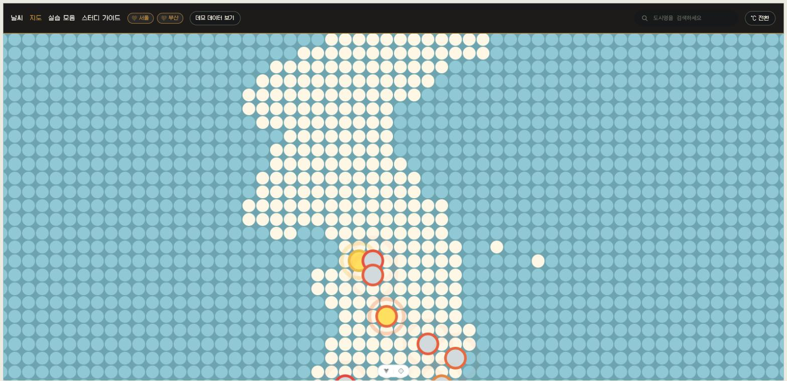
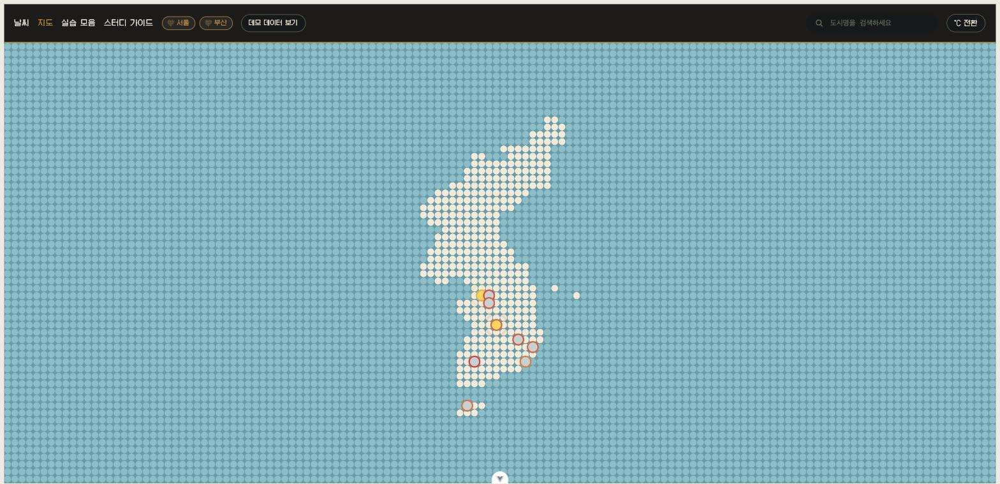
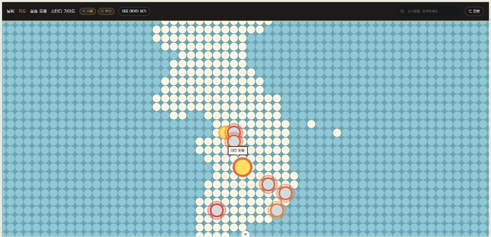

**느낀점**
- "성능 최우선"이라는 제약이 걸리면 새 기능을 붙일 때마다 "이게 매 프레임 비용을 늘리는가"를 먼저 따지는 습관이 생긴다는 걸 느꼈다. 도시 도트 애니메이션을 CSS 키프레임으로만 처리한 것도, 줌을 transform 하나로 처리한 것도 결국 "JS가 매 프레임 할 일을 최대한 줄이자"는 같은 판단에서 나온 선택이었다.
- 자동화 브라우저로 인터랙션을 검증할 때 도구가 "그럴듯해 보이는" 화면을 만들어내더라도 실제로 의도한 이벤트 경로를 탔는지는 별도로 확인해야 한다는 걸 다시 배웠다 — `scroll` 제스처가 실제 `wheel` 이벤트를 발생시키지 않는다는 걸 카운터를 심어보고 나서야 알았고, 그 뒤로는 "화면이 바뀌었다"가 아니라 "이벤트가 발생했다"를 검증 기준으로 삼았다.

---

## 8. 지도 인터랙션 3차 개선 — 도시 도트 호버 전용 효과, 바다 흐름 레이어, 픽셀 커서, 대륙 확장

**요구사항**
- 도시 도트가 항상 크고 항상 펄스가 재생돼 부담스럽다는 피드백을 받았다. 평상시엔 주변 지형 도트와 같은 크기이되, 커서를 올렸을 때만 뚜렷하게 커지고 반짝여야 하며, 그 색도 기온이 아니라 지금 날씨(맑음/비/눈 등)를 더 잘 드러내야 한다는 요청을 받았다.
- 바다 전체에 "흐르는 파도" 같은 상시 효과를 원하지만, 스스로도 "최적화가 많이 필요"하다고 인지하고 있으니 기존 커서 파동과 타협해 최선의 결과를 내달라는 요청을 받았다.
- 기본 커서와 클릭 시 커서로 쓸 픽셀 손가락 이미지 2장을 제공받았다.
- 한반도 북쪽으로 이어지는 대륙을 참고 이미지를 바탕으로 픽셀화해 추가하고, 한반도보다 살짝 어두운 색으로 구분하며, 여기서도 파동 계산은 제외해달라는 요청을 받았다.

**사고 과정**
- 도시 도트 효과는 "평소엔 지형과 동일 크기, 호버 시에만 확대·펄스"라는 조건이 이미 존재하던 `.is-city:hover { transform: scale(1.9) }` 규칙 위에 자연스럽게 얹을 수 있었다. 기존엔 `hoveredDot`이라는 JS 상태를 말풍선 표시에 쓰고 있었지만, 시각 효과(확대·글로우·펄스)는 순수 CSS `:hover` 의사 클래스만으로 충분해 별도 JS 상태 추적을 늘리지 않았다. 색상도 기온 기반 hue 계산 함수를 조건(condition) → 강조색 매핑으로 바꿔치기만 하면 돼 변경 범위가 작았다.
- 바다 흐름 효과가 까다로운 지점은 "도트가 스크린 크기에 따라 최대 수천 개까지 생길 수 있다"는 것이었다. 도트마다 개별 애니메이션을 걸면 프레임마다 수천 개를 리페인트해야 해 사용자가 우려한 그대로 무거워진다. 대신 "그리드 밑에 깔리는 배경 레이어 하나만 흘려보내고, 바다 도트에 살짝 투명도를 줘서 그 흐름이 비쳐 보이게 하면 어떨까"라는 아이디어로 방향을 잡았다 — 이러면 애니메이션 대상이 도트 수와 무관하게 항상 "엘리먼트 1개"로 고정되고, 그마저도 `transform: translate()`만 쓰면 GPU 합성만으로 처리돼 리페인트 자체가 발생하지 않는다. 이게 "도트 단위 계산을 하나도 늘리지 않는" 타협안이라고 판단했다.
- 픽셀 커서는 CSS `cursor: url(...)`와 `:active` 의사 클래스만으로 JS 없이 구현 가능하다고 보고, 제공받은 이미지를 그대로 쓰기보다 Pillow로 32×32 NEAREST 리샘플링해 픽셀 느낌을 유지한 채 프로젝트 안에 자산으로 편입했다.
- 대륙 이미지를 직접 분석해보니(Pillow로 그리드 크기로 재래스터화) 정밀한 해안선이라기보다 "이 위가 대륙"이라는 대략적 참고에 가까웠다. 그대로 픽셀 단위 복제를 시도하기보다 같은 느낌(꽉 찬 덩어리 + 들쭉날쭉한 해안선)을 살려 새 매트릭스를 직접 설계하는 쪽을 택했다. 처음엔 대륙을 14행 높이로 크게 설계했는데, 실제 화면에서 확인해보니 한반도가 그리드 안에서 항상 세로 중앙에 배치되는 구조라 그 위 여백(`koreaOffsetRow`)이 생각보다 훨씬 좁아(테스트 환경에서 5행) 대부분이 화면 밖으로 잘려나갔다 — 높이를 줄이는 쪽으로 재설계했다.

**해결 과정**
1. `src/assets/cursors/`에 사용자가 제공한 두 이미지를 Pillow로 32×32 `NEAREST` 리샘플링해 저장했다.

   #### `/tmp/make_cursors.py` (일회성 스크립트)
   ```python
   from PIL import Image
   def make(src, dst, size=32):
       im = Image.open(src).convert("RGBA")
       im = im.resize((size, size), Image.Resampling.NEAREST)
       im.save(dst)
   ```
2. `src/components/practices/weather/KoreaMapDots.vue`의 `pulseColor(city)`를 기온 기반 hue 계산에서 조건(condition) 기반 강조색 매핑으로 바꿨다. 마커 자체 배경색(`CONDITION_COLORS`)은 날씨 아이콘 등 다른 화면과 값을 공유해서 그대로 두고, 호버 링 색만 채도 높은 새 팔레트로 분리했다.

   #### `src/components/practices/weather/KoreaMapDots.vue`
   ```js
   const CONDITION_ACCENT_COLORS = {
     sun: '#ff9d3d', cloud: '#8fa6ad', rain: '#2f80ed',
     snow: '#8fe3f0', thunderstorm: '#8e5bd6', fog: '#6b7b80',
   }
   function pulseColor(city) {
     return CONDITION_ACCENT_COLORS[city.condition] ?? CONDITION_ACCENT_COLORS.sun
   }
   ```
3. `.is-city`의 상시 `transform: scale(1.35)`와 상시 `box-shadow` 링을 제거해 평상시엔 일반 도트와 완전히 같은 크기가 되게 하고, 확대·글로우·조건별 펄스/명멸/빗방울 애니메이션을 전부 `:hover`(및 `.is-city.is-condition-X:hover::after`) 조건 아래로 옮겼다.
4. 바다 흐름 효과를 `.korea-map__grid` 바로 아래 깔리는 `.korea-map__sea-flow` 레이어 하나로 구현했다. 사선 반복 그라데이션을 `transform: translate()`로만 흘려보내고, 바다 도트 배경에 8%의 투명도(`rgba(124,192,203,0.92)`)를 줘서 이 흐름이 도트 표면에 은은하게 비쳐 보이게 했다. 커서 파동(`--intensity` → `filter: brightness()`)은 그대로 각 도트에 남아 있어 서로 다른 레이어로 자연스럽게 겹친다.

   #### `src/components/practices/weather/KoreaMapDots.vue`
   ```css
   .korea-map__sea-flow {
     position: absolute;
     inset: -50% -50%;
     background: repeating-linear-gradient(120deg,
       rgba(255,255,255,.14) 0, rgba(255,255,255,.14) 18px, transparent 18px, transparent 70px);
     animation: sea-flow-drift 14s linear infinite; /* transform만 사용 — GPU 합성, 도트 수와 무관하게 비용 상수 */
   }
   ```
5. `.korea-map`에 `cursor: url('.../point.png') 6 2, pointer;`, `.korea-map:active`에 `cursor: url('.../grab.png') 10 8, pointer;`를 걸어 기본/클릭 커서를 픽셀 이미지로 바꿨다. 버튼을 떼면 자동으로 기본 커서로 복귀해 별도 JS 상태 관리가 필요 없다.
6. 대륙 참고 이미지를 Pillow로 지도 그리드와 비슷한 해상도(34×18)로 재래스터화해 분석해보니 정밀한 해안선이 아니라 대략적인 덩어리 참고에 가까웠다. 이를 바탕으로 `CONTINENT_MATRIX`(32열×7행, 위쪽은 넓고 아래로 갈수록 한반도 북단 폭에 맞춰 좁아지는 쐐기 모양)를 직접 설계하고, `buildGrid()`의 셀 판정 로직에 "한반도 매트릭스 안인가"뿐 아니라 "대륙 매트릭스 안인가"도 함께 검사하도록 확장했다. 대륙에 속한 칸은 `isLand: true`(파동 계산 제외용), `isContinent: true`(색상 구분용)로 표시했다.

   #### `src/components/practices/weather/KoreaMapDots.vue`
   ```js
   const continentCol = col - continentOffsetCol
   const continentRow = row - continentOffsetRow
   const isContinent =
     !isKoreaLand && continentCol >= 0 && continentCol < CONTINENT_W &&
     continentRow >= 0 && continentRow < CONTINENT_H &&
     CONTINENT_MATRIX[continentRow][continentCol] === '1'
   const isLand = isKoreaLand || isContinent
   ```
7. `.is-continent`에 한반도 육지색(`#f3ebd9`)보다 약 14% 어둡게 계산한 `#d1cabb`를 지정해 색으로 구분되게 했다.
8. `npx vite build`로 오류 여부를 먼저 확인한 뒤, 실제 브라우저에서 `WheelEvent`/`MouseEvent`를 디스패치해 회귀 없음(도시 클릭 팝업, 줌 클램프)과 새 기능(대륙 위 파동 미발생, 커서 이미지 200 응답)을 함께 검증했다.

**트러블슈팅**
- 문제: `CONTINENT_MATRIX`를 처음 14행 높이로 설계했을 때, 최대 축소(스케일 1) 상태에서 대륙의 대부분이 화면 위로 잘려 보이지 않았다.
- 원인: 한반도가 그리드 안에서 항상 세로 중앙에 배치되는 구조라, 그 위쪽 여백(`koreaOffsetRow`)은 컨테이너 높이에 따라 달라지는데 흔한 가로로 넓은 창 비율에서는 5~10행 정도밖에 안 됐다. 게다가 최대 축소 상태에서는 팬(pan)이 `[0,0]`으로 잠기는 게 의도된 동작(가장자리 여백 없음 유지)이라, 사용자가 위로 스크롤해서 볼 수도 없었다.
- 해결: 대륙 높이를 7행으로 줄여 흔한 여백 안에 항상 들어오게 재설계했다.
- 문제: 대륙과 한반도를 재배치한 첫 시도에서, 두 매트릭스의 그리드 행이 서로 인접(대륙 마지막 행 바로 아래에 한반도 첫 행)하도록만 맞췄는데도 확대해서 보니 두 육지 사이에 바다색 틈이 뚜렷이 보였다.
- 원인: 원(circle) 그리드에서는 서로 다른 행에 있는 두 도트가 대각선으로만 걸쳐 있으면(직접 겹치는 열이 없으면) 원의 기하학적 특성상 시각적으로 떨어져 보인다. 실제로 두 매트릭스의 육지 열이 겹치지 않고 대각선으로 스치듯만 배치돼 있었다.
- 해결: 대륙의 마지막 3행이 한반도의 첫 3개 육지 행과 **같은 그리드 행**을 공유하도록(`CONTINENT_ROW_OVERLAP`) 오프셋을 바꾸고, 그 겹치는 행들의 열 범위를 넓은 통짜 밴드로 다시 그렸다. 셀 판정에서 한반도가 있으면 한반도 색이, 없으면 대륙 색이 채워지도록(`isContinent = !isKoreaLand && ...`) 만들어, 겹치는 행에서 두 색이 자연스럽게 이어 붙게 했다.

**결과**
- 도시 도트가 평상시엔 일반 지형 도트와 완전히 같은 크기로 보이다가, 호버 시에만 확대되며 조건에 맞는 색(예: 맑음 → 진한 주황)으로 반짝이는 것을 스크린샷으로 확인했다.
- 대륙이 한반도 북쪽과 끊긴 틈 없이 이어지고, 한반도보다 살짝 어두운 색으로 구분되는 것을 확인했다. 대륙 위에서 커서를 움직여도 파동 강도(`--intensity`)를 가진 도트가 0개임을 확인해 파동 계산 제외를 검증했다.
- 픽셀 커서 이미지 2장이 각각 200 응답으로 정상 로드되고, `getComputedStyle`로 `cursor` 속성이 의도한 이미지 URL을 가리키는 것을 확인했다(자동화 스크린샷에는 OS 커서 스프라이트 자체가 찍히지 않아, 실제 커서 모양은 사용자 화면에서 최종 확인이 필요하다).
- 줌 최소/최대 클램프, 도시 클릭 팝업이 기존과 동일하게 동작함을 회귀 확인했다.

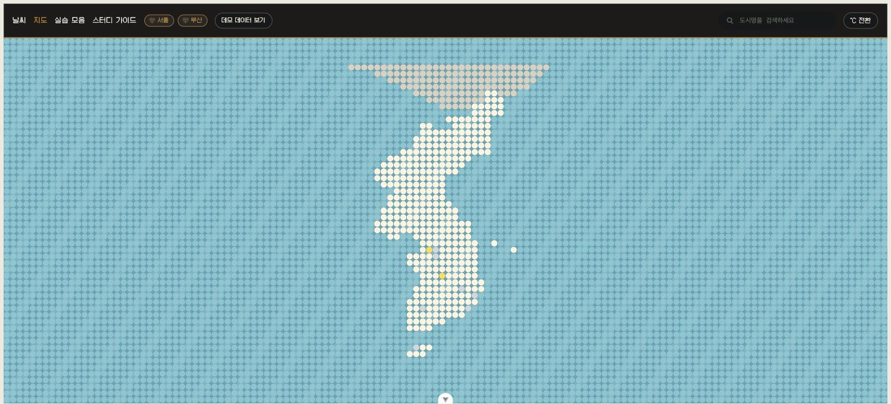
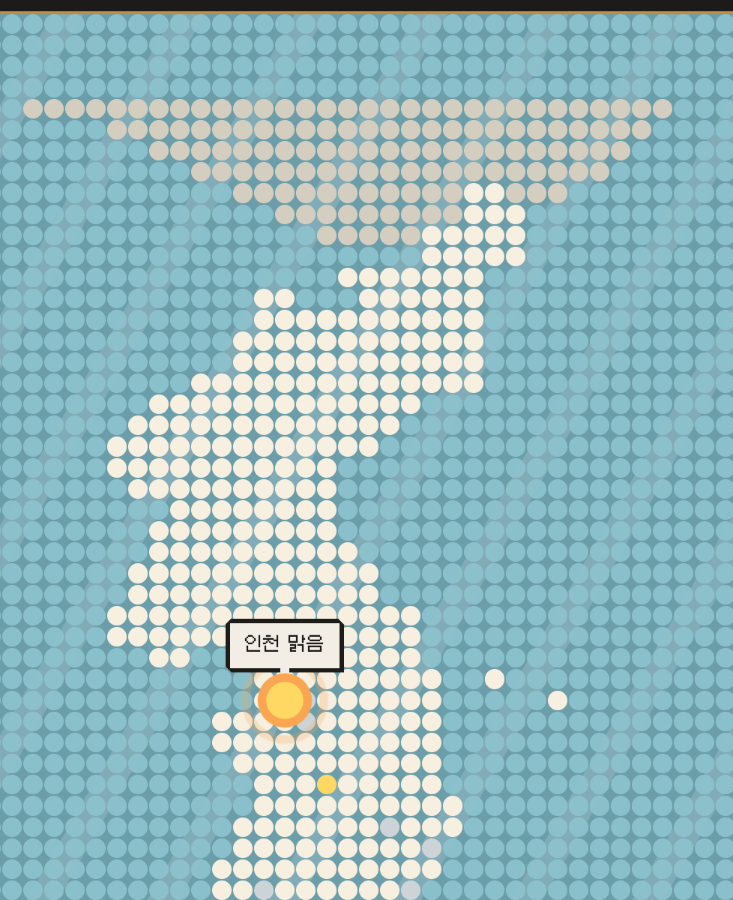

**느낀점**
- "평소엔 조용하고 호버할 때만 확실하게 반응한다"는 설계는 정보 밀도를 낮추면서도 필요한 순간엔 오히려 더 또렷해지는, 흔히 말하는 "절제된 인터랙션"의 좋은 예라고 느꼈다. 상시 애니메이션을 켜두는 것보다 사용자가 실제로 관심을 보인 대상에만 반응을 몰아주는 편이 시각적으로도 성능적으로도 이득이었다.
- 바다 흐름 효과를 구현하며 "애니메이션 대상 개수"와 "애니메이션에 쓰는 CSS 속성" 둘 다 성능에 영향을 준다는 걸 다시 확인했다. 도트 수천 개에 각각 걸기보다 배경 레이어 하나에 걸고 투명도로 비쳐 보이게 하는 우회로가, 요구사항("흐르는 느낌")을 놓치지 않으면서 비용을 상수로 만드는 실질적인 타협이었다.
- 참고 이미지를 다룰 때 "이미지를 그대로 재현하는 것"과 "이미지가 전달하려는 느낌을 코드로 재해석하는 것"은 다른 작업이라는 걸 체감했다. Pillow로 실제 픽셀 값을 뜯어봤을 때 예상과 다르다는 걸 먼저 확인하고 나서야, 무리하게 원본을 따라가기보다 같은 스타일의 새 모양을 설계하는 게 더 합리적이라는 판단을 내릴 수 있었다.

---

## 9. 지도 3차 개선 롤백 — 바다 흐름 레이어·픽셀 커서·대륙 확장 제거

**요구사항**
- 직전(8번) 작업에서 넣은 4가지 중 3가지가 요구사항과 어긋난다는 피드백을 받았다: ①바다 흐름 효과가 "인터랙티브 효과는 픽셀 단위에서 진행돼야 하는데 지금은 배경 이미지에서 사선이 지나갈 뿐"이라 롤백 요청, ②픽셀 커서가 "요구사항이랑 아예 다르다"며 롤백 요청, ③대륙 확장이 "내가 보낸 이미지랑 전혀 다르다"며 롤백 요청. ④네비게이션 메뉴가 동작하지 않는다는 버그 리포트도 함께 받았다.

**사고 과정**
- 3가지 롤백은 방향이 명확했다 — 직전 라운드의 1번 항목(도시 도트 호버 전용 효과·조건 기반 강조색)은 이번 피드백에서 언급되지 않았으므로 그대로 두고, 나머지 세 기능만 걷어내는 부분 롤백이 필요했다. 커밋 하나(`196e103`)에 네 기능이 함께 들어가 있어 `git revert`로 통째로 되돌릴 수는 없었고, 파일을 직접 편집해 세 기능의 코드만 골라 제거하는 방식을 택했다.
- 네비게이션 버그는 먼저 코드 리뷰(Explore 에이전트)로 원인을 찾아봤으나 `.app-nav`엔 z-index·position 충돌이 없었고, 지도 컴포넌트의 `.korea-map__sea-flow`도 `overflow: hidden`으로 감싸인 부모 안에 있어 `.app-nav`를 덮을 수 없는 구조였다. 실제 브라우저에서 재현을 시도했는데, 이번엔 자동화 도구의 클릭 이벤트 자체가 페이지에 전혀 전달되지 않는 현상을 발견했다(같은 요소에 `link.click()`을 JS로 직접 호출하면 정상 동작하지만, 자동화 도구의 클릭 액션으로는 `document`에 심어둔 캡처 리스너조차 호출 횟수가 0으로 유지됨) — 지난 세션에서 확인한 "자동화 탭의 `scroll` 액션이 실제 `wheel` 이벤트를 만들지 않는다"는 제약과 같은 계열의 도구 한계로 보였다. 재현에 실패한 채로 사용자에게 재현 방법을 물었더니, "지금은 해결됐다, 일시적 현상이었던 것 같다"는 답을 받아 코드 변경 없이 종료했다.

**해결 과정**
1. 더 이상 쓰이지 않는 커서 이미지 파일(`src/assets/cursors/point.png`, `grab.png`)과 빈 디렉터리를 삭제했다.
2. `src/components/practices/weather/KoreaMapDots.vue`에서 `CONTINENT_W`/`CONTINENT_H`/`CONTINENT_ROW_OVERLAP`/`CONTINENT_MATRIX`/`CONTINENT_OFFSET_FROM_KOREA_COL`/`CONTINENT_OFFSET_FROM_KOREA_ROW` 상수 전체와, `buildGrid()` 안의 `continentOffsetCol`/`continentOffsetRow` 계산 및 `isContinent` 판정 로직을 제거해 `isLand`가 다시 한반도 매트릭스만으로 결정되게 되돌렸다.

   #### `src/components/practices/weather/KoreaMapDots.vue`
   ```js
   // 되돌린 뒤
   const isLand = isKoreaLand
   const index = row * newCols + col
   newLandMask[index] = isLand ? 1 : 0
   newDots.push({ col, row, index, isLand, city: cityByKey.get(`${col},${row}`) ?? null })
   ```
3. 템플릿에서 `<div class="korea-map__sea-flow" />`와 `'is-continent': dot.isContinent` 클래스 바인딩을 제거했다.
4. `<style>`에서 `.korea-map`/`.korea-map:active`의 `cursor: url(...)` 규칙, `.korea-map__sea-flow` 규칙과 `@keyframes sea-flow-drift`, `.korea-map__dot.is-continent` 규칙을 모두 삭제하고, `.korea-map__dot`의 배경을 흐름이 비치도록 넣었던 반투명(`rgba(124,192,203,0.92)`)에서 원래의 불투명(`#7cc0cb`)으로 되돌렸다.
5. `npx vite build`로 오류 여부를 확인한 뒤, 브라우저에서 `WheelEvent`/`MouseEvent`를 디스패치해 세 기능이 실제로 사라졌는지(`--intensity` 파동만 남고 흐름 레이어·대륙 도트 없음, `getComputedStyle(...).cursor === 'auto'`)와 유지되는 기능(도시 클릭 팝업, 줌 클램프)이 회귀 없이 동작하는지 확인했다.

**트러블슈팅**
- 문제: 네비게이션 버그를 재현하려고 자동화 브라우저에서 `computer` 도구로 링크를 클릭했는데, 좌표 기반 클릭·요소 참조(ref) 기반 클릭 모두 페이지에 아무 변화도 일으키지 않았다. `document`에 캡처 단계 클릭 리스너를 심어도 호출 횟수가 0으로 유지됐다.
- 원인: 자동화 탭 환경 자체의 클릭 이벤트 전달 제약으로 보인다(같은 세션에서 이미 겪은 "`scroll` 액션이 실제 `wheel` 이벤트를 만들지 않는다"는 제약과 같은 계열). `link.click()`처럼 JS로 직접 호출하면 정상적으로 라우팅이 동작해, 앱 자체의 로직 문제는 아니라는 것을 확인했다.
- 해결: 자동화 도구로는 신뢰할 수 있게 재현할 수 없다고 판단해 사용자에게 직접 재현 방법을 질문했고, 사용자가 "지금은 해결됐다"고 확인해줘 코드 변경 없이 마무리했다.

**결과**
- `/map`에서 바다 배경에 흐름 그라데이션이 더 이상 보이지 않고, 커서 파동만 남아있음을 확인했다.
- `/map` 위에서 커서가 다시 기본 브라우저 커서(`cursor: auto`)로 보임을 확인했다.
- 한반도 북쪽에 대륙 픽셀이 더 이상 나타나지 않음을 확인했다.
- 도시 도트 호버 전용 효과, 줌 클램프, 도시 클릭 팝업 등 유지 대상 기능은 회귀 없이 그대로 동작함을 확인했다.

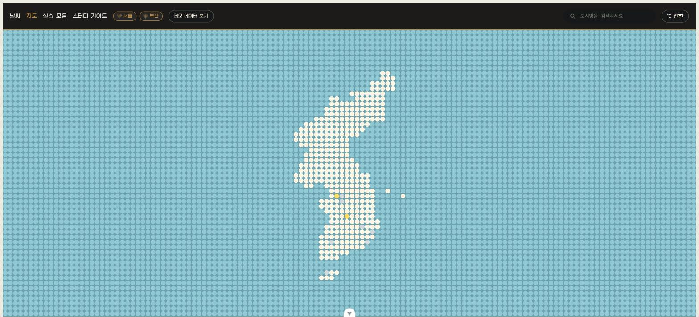

**느낀점**
- 여러 기능을 한 커밋에 묶어서 넣으면, 그중 일부만 되돌려야 할 때 `git revert`처럼 깔끔한 되돌리기 도구를 쓸 수 없다는 걸 직접 겪었다. 기능 단위가 명확히 다르다면(이번처럼 "도시 도트 효과"와 "바다 흐름·커서·대륙"처럼) 커밋도 더 잘게 나눴으면 이번 롤백이 더 쉬웠을 것 같다.
- 자동화 도구로 버그를 재현하려다 오히려 도구 자체의 한계에 부딪혔을 때, 끝까지 도구로 재현을 밀어붙이기보다 "직접 호출로 앱 로직은 정상"이라는 사실을 먼저 확보하고 나서 사용자에게 재현 방법을 되묻는 편이 더 빨리 결론에 도달했다. 자동화로 확인할 수 없는 부분은 억지로 우회하지 말고 그 한계를 인정하는 것도 중요한 판단이라는 걸 배웠다.

---

## 10. 파동/프레스 발생 빈도 최적화 + 데모 토글·즐겨찾기 반응성 + 배경색 수정

**요구사항**
- 바다 파동이 커서가 같은 픽셀(원) 안에서 조금만 움직여도 계속 새로 발생해 낭비가 심하니, 커서가 한 픽셀에 머무는 동안은 파동이 한 번만 나도록 해달라는 요청을 받았다.
- 한반도 육지 픽셀에는 파동 대신 무거운 것이 지형을 누르는 느낌의 인터랙션을 원하며, 이것도 같은 픽셀에 머무는 동안 한 번만 발생해야 한다는 요청을 받았다.
- 실제/데모 데이터 토글을 눌러도 지도 페이지의 도시 도트·팝업이 실시간으로 안 바뀐다는 버그, 상단 즐겨찾기 칩의 "지도에서 보기"를 이미 `/map`에 있는 상태에서 누르면 팝업이 안 뜨는 버그, 도트 픽셀 뒤에 깔린 원색 배경(청록색)을 자연스러운 검은색으로 바꿔달라는 요청을 함께 받았다.

**사고 과정**
- 파동/프레스를 "칸에 머무는 동안 1회"로 제한하는 방법을 고민했다. 기존엔 `mousemove`마다 시간 기준(`RIPPLE_MIN_INTERVAL` 50ms)으로만 스팸을 막았는데, 이건 "같은 칸 안에서 흔들림"과 "다른 칸으로 이동"을 구분하지 못한다. "마지막으로 반응한 칸(col,row)"을 하나만 기억해뒀다가, 새로 계산한 칸이 그것과 다를 때만 반응하는 방식이면 정확히 요구사항대로 동작하면서 코드도 단순하다고 판단했다.
- 육지 프레스 효과를 구현하기 전 기존 파동 엔진 구조를 다시 봤는데, 파동 루프가 이미 `if (landMask[idx]) continue`로 육지를 완전히 건너뛰고 있어서 육지 도트의 `--intensity` CSS 변수와 그 값을 담는 `frameScratch`/`touchedThisFrame`/`prevTouched` 버퍼가 사실상 놀고 있었다. 육지·바다 칸은 서로 절대 겹치지 않으므로(한쪽 시스템이 건드리는 칸은 다른 쪽이 절대 안 건드림), 프레스를 위해 새 버퍼를 만들지 않고 이 기존 버퍼를 그대로 재사용하면 코드 중복 없이 같은 `tick()` 루프 안에 자연스럽게 얹을 수 있다고 봤다. "무거운 게 누른다"는 느낌은 파동과 달리 반경이 퍼지지 않는 고정 크기로, 빠르게 강해졌다가 서서히 풀리는 감쇠 곡선으로 표현하기로 했다.
- 데모 토글 버그는 `KoreaMapDots.vue`의 `buildGrid()`가 `onMounted`/리사이즈 시에만 실행되고 `props.cities`가 나중에 바뀌는 것을 감시하지 않는다는 게 원인이라고 판단해, `watch(() => props.cities, ...)`로 부모의 배열이 통째로 바뀔 때마다 다시 그리도록 하면 될 것 같았다.
- 즐겨찾기 팝업 버그는 `onMounted`가 `route.query.city`를 딱 한 번만 읽는 게 원인이라고 보고, `watch(() => route.query.city, ...)`를 추가하기로 했다. 다만 실제 확인 과정에서 팝업을 닫는 버튼이 자동화 브라우저에서 전혀 반응하지 않는 것처럼 보이는 현상을 발견해, 처음엔 `<Transition>`이 감시하는 `.popup-backdrop` 자신에 CSS 트랜지션이 없어서(트랜지션은 안쪽 `.weather-popup`에만 있음) `transitionend`가 감지되지 않아 leave가 영원히 끝나지 않는 버그로 의심하고 backdrop에도 트랜지션을 추가했었다. 하지만 고친 뒤에도 같은 현상이 재현돼, `document.visibilityState`가 `hidden`인 이 세션의 자동화 탭 특성상 `requestAnimationFrame`이 멈춰 있고 Vue의 `<Transition>` 클래스 전환도 내부적으로 `requestAnimationFrame`에 의존한다는 점이 진짜 원인이라고 다시 판단했다(같은 세션에서 이미 두 번 겪은 rAF 정지 문제와 같은 계열). 실제로 요청받은 증상(팝업이 "열리지" 않음)과는 무관한 곁가지였으므로, 검증되지 않은 backdrop 트랜지션 변경은 되돌리고 원래 계획했던 `route.query.city` watcher만 남겼다.

**해결 과정**
1. `src/components/practices/weather/KoreaMapDots.vue`에 `lastActiveCol`/`lastActiveRow`(마지막으로 파동·프레스를 발생시킨 칸)를 추가하고, `handleMouseMove`에서 새로 계산한 칸이 이전과 같으면 아무 것도 하지 않고, 다르면 육지/바다 여부에 따라 프레스 또는 파동을 1회만 발생시키도록 바꿨다. `.korea-map`에 `@mouseleave`를 추가해 지도를 벗어나면 추적값을 초기화해, 같은 칸에 다시 들어와도 새로 반응하게 했다.

   #### `src/components/practices/weather/KoreaMapDots.vue`
   ```js
   if (col >= 0 && col < cols.value && row >= 0 && row < rows.value) {
     if (col !== lastActiveCol || row !== lastActiveRow) {
       lastActiveCol = col
       lastActiveRow = row
       const idx = row * cols.value + col
       if (landMask[idx]) spawnPress(col, row)
       else spawnRipple(col, row)
     }
   }
   ```
2. 육지 프레스를 파동과 같은 `tick()` 루프 안에 추가했다. 반경이 퍼지지 않는 고정 크기(`PRESS_RADIUS`)와, 처음 15%는 빠르게 강해지고 나머지 85%는 거듭제곱으로 서서히 풀리는 감쇠 곡선(`PRESS_DURATION` ≈ 550ms)을 썼다. 기존 `frameScratch`/`touchedThisFrame`/`prevTouched` 버퍼를 그대로 재사용해 새 자료구조를 만들지 않았다.

   #### `src/components/practices/weather/KoreaMapDots.vue`
   ```js
   const envelope = t < 0.15 ? t / 0.15 : Math.pow(1 - (t - 0.15) / 0.85, 1.6)
   // ...반경 안 육지 칸에 대해 (1 - distance/PRESS_RADIUS) * envelope 를
   // 기존 frameScratch/touchedThisFrame에 그대로 합류시킨다(파동과 겹치지 않는 칸이라 안전)
   ```
3. 육지 도트 CSS를 밝아지는 방향에서 어두워지는 방향으로 바꾸고, 살짝 오그라드는 `transform: scale(...)`을 더해 "눌리는" 느낌을 강화했다.

   #### `src/components/practices/weather/KoreaMapDots.vue`
   ```css
   .korea-map__dot.is-land {
     background: var(--dot-lit);
     filter: brightness(calc(1 - var(--intensity, 0) * 0.4));
     transform: scale(calc(1 - var(--intensity, 0) * 0.12));
   }
   ```
4. `KoreaMapDots.vue`에 `watch(() => props.cities, () => { if (!containerW || !containerH) return; buildGrid(containerW, containerH) })`를 추가해, 데모/실제 데이터 토글로 부모의 `cityList`가 교체될 때마다 그리드를 다시 그리도록 했다(줌/팬 상태는 `buildGrid`가 건드리지 않아 유지된다).
5. `src/views/WeatherMapView.vue`에 `watch(() => route.query.city, (cityId) => { ...; selectCityById(city) })`를 추가해, 이미 `/map`에 마운트된 상태에서 즐겨찾기 칩으로 쿼리만 바뀌는 경우에도 팝업이 열리도록 했다. 최초 진입은 기존 `onMounted` 로직이 그대로 처리한다.
6. `.weather-map`의 `background-color`를 `var(--sea)`(청록)에서 테마에 이미 있는 근접-검정 토큰 `var(--ink)`로 바꿨다.
7. `npx vite build`로 오류 여부를 확인한 뒤, 브라우저에서 실제 도구 클릭 대신 앱 내부 `router.push`를 직접 호출해(자동화 탭의 rAF 제약과 무관하게 확인 가능한 경로) 즐겨찾기 흐름과 데모 토글 반응성을 검증했다.

**트러블슈팅**
- 문제: 항목 4를 검증하려고 팝업을 열고 닫는 흐름을 테스트하다가, 팝업 닫기 버튼을 아무리 클릭해도(좌표 클릭, `dispatchEvent`, 네이티브 `.click()` 모두) 팝업 DOM이 `opacity:0` 상태로 계속 남아있는 현상을 발견했다.
- 원인: 처음엔 `<Transition>`이 실제로 감시하는 루트가 `.popup-backdrop`인데 트랜지션 속성은 안쪽 `.weather-popup`에만 걸려있어 `transitionend`가 감지되지 않는 CSS 구조 버그로 판단하고 `.popup-backdrop` 자신에도 트랜지션을 추가했다. 하지만 고친 뒤에도 동일하게 재현돼, 이 세션의 자동화 탭이 `document.visibilityState: 'hidden'`이라 `requestAnimationFrame`이 정지돼 있고 Vue의 `<Transition>` 클래스 전환도 내부적으로 rAF에 의존한다는 진짜 원인을 다시 확인했다(같은 세션에서 `scroll`/`wheel`, 클릭 이벤트에 이어 세 번째로 겪은 같은 계열의 제약).
- 해결: 검증되지 않은 채 남겨두면 사용하지 않은 CSS 변경만 늘리는 셈이라, `.popup-backdrop` 트랜지션 추가는 되돌렸다. 대신 실제 요청 대상이었던 "쿼리 변경으로 팝업이 열리는지"는 앱의 `router` 인스턴스를 `document.querySelector('#app').__vue_app__`로 직접 얻어 `router.push({name:'weather-map', query:{city:...}})`를 호출하는 방식(rAF와 무관, 순수 상태 변경 확인)으로 검증해, 다른 두 도시에 대해 연달아 팝업이 정상적으로 바뀌는 것을 확인했다.

**결과**
- 파동/프레스 발생 빈도를 "칸 진입마다 1회"로 제한하는 로직과 육지용 프레스 감쇠 곡선을 Node.js로 독립 검증해, 곡선이 0→약 1(빠르게)→0(서서히)으로 정상적으로 움직임을 확인했다(rAF 의존 애니메이션 자체는 이 세션의 자동화 탭에서 시각적으로 재생되지 않는 기존 제약으로, 수치 검증으로 대체).
- 데모/실제 데이터 토글을 지도 페이지에 머문 채로 눌러 도시 도트 배경색이 토글 직후 바로 바뀌는 것을 확인했다.
- `/map`에 이미 있는 상태에서 `router.push`로 쿼리(`?city=...`)만 바꿔도 팝업이 즉시 열리고, 다른 도시로 다시 바꾸면 팝업 내용도 바로 갱신되는 것을 확인했다.
- 지도 배경이 청록색에서 검은 계열로 바뀐 것을 스크린샷으로 확인했다.

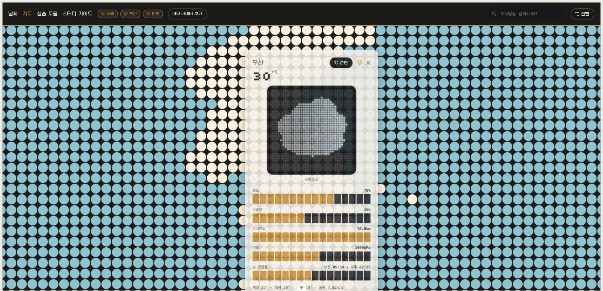

**느낀점**
- "발생 빈도를 줄여달라"는 요청을 받았을 때, 계산 자체를 더 가볍게 만드는 것과 애초에 덜 자주 실행되게 만드는 것은 다른 최적화라는 걸 다시 확인했다. 이번엔 계산량은 지난 라운드에서 이미 최적화돼 있었으므로, "같은 칸이면 아예 트리거하지 않는다"는 발생 빈도 자체를 줄이는 접근이 훨씬 간단하고 효과적이었다.
- 버그를 재현하다 자동화 도구의 한계(rAF 정지)에 부딪혔을 때, 그 자리에서 바로 "원인일 수도 있겠다"며 코드를 고치기보다 고친 뒤에도 같은 증상이 재현되는지 먼저 재확인하는 습관이 중요하다는 걸 다시 느꼈다. 고치고 나서도 증상이 그대로라면 그건 내가 고친 부분이 원인이 아니라는 뜻이고, 검증되지 않은 변경은 남겨두지 않고 되돌리는 게 맞다.

---

## 11. 지도 배경색 롤백 + 한반도 영역 구분색 추가

**요구사항**
- 직전(10번) 작업에서 검은색으로 바꾼 지도 배경이 눈이 아프다는 피드백을 받아 롤백을 요청받았다. 대신 한반도 지형 부분만 육지색보다 조금 진한 색으로 영역을 구분해달라는 요청과, 바다 색상은 이전(청록) 그대로 유지해달라는 요청을 함께 받았다.

**사고 과정**
- `.weather-map`의 `background-color`는 지도 전체에 깔리는 단일 색이라, 이 값 하나로는 "바다는 청록, 육지 부분만 진한 색"처럼 칸 단위로 다른 색을 줄 수 없다는 게 핵심 제약이었다. 배경은 원래 색(`var(--sea)`)으로 단순히 되돌리고, "한반도 영역 구분"은 육지 도트 쪽에서 별도로 해결해야 했다.
- 육지 도트 하나하나에 자신의 색보다 살짝 진한 `box-shadow`를 둘러 그리드 간격(1px)까지 덮으면, 인접한 육지 칸들의 그림자가 서로 이어붙어 마치 하나의 연속된 영역처럼 보일 거라고 판단했다. 그림자는 도트의 실제 원형 경계보다 살짝 넓게 퍼지므로, 촘촘한 그리드에서는 사각형 셀 사이 빈틈(둥근 도트라 생기는 모서리 여백)도 자연스럽게 메워진다.
- 도시 마커는 지리적으로 대부분 육지 위에 있어 `is-land`와 `is-city` 클래스를 동시에 가진다. 지난 라운드에서 "도시 도트는 평상시엔 지형과 완전히 동일하게 보여야 한다"고 정해뒀던 걸 깨지 않으려면, 새로 추가한 육지 구분색 그림자가 도시 도트의 평상시 모습에 새어 들어가지 않도록 명시적으로 막아야 한다고 판단했다.

**해결 과정**
1. `src/views/WeatherMapView.vue`의 `.weather-map` 배경색을 `var(--ink)`에서 `var(--sea)`로 되돌렸다.
2. `src/components/practices/weather/KoreaMapDots.vue`의 `.korea-map__dot.is-land`에 `box-shadow: 0 0 0 2px #d1cabb`를 추가했다. 색은 육지색(`var(--dot-lit)` = `#f3ebd9`)을 약 14% 어둡게 계산한 값으로, 지난 라운드 대륙 확장 때 이미 같은 방식으로 계산해 검증해둔 값을 그대로 재사용했다.

   #### `src/components/practices/weather/KoreaMapDots.vue`
   ```css
   .korea-map__dot.is-land {
     background: var(--dot-lit);
     filter: brightness(calc(1 - var(--intensity, 0) * 0.4));
     transform: scale(calc(1 - var(--intensity, 0) * 0.12));
     box-shadow: 0 0 0 2px #d1cabb;
   }
   ```
3. `.korea-map__dot.is-city` 기본(호버 전) 상태에 `box-shadow: none`을 명시해, `is-land`와 동시에 걸리는 도시 도트가 평상시엔 여전히 장식 없는 일반 도트로 보이게 했다. 호버·선택 시의 기존 `box-shadow` 규칙은 더 구체적인 선택자라 자동으로 우선 적용된다.

**트러블슈팅**
- 없음.

**결과**
- `npx vite build` 통과를 확인했다.
- `/map`에서 바다 배경이 이전의 청록색으로 돌아왔고, 한반도 육지 도트들 사이가 육지색보다 진한 톤으로 채워져 육지 영역이 바다와 뚜렷이 구분되는 것을 스크린샷으로 확인했다.
- 도시 도트가 평상시(호버 전)엔 `box-shadow: none`으로 계산돼 여전히 장식 없이 일반 도트와 동일하게 보이고, 클릭 시 팝업도 정상적으로 열리는 것을 확인했다.

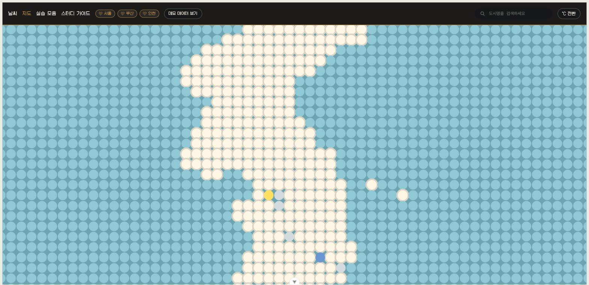

**느낀점**
- "배경색을 바꿔달라"는 요청이 두 번째로 반대 방향으로 뒤집혔는데, 처음 요청(검은색)만 보고 확정적으로 좋다고 판단하지 않고 실제 반응을 지켜보며 조정하는 흐름이 자연스럽다는 걸 느꼈다. 시각적 선호는 코드보다 훨씬 주관적이라, 이런 되돌림 자체를 실패로 여기기보다 반복 조정의 정상적인 일부로 받아들이는 게 맞다고 생각했다.
- "영역을 구분해달라"는 요청을 문자 그대로 "배경색을 칸마다 다르게 칠한다"로 풀려고 하면 CSS 구조상 막히는 지점(단일 배경색)이 있었는데, "인접한 원형 도트의 그림자를 서로 이어붙인다"는 약간 다른 각도로 접근하니 기존 구조를 거의 안 건드리고도 원하는 시각적 결과를 낼 수 있었다. 요구사항을 가장 직관적인 구현 방법 하나로만 고정해서 생각하지 않는 게 중요하다고 다시 느꼈다.

---

## 12. 지도 팝업 축소 — 아이콘·간격을 줄여 스크롤 없이 한 화면에 들어오게

**요구사항**
- 지도에서 도시를 클릭했을 때 뜨는 팝업이 세로로 너무 길어(첨부 이미지: 낮 진행률 막대가 화면 아래로 잘림) 한눈에 안 들어온다는 피드백을 받아, 팝업 크기를 줄여달라는 요청을 받았다.

**사고 과정**
- 팝업 높이의 가장 큰 비중을 차지하는 건 `WeatherStatsPanel` 안의 `DotMatrixIcon`(`size="lg"`, 260×260px)이었다. 이 컴포넌트는 지도 팝업과 날씨 상세 페이지(`WeatherDetailView`) 양쪽에서 공유되는데, 상세 페이지는 화면 전체를 쓰므로 굳이 줄일 필요가 없다. 그래서 컴포넌트 자체를 줄이지 않고, "좁은 곳에서 쓸 때만 작아지는" `compact` prop을 추가해 팝업에서만 영향을 주는 쪽으로 갔다.

**해결 과정**
1. `DotMatrixIcon.vue`에 `sm`/`lg` 두 크기만 있던 것에 `md`(150×150px)를 추가했다(기존 크기 동작은 그대로라 다른 사용처에 영향 없음).
2. `WeatherStatsPanel.vue`에 `compact` prop을 추가해, true일 때 아이콘을 `size="md"`로 줄이고 통계 막대 간격·여백을 좁혔다.

   #### `src/components/practices/weather/WeatherStatsPanel.vue`
   ```vue
   <DotMatrixIcon :condition="city.condition" :size="compact ? 'md' : 'lg'" :animated="true" />
   ```
3. `WeatherMapView.vue`에서 `<WeatherStatsPanel :city="selectedCity" compact />`로 호출하고, 팝업 자체 폭(380→320px)·패딩(24→18px)·온도 폰트(40→32px)도 비례해 줄였다.

**트러블슈팅**
- 없음.

**결과**
- `npx vite build` 통과를 확인했다.
- 지도에서 도시를 클릭했을 때 팝업이 스크롤 없이 화면에 전부 들어오는 것을 확인했다.
- `/weather/:id` 상세 페이지의 `WeatherStatsPanel`은 `compact`를 넘기지 않아 기존과 동일한 크기(`size="lg"`, 260px)로 유지되는 것을 확인해 회귀가 없음을 검증했다.
- ℃/℉ 전환, 즐겨찾기, 닫기 버튼 등 팝업 내부 인터랙션이 축소 후에도 정상 동작함을 확인했다.

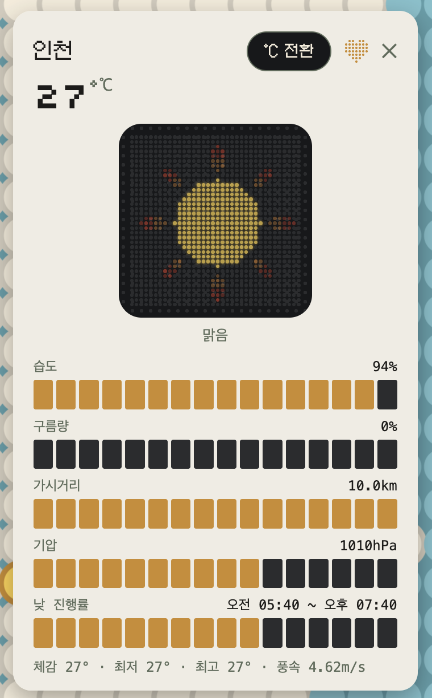

**느낀점**
- 여러 화면에서 공유하는 컴포넌트를 줄여야 할 때, 컴포넌트 자체의 기본 크기를 바꾸기보다 "좁은 곳에서만 작아지는" 선택적 prop을 추가하는 편이 다른 사용처에 대한 회귀 위험을 원천적으로 없앤다는 걸 다시 확인했다.

---

## 13. 팝업 위치 보정 + 즐겨찾기·온도 TOP3 사이드 패널 + 바다·주요지역 픽셀 밀도 개선

**요구사항**
- 팝업을 줄였는데도 여전히 화면 아래쪽으로 치우쳐 뜬다는 피드백을 받아, 위치를 다시 조정해달라는 요청을 받았다.
- 이전에 계획 단계로만 남겨뒀던 "지도 페이지 좌우 컨텐츠" 브레인스토밍 중 후보 A(즐겨찾기 미니 카드 + 온도 TOP3 랭킹)를 실제로 구현해달라는 요청을 받았다.
- 지난 라운드에 한반도 육지에 적용한 "자기 색보다 진한 box-shadow로 칸 사이 간격을 메워 하나의 영역처럼 보이게 하는" 기법을, 바다와 주요 지역(도시) 픽셀에도 똑같이 적용해 꽉 찬 느낌을 내달라는 요청을 받았다.

**사고 과정**
- 팝업 위치 문제의 원인을 다시 짚어보니, "클릭 지점 아래로 열고 공간이 부족할 때만 위로 뒤집는다"는 분기 로직 자체가 문제였다. 도시 도트 대부분이 한반도 지형상 화면 중하단에 몰려 있어 이 로직은 거의 항상 "아래로 열기"를 택하고, 화면 하단 클램프에 걸려 계속 아래쪽에 붙어 보였다. 클릭 위치를 기준으로 위/아래를 판단하는 대신, **클릭 지점을 팝업의 세로 중심으로 삼고 화면 안에 들어오도록 클램프**하면 클릭 위치와 무관하게 항상 고르게 화면 안에 들어온다는 훨씬 단순한 규칙으로 바꿀 수 있다고 판단했다.
- 사이드 패널은 별도 컴포넌트 파일을 만들지 않고 `WeatherMapView.vue` 안에 직접 구성하기로 했다 — 지도 페이지 전용 UI라 다른 곳에서 재사용할 일이 없어서, 파일을 분리하면 오히려 props를 주고받는 코드만 늘어난다고 봤다(CLAUDE.md의 "일회성 코드를 위해 추상화 계층을 만들지 않는다" 원칙과도 맞음). 즐겨찾기 목록은 `favoritesStore`+`cityList`(실시간 날씨 포함)를 조합하면 되고, TOP3 랭킹은 `WeatherHomeView.vue`에 이미 있던 `hottestCity`/`coldestCity`(1개만 뽑는 `reduce`) 패턴을 정렬 후 `slice(0,3)`으로 확장하면 되는, 기존 코드 재사용 비중이 큰 구현이라고 판단했다.
- 바다·도시 픽셀 밀도 개선은 지난 라운드 육지 처리와 완전히 같은 원리라 새로 고민할 부분은 적었다. 다만 도시 도트는 이미 인라인으로 `--pulse-color`(호버 강조색)를 받고 있어서, 여기에 `--marker-color`(마커 자체색)를 하나 더 얹어 CSS에서 그대로 box-shadow 색으로 쓰면 됐다. 도시는 이미 자기 색으로 눈에 띄는 데다 여러 개가 다닥다닥 붙어있지 않은 경우가 많아, 육지(2px)와 똑같은 두께를 주면 평상시 크기가 커 보일 위험이 있다고 보고 1px로 더 얇게 뒀다.

**해결 과정**
1. `src/views/WeatherMapView.vue`의 `selectCity`/`selectCityById`가 `popupAnchor`에 `top`/`bottom` 대신 `centerY`(세로 중심)를 저장하도록 바꾸고, `popupStyle`도 위/아래 분기 없이 `centerY - 팝업높이/2`를 화면 안으로 클램프하는 방식으로 단순화했다. `POPUP_HEIGHT_ESTIMATE`도 실제 축소된 팝업 높이에 맞춰 560 → 480으로, `.weather-popup`의 `max-height`도 520px로 다시 보정했다.

   #### `src/views/WeatherMapView.vue`
   ```js
   const popupStyle = computed(() => {
     if (!popupAnchor.value) return {}
     const { left, centerY } = popupAnchor.value
     const clampedLeft = Math.max(POPUP_MARGIN, Math.min(left, window.innerWidth - POPUP_WIDTH - POPUP_MARGIN))
     const rawTop = centerY - POPUP_HEIGHT_ESTIMATE / 2
     const clampedTop = Math.max(POPUP_MARGIN, Math.min(rawTop, window.innerHeight - POPUP_HEIGHT_ESTIMATE - POPUP_MARGIN))
     return { left: `${clampedLeft}px`, top: `${clampedTop}px` }
   })
   ```
2. `.weather-map__grid-area`를 감싸는 `.weather-map__body`(flex row)를 새로 두고, 왼쪽엔 즐겨찾기 목록, 오른쪽엔 온도 TOP3(더움/추움) 랭킹을 배치했다. 둘 다 항목을 클릭하면 기존 `selectCityById`로 팝업이 뜨고, 온도는 `convertTemp()`로 ℃/℉ 전환을 반영한다.

   #### `src/views/WeatherMapView.vue`
   ```js
   const favoriteCitiesWithWeather = computed(() =>
     cityList.value.filter((city) => favoritesStore.isFavorite(city.id)),
   )
   const hottestThree = computed(() => [...cityList.value].sort((a, b) => b.temp - a.temp).slice(0, 3))
   const coldestThree = computed(() => [...cityList.value].sort((a, b) => a.temp - b.temp).slice(0, 3))
   ```
3. 좁은 화면(1000px 이하)에서는 지도가 눌리지 않도록 사이드 패널을 숨기는 미디어쿼리를 추가했다.
4. `src/components/practices/weather/KoreaMapDots.vue`의 기본 `.korea-map__dot`(바다) 규칙에 자기 배경색과 같은 `box-shadow: 0 0 0 2px #7cc0cb`를 추가해 바다도 육지처럼 격자 간격 없이 꽉 찬 면으로 보이게 했고, 도시 도트에는 인라인으로 넘긴 `--marker-color`를 이용해 `box-shadow: 0 0 0 1px var(--marker-color, var(--amber))`를 적용했다.

   #### `src/components/practices/weather/KoreaMapDots.vue`
   ```css
   .korea-map__dot {
     background: #7cc0cb;
     box-shadow: 0 0 0 2px #7cc0cb; /* 바다도 육지처럼 꽉 찬 면으로 */
   }
   .korea-map__dot.is-city {
     box-shadow: 0 0 0 1px var(--marker-color, var(--amber));
   }
   ```
5. `npx vite build`로 오류 여부를 확인했다.

**트러블슈팅**
- 문제: 이번 라운드는 Chrome 확장(브라우저 자동화 도구)이 세션 내내 연결되지 않아 실제 브라우저에서 스크린샷·클릭 검증을 하지 못했다.
- 원인: 확장 프로그램 연결 문제로 추정되며, 재시도(수 차례, 간격을 두고)해도 계속 "확장 프로그램 연결 안 됨" 상태였다.
- 해결: 대신 (1) `npx vite build`로 템플릿·스크립트 컴파일 오류가 없는지, (2) 개발 서버에 떠 있는 상태에서 수정한 세 파일(`WeatherMapView.vue`, `KoreaMapDots.vue`, `WeatherStatsPanel.vue`) 각각을 직접 요청해 Vite가 200으로 정상 컴파일·서빙하는지(컴파일 에러가 있으면 500이나 오버레이 스크립트가 온다), (3) 코드를 다시 훑어 로직을 재검증하는 방식으로 확인을 대신했다. 다만 이 방식으로는 **실제 화면에서 팝업 위치·사이드 패널 레이아웃·픽셀 밀도가 의도대로 보이는지는 확인하지 못했다** — 사용자가 직접 화면에서 확인해줘야 한다.

**결과**
- 빌드 통과, 수정한 3개 파일 모두 Vite가 정상 컴파일·서빙함을 확인했다.
- (브라우저 자동화 도구 연결 불가로 시각적 확인은 다음에 사용자가 직접 확인 필요) 코드상으로는: 팝업이 클릭 위치를 중심으로 화면 안에 클램프되어 열리도록, 왼쪽엔 즐겨찾기·오른쪽엔 온도 TOP3 패널이 클릭 시 `selectCityById`를 호출하도록, 바다·도시 도트에 각각 box-shadow 밀도 처리가 적용되도록 구현했다.

**느낀점**
- 팝업 위치를 "조건 분기로 위/아래를 고르는" 방식에서 "중심점 + 클램프"로 바꾸면서, 분기 로직이 늘어나던 이전 방식보다 코드가 더 짧아지면서 오히려 더 안정적으로 동작하는 경우가 있다는 걸 다시 느꼈다. 조건을 늘려 특수 케이스를 처리하기보다, 애초에 특수 케이스가 생기지 않는 더 단순한 규칙을 찾는 게 나을 때가 많다.
- 이번엔 평소 쓰던 브라우저 자동화 검증을 못 쓰는 상황을 처음 겪었는데, "검증 도구가 없다고 검증을 포기하는" 대신 빌드·모듈 서빙 확인처럼 지금 가능한 다른 방식으로 확인 범위를 최대한 좁혀두고, 확인하지 못한 부분은 명확히 사용자에게 알리는 게 맞다고 판단했다. 안 되는 걸 억지로 되는 척하지 않는 태도가 중요하다고 다시 느꼈다.

---

## 14. 팝업 위치 실측 전환 + 사이드 패널 오버레이화 + 픽셀 테두리 명도 조정

**요구사항**
- 직전 작업(13번)을 사용자가 실제로 확인해보니, 팝업이 여전히 화면 아래로 잘려 나온다는 스크린샷과 함께 재조정 요청을 받았다.
- 좌우 사이드 패널이 지도 폭을 줄이는 고정 컬럼으로 붙어 있는데, 바다 배경 위에 뜨는 게임 배너/이벤트창처럼 "떠 있는 패널"로 바꿔달라는 요청을 받았다.
- 바다·주요 지역(도시) 픽셀의 테두리 색이 자기 색과 완전히 같아 구분이 잘 안 되니, 육지처럼 자기 색보다 진한 색으로 바꿔달라는 요청을 받았다.

**사고 과정**
- 팝업 위치는 지난 두 라운드에서 어림값(`POPUP_HEIGHT_ESTIMATE`)을 800→560→480으로 계속 손으로 맞춰왔는데도 매번 살짝 어긋났다. 근본 원인은 "콘텐츠 높이를 미리 예측해서 위치를 계산한다"는 접근 자체였다 — 아이콘 크기, 패딩, 폰트가 바뀔 때마다 다시 틀어질 수밖에 없는 구조다. 어림값을 또 조정하는 대신, **팝업이 실제로 DOM에 그려진 뒤 그 크기를 직접 측정**해서 위치를 계산하면 이후 콘텐츠가 어떻게 바뀌어도 항상 정확하다고 판단했다. `nextTick()`으로 렌더링을 기다린 뒤 `offsetHeight`/`offsetWidth`를 읽으면 되고, CSS 트랜지션은 opacity/transform만 다루므로 레이아웃 크기(offsetHeight)에는 영향을 주지 않아 측정 타이밍 문제도 없다.
- 사이드 패널을 "떠 있는 패널"로 바꾸는 건 레이아웃 방식의 전환이었다 — flex row로 폭을 나눠 갖던 것을, 지도를 다시 컨테이너 전체를 채우게 하고 사이드 패널은 그 위에 `position: absolute`로 얹는 방식으로 바꿨다. 이왕 "이벤트창처럼" 보이길 원해서, 기존에 평평한 어두운 블록이던 배경을 이미 있는 날씨 팝업과 같은 "밝은 카드 + 그림자" 룩으로 통일했다(카드 배경이 밝아졌으니 글자색도 어두운 배경 기준(cream/paper)에서 밝은 배경 기준(ink/moss)으로 같이 바꿔야 했다).
- 픽셀 테두리 명도 조정은 지난 라운드에 육지에 이미 적용한 "자기 색보다 진하게" 원리를 그대로 바다·도시에 옮기는 것뿐이라 새로 고민할 부분은 적었다. 다만 바다는 고정된 단일 색이라 계산값을 그냥 하드코딩하면 되지만, 도시는 조건별로 색이 6가지라 매번 손으로 계산하기보다 재사용 가능한 `darken(hex, amount)` 유틸을 만들어 인라인으로 계산하는 쪽이 유지보수하기 낫다고 봤다.

**해결 과정**
1. `src/views/WeatherMapView.vue`에 `popupRef`(템플릿 ref)와 `popupPosition`(반응형 좌표)을 추가하고, `positionPopupAt(centerX, centerY)`가 `nextTick()` 이후 실측 크기로 클램프된 위치를 계산하도록 바꿨다. `selectCity`/`selectCityById`는 이제 클릭 지점(또는 화면 중앙)의 중심 좌표만 넘긴다.

   #### `src/views/WeatherMapView.vue`
   ```js
   async function positionPopupAt(centerX, centerY) {
     await nextTick()
     const el = popupRef.value
     const height = el?.offsetHeight ?? POPUP_HEIGHT_ESTIMATE
     const width = el?.offsetWidth ?? POPUP_WIDTH
     const left = Math.max(POPUP_MARGIN, Math.min(centerX - width / 2, window.innerWidth - width - POPUP_MARGIN))
     const top = Math.max(POPUP_MARGIN, Math.min(centerY - height / 2, window.innerHeight - height - POPUP_MARGIN))
     popupPosition.value = { left: `${left}px`, top: `${top}px` }
   }
   ```
2. `.weather-map__body`를 `position: relative` 컨테이너로, `.weather-map__grid-area`를 그 안을 꽉 채우는 `position: absolute; inset:0`으로 바꿔 지도가 다시 전체 폭을 쓰게 했다. `.weather-map__side`를 `position: absolute`(좌/우 16px, 위/아래 16px)로 바꾸고, 배경을 `var(--ink)` 평면 블록에서 `var(--paper)` + `border-radius` + `box-shadow`(날씨 팝업과 동일한 룩)로 교체했다. `z-index: 10`으로 지도 위·팝업(50) 아래에 오도록 뒀다.
3. `src/components/practices/weather/KoreaMapDots.vue`에 `darken(hex, amount)` 유틸을 추가하고, 바다 도트의 `box-shadow` 색을 `#7cc0cb`(자기 색 그대로)에서 15% 어둡게 계산한 `#69a3ad`로, 도시 도트는 인라인으로 넘기던 `--marker-color`(자기 색 그대로) 대신 `--marker-border-color`(`darken(markerColor(...))`)를 넘겨 `box-shadow`가 이 값을 쓰도록 바꿨다.

   #### `src/components/practices/weather/KoreaMapDots.vue`
   ```js
   function darken(hex, amount = 0.15) {
     const num = parseInt(hex.slice(1), 16)
     const r = Math.round(((num >> 16) & 255) * (1 - amount))
     const g = Math.round(((num >> 8) & 255) * (1 - amount))
     const b = Math.round((num & 255) * (1 - amount))
     return `rgb(${r}, ${g}, ${b})`
   }
   function markerBorderColor(city) {
     return darken(markerColor(city.condition))
   }
   ```
4. `npx vite build`로 컴파일 오류가 없는지 확인하고, 개발 서버에서 수정한 두 파일을 직접 요청해 Vite가 정상 컴파일·서빙(200)하는지 확인했다. `darken()` 계산 결과는 Node.js로 6가지 조건 색 전부를 미리 돌려봐서 육안으로도 뚜렷이 어두워진 값이 나오는지 확인했다.

**트러블슈팅**
- 문제: 이번 라운드도 Chrome 확장이 세션 내내 연결되지 않아(여러 차례 재시도, 간격을 두고 재확인해도 계속 연결 안 됨) 실제 화면 검증을 하지 못했다.
- 원인: 브라우저 자동화 도구 연결 문제로 추정(원인 미상, 재시도로 해결 안 됨).
- 해결: 지난 라운드와 동일하게 (1) 빌드 통과, (2) 수정 파일이 Vite에서 정상 컴파일·서빙되는지, (3) 색상 계산처럼 브라우저 없이도 검증 가능한 부분은 Node.js로 별도 확인하는 방식으로 대신했다. 실제 화면에서 팝업이 잘리지 않는지, 사이드 패널이 카드처럼 떠 보이는지, 테두리 명도 차이가 실제로 눈에 띄는지는 여전히 사용자가 직접 확인해야 한다.

**결과**
- 빌드 통과, 수정한 파일들이 Vite에서 정상 컴파일·서빙됨을 확인했다.
- `darken()`이 6가지 날씨 조건 색 모두에 대해 뚜렷이 어두운 RGB 값을 반환함을 Node.js로 확인했다.
- (브라우저 자동화 도구 연결 불가로 실제 화면 확인은 사용자 몫으로 남음) 코드상으로는 팝업이 실측 높이 기준으로 항상 화면 안에 클램프되도록, 사이드 패널이 지도 위 오버레이 카드로 뜨도록, 바다·도시 테두리가 각자 색보다 어둡게 계산되도록 구현했다.

**느낀점**
- "어림값을 계속 손으로 맞추는" 접근은 값을 아무리 정교하게 재보정해도 콘텐츠가 바뀌는 순간 다시 어긋나는 구조적 한계가 있다는 걸 이번에 확실히 체감했다. 처음부터 "실측"으로 갔다면 지난 두 라운드의 재조정 자체가 필요 없었을 것 — 값을 추측해야 하는 상황을 만나면, 값을 더 정확히 추측하려 하기보다 애초에 추측이 필요 없는 방법이 있는지부터 살펴보는 게 낫다는 교훈을 얻었다.
- 시각적 확인 도구가 연속으로 두 라운드나 막혔는데도, 사용자가 직접 스크린샷을 찍어 피드백을 줘서 작업을 이어갈 수 있었다. 자동화 검증이 막혔을 때 정직하게 그 사실을 알리고 사용자의 눈을 대신 빌리는 것도 하나의 유효한 검증 경로라는 걸 다시 느꼈다.

---

## 15. 팝업 완전 표시(fit-scale) + 바다 윤슬 + 선택 폭발 이펙트 + 테두리 두께 통일 + 픽셀 아이콘

**요구사항**
- 팝업이 스크롤 없이 전체가 뜨도록, 어떤 창 크기에서도 잘리지 않게 위치가 자동 조절되어야 한다.
- 바다 픽셀의 파동 색상을 청록이 밝아지는 것이 아니라 흰색 계열(빈티지 색감과 어울리는 윤슬)로 바꾼다.
- 지역을 선택할 때 해당 픽셀이 터지는 듯한 이펙트를 추가한다.
- 도시(주요 지역) 픽셀 테두리 두께를 바다·한반도 지형 픽셀과 동일하게 맞춘다.
- 즐겨찾기/오늘의 순위 제목의 기본 이모지(⭐🔥🧊)를 없애고, 즐겨찾기는 기존 하트 픽셀을, 더운/추운 지역은 새로 픽셀로 구현한 아이콘을 쓴다.

**사고 과정**
- 팝업은 지난 라운드(14번)에서 "어림값 대신 실측"으로 위치 계산의 어긋남 문제는 해결했지만, 높이 자체에 상한이 없어 창이 작으면 여전히 내부 스크롤이 생겼다. 근본적으로 "위치만 조정"해서는 풀리지 않는 문제라, 실측한 높이가 화면보다 크면 **팝업 전체를 비율대로 축소(scale)**해서 항상 한 화면에 다 들어오게 하는 쪽으로 접근을 바꿨다. 다만 기존 등장/퇴장 트랜지션도 같은 엘리먼트에서 `scale(0.9)`를 쓰고 있어서, 두 스케일이 한 엘리먼트에서 충돌하면 실측(`offsetHeight`)이 트랜지션 도중 값에 흔들릴 수 있다고 판단해 바깥(`.weather-popup`, 위치+fit-scale)과 안쪽(`.weather-popup__inner`, 콘텐츠+트랜지션) 두 겹으로 나눴다. 또 팝업이 열려 있는 동안 창 크기가 바뀌는 경우까지 요구사항의 "어떤 창 크기든"에 포함된다고 보고, 마지막으로 연 좌표를 기억해뒀다가 `resize` 이벤트에서 재계산하도록 추가했다.
- 파동 색은 기존에 `filter: brightness()`로 청록을 밝히기만 해서 "밝은 청록"이었지 흰빛이 아니었다. 새 색을 만들지 않고 이미 팔레트에 있는 `--dot-lit`(육지 픽셀에 쓰는 크림 화이트, `#f3ebd9`)을 그대로 재사용하면 전체 빈티지 색감과 자연스럽게 어울릴 거라 판단했다. `filter`가 아니라 `color-mix()`로 바다색과 크림 화이트를 강도(intensity)만큼 섞는 방식을 택했다 — 밝기만 올리는 것보다 실제로 "흰 물결이 이는" 것처럼 보인다.
- 선택 시 터지는 이펙트는 완전히 새 애니메이션 루프를 만들지 않고, 이미 있는 파동/프레스용 rAF 파이프라인(`tick()`)에 세 번째 효과(`bursts`)로 얹는 게 가장 자연스럽다고 봤다. 파동/프레스는 각각 바다/육지 한쪽에만 적용되지만, "터지는" 이펙트는 클릭한 지점이 육지 위 도시든 근처 바다든 상관없이 나야 하므로 landMask 필터링을 하지 않는 별도 버퍼(`burstScratch`)로 분리했다. 곡선은 프레스와 달리 "펑" 하고 순간적으로 강했다가 빠르게 사그라드는 형태(제곱 감쇠 envelope)에, 링 반경은 처음에 빠르게 퍼졌다가 감속하는(`sqrt(t)`) 충격파 형태로 잡았다.
- 테두리 두께 통일은 지난 라운드에 "도시는 은은하게 보이도록 육지보다 얇게 1px"라고 의도적으로 다르게 뒀던 것을, 이번 요구사항으로 명시적으로 통일해달라고 해서 2px로 맞췄다 — 디자인 의도 변경이므로 주석도 함께 갱신했다.
- 이모지 교체는 구글 폰트(아이콘 폰트)를 새로 불러오는 방안도 후보였지만, 외부 폰트 의존이 늘고 이미 프로젝트에 픽셀 패턴 방식(`FavoriteHeartDots.vue`, 7×7 격자)이 있어 그 패턴을 그대로 재사용/복제하는 게 더 일관적이라고 판단했다. 즐겨찾기는 기존 컴포넌트를 그대로 재사용(요구사항이 명시한 "우리가 구현한 하트 픽셀"), 불꽃/눈송이는 같은 구조의 신규 컴포넌트(`PixelTempIcon.vue`)로 만들었다.

**해결 과정**
1. `src/views/WeatherMapView.vue`의 `positionPopupAt`을 확장해, 실측한 팝업 크기가 화면보다 크면 `MIN_FIT_SCALE`(0.7)까지 축소하는 `fitScale`을 계산하고 `--fit-scale` CSS 변수로 넘기도록 바꿨다. 팝업이 열린 채 창이 리사이즈되면 마지막 중심 좌표로 다시 계산한다.

   #### `src/views/WeatherMapView.vue`
   ```js
   const MIN_FIT_SCALE = 0.7
   let lastPopupCenter = null

   async function positionPopupAt(centerX, centerY) {
     lastPopupCenter = { x: centerX, y: centerY }
     await nextTick()
     const el = popupRef.value
     if (!el) return
     const rawH = el.offsetHeight
     const rawW = el.offsetWidth
     const availH = window.innerHeight - POPUP_MARGIN * 2
     const availW = window.innerWidth - POPUP_MARGIN * 2
     const fitScale = Math.max(MIN_FIT_SCALE, Math.min(1, availH / rawH, availW / rawW))
     const h = rawH * fitScale
     const w = rawW * fitScale
     const left = Math.max(POPUP_MARGIN, Math.min(centerX - w / 2, window.innerWidth - w - POPUP_MARGIN))
     const top = Math.max(POPUP_MARGIN, Math.min(centerY - h / 2, window.innerHeight - h - POPUP_MARGIN))
     popupPosition.value = { left: `${left}px`, top: `${top}px`, '--fit-scale': fitScale }
   }

   function handleWindowResize() {
     if (!lastPopupCenter) return
     positionPopupAt(lastPopupCenter.x, lastPopupCenter.y)
   }
   ```
   템플릿도 `.weather-popup`(위치+fit-scale, `ref="popupRef"`)과 `.weather-popup__inner`(콘텐츠+트랜지션)로 나누고, CSS의 `max-height: min(520px, ...)` 하드 캡을 제거했다.
2. `src/components/practices/weather/KoreaMapDots.vue`의 바다 도트 배경을 `filter: brightness()`에서 `color-mix()` 기반으로 바꿔, 강도가 오를수록 청록에서 크림 화이트로 섞이게 했다.

   #### `src/components/practices/weather/KoreaMapDots.vue`
   ```css
   .korea-map__dot {
     background: #7cc0cb; /* color-mix 미지원 환경 폴백 */
     background-color: color-mix(in srgb, var(--dot-lit) calc(var(--intensity, 0) * 100%), #7cc0cb);
   }
   ```
3. 같은 파일에 `bursts` 배열과 `burstScratch` 버퍼, `spawnBurst(col, row)`를 추가하고 `tick()` 안에 파동/프레스와 같은 형태의 burst 처리 루프를 넣었다. `handleCityDotClick`이 클릭된 도시의 `dot.col/row`로 `spawnBurst`를 호출하도록 시그니처를 `(city, event)`에서 `(dot, event)`로 바꿨다.

   ```js
   const envelope = (1 - t) * (1 - t)
   const ringRadius = BURST_MAX_RADIUS * Math.sqrt(t)
   // ...링 안쪽 좁은 밴드만 스캔해 burstScratch에 기록, 육지/바다 구분 없이 적용
   ```
   `--burst` CSS 변수를 도트에 부여해, 바다는 `transform: scale(1 + burst*0.8)` + `filter: brightness(1 + burst*1.2)`로, 육지는 기존 프레스(`intensity`) 계산과 한 식으로 합성해 부풀며 밝아지게 했다.
4. `.korea-map__dot.is-city`의 `box-shadow` 두께를 `1px`→`2px`로 바꿔 바다·육지와 통일하고, 관련 주석도 "은은하게 얇게"에서 "두께 통일"로 갱신했다.
5. 신규 `src/components/practices/weather/PixelTempIcon.vue`를 `FavoriteHeartDots.vue`와 동일한 구조(7×7 패턴 + grid)로 만들고 `variant: 'hot' | 'cold'` prop으로 불꽃/눈송이 패턴과 `--amber`/`--sea` 색을 고른다. `WeatherMapView.vue`의 사이드 패널 제목에서 `⭐`는 `<FavoriteHeartDots :active="true" :size="14" />`로, `🔥`/`🧊`는 `<PixelTempIcon variant="hot"/"cold" :size="14" />`로 교체했다.
6. `npx vite build`로 컴파일 오류 없음을 확인했고, 개발 서버를 임시로 띄워 수정/신규 파일 3개(`WeatherMapView.vue`, `KoreaMapDots.vue`, `PixelTempIcon.vue`) 전부 Vite가 200으로 정상 서빙함을 curl로 확인했다. burst의 envelope/ringRadius 곡선은 Node.js로 t=0~0.99 구간을 찍어봐서 순간적으로 강했다가 빠르게 감쇠하고, 반경이 초반에 빠르게 퍼지다 감속하는 의도한 모양이 맞는지 수치로 확인했다.

**트러블슈팅**
- 문제: 이번에도 Chrome 브라우저 자동화 확장이 연결되지 않아(`tabs_context_mcp` 호출 시 "Browser extension is not connected") 실제 화면에서 fit-scale 동작, 윤슬 색, burst 애니메이션, 아이콘 렌더링을 눈으로 확인하지 못했다.
- 원인: 이전 라운드들과 동일한 브라우저 확장 연결 문제(원인 미상).
- 해결: `npx vite build` 통과, 개발 서버 curl 확인(수정 파일 3개 모두 200 정상 서빙), burst 곡선 수치 검증(Node.js)까지만 내가 확인할 수 있는 범위였고, 실제 화면 검증은 사용자에게 요청했다.

**결과**
- 빌드 통과, 수정/신규 파일 모두 Vite에서 정상 컴파일·서빙됨을 확인했다.
- burst 애니메이션의 envelope·ringRadius 곡선이 의도한 형태(순간적으로 강했다 빠르게 사그라들고, 반경은 빠르게 퍼졌다 감속)임을 수치로 확인했다.
- (브라우저 자동화 도구 연결 불가로 실제 화면 확인은 사용자 몫으로 남음) 코드상으로는 팝업이 화면보다 크면 자동으로 축소되어 항상 스크롤 없이 다 보이도록, 바다 파동이 크림 화이트로 섞이도록, 도시 클릭 시 폭발 이펙트가 재생되도록, 도시 테두리가 2px로 통일되도록, 사이드 패널 제목이 픽셀 아이콘을 쓰도록 구현했다.

**느낀점**
- "위치만 클램프"해서는 풀리지 않는 문제(콘텐츠 자체가 화면보다 큰 경우)를 만났을 때, 위치 계산 로직을 더 정교하게 다듬기보다 "통째로 축소한다"는 한 단계 다른 층위의 해법으로 옮기는 게 오히려 더 단순하고 견고했다. 같은 문제를 같은 층위에서 계속 땜질하기보다, 문제가 반복되면 접근 자체를 한 단계 위(또는 다른 축)에서 다시 보는 게 낫다는 걸 다시 확인했다.
- 이미 있는 애니메이션 파이프라인(파동/프레스)에 새 효과(burst)를 얹을 때, 처음부터 "이 효과는 다른 효과들과 무엇을 공유하고 무엇을 공유하면 안 되는가"(버퍼는 분리하되 rAF 루프는 공유)를 먼저 정하고 시작하니 구현이 깔끔했다 — 무작정 복사-붙여넣기로 시작했다면 버퍼가 꼬였을 것 같다.

---

## 16. 드래그 가능한 창 시스템 + "한반도 지역 찾기" 미니게임

**요구사항**
- 즐겨찾기·오늘의 순위·도시 팝업 창을 드래그해서 위치를 옮길 수 있게 한다. 이를 구현하기 전, 즐겨찾기와 오늘의 순위를 한 창으로 합친다.
- 사이트 컨셉(픽셀 + 날씨)에 맞는 미니게임을 추가한다. 게임은 픽셀 형태여야 하고, 날씨 사이트 컨셉에 맞아야 한다. 지도 탭에서 만들지 새 페이지로 만들지도 고민해서 방안을 제시한다.
- (사용자와 협의 결과) 게임은 **"한반도 지역 찾기"**(지도 위 문제 지역을 클릭해서 맞히는 게임)로 확정, **지도 탭 안의 드래그 가능한 창**에서 "게임 시작"을 누르면 지도 자체가 게임판이 되는 형태로 확정. 문제로 나올 지역은 기존 주요 도시(9곳)보다 많아야 하고, 창에는 남은 시간·점수 등 재밌는 오브젝트를 배치한다.

**사고 과정**
- 미니게임 아이디어는 3가지(픽셀 우산 받기 액션 게임, 두 도시 날씨 비교 퀴즈, 지도에서 도시 찾기)를 제시했고, 사용자가 "지도에서 도시 찾기"를 골랐다. 이 선택은 결과적으로 구현도 가장 효율적이었다 — 게임 좌표계·픽셀 렌더링·burst 이펙트를 이미 만든 `KoreaMapDots`에서 그대로 재사용할 수 있고, 액션 게임처럼 새로운 입력 루프나 비교 퀴즈처럼 API 데이터 의존적인 로직을 새로 설계할 필요가 없었다. 배치도 "지도 탭 안의 드래그 창 + 지도 자체가 게임판"으로 정해져, 새 페이지(/game)를 만들 때 생기는 라우팅·레이아웃 중복 없이 기존 지도 인터랙션(줌·팬·파동·burst) 위에 게임 모드만 얹으면 됐다.
- 드래그를 3개 창(정보창·게임창·팝업)에 각각 따로 구현하면 중복이 크고, 팝업은 이미 실측 기반 위치 계산(`positionPopupAt`, fit-scale)을 갖고 있어 단순 래퍼 컴포넌트로 감싸면 그 로직과 부딪힌다고 판단했다. 그래서 **컴포저블**(`useDraggable`)로 좌표 상태(`position`)와 드래그 이벤트 처리만 분리하고, 렌더링 방식은 강요하지 않는 방식을 택했다 — 정보창/게임창은 `position.value`를 그대로 style에 바인딩하고, 팝업은 기존 `positionPopupAt`이 계산한 좌표를 `popupDrag.setPosition()`으로 밀어넣는 식으로 기존 로직을 유지한 채 드래그만 얹었다. `hasMoved` 플래그를 둬서, 사용자가 한 번이라도 드래그한 팝업은 창 리사이즈 시 자동 재배치가 그 위치를 덮어쓰지 않고 화면 안에만 다시 clamp하도록 했다(반대로 매번 새 도시를 선택하면 `hasMoved`를 초기화해 클릭 지점 기준으로 다시 뜬다).
- 게임 지역 데이터는 `CITY_LIST`에 추가하지 않고 별도 파일(`gameRegions.js`)로 분리했다 — `CITY_LIST`는 실제 OpenWeatherMap API 호출 대상이라 항목이 늘면 지도/홈 화면 진입마다 API 요청이 그만큼 늘고, 홈 화면 카드 목록도 게임과 무관하게 길어지기 때문이다. 게임은 좌표만 있으면 되므로 날씨 데이터가 필요 없는 가벼운 목록으로 뒀다. 좌표는 `KOREA_MATRIX`(육지/바다 이진 그리드)에 정확히 육지 칸으로 떨어져야 게임이 정상 동작하므로, 후보 좌표를 전부 Node.js로 직접 검증한 뒤에야 파일에 반영했다(처음 계산에서 그리드 폭을 22가 아니라 23으로 착각해 강릉·속초 좌표가 바다에 찍히는 걸 검증 단계에서 미리 잡아냈다 — 아래 트러블슈팅 참고).
- 게임 상태(점수·라운드·타이머·최고 기록)는 뷰 컴포넌트에 직접 두지 않고 `useRegionGame` 컴포저블로 분리했다. `WeatherMapView.vue`가 이미 지도·팝업·정보창·드래그 로직으로 커지고 있어서, 게임 로직까지 그 파일에 얹으면 가독성이 떨어진다고 판단했다.
- 게임 중 도시 도트를 클릭하면 원래 날씨 팝업이 뜨는데, 게임 진행을 방해하므로 `gameActive` prop을 추가해 게임 중에는 모든 도트 클릭이 `map-pick`(정답 판정)으로 가고 `select-city`(팝업)는 나가지 않게 분기했다. 정답 위치를 알려줄 때는 새 이펙트를 만들지 않고 직전 라운드에 만든 `spawnBurst`를 그대로 재사용했다 — "폭발 이펙트로 위치를 알려준다"는 용도가 정확히 burst의 기존 의미와 맞아떨어졌다.

**해결 과정**
1. 드래그 공용 로직을 `src/composables/useDraggable.js`로 새로 만들었다. Pointer Events(`pointerdown`/`pointermove`/`pointerup`)를 `window`에 등록해 마우스·터치를 함께 처리하고, 뷰포트 밖으로 나가지 않도록 매번 clamp한다.

   #### `src/composables/useDraggable.js`
   ```js
   export function clampToViewport(x, y, width, height) {
     const maxX = window.innerWidth - width - MARGIN
     const maxY = window.innerHeight - height - MARGIN
     return {
       x: Math.min(Math.max(x, MARGIN), Math.max(MARGIN, maxX)),
       y: Math.min(Math.max(y, MARGIN), Math.max(MARGIN, maxY)),
     }
   }
   export function useDraggable(initial = { x: 0, y: 0 }) {
     const position = ref({ x: initial.x, y: initial.y })
     const hasMoved = ref(false)
     function startDrag(event) {
       const rect = event.currentTarget.closest('[data-draggable-window]')?.getBoundingClientRect()
       elWidth = rect.width; elHeight = rect.height
       pointerId = event.pointerId
       startPointerX = event.clientX; startPointerY = event.clientY
       startX = position.value.x; startY = position.value.y
       hasMoved.value = true
       window.addEventListener('pointermove', handlePointerMove)
       window.addEventListener('pointerup', handlePointerUp)
     }
     function setPosition(x, y, width = elWidth, height = elHeight) {
       position.value = clampToViewport(x, y, width, height)
     }
     return { position, hasMoved, startDrag, setPosition }
   }
   ```
2. `src/views/WeatherMapView.vue`에서 기존 좌/우 `<aside>` 두 개를 하나의 `.map-window--info`로 통합하고(즐겨찾기 섹션 → 오늘의 순위 섹션 순서, 계산 로직은 그대로 재사용), 게임창(`.map-window--game`)을 새로 추가했다. 둘 다 헤더에 `@pointerdown="xxxDrag.startDrag"`를 걸어 헤더를 잡고 끌면 옮겨진다. 도시 팝업도 헤더(`weather-popup__head`)에 같은 방식으로 드래그를 걸되, 액션 버튼 영역(`weather-popup__head-actions`)에는 `@pointerdown.stop`을 둬서 버튼 클릭이 드래그로 오인되지 않게 했다.

   #### `src/views/WeatherMapView.vue`
   ```js
   async function positionPopupAt(centerX, centerY) {
     lastPopupCenter = { x: centerX, y: centerY }
     popupDrag.hasMoved.value = false
     await nextTick()
     const el = popupRef.value
     // ...실측 기반 fit-scale 계산은 기존과 동일...
     popupDrag.setPosition(left, top, w, h)
   }
   function handleWindowResize() {
     if (!selectedCity.value) return
     if (popupDrag.hasMoved.value) {
       // 사용자가 옮긴 팝업은 위치를 존중하고 화면 밖으로만 안 나가게 다시 clamp한다.
       const el = popupRef.value
       const w = el.offsetWidth * popupFitScale.value
       const h = el.offsetHeight * popupFitScale.value
       popupDrag.setPosition(popupDrag.position.value.x, popupDrag.position.value.y, w, h)
       return
     }
     if (lastPopupCenter) positionPopupAt(lastPopupCenter.x, lastPopupCenter.y)
   }
   ```
3. 게임 지역 목록을 `src/services/gameRegions.js`에 새로 만들었다. `CITY_LIST`의 9개 도시(좌표째 재사용)에 12개 지역(춘천·강릉·속초·원주·청주·전주·목포·여수·포항·안동·창원·천안)을 더해 총 21곳으로 구성했다.

   #### `src/services/gameRegions.js`
   ```js
   export const GAME_REGION_LIST = [
     ...CITY_LIST.map((city) => ({ id: `game_${city.id}`, name: city.name, mapX: city.mapX, mapY: city.mapY })),
     { id: 'region_chuncheon', name: '춘천', mapX: 0.568, mapY: 0.524 },
     { id: 'region_gangneung', name: '강릉', mapX: 0.705, mapY: 0.598 },
     // ... 이하 10곳
   ]
   ```
4. 게임 상태 기계를 `src/composables/useRegionGame.js`로 새로 만들었다. `startGame()`이 21곳 중 5곳을 무작위로 뽑아 60초 타이머를 시작하고, `submitGuess(col, row, toColRow)`가 클릭 칸과 정답 칸의 거리로 채점한다(거리 0이면 200점 만점, 허용 반경 2.5칸을 넘으면 오답).

   #### `src/composables/useRegionGame.js`
   ```js
   function submitGuess(col, row, toColRow) {
     const region = currentRegion.value
     const answer = toColRow(region.mapX, region.mapY)
     const distance = Math.hypot(col - answer.col, row - answer.row)
     const correct = distance <= TOLERANCE
     const points = correct ? Math.round(MAX_ROUND_SCORE * (1 - distance / TOLERANCE)) : 0
     if (correct) { combo.value += 1; score.value += points } else { combo.value = 0 }
     lastResult.value = { correct, points, region }
     // ...다음 라운드로 진행, 마지막 라운드면 finishGame()...
     return answer
   }
   ```
5. `src/components/practices/weather/KoreaMapDots.vue`에 `gameActive` prop, `map-pick` emit, `mapToColRow(mapX, mapY)`(도시 배치와 완전히 같은 공식 재사용)를 추가하고 `spawnBurst`와 함께 `defineExpose`로 부모에 노출했다. `handleDotClick`이 `gameActive`면 `map-pick`을, 아니면 기존처럼 도시일 때만 `select-city`를 내도록 분기했다.

   #### `src/components/practices/weather/KoreaMapDots.vue`
   ```js
   function handleDotClick(dot, event) {
     if (props.gameActive) {
       emit('map-pick', { col: dot.col, row: dot.row })
       return
     }
     if (dot.city) handleCityDotClick(dot, event)
   }
   function mapToColRow(mapX, mapY) {
     const localCol = Math.round(mapX * GRID_W - 0.5)
     const localRow = Math.round(mapY * GRID_H - 0.5)
     return { col: koreaOffsetCol + localCol, row: koreaOffsetRow + localRow }
   }
   defineExpose({ spawnBurst, mapToColRow })
   ```
6. `WeatherMapView.vue`에 게임창 UI(대기/진행/종료 3단계)를 추가했다. 진행 중에는 남은 시간을 새 게이지 없이 기존 `DotStatBar`로, 결과 마스코트는 새 애셋 없이 기존 `DotMatrixIcon`(정답=sun, 오답=rain, 대기=cloud)으로 표시한다. 정답 판정은 `handleMapPick`이 처리한다.

   ```js
   function handleMapPick({ col, row }) {
     const answer = game.submitGuess(col, row, (mapX, mapY) => mapDotsRef.value?.mapToColRow(mapX, mapY))
     if (answer) mapDotsRef.value?.spawnBurst(answer.col, answer.row)
   }
   ```
7. 게임 중 도시 도트에 마우스를 올리면 뜨던 이름 말풍선(`handleCityHover`)이 정답을 미리 알려주는 구멍이라는 걸 구현 중 알아채고, `@mouseenter="dot.city && !gameActive && handleCityHover(dot, $event)"`로 게임 중에는 아예 막았다. 게임이 막 시작되는 순간 이미 뜬 말풍선이 남아있을 수 있어 `watch(() => props.gameActive, ...)`로 게임 시작 시 즉시 지우는 것도 추가했다.
8. `npx vite build`로 컴파일 오류 없음을 확인하고, 개발 서버를 임시로 띄워 신규/수정 파일 5개(`WeatherMapView.vue`, `KoreaMapDots.vue`, `useDraggable.js`, `useRegionGame.js`, `gameRegions.js`) 전부 200으로 정상 서빙됨을 확인했다. `WeatherMapView.vue`가 Vite 컴파일 산출물에서 `setup()` 반환 객체에 모든 바인딩(게임 상태, 드래그 핸들러 등)이 빠짐없이 포함돼 있는지 직접 확인해 참조 누락이 없음을 검증했다. 채점 곡선(거리별 점수)과 `mapToColRow`가 `buildGrid`의 도시 배치 공식과 완전히 동일한지도 Node.js/grep으로 별도 검증했다.

**트러블슈팅**
- 문제: `gameRegions.js`의 좌표를 처음 계산할 때 `KOREA_MATRIX`의 각 행 문자열 길이를 23으로 잘못 가정해서(`GRID_W`는 실제로 22), 강릉·속초 후보 좌표가 육지가 아니라 바다 칸에 떨어졌다.
- 원인: 그리드 폭 상수(`GRID_W = 22`)를 코드에서 직접 확인하지 않고 어림으로 셈해 인덱스 계산이 하나씩 밀렸다.
- 해결: 좌표를 파일에 반영하기 전에 Node.js로 21곳 전체를 `KOREA_MATRIX`에 대입해 전부 `'1'`(육지)인지 자동 검증하는 스크립트를 먼저 돌렸고, 이 검증에서 두 곳의 불일치를 바로 잡아냈다. 실제 코드(`gameRegions.js`)에는 검증을 통과한 좌표만 반영했다.
- 문제: 이번에도 Chrome 브라우저 자동화 확장이 연결되지 않아(`tabs_context_mcp` 호출 시 "Browser extension is not connected") 드래그 동작, 게임 흐름(문제 표시 → 클릭 → 정답 판정 → burst)을 실제 화면에서 확인하지 못했다.
- 원인: 이전 라운드들과 동일한 브라우저 확장 연결 문제(원인 미상, 세션 내내 지속).
- 해결: 빌드 통과, 개발 서버 curl 확인(신규/수정 파일 5개 모두 200 정상 서빙, 컴파일 산출물의 `setup()` 반환 객체에 참조 누락 없음 확인), 채점 곡선·좌표 변환 공식 일치 여부를 Node.js/grep으로 검증하는 것까지만 내가 확인할 수 있는 범위였다. 실제 드래그감, 게임 플레이 흐름은 사용자에게 확인을 요청했다.

**결과**
- 빌드 통과, 신규/수정 파일 모두 Vite에서 정상 컴파일·서빙됨을 확인했다.
- 게임 채점 곡선이 의도한 대로(정확히 맞히면 200점 만점, 허용 반경 2.5칸 경계에서 0점에 수렴, 그 밖은 오답) 동작함을 Node.js로 확인했다.
- 21개 게임 지역 좌표 전부가 한반도 매트릭스의 육지 칸에 정확히 떨어짐을 Node.js 검증으로 확인했다(검증 과정에서 발견한 강릉·속초 좌표 오류를 수정 반영).
- (브라우저 자동화 도구 연결 불가로 실제 화면 확인은 사용자 몫으로 남음) 코드상으로는 정보창(즐겨찾기+순위 통합)·게임창·도시 팝업 모두 헤더를 잡고 끌 수 있고, 게임 시작 시 지도가 게임판이 되어 클릭한 칸과 정답 칸의 거리로 채점하며 정답 위치에 burst 이펙트가 뜨도록 구현했다.

**느낀점**
- 좌표처럼 "코드로 검증 가능한데 눈으로만 확인하면 놓치기 쉬운" 값은, 화면을 못 보는 상황에서도(혹은 볼 수 있어도) 스크립트로 전수 검증하는 게 훨씬 믿을 만하다는 걸 체감했다. 실제로 그리드 폭을 잘못 가정한 실수를 화면 없이도 검증 단계에서 바로 잡아낼 수 있었다 — "일단 그럴듯해 보이니 넘어가자"가 아니라 사전에 정의한 불변 조건(모든 게임 좌표는 육지여야 한다)을 기계적으로 확인하는 습관이 중요하다는 걸 다시 느꼈다.
- 컴포저블로 로직을 분리할 때 "무엇을 강요하지 않을 것인가"를 먼저 정하는 게 중요했다 — `useDraggable`이 렌더링 방식이나 위치 계산 로직 자체를 강요하지 않고 좌표 상태와 이벤트만 다뤘기 때문에, 이미 복잡한 자체 위치 계산(fit-scale)을 가진 팝업에도 억지로 끼워 맞추지 않고 자연스럽게 얹을 수 있었다. 재사용 가능한 로직을 뽑아낼 때는 "이 기능이 필요로 하지 않는 것까지 떠안기지 않는다"는 기준이 유용했다.

---

## 17. 게임 오답 피드백 강화 + 난이도 조정 + 성능 최적화 + 정답 노출 방지 + 지역 확충

**요구사항**
- 게임에서 틀릴 경우 클릭한 지역이 어디였는지도 알려준다.
- 게임 시간을 30초로, 맞출 개수를 10개로 조정한다.
- 오답 이펙트를 정답과 구분되게 빨간색으로 표시한다.
- 게임 진행 중 렉이 심하다는 피드백에 대해 최적화 방안을 제시하고 적용한다.
- (추가 요청) 게임 시작 시 9개 주요 도시가 다른 지역과 구분되지 않게 한다.
- (추가 요청) 게임 지역을 더 추가하되 울릉도·독도는 반드시 포함한다.
- (추가 요청, 사용자 제안) "가장 축소된 화면이 한반도 전체 + 약간의 바다만 보이는" 크기로 바꾸면 최적화가 되는지 확인하고, 맞다면 적용한다.

**사고 과정**
- 렉의 원인을 코드 레벨에서 먼저 진단했다. `KoreaMapDots.vue`는 화면 전체를 도트로 채우는데, 예전엔 화면 픽셀 크기를 고정 도트 크기(14px)로 나눠 칸 수를 정했다 — 화면이 넓을수록 칸(=DOM 노드) 수가 4000~6000개까지 늘어나는 구조였다. 평소 브라우징(가끔 호버)에서는 괜찮았지만, "지역 찾기" 게임은 정답을 찾으려고 커서로 지도 전체를 빠르고 넓게 훑는 조작을 유도하는 게임이라, 파동/프레스 이펙트가 상한(각 10개)까지 거의 항상 차 있는 최악의 경우가 몇 초씩 지속되며 매 프레임 수백~수천 개 도트의 스타일을 다시 쓰게 되어 렉이 났다. 추가로 `handleMouseMove`가 마우스가 움직일 때마다 `getBoundingClientRect()`를 두 번씩 호출하는 것도 불필요한 레이아웃 읽기였다.
- 사용자가 먼저 제안한 "가장 축소된 화면을 한반도+약간의 바다로" 아이디어를 검토해보니, 실제로 최적화가 맞았다 — 다만 단순히 확대/축소 배율(scale) 숫자만 바꿔서는 안 됐다. 줌은 CSS transform으로 화면에 이미 존재하는 도트들을 시각적으로 늘리고 줄일 뿐이라, 배율 상수를 조정해도 실제 DOM 노드 수(=성능 비용)는 그대로였다. 진짜 최적화가 되려면 **칸 개수 자체를 "한반도 매트릭스 크기 + 약간의 여백"으로 고정**하고, 화면 크기와 무관하게 그 칸 수만 그리도록 렌더링 방식을 바꿔야 했다(화면이 넓어져도 칸 하나가 커질 뿐, 칸 개수는 늘지 않는다). 이렇게 하면 4000~6000개였던 도트가 항상 1316개로 고정된다(약 70% 감소). 이 김에 처음 진입 시 기본 배율도 "한반도+약간의 바다"가 보이는 배율(기존 최대 축소 배율)로 바꿔, 사용자가 설명한 화면이 처음 들어왔을 때부터 보이게 했다.
- 오답 시 "내가 클릭한 곳"을 알려주려면 임의의 클릭 좌표를 다시 지역 이름으로 되짚어야 하는데, 정확히 그 칸에 있는 지역이 아닐 수도 있어(대부분 바다거나 지역이 없는 육지) "가장 가까운 지역을 찾고, 너무 멀면 지역이 없다고 본다"는 최근접 탐색 방식을 택했다. 게임 지역이 최대 35개뿐이라 매 클릭마다 전체를 순회해도 비용이 무시할 만하다.
- 게임 중 주요 도시가 다른 지역과 구분되지 않아야 한다는 요청은, 정답을 미리 알려주는 문제를 완전히 없애기 위한 것이었다. 9개 도시만 색상 마커·테두리·호버 확대·글로우 링을 갖고 있어서 게임 중에도 이 스타일이 남아있으면 이 9곳만 시각적으로 튀는 문제가 있었다 — 게임 중엔 관련 클래스·인라인 스타일을 아예 적용하지 않는 방식으로 해결했다(다른 26개 게임 지역은 애초에 `cities` prop에 없어 이미 구분이 안 된다).
- 지역 확충은 `KOREA_MATRIX`에서 본토 덩어리와 떨어진 고립된 칸을 찾아 울릉도·독도 좌표를 특정하고, 그 외 12곳(세종·구미·경주·진주·나주·군산·서산·충주·태백·삼척·거제·통영)을 지리적으로 자연스러운 위치에 배치했다. 모든 신규 좌표를 Node.js로 육지 여부·중복 여부 전수 검증한 뒤에만 반영했다(이전 라운드에서 그리드 폭을 잘못 가정해 좌표가 바다에 찍혔던 실수를 반복하지 않기 위해).

**해결 과정**
1. `src/composables/useRegionGame.js`의 난이도 상수를 바꾸고, 오답 클릭 위치의 최근접 지역을 찾는 `nearestRegionName`을 추가했다. `submitGuess`가 오답일 때 `lastResult.clickedRegionName`을 채우고, 반환값을 `{ correct, answer, clicked }`로 확장했다.

   #### `src/composables/useRegionGame.js`
   ```js
   const ROUNDS_PER_GAME = 10
   const TIME_LIMIT_SEC = 30
   const CLICK_LABEL_RADIUS = 3

   function nearestRegionName(col, row, toColRow) {
     let closest = null
     let closestDist = Infinity
     for (const region of GAME_REGION_LIST) {
       const pos = toColRow(region.mapX, region.mapY)
       const d = Math.hypot(col - pos.col, row - pos.row)
       if (d < closestDist) { closestDist = d; closest = region }
     }
     return closestDist <= CLICK_LABEL_RADIUS ? (closest?.name ?? null) : null
   }
   // submitGuess 안:
   lastResult.value = {
     correct, points, region,
     clickedRegionName: correct ? null : nearestRegionName(col, row, toColRow),
   }
   return { correct, answer, clicked: { col, row } }
   ```
2. `src/assets/retro-theme.css`에 오답용 색상 토큰을 추가했다.

   #### `src/assets/retro-theme.css`
   ```css
   --danger: #b8442f; /* 오답 이펙트 등 경고 표시에 쓰는, 팔레트 톤에 맞춘 채도 낮은 벽돌색 */
   ```
3. `src/components/practices/weather/KoreaMapDots.vue`의 `spawnBurst`에 `variant`('correct'|'wrong')를 추가하고, burst 처리 루프에서 셀별 최고 강도를 기록할 때 그 강도를 만든 burst의 variant도 병렬 배열(`burstVariant`)에 함께 기록해, 오답 burst만 `--burst-color`를 빨간색으로 설정하게 했다.

   #### `src/components/practices/weather/KoreaMapDots.vue`
   ```js
   function spawnBurst(col, row, variant = 'correct') {
     const now = performance.now()
     if (bursts.length >= MAX_BURSTS) bursts.shift()
     bursts.push({ col, row, startTime: now, variant })
     ensureTicking()
   }
   // tick() 안:
   if (contribution > burstScratch[idx]) {
     burstScratch[idx] = contribution
     burstVariant[idx] = burst.variant
   }
   // 터치된 셀에 스타일 쓰는 부분:
   el.style.setProperty('--burst', burstScratch[idx])
   if (burstVariant[idx] === 'wrong') el.style.setProperty('--burst-color', 'var(--danger)')
   else el.style.removeProperty('--burst-color')
   ```
   CSS의 background-color를 `color-mix()` 두 겹으로 체이닝해, burst가 0이면 기존과 동일하고 `--burst-color`가 없으면 크림 화이트로, 있으면(오답) 그 색으로 섞이게 했다.
4. `src/views/WeatherMapView.vue`의 `handleMapPick`이 새 반환값에 맞춰 정답 위치엔 항상(`'correct'`), 오답이면 클릭 위치에도(`'wrong'`) burst를 띄우도록 바꾸고, 피드백 문구에 클릭한 곳 이름을 추가했다.

   #### `src/views/WeatherMapView.vue`
   ```js
   function handleMapPick({ col, row }) {
     const result = game.submitGuess(col, row, (mapX, mapY) => mapDotsRef.value?.mapToColRow(mapX, mapY))
     if (!result) return
     mapDotsRef.value?.spawnBurst(result.answer.col, result.answer.row, 'correct')
     if (!result.correct) mapDotsRef.value?.spawnBurst(result.clicked.col, result.clicked.row, 'wrong')
   }
   ```
   ```
   아쉬워요! 정답은 {region.name} · 클릭한 곳: {clickedRegionName ?? '바다 근처'}
   ```
5. `src/services/gameRegions.js`에 울릉도·독도를 포함한 14곳을 추가했다(9개 도시 + 26개 = 총 35곳). 모든 좌표를 Node.js로 `KOREA_MATRIX`의 육지 칸('1')에 정확히 떨어지는지, 서로 중복되지 않는지 전수 검증했다.

   #### `src/services/gameRegions.js`
   ```js
   { id: 'region_ulleungdo', name: '울릉도', mapX: 0.841, mapY: 0.573 },
   { id: 'region_dokdo', name: '독도', mapX: 0.977, mapY: 0.598 },
   // ...세종·구미·경주·진주·나주·군산·서산·충주·태백·삼척·거제·통영
   ```
6. `KoreaMapDots.vue` 템플릿에서 `is-city`/`is-selected`/조건별 클래스와 마커 인라인 스타일을 `!gameActive`일 때만 적용하도록 바꿔, 게임 중엔 9개 주요 도시 칸도 평범한 육지 도트로 렌더링되게 했다.
7. **성능 최적화 3가지를 적용했다**:
   - (a) `handleMouseMove`에서 새 칸에 들어왔을 때 파동/프레스를 생성하는 부분을 `!props.gameActive`로 감쌌다 — 게임 중엔 만들지 않는다(클릭 시 burst 피드백은 그대로 유지).
   - (b) root/grid의 `getBoundingClientRect()`를 캐시(`cachedRootRect`/`cachedGridRect`)하고, 실제로 변형이 바뀌는 시점(`applyTransform()` 호출 시 — 마운트·리사이즈·줌·팬)에만 다시 읽도록 바꿔, mousemove마다 반복되던 레이아웃 읽기를 없앴다.
   - (c) 칸 개수를 화면 픽셀 크기에서 역산하던 방식을 버리고, "한반도 매트릭스 + 여백 3칸"(28×47=1316칸)으로 고정했다. `.korea-map__grid`를 감싸는 새 `.korea-map__stage`에 `aspect-ratio`를 주고 부모(`.korea-map__viewport`)를 flex 중앙 정렬로 바꿔, 화면 비율과 무관하게 이 비율의 박스가 화면 안에 최대한 크게(넘치지 않게) 중앙 배치되게 했다 — 화면을 꽉 채우던 바다 도트가 사라지고, 도트 총 개수가 화면 크기와 무관하게 항상 1316개로 고정된다(기존 대비 약 70% 감소). 칸 수가 고정이라 `handleResize`에서 더 이상 `buildGrid()`를 다시 호출할 필요가 없어져(그 자체로 추가 이득) `containerW/H` 갱신과 `clampPan()`만 하도록 정리했다. 처음 진입 시 배율(`DEFAULT_SCALE`)도 최대 확대(`MAX_SCALE`)에서 최소 축소(`MIN_SCALE`)로 바꿔, 진입하자마자 "한반도+약간의 바다"가 보이게 했다.

   #### `src/components/practices/weather/KoreaMapDots.vue`
   ```js
   const MAP_MARGIN_CELLS = 3
   const BASE_GRID_W = GRID_W + MAP_MARGIN_CELLS * 2 // 28
   const BASE_GRID_H = GRID_H + MAP_MARGIN_CELLS * 2 // 47

   function buildGrid() {
     const newCols = BASE_GRID_W
     const newRows = BASE_GRID_H
     // ...이하 동일(칸 수만 상수로 고정)
   }
   ```
   ```css
   .korea-map__viewport { display: flex; align-items: center; justify-content: center; ... }
   .korea-map__stage { max-width: 100%; max-height: 100%; } /* :style="{ aspectRatio: '28 / 47' }" */
   ```
8. `npx vite build`로 컴파일 오류 없음을 확인하고, 개발 서버를 임시로 띄워 수정한 파일 5개 전부 200으로 정상 서빙됨을 확인했다. 서빙된 실제 코드에서 `ROUNDS_PER_GAME = 10`, `TIME_LIMIT_SEC = 30`, `--danger` 토큰, `gameRegions.js`의 신규 지역 26개(`region_` 접두사 카운트)가 모두 반영됐는지 grep으로 확인했다. 신규 좌표 21곳(기존 21+신규 14=35 전체) 전부가 `KOREA_MATRIX`의 육지 칸에 떨어지고 서로 중복되지 않는지 Node.js로 전수 검증했다. 고정 그리드(28×47=1316칸)가 기존 대비 실제로 크게 줄어드는 값인지도 Node.js로 재확인했다.

**트러블슈팅**
- 문제: 처음 울릉도·독도·강릉 좌표를 계산할 때 `KOREA_MATRIX` 행 문자열 길이를 잘못 가정해서(23으로 착각, 실제로는 `GRID_W=22`) 일부 후보 좌표가 육지가 아닌 바다 칸에 걸렸다.
- 원인: 그리드 폭 상수를 코드에서 직접 확인하지 않고 어림으로 계산했다(이전 라운드에서 이미 한 번 겪었던 것과 같은 유형의 실수).
- 해결: 이번에도 좌표를 파일에 반영하기 전에 Node.js로 전체 좌표(신규 14곳 + 기존 21곳)를 `KOREA_MATRIX`에 대입해 전부 육지인지, 서로 중복되지 않는지 자동 검증하는 스크립트를 먼저 돌렸고, 이 과정에서 강릉·속초 좌표 오류를 실제 코드에 반영하기 전에 잡아냈다.
- 문제: 이번에도 Chrome 브라우저 자동화 확장이 연결되지 않아(`tabs_context_mcp` 호출 시 "Browser extension is not connected") 실제 화면에서 렉 개선 체감, 빨간 오답 이펙트, 도시 스타일 숨김, 축소된 기본 화면 등을 직접 확인하지 못했다.
- 원인: 이전 라운드들과 동일한 브라우저 확장 연결 문제(원인 미상).
- 해결: 빌드 통과, 개발 서버 curl 확인(수정 파일 전부 200, 서빙된 코드에 상수·토큰·지역 반영 확인), 좌표·그리드 크기 계산을 Node.js로 검증하는 것까지만 내가 확인할 수 있는 범위였다. 실제 플레이 체감(렉 개선, 시각적 구분 여부 등)은 사용자에게 확인을 요청했다.

**결과**
- 빌드 통과, 수정한 파일 5개 모두 Vite에서 정상 컴파일·서빙됨을 확인했다.
- 게임 지역이 9(도시)+26(신규 확충)=35곳으로 늘었고, 울릉도·독도를 포함해 전부 육지·비중복임을 Node.js로 확인했다.
- 고정 그리드 크기(28×47=1316칸)가 기존 화면 크기 기반 방식(보통 4000~6000칸) 대비 약 70% 적음을 확인했다.
- (브라우저 자동화 도구 연결 불가로 실제 화면 확인은 사용자 몫으로 남음) 코드상으로는 오답 시 클릭 위치가 빨간 burst로, 정답 위치는 기존 색으로 표시되도록, 피드백 문구에 클릭한 곳 이름이 나오도록, 30초/10문제로, 게임 중 9개 주요 도시가 평범한 육지처럼 보이도록, 지도가 "한반도+약간의 바다" 비율로 화면 중앙에 고정 크기로 뜨도록 구현했다.

**느낀점**
- 사용자가 먼저 제안한 최적화 아이디어("가장 축소된 화면을 한반도+바다만 보이게")를 검토하면서, "겉보기엔 비슷해 보이는 변경(배율 숫자만 조정)"과 "실제로 비용을 줄이는 변경(렌더링 대상 자체를 줄임)"이 다르다는 걸 명확히 짚어낼 수 있었던 게 도움이 됐다. 사용자의 직관이 맞는 방향이었지만, 그 직관을 그대로(스케일 상수 조정) 구현했다면 실제로는 아무 성능 개선이 없었을 것이다 — 제안의 "의도"와 "구현 방법"을 분리해서, 의도를 살리는 다른 구현(칸 수 고정)을 찾는 게 중요했다.
- 좌표 검증 실수를 이번에도 반복했다는 게 뼈아팠다 — 그리드 폭 같은 "코드에 이미 있는 값"은 절대 기억이나 어림으로 다시 계산하지 말고 항상 코드에서 직접 읽어와야 한다는 교훈을 다시 얻었다. 다만 검증 스크립트를 먼저 돌리는 습관 덕분에 실제 코드에는 오류가 들어가지 않았다는 점에서, "실수를 안 하는 것"보다 "실수를 반영되기 전에 걸러내는 절차"가 더 신뢰할 수 있는 안전장치라는 것도 다시 확인했다.

---

## 18. 지도 크기 버그 수정 — CSS aspect-ratio 트릭 대신 JS로 실제 픽셀 크기 계산

**요구사항**
- 직전 라운드(17번)의 "화면 크기를 한반도+약간의 바다로 최적화" 결과를 사용자가 실제로 확인해보니, 지도가 화면 대부분을 차지하며 확대되어야 하는데 오히려 화면 한가운데 아주 작게(약 75px) 쪼그라들어 렌더링됐다. 스크린샷과 함께 큰 실수라는 피드백을 받았다.

**사고 과정**
- 직전 구현은 `.korea-map__stage`에 `aspect-ratio` + `max-width:100%;max-height:100%`를 주고, 부모 `.korea-map__viewport`를 `display:flex; align-items:center; justify-content:center`로 바꿔서 "브라우저가 알아서 비율을 유지한 채 최대한 크게 중앙 배치해줄 것"을 기대했다. 실제로는 `.korea-map__stage`가 콘텐츠 기반 크기(flex item의 기본값인 auto)로 시작하는데, 그 콘텐츠인 `.korea-map__grid`도 `width:100%;height:100%`(stage 기준)라 확정 크기가 없고, 그 안의 도트들도 다시 grid 기준 100% — **체인 전체에 실제 픽셀값을 가진 시작점이 하나도 없었다.** `aspect-ratio`는 최소 한쪽 축이 확정값이어야 다른 쪽을 계산할 수 있는데 그 조건이 충족되지 않아, CSS Grid의 `1fr` 트랙들이 사실상 최소 크기로 쪼그라들었다. ``의 `object-fit:contain`이 하는 "비율 유지한 채 최대화" 계산은 대체 요소(img/video 등) 전용이고 일반 `<div>`에는 적용되지 않는다는 점도 이 접근이 근본적으로 틀렸던 이유였다.
- CSS만으로 이 문제를 다시 풀려고 하기보다(finicky한 flex/grid 상호작용에 계속 의존하게 됨), 이미 `containerW`/`containerH`를 JS(ResizeObserver)로 추적하고 있다는 점을 활용해 **stage의 실제 픽셀 크기를 JS에서 직접 계산**하기로 했다 — 브라우저가 이미지에 대해 하는 "contain" 계산을 손으로 구현하는 것과 같아서, CSS 엔진의 암묵적 동작에 기대지 않고 항상 정확하다.

**해결 과정**
1. `src/components/practices/weather/KoreaMapDots.vue`에 `stageSize` ref와 `updateStageSize()`를 추가해, containerW/H와 BASE_GRID_W/H 비율을 비교해 "컨테이너 안에 최대한 크게, 비율 유지, 넘치지 않게" 채우는 실제 픽셀 크기를 계산한다.

   #### `src/components/practices/weather/KoreaMapDots.vue`
   ```js
   const stageSize = ref({ width: 0, height: 0 })
   function updateStageSize() {
     if (!containerW || !containerH) return
     const containerAspect = containerW / containerH
     const stageAspect = BASE_GRID_W / BASE_GRID_H
     if (containerAspect > stageAspect) {
       const height = containerH
       stageSize.value = { width: height * stageAspect, height }
     } else {
       const width = containerW
       stageSize.value = { width, height: width / stageAspect }
     }
   }
   ```
2. `onMounted`(containerW/H 최초 설정 직후)와 `handleResize`(containerW/H 갱신 직후) 양쪽에서 `updateStageSize()`를 호출하도록 추가했다.
3. 템플릿의 `.korea-map__stage`에서 `:style="{ aspectRatio: ... }"`를 `:style="{ width: '${stageSize.width}px', height: '${stageSize.height}px' }"`로 바꿔 계산된 실제 픽셀값을 인라인으로 박아넣었다.
4. `npx vite build`로 컴파일 오류 없음을 확인했고, Node.js로 `updateStageSize`와 동일한 계산을 와이드 모니터·보통 노트북·거의 정사각형·세로로 긴 창 4가지 대표 화면 크기에 대해 시뮬레이션해, 모든 경우에 컨테이너 안에 정확히 들어맞으면서(overflow 없음) 목표 비율(28:47 ≈ 0.596)을 정확히 유지하는지 확인했다.

**트러블슈팅**
- 문제(이번 라운드의 근본 원인): CSS `aspect-ratio` + flex 중앙 정렬만으로 "비율 유지한 채 최대화"가 될 거라고 가정했는데, 확정 크기를 가진 시작점이 체인에 없어 정반대로(최소 크기로 쪼그라듦) 동작했다.
- 원인: `aspect-ratio`가 실제로 어떻게 크기를 결정하는지(최소 한쪽 축의 확정값이 필요하다는 전제조건)를 검증하지 않고 "될 것"이라고 낙관적으로 가정한 채 구현했다. 빌드/서빙 확인만으로는 이런 시각적 레이아웃 버그를 잡을 수 없었고, 사용자가 실제 화면에서 확인해 준 덕분에 발견됐다.
- 해결: CSS 엔진의 암묵적 크기 계산에 기대는 대신, 이미 JS로 추적하던 컨테이너 크기를 이용해 stage의 실제 픽셀 크기를 직접 계산하는 방식으로 바꿨다. 이번엔 사후 확인으로 계산식을 여러 화면 비율에 대해 Node.js로 시뮬레이션해, 배포 전에 수치적으로 검증했다.

**결과**
- 빌드 통과, 수정한 파일이 Vite에서 정상 컴파일·서빙됨을 확인했다.
- `updateStageSize` 계산이 4가지 대표 화면 크기 전부에서 컨테이너를 넘치지 않으면서 목표 비율을 정확히 유지함을 Node.js로 확인했다.
- (브라우저 자동화 도구 연결 불가로 실제 화면 확인은 사용자 몫으로 남음) 코드상으로는 지도가 화면 대부분을 차지하고 한반도 바깥으로 약간의 바다만 보이도록, 창 크기를 바꿔도 비율을 유지하며 다시 화면을 꽉 채우도록 구현했다.

**느낀점**
- "CSS가 알아서 해줄 것"이라는 가정은 특히 aspect-ratio·flex·grid가 얽힌 크기 계산에서는 위험하다는 걸 직접 겪었다. 각 속성이 "어떤 조건에서" 의도한 대로 동작하는지(이번엔 "최소 한쪽 축이 확정 크기여야 aspect-ratio가 계산된다"는 전제조건)를 검증하지 않고 넘어가면, 빌드는 통과하고 컴파일 오류도 없지만 실제 렌더링 결과는 완전히 다를 수 있다는 걸 이번에 뼈저리게 확인했다. 애매한 CSS 레이아웃 트릭보다, 이미 JS로 값을 들고 있다면 그 값으로 직접 계산하는 쪽이 더 예측 가능하고 디버깅하기도 쉽다는 교훈을 얻었다.
- 브라우저로 직접 확인할 수 없는 제약 속에서 "빌드 통과 + 서빙 확인"만으로 "구현이 끝났다"고 말하는 게 얼마나 위험한지도 다시 느꼈다 — 이번처럼 레이아웃/시각적 결과가 핵심인 작업은 결국 사용자의 눈으로 확인받기 전까지는 절반만 검증된 것이라는 걸 인정하고, 다음부터는 이런 종류의 변경에 대해 더 명확하게 "시각적 확인 전까지는 추정"이라고 짚어야겠다.

---

## 19. 지도 여백을 바다 픽셀로 확장 + 체크리스트 전수 점검 + README 작성

**요구사항**
- 직전 라운드(18번)에서 고친 지도가 여전히 왼쪽에만 작은 도트 덩어리가 있고 나머지 화면은 텅 빈 단색 배경이었다. 여백도 전부 바다 픽셀로 채워달라는 피드백을 받았다.
- 종합과제 체크리스트(1~4일차 전체)를 실제 코드와 대조해 빠짐없이 완료됐는지 확인해달라는 요청을 받았다.
- GitHub에서 바로 보이는 README를 작성하고 오늘 실습을 마무리해달라는 요청을 받았다.

**사고 과정**
- 지도 문제의 근본 원인은 17→18번 라운드에서 "칸 수를 한반도+여백으로 고정"하는 최적화 접근 자체가 "화면 전체를 도트로 채운다"는 요구사항과 애초에 모순이었다는 데 있었다. 고정된 작은 박스 바깥은 필연적으로 도트가 아닌 단색으로 채울 수밖에 없다 — CSS 계산 버그(18번에서 고친 것)를 아무리 잘 고쳐도 이 구조적 모순은 해결되지 않는다. 그래서 CSS를 더 다듬는 대신 **접근 자체를 되돌리기**로 했다: 칸 수를 다시 화면 픽셀 크기에서 동적으로 계산(예전 방식)해 화면 전체가 항상 도트로 채워지게 하고, 대신 도트 한 칸의 크기(`DOT_PX`)를 14→16으로 키워 "한반도가 화면에서 차지하는 비중을 키운다"는 원래 의도와 "총 도트 수를 줄여 성능을 개선한다"는 목표를 동시에 만족시켰다(한반도는 칸 수가 고정이라, 도트가 커지면 자동으로 화면에서 차지하는 비중도 커지고 전체 칸 수는 줄어든다).
- 체크리스트 점검은 코드베이스를 조사 전용 서브에이전트로 넓게(1~4일차 전체) 훑어 항목별 파일·라인 단위 근거를 확보한 뒤, 그 결과를 체크리스트 구조 그대로 표로 정리했다. 조사 중 저장소 구조의 중요한 사실을 하나 발견했다 — 실제 git 루트는 `skala-vue`가 아니라 그 상위 폴더(`study_to_vuejs`)이고, GitHub 저장소 첫 화면에 뜨는 README는 이 루트의 `README.md`인데 그게 아예 없었다(있는 건 `skala-vue/README.md`뿐이고 그마저 Vite 스캐폴드 기본 문구). 이 발견 덕분에 README를 어디에 써야 실제로 GitHub에서 보이는지 정확히 알 수 있었다.
- 조사 중 발견한 사소한 버그(상세 페이지의 `°℃` 도수 기호 중복 표시, 홈 화면의 빈 `<h2>`)는 "확인만 해달라"는 요청 범위를 벗어나므로 직접 고치지 않고 보고만 하기로 했다 — 요청받지 않은 수정을 임의로 얹지 않는다는 원칙을 지켰다.

**해결 과정**
1. `src/components/practices/weather/KoreaMapDots.vue`에서 지난 라운드의 고정 그리드(`BASE_GRID_W`/`BASE_GRID_H`/`MAP_MARGIN_CELLS`/`stageSize`/`updateStageSize`/`.korea-map__stage`)를 전부 되돌리고, `buildGrid(width, height)`가 다시 컨테이너 픽셀 크기에서 동적으로 칸 수를 계산하도록 복원했다. `DOT_PX`만 14→16으로 키웠다.

   #### `src/components/practices/weather/KoreaMapDots.vue`
   ```js
   // 도트 한 칸의 픽셀 크기. 14→16으로 키운 이유: 한반도(22×41칸)는 크기가 고정이라, 도트가
   // 커질수록 같은 칸 수가 차지하는 실제 픽셀 면적이 커져 화면에서 한반도가 차지하는 비중이
   // 자연히 커진다. 동시에 같은 화면을 채우는 데 필요한 총 칸 수(=DOM 노드 수)는 줄어든다.
   const DOT_PX = 16

   function buildGrid(width, height) {
     const newCols = Math.max(1, Math.round(width / DOT_PX))
     const newRows = Math.max(1, Math.round(height / DOT_PX))
     // ...cols/rows를 다시 화면 크기 기반으로 계산(고정 상수 대신)
   }
   ```
   템플릿에서 `.korea-map__stage` 래퍼를 제거해 `.korea-map__grid`가 다시 `.korea-map__viewport`를 직접 100% 채우도록 하고, CSS의 flex 중앙 정렬도 제거했다.
2. 체크리스트 18개 항목(사전 준비 포함)을 실제 코드와 대조해 완료 여부를 표로 정리했다 — 17개 완료, 1개(빌드는 되지만 base 경로 미설정 + 배포 설정 전무) 미완료로 확인했다. 미완료 항목은 호스팅 계정 선택이 필요한 사용자 행동이라 코드를 임의로 추가하지 않았다.
3. GitHub 저장소 첫 화면에 뜨는 실제 루트에 새 README를 작성하고, `skala-vue/README.md`(Vite 스캐폴드 기본 문구)도 프로젝트 설명으로 교체했다.

   #### `/Users/hwangjaewon/skala/실습/front/study_to_vuejs/README.md`(신규)
   4일간 발전 과정 표, 주요 기능, 기술 스택, 로컬 실행 방법을 담았다.

   #### `skala-vue/README.md`(교체)
   프로젝트 구조 트리, 주요 기능 상세, 실습 기록 링크를 담았다.
4. `npx vite build`로 컴파일 오류 없음을 확인했고, Node.js로 `DOT_PX=16` 기준 대표 화면 크기(노트북/일반/짧은 창) 3가지에 대해 칸 수·한반도 비중을 재계산해 의도대로(비중 증가, 칸 수 감소) 나오는지 확인했다. README 2개에서 링크로 참조한 경로(`docs/reports/`, `docs/vue-study-guide.md`, `.env.example`, `skala-vue/`)가 실제로 존재하는지도 확인했다.

**트러블슈팅**
- 문제: 지난 라운드(18번)에서 CSS 계산 버그만 고치고 "칸 수 고정" 접근 자체는 유지했는데, 사용자 피드백을 보니 애초에 그 접근 자체가 요구사항과 맞지 않았다.
- 원인: "화면 전체를 도트로 채운다"(항상 참이었던 전제)와 "칸 수를 한반도+여백으로 고정한다"(지난 라운드에 새로 도입한 접근)가 서로 양립할 수 없다는 걸 미리 검토하지 않았다.
- 해결: CSS를 더 다듬는 대신 접근을 통째로 되돌리고, 원래 있던(그리고 이미 검증된) "동적 칸 수 계산" 방식 위에서 `DOT_PX` 상수 하나만 조정해 목표(한반도 비중 확대 + 성능)를 달성했다 — 새로운 리스크를 만들지 않고 검증된 코드 경로로 돌아간 것이 핵심이었다.
- 문제: 이번에도 Chrome 브라우저 자동화 확장이 연결되지 않아 실제 화면에서 지도가 여백 없이 채워지는지 직접 확인하지 못했다.
- 해결: 빌드 통과, Node.js로 크기 계산 재검증, README 참조 경로 실존 확인까지만 내가 검증할 수 있는 범위였다. 실제 화면 확인은 사용자에게 요청했다.

**결과**
- 빌드 통과, 수정한 파일이 정상 컴파일됨을 확인했다.
- 체크리스트 18개 항목 중 17개 완료, 1개(배포)만 사용자 행동이 필요한 상태로 확인·보고했다.
- README 2개(저장소 루트 + `skala-vue/`)를 프로젝트 설명으로 새로 작성/교체했다.
- (브라우저 자동화 도구 연결 불가로 실제 화면 확인은 사용자 몫으로 남음) 코드상으로는 화면 전체가 다시 도트로 빈틈없이 채워지고, 한반도가 이전보다 크게 보이도록 구현했다.

**느낀점**
- 이번 시리즈에서 세 번 연속으로 지도 크기 문제를 다뤘는데, 매번 "CSS를 더 정교하게 고치면 될 것"이라고 생각했다가 두 번(letterbox aspect-ratio 실패, 이번 여백 문제)이나 접근 자체가 틀렸다는 걸 뒤늦게 깨달았다. 문제가 반복되면 "구현을 더 다듬을지" 대신 "접근 자체가 요구사항과 맞는지"부터 다시 검토하는 습관이 필요하다는 걸 이번에 확실히 배웠다.
- 체크리스트 점검처럼 넓은 범위를 훑어야 하는 조사는 직접 하나씩 grep하기보다 조사 전용 서브에이전트에게 맡기고 근거(파일:라인)까지 받아오는 방식이, 내 컨텍스트를 아끼면서도 더 꼼꼼한 결과를 얻을 수 있어 효율적이었다.

---

## 20. 게임 채점·연출 강화 + 순위표 + 도시 픽셀 어우러짐 + 바다 클릭 파동

**요구사항**
- (사용자가 직접 수정) `WeatherMapView.vue`에서 게임 설명 문구를 정리하고 헤더의 이모티콘을 제거 — 별도 커밋으로 반영.
- 게임에서 오답이고 거리가 멀수록 비례해서 감점, 단 0점 밑으로는 내려가지 않는다.
- 연속으로 맞히면(콤보) 한반도 전체가 한 번 빛나는 이펙트.
- 시간이 다 되면(게임 종료) 한반도 픽셀 전체가 들썩이는 이펙트.
- 한 문제에서 5초 동안 못 맞히면 정답 근처 픽셀이 살짝 빛나는 힌트.
- 게임이 끝나면 순위 top10을 표기.
- 주요 지역(도시) 픽셀이 다른 지형 픽셀과 자연스럽게 어우러지게(지금처럼 별도 레이어에 떠 있는 것처럼 보이지 않게).
- 바다 픽셀을 클릭하면 그 위치를 기준으로 파도가 일렁이는 이펙트.
- 이상 전체 커밋 및 푸시.

**사고 과정**
- 사용자가 직접 편집한 diff를 먼저 확인해보니 실제 내용 변경(이모티콘 제거, 문구 축약)과 별개로 에디터의 자동 포맷터가 전체 파일의 줄바꿈 스타일을 바꿔놓았다. 이 변경은 사용자 소유이므로 되돌리지 않고 그대로 첫 커밋으로 반영한 뒤, 그 위에 이번 작업을 이어서 얹었다.
- 감점 로직은 "거리에 비례"라는 요구사항을 그대로 `Math.round(distance * PENALTY_PER_CELL)`로 구현하고, `Math.max(0, score - penalty)`로 0점 하한을 걸었다. 정답 시 점수 계산식(거리 0이면 만점, TOLERANCE에서 0점)과 대칭을 이루도록 오답 감점도 "거리에 선형 비례"로 통일했다.
- 콤보 이펙트("연속으로 맞추면")는 문자 그대로 "연속"이 최소 2번 이상 이어진 경우를 뜻한다고 판단해, `combo.value >= 2`일 때(이번 정답이 이전 정답에 이어진 두 번째 이상)만 트리거하도록 했다. 매번 정답마다 트리거하면 "연속"의 의미가 사라지기 때문이다.
- 게임 종료 이펙트와 콤보 이펙트 모두 "한반도 전체"에 적용해야 해서, 개별 도트마다 Vue 반응형을 거치는 대신(수천 개 도트가 매번 다시 diff되어 렉의 원인이 됐던 경험이 있어서) 기존 burst/파동과 같은 패턴 — 클래스 토글 + CSS `@keyframes` — 을 재사용했다. 다만 이 두 이펙트는 `filter`/`transform`을 애니메이션하는데, 기존 파동/프레스/burst도 같은 속성을 CSS 커스텀 프로퍼티로 제어하고 있어 이론상 짧은 순간 시각적으로 겹칠 수 있다 — 하지만 게임 중에는 파동/프레스가 이미 꺼져 있고(직전 라운드 최적화), burst는 찰나(0.48초)뿐이라 실제로 부딪힐 확률은 낮고, 설령 겹쳐도 둘 다 "긍정적 반짝임" 계열이라 위화감이 적다고 판단해 그대로 진행했다.
- 힌트 기능은 "라운드 시작 후 5초"라는 조건이 게임 전체 타이머(30초)와는 별개의, 라운드 단위 타이머라는 걸 명확히 했다 — `useRegionGame`에 `scheduleHint(region)`을 추가해 매 라운드 시작마다 새로 예약하고, 5초 뒤 콜백이 실행될 때 "그 사이에 이미 답을 했거나 게임이 끝나지 않았는지"(`status.value === 'playing' && currentRegion.value === region`)를 확인해 레이스 컨디션을 막았다.
- 순위 top10은 기존 "최고 기록 1개만 저장"하던 localStorage 구조를 배열로 바꿨다. `bestScore`는 그대로 유지하되 `leaderboard.value[0]`을 참조하는 `computed`로 바꿔 기존 대기 화면("최고 기록: N점")과 하위 호환을 지켰다.
- 주요 지역(도시) 픽셀이 "떠 있는 것처럼" 보이는 원인을 CSS 쌓임 순서(stacking)에서 찾았다 — `.is-city`에 항상 걸려 있던 `position:relative; z-index:1`이, 인접한 육지/바다 도트들의 자연스러운 DOM 순서 기반 겹침(육지·바다가 서로 이어붙어 보이게 만드는 핵심 기법)을 깨고 도시 도트의 테두리를 항상 이웃 위로 그리게 만들고 있었다. 평상시(호버·선택 아님)에는 z-index를 아예 주지 않고, 실제로 도드라져야 하는 `:hover`·`.is-selected`에서만 국소적으로 `position:relative`를 주는 방식으로 바꿨다.
- 바다 클릭 파동은 이미 마우스 이동 시 쓰던 `spawnRipple`을 그대로 재사용하면 됐다 — 새 이펙트를 만들 필요 없이, 게임이 아닐 때 클릭한 도트가 바다(비육지)이면 그 자리에 파동을 하나 등록하도록 클릭 핸들러만 확장했다.

**해결 과정**
1. `src/composables/useRegionGame.js`에 거리 비례 감점, 0점 하한, top10 리더보드, 라운드별 힌트 타이머를 추가했다.

   #### `src/composables/useRegionGame.js`
   ```js
   const PENALTY_PER_CELL = 8
   // ...
   } else {
     combo.value = 0
     penalty = Math.round(distance * PENALTY_PER_CELL)
     score.value = Math.max(0, score.value - penalty)
   }
   // ...
   function scheduleHint(region) {
     clearHintTimer()
     hintRegion.value = null
     hintTimerId = setTimeout(() => {
       if (status.value === 'playing' && currentRegion.value === region) {
         hintRegion.value = region
       }
     }, HINT_DELAY_MS)
   }
   function finishGame() {
     // ...
     const updated = [...leaderboard.value, score.value].sort((a, b) => b - a).slice(0, LEADERBOARD_SIZE)
     leaderboard.value = updated
     localStorage.setItem(LEADERBOARD_KEY, JSON.stringify(updated))
   }
   ```
2. `src/components/practices/weather/KoreaMapDots.vue`에 콤보 플래시(`flashKorea`)·게임오버 흔들림(`shakeKorea`)·힌트(`showHint`/`clearHint`)를 추가하고 `defineExpose`에 노출했다. 게임 종료 흔들림은 육지 도트마다 무작위 지연(`--shake-delay`)을 부여해 기계적으로 보이지 않게 했다.

   #### `src/components/practices/weather/KoreaMapDots.vue`
   ```js
   function shakeKorea() {
     for (const dot of dots.value) {
       if (!dot.isLand) continue
       const el = dotElements[dot.index]
       if (el) el.style.setProperty('--shake-delay', `${(Math.random() * 0.4).toFixed(2)}s`)
     }
     isGameOverShaking.value = true
     // ...1.5초 뒤 해제
   }
   ```
   ```css
   .korea-map.is-game-over-shaking .korea-map__dot.is-land {
     animation: korea-game-over-shake 1.2s ease-in-out;
     animation-delay: var(--shake-delay, 0s);
   }
   ```
3. 같은 파일에서 도시 픽셀의 `position:relative; z-index:1`을 평상시 규칙에서 제거하고 `:hover`/`.is-selected`에만 국소적으로 부여했다.
4. `handleDotClick`에 "게임 중이 아니고, 도시도 아니고, 육지도 아니면(=바다) 그 자리에 파동을 등록" 분기를 추가했다.

   ```js
   function handleDotClick(dot, event) {
     if (props.gameActive) { emit('map-pick', { col: dot.col, row: dot.row }); return }
     if (dot.city) { handleCityDotClick(dot, event) }
     else if (!dot.isLand) { spawnRipple(dot.col, dot.row); ensureTicking() }
   }
   ```
5. `src/views/WeatherMapView.vue`에서 `handleMapPick`이 콤보 조건을 확인해 `flashKorea()`를 호출하도록 하고, `game.status`가 `'finished'`로 바뀌는 순간 `shakeKorea()`를 호출하는 watcher, `game.hintRegion`이 채워지고 비워질 때마다 `showHint`/`clearHint`를 호출하는 watcher를 추가했다. 게임 종료 화면을 "최고 기록 1줄"에서 top10 순위 목록으로 교체했다.
6. `npx vite build`로 컴파일 오류 없음을 확인하고, 개발 서버로 수정 파일 3개가 정상 서빙됨을 확인했다. Node.js로 감점 공식(거리별 감점액)과 0점 하한이 의도대로 동작하는지 수치로 검증했다.

**트러블슈팅**
- 문제: 사용자가 직접 수정한 `WeatherMapView.vue`를 그대로 커밋하려 했을 때, 실제 내용 변경과 에디터 자동 포맷팅이 섞여 있어 diff가 커 보였다.
- 해결: 되돌리지 않고 사용자의 수정 그대로(포맷팅 포함) 첫 커밋으로 분리해 반영한 뒤, 그 위에 새 작업을 이어갔다 — "사용자가 의도적으로 만든 변경은 되돌리지 않는다"는 원칙을 지켰다.
- 문제: 이번에도 Chrome 브라우저 자동화 확장이 연결되지 않아 콤보 플래시, 게임오버 흔들림, 힌트 깜빡임, 도시 픽셀 어우러짐, 바다 클릭 파동을 실제 화면에서 확인하지 못했다.
- 해결: 빌드 통과, 개발 서버 서빙 확인, 감점 공식 수치 검증까지만 내가 확인할 수 있는 범위였다. 실제 시각 효과 확인은 사용자에게 요청했다.

**결과**
- 빌드 통과, 수정한 파일 3개 모두 정상 컴파일·서빙됨을 확인했다.
- 감점 공식이 거리에 선형 비례하고 0점 밑으로 내려가지 않음을 Node.js로 확인했다.
- (브라우저 자동화 도구 연결 불가로 실제 화면 확인은 사용자 몫으로 남음) 코드상으로는 콤보 시 한반도 전체 플래시, 게임 종료 시 들썩임, 무응답 5초 후 힌트, top10 순위표, 평상시 도시 픽셀이 지형과 자연스럽게 이어지는 모습, 바다 클릭 시 파동이 모두 구현됐다.

**느낀점**
- "한반도 전체가 빛난다/들썩인다"처럼 수천 개 도트에 영향을 주는 이펙트도, 개별 도트를 순회하며 JS로 애니메이션하는 대신 CSS 클래스 토글 + `@keyframes`로 넘기면 브라우저 렌더링 엔진이 처리해줘서 코드도 짧고 성능도 낫다는 걸 다시 확인했다. 다만 이미 같은 속성(`filter`/`transform`)을 여러 이펙트가 공유하고 있어서, 새 이펙트를 추가할 때마다 "기존 이펙트와 같은 순간에 겹치면 어떻게 보일지"를 미리 따져보는 습관이 점점 더 중요해지고 있다.
- CSS 쌓임 순서(stacking context) 문제는 "왜 이게 떠 있는 것처럼 보이지?"라는 질문에 대해 색상이나 그림자보다 z-index/position 쪽을 먼저 의심해봐야 한다는 걸 이번에 배웠다 — 시각적으로 "레이어가 분리된 느낌"은 색보다 쌓임 순서(어떤 요소가 이웃 위로 그려지는지)에서 오는 경우가 많다.

---

## 21. GitHub Pages 배포

**요구사항**
- 지금까지 만든 프로젝트를 GitHub Pages(github.io)로 업로드해달라는 요청을 받았다.

**사고 과정**
- 체크리스트 마지막 남은 항목(`npm run build`·base 경로 확인·정적 배포)이 이걸로 완성되는 것이라, 이전 라운드(19번)에서 "사용자 행동이 필요하다"고 남겨둔 부분을 실제로 처리했다.
- Vite로 빌드한 SPA를 GitHub Pages "프로젝트 페이지"(`https://<user>.github.io/skala-vue/`)로 올리려면 두 가지를 꼭 맞춰야 한다: (1) 정적 자산 경로가 저장소 이름 하위 경로(`/skala-vue/`)를 기준으로 나가도록 Vite `base`를 설정해야 하고, (2) Vue Router가 history 모드라 `/map`처럼 루트가 아닌 경로로 직접 접속하거나 새로고침하면 GitHub Pages 서버가 그 경로에 해당하는 정적 파일을 못 찾아 404를 낸다 — 이건 SPA를 정적 호스팅에 올릴 때 흔히 겪는 문제라, 널리 쓰이는 우회법(`index.html`을 `404.html`로도 복사해두면 GitHub Pages가 알 수 없는 경로에서 그 파일을 서빙해 브라우저에서 Vue Router가 라우팅을 이어받는다)을 그대로 적용했다. 라우터 자체를 hash 모드로 바꾸는 대안도 있었지만, 이미 채점된 3일차 Router 구현(history 모드)을 건드리지 않고 배포 설정만으로 해결하는 쪽을 택했다.
- 배포 자동화는 `gh` CLI가 이미 이 저장소에 admin 권한으로 인증돼 있는 걸 확인하고, GitHub Actions 공식 Pages 배포 액션(`actions/upload-pages-artifact`, `actions/deploy-pages`)으로 워크플로를 구성한 뒤 `gh api`로 저장소의 Pages 설정 자체(빌드 방식을 "GitHub Actions"로)도 직접 활성화했다. OpenWeatherMap API Key는 사용자의 자격 증명이라 내가 값을 직접 다루지 않고(`.env`를 읽어 GitHub Secret에 넣는 행위를 하지 않음), 워크플로가 `secrets.VITE_OPENWEATHER_API_KEY`를 참조하도록만 해뒀다 — 등록하지 않아도 빌드/배포는 정상 진행되고, 방문자는 데모 데이터 토글로 둘러볼 수 있다.
- 실제로 워크플로를 돌려보니 `npm ci`가 `ERESOLVE` 에러로 실패했다 — `package.json`의 `oxlint`(~1.74.0)와 `eslint-plugin-oxlint`(~1.73.0)가 요구하는 peer dependency 범위가 어긋나 있었다. 로컬에서는 이미 설치된 `node_modules`로 작업해왔고 `npm install`이 `npm ci`보다 관대해서 지금까지 드러나지 않았던, 이 작업과 무관하게 이미 존재하던 문제였다. 하지만 배포를 막고 있는 이상 그냥 넘어갈 수 없어서, `oxlint`를 `eslint-plugin-oxlint`가 이미 요구하던 범위(`~1.73.0`)에 맞춰 내렸다 — 최신 버전으로 둘 다 올리는 것보다 더 작은 변경이라 이쪽을 택했다.

**해결 과정**
1. `vite.config.js`에 GitHub Pages 하위 경로에 맞춘 `base`를 추가했다.

   #### `src/../vite.config.js`
   ```js
   export default defineConfig({
     base: '/skala-vue/',
     // ...
   })
   ```
2. 저장소 루트에 `.github/workflows/deploy.yml`을 새로 만들어, `main`에 푸시될 때마다 `skala-vue/` 안에서 빌드하고 GitHub Pages에 배포하도록 했다.

   #### `.github/workflows/deploy.yml`
   ```yaml
   - run: npm ci
   - run: npm run build
     env:
       VITE_OPENWEATHER_API_KEY: ${{ secrets.VITE_OPENWEATHER_API_KEY }}
   - run: cp dist/index.html dist/404.html
   - uses: actions/upload-pages-artifact@v3
     with:
       path: skala-vue/dist
   ```
3. `gh api -X POST repos/wodnjs2020136144/skala-vue/pages -f build_type=workflow`로 저장소의 Pages 설정을 "GitHub Actions로 빌드"로 활성화했다.
4. 첫 배포 시도에서 `npm ci`가 실패한 걸 로그(`gh run view --log-failed`)로 확인하고, `package.json`의 `oxlint` 버전을 `~1.73.0`으로 내려 `eslint-plugin-oxlint`와 맞춘 뒤 `npm install`로 락파일을 재생성했다. 재생성된 락파일로 로컬에서 `npm ci`가 깨끗하게 성공하는지 먼저 확인한 뒤 커밋했다.
5. 커밋을 다시 푸시해 워크플로를 재실행시켰고, `gh run watch`로 완료(성공)까지 지켜봤다. 배포된 사이트(`https://wodnjs2020136144.github.io/skala-vue/`)의 루트와, history 모드 라우팅이 걸리는 `/map` 하위 경로 둘 다 curl로 요청해 실제 앱의 `index.html`(정확한 `/skala-vue/` 자산 경로 포함)이 응답으로 오는지 확인했다.

**트러블슈팅**
- 문제: 배포 워크플로의 `npm ci`가 `ERESOLVE`로 실패했다.
- 원인: `package.json`의 `oxlint`(~1.74.0)와 `eslint-plugin-oxlint`(~1.73.0)의 peer dependency 범위가 어긋나 있었다 — 이 작업 이전부터 존재하던 문제였는데, 로컬 `node_modules`가 이미 설치돼 있어 드러나지 않았을 뿐이었다.
- 해결: `oxlint`를 `eslint-plugin-oxlint`가 요구하는 범위(`~1.73.0`)로 내리고 락파일을 재생성, 로컬 `npm ci`로 먼저 재현·검증한 뒤 반영했다. 이후 배포가 정상적으로 성공했다.
- 문제: `/map`처럼 루트가 아닌 경로로 배포 사이트에 직접 접속하면 GitHub Pages가 404를 낼 수 있는 구조적 제약이 있었다(Vue Router history 모드 + 정적 호스팅의 흔한 충돌).
- 해결: 라우터 모드를 바꾸는 대신, 빌드 결과의 `index.html`을 `404.html`로도 복사해 GitHub Pages가 이 파일을 폴백으로 서빙하게 했다 — curl로 실제 응답 본문이 (HTTP 상태 코드는 404이지만) 우리 앱의 `index.html`임을 확인해, 브라우저에서는 정상적으로 Vue Router가 라우팅을 이어받는 구조임을 검증했다.

**결과**
- `https://wodnjs2020136144.github.io/skala-vue/`에 배포 완료. GitHub Actions 워크플로가 `main` 푸시마다 자동으로 재배포한다.
- 루트(`/`)와 하위 경로(`/map`) 둘 다 curl로 실제 앱 HTML이 응답됨을 확인했다(하위 경로는 404 폴백 메커니즘을 통해서임을 확인).
- 체크리스트의 마지막 미완료 항목(빌드·base 경로·정적 배포)까지 모두 완료됨.

**느낀점**
- CI 환경(`npm ci`)이 로컬 개발 환경(`npm install`)보다 훨씬 엄격하다는 걸 실제로 겪었다 — 로컬에서 아무 문제 없이 잘 돌아가던 프로젝트도, 처음부터 깨끗하게 설치하는 CI에서는 잠재된 의존성 버전 불일치가 바로 드러난다. "로컬에서 되니까 괜찮다"가 아니라, 배포 파이프라인을 한 번은 반드시 실제로 돌려봐야 이런 문제를 미리 잡을 수 있다는 걸 다시 확인했다.
- API Key처럼 사용자의 자격 증명이 필요한 상황에서, "내가 대신 처리해버리면 더 매끄러울 텐데"라는 유혹이 있었지만 값 자체를 직접 다루지 않고 참조만 걸어두는 선에서 멈춘 게 맞는 판단이었다고 생각한다 — 편의보다 경계를 지키는 쪽이 신뢰를 지키는 길이다.

---

## 22. 지도 인터랙션 최적화(클릭/드래그 전용) + 게임 줌·채점·안내 개선 + 전반 완성도 점검

**요구사항**
- (최적화) 파동·눌림 이펙트가 커서를 올리기만 해도 발생하던 것을, 클릭했을 때와 클릭한 채로 드래그할 때만 발생하도록 변경. 드래그 중 같은 픽셀 안에서는 중복 발생 없이 한 번만.
- (게임 개선) 게임이 시작되면 한반도가 화면의 절반 정도를 채우도록 확대, 종료되면 다시 최대 축소로 복귀.
- (게임 개선) 북한 지역을 클릭하면 "바다 근처"가 아니라 "북한"이라고 알려주기.
- (게임 개선) 정답 근처(허용 범위 밖)를 클릭했는데 하필 다른 문제 지역과 겹쳐 완전 오답으로 처리되던 문제 완화 — 근접 시 부분 점수를 주고 감점하지 않기.
- (완성도 점검) 기능적 사소한 버그와 표기 오류를 전체적으로 재검토해 완성도를 높이기.

**사고 과정**
- 이펙트 트리거 조건 변경은 기존 이펙트 엔진(`spawnRipple`/`spawnPress`/`tick`/`lastActiveCol,Row` 기반 "칸이 바뀔 때만 1회 트리거") 자체는 이미 잘 동작하고 있었으므로, 엔진은 그대로 두고 **호출 조건만** `mousemove`(항상)에서 `isPointerDown`일 때의 `mousedown`/`mousemove`로 옮기면 된다고 판단했다. 이렇게 하면 "게임 중에는 파동/프레스를 끈다"는 기존의 별도 억제 로직도 자연히 필요 없어진다 — 애초에 호버만으로는 아무것도 안 생기기 때문이다.
- 게임 줌은 기존에 `panX/panY`만 `tick()`에서 `targetPanX/Y`로 매 프레임 보간되고 있었던 구조를 그대로 확장해, `scale`에도 `targetScale`을 두고 같은 방식으로 보간했다. `handleWheel`의 커서 고정 확대/축소가 쓰던 "screen = pan + scale × local" 공식을 그대로 재사용해, 한반도 중심(그리드 중심과 일치하도록 `buildGrid`가 이미 보장)을 화면 중앙에 오게 하는 `targetPanX/Y`를 계산했다. scale이 바뀌면 pan의 허용 범위(`panRangeX/Y`)도 함께 바뀌므로, 보간 중에는 매 프레임 `clampPan()`을 다시 불러야 한다는 점을 놓치지 않았다.
- "한반도 절반이 화면을 채운다"는 요구를 정확한 배율로 확인하려면 사용자에게 물어야 한다고 판단해, "절반만 보이게(약 2.2배)" vs "전체가 다 보이게(약 1.5배)" 중 선택지를 제시했고, 사용자가 전자를 골랐다 — 그만큼 게임 중에는 커서 추종 팬(drift)이 반대쪽 끝까지 닿아야 하므로, 기존에 상수 하나였던 `DRIFT_RATIO`를 게임 중/평상시 두 값으로 나눴다.
- 북한 판정은 문제 지역이 전부 남한이라 발생한 사각지대였다. 새 좌표 체계를 만드는 대신, 이미 `KoreaMapDots.vue`가 알고 있는 `KOREA_MATRIX`와 `koreaOffsetCol/Row`를 그대로 활용해 "이 칸이 북한/남한/바다 중 무엇인지"를 판정하는 `describeCell`을 추가하는 게 가장 자연스럽다고 봤다. 실제 휴전선은 사선이지만, 그렇게까지 정밀하게 만들 필요는 없다고 판단해 남한 최북단 문제 지역(속초, localRow 18)을 기준으로 한 가로선 근사로 단순화했다.
- 근접 판정은 "감점 없는 부분 점수"로 처리하기로 사용자와 확인했다. 기존 2단계(정답/오답) 채점을 3단계(정답/근접/오답)로 확장하되, 뷰가 쓰는 `correct` 불리언은 `tier === 'correct'`로 그대로 파생시켜 다른 사용처(마스코트 표정 등)를 깨지 않게 했다.
- 완성도 점검은 조사 전담 서브에이전트를 띄워 `src/` 62개 파일을 훑게 했다. 그 결과 나온 항목 중 "명백한 버그"(온도 단위 기호 중복·누락·미변환, 빈 `<h2>`)와 "쉽게 고칠 수 있는 사소한 버그"(타이머 미정리, `pointercancel` 미처리, 검색어 trim 누락, 리더보드 동점 강조 오류)는 바로 고치고, 체크리스트 필수 항목(디버그성으로 보이는 콘솔 로그 watch 3종은 사실 2일차 필수 요구사항)이나 이번 요청과 무관한 기존 코드(죽은 라우트, 중복 학습 데모)는 손대지 않고 보고만 하기로 판단했다.

**해결 과정**
1. `src/components/practices/weather/KoreaMapDots.vue`에서 파동/눌림 트리거를 클릭/드래그 전용으로 바꿨다. `handleMouseDown`이 눌린 시점에 한 번 트리거하고, `handleMouseMove`는 `isPointerDown`일 때만 같은 로직(`triggerCellEffect`)을 호출한다. 지도 밖에서 버튼을 떼는 경우까지 잡기 위해 `mouseup`은 `window`에 걸었다.

   #### `src/components/practices/weather/KoreaMapDots.vue`
   ```js
   let isPointerDown = false
   function triggerCellEffect(col, row) {
     if (col === lastActiveCol && row === lastActiveRow) return
     lastActiveCol = col
     lastActiveRow = row
     const idx = row * cols.value + col
     if (dots.value[idx]?.city) return
     if (landMask[idx]) spawnPress(col, row)
     else spawnRipple(col, row)
     ensureTicking()
   }
   function handleMouseDown(event) {
     isPointerDown = true
     const cell = pointToColRow(event.clientX, event.clientY)
     if (cell) triggerCellEffect(cell.col, cell.row)
   }
   function handleMouseMove(event) {
     // ...
     if (isPointerDown) {
       const cell = pointToColRow(event.clientX, event.clientY)
       if (cell) triggerCellEffect(cell.col, cell.row)
     }
   }
   ```
2. 같은 파일에 `scale` 보간(`targetScale`)과 `zoomToKorea()`/`resetZoom()`, 북한 판정용 `describeCell()`을 추가하고 `defineExpose`에 노출했다. 게임 중에는 `DRIFT_RATIO_GAME`(0.95)을, 평상시엔 `DRIFT_RATIO_IDLE`(0.6)을 쓰도록 `updateDriftTarget`을 고쳤다.

   ```js
   function zoomToKorea() {
     targetScale = clamp(rows.value / (GRID_H / 2), MIN_SCALE, MAX_SCALE)
     targetPanX = (containerW / 2) * (1 - targetScale)
     targetPanY = (containerH / 2) * (1 - targetScale)
     ensureTicking()
   }
   const NORTH_KOREA_ROW_BOUNDARY = 17
   function describeCell(col, row) {
     const localCol = col - koreaOffsetCol
     const localRow = row - koreaOffsetRow
     const isLand = localCol >= 0 && localCol < GRID_W && localRow >= 0 && localRow < GRID_H
       && KOREA_MATRIX[localRow][localCol] === '1'
     if (!isLand) return 'sea'
     return localRow <= NORTH_KOREA_ROW_BOUNDARY ? 'north' : 'land'
   }
   ```
3. `src/composables/useRegionGame.js`의 `submitGuess`를 3단계 채점(정답/근접/오답)으로 바꾸고, `describeCell` 콜백을 받아 완전 오답일 때 "근처 문제 지역이 없으면 북한/육지/바다로 설명"하도록 확장했다. 동점 리더보드 강조를 위한 `lastRankIndex`도 추가했다.

   #### `src/composables/useRegionGame.js`
   ```js
   const NEAR_TOLERANCE = 5
   // ...
   } else if (distance <= NEAR_TOLERANCE) {
     tier = 'near'
     points = Math.round(MAX_ROUND_SCORE * 0.4 * (1 - (distance - TOLERANCE) / (NEAR_TOLERANCE - TOLERANCE)))
     combo.value = 0
     score.value += points  // 감점 없음
   }
   ```
4. `src/views/WeatherMapView.vue`에서 `game.status` watcher에 `'playing'` → `zoomToKorea()`, `'finished'` → `shakeKorea()` + `resetZoom()` 분기를 추가하고, 근접(`near`) 결과는 빨간 burst 없이 정답과 같은 크림색 burst만 뜨도록 했다. 리더보드 항목의 강조 조건을 `entry === score`(동점이면 전부 강조)에서 `index === lastRankIndex`(이번 기록의 자리만 강조)로 바꿨다.
5. 전반 점검에서 발견한 버그를 수정했다 — 온도 단위 기호 중복(`°℃`, `WeatherDetailView.vue`/`WeatherMapView.vue`)과 누락(`WeatherMapView.vue`/`WeatherStatsPanel.vue`), `WeatherHomeView.vue` 요약줄이 ℉ 전환을 반영하지 않던 문제(변환 함수 공유로 해결), 빈 `<h2>`, `UnitToggler.vue`의 "현재 단위"로 읽히던 라벨을 "다음 단위"로, `DotMatrixPreviewView.vue`의 "4종"→"6종" 오기, `FileDeleteProgressChallenge.vue`의 `setInterval` 미정리, `useDraggable.js`의 `pointercancel` 미처리, 검색어 공백 trim 누락, 닫기/즐겨찾기/검색창 `aria-label` 보강.
6. `npm run lint`(oxlint+eslint)와 `npx vite build`로 컴파일·정적 검사를 통과시켰다. 이 과정에서 이번 작업과 무관하게 이미 실패 중이던 pre-existing lint 오류 2건을 발견했다 — `KoreaMapDots.vue`의 `new Array(n)` 규칙 위반은 내가 이미 편집 중인 파일이라 `Array.from({ length: n }, () => null)`로 함께 고쳤고, `MiscDirectivesDemo.vue`의 미사용 변수는 완전히 무관한 파일이라 고치지 않고 보고만 한다.

**트러블슈팅**
- 문제: 이번에도 Chrome 브라우저 자동화 확장이 연결되지 않아(`tabs_context_mcp` 호출 시 확장 미연결 오류), 클릭/드래그 이펙트·게임 줌·북한 안내·근접 채점을 실제 화면에서 눈으로 확인하지 못했다.
- 해결: `npm run lint`, `npx vite build`, 그리고 각 diff를 다시 읽으며 좌표 변환식(특히 `zoomToKorea`의 pan 계산식이 `handleWheel`의 커서 고정 공식과 일관되는지)을 수식으로 재검증하는 선에서 확인을 마쳤다. 실제 시각 확인은 사용자에게 요청했다.

**결과**
- `npm run lint`, `npx vite build` 모두 통과.
- 코드상으로는: 평상시 마우스 이동만으로는 이펙트가 생기지 않고 클릭/드래그에만 반응, 게임 시작·종료 시 줌 전환, 북한 클릭 시 "북한" 안내, 정답 근처 클릭 시 감점 없는 부분 점수, 온도 단위 표기 일관성 확보까지 모두 구현됨. 실제 화면 확인은 사용자 몫으로 남음.

**느낀점**
- "호버만으로 반응하던 걸 클릭/드래그로 좁힌다"처럼 트리거 조건만 바꾸는 최적화는, 이미 잘 만들어둔 엔진(파동/프레스 계산, 같은 칸 중복 방지)을 건드리지 않고 호출부만 옮기는 것으로 충분했다 — 성능 문제를 "엔진을 다시 짜서" 해결하려 하기 전에, 먼저 "언제 엔진을 부르고 있는지"부터 의심해보는 습관이 유용했다.
- 줌 보간을 추가할 때 기존 팬 보간 코드의 패턴(목표값 변수 + `tick()`에서 lerp)을 그대로 복제하니 새 코드가 기존 코드와 자연스럽게 섞였다 — 같은 파일 안에 이미 있는 패턴을 찾아 재사용하는 게, 새로운 방식을 고안하는 것보다 유지보수 관점에서 더 안전하다는 걸 다시 느꼈다.
- 서브에이전트에게 "전체 코드베이스에서 사소한 버그·표기 오류를 찾아달라"고 위임했을 때, 우선순위(높음/중간/낮음)까지 매겨서 돌아온 결과를 그대로 다 고치는 대신 "이건 체크리스트 필수 요구사항이라 버그가 아니다"처럼 프로젝트 맥락을 다시 한번 대조해보는 단계가 필요했다 — 조사 결과를 곧이곧대로 실행하지 않고 한 번 더 걸러야 한다는 걸 확인했다.

---

## 23. OpenWeatherMap 데이터 정리 + 지역 확장(이원화) + 검색창 중복 정리

**요구사항**
- AI 기능 대신, 이미 받아오는 OpenWeatherMap 데이터를 더 활용하는 방향으로 진행. 5가지 세부 요청:
  1. API에서 받아오는 정보 정리.
  2. 우리나라 주요 지역 말고도 픽셀 상에서 가능한 많이 지역 추가(단, 최적화 최우선).
  3. 지역 추가 시 날씨 탭에서 어떻게 보이면 좋을지 개선 방안 제시.
  4. 날씨 탭의 검색 탭 두 개 중복 문제 개선 방안 제시(과제 요구사항이면 남겨두기).
  5. API 데이터를 더 활용할 기능 제안.
- 이 중 실제 구현은 사용자와 협의해 2번(지역 확장)과 4번(검색창 중복의 가벼운 수정)으로 한정하고, 나머지는 조사·분석 결과로 제시.

**사고 과정**
- 조사 서브에이전트 2개를 병렬로 띄워 (a) `weatherApi.js`가 OpenWeatherMap 응답의 어느 필드를 어떻게 가공해 어느 화면에서 쓰는지 전수 매핑, (b) 검색창 중복 실태와 체크리스트상 필수 여부, 지역을 늘렸을 때 API 호출·좌표 충돌·레이아웃 관점에서 무엇이 문제가 되는지를 조사했다. 그 결과 `windDeg`(풍향)·`tempMin`(최저기온)이 이미 받아오면서도 화면에 전혀 안 쓰이는 "죽은 데이터"임을 확인했고, 홈(`/`)에서만 nav 검색창과 `SearchBar.vue`(과제 필수 산출물)가 동시에 보이는 완전한 중복이라는 것도 확인했다.
- "최적화 최우선"이라는 요구사항과 "가능한 많이"라는 요구사항이 정면으로 충돌하므로, 사용자에게 세 가지 확장 방식(전부 API 도시로 확장 / 전부 장식용 픽셀로만 확장 / 이원화) 중 선택지를 제시했고 이원화(추천안)로 확정했다 — 소수(17개, 17개 시·도 커버)만 실제 날씨 API를 부르는 "날씨 도시"로, 나머지는 API 호출이 0건인 "지명 픽셀"로 최대한 채운다.
- 지역 확장은 실제 좌표가 `KOREA_MATRIX`(22x41 그리드)의 육지 칸에 정확히 떨어지고 다른 지역과 칸이 겹치지 않아야 게임 판정·지도 마커가 정상 동작하므로, 이전 라운드와 같은 방식으로 Node.js 스크립트를 짜서 후보 좌표를 탐색·검증했다. `gameRegions.js`의 `EXTRA_REGIONS`에 이미 좌표가 검증된 지역(춘천·청주·전주·안동·창원·세종·목포)이 있어 그대로 재사용해 중복 작업을 피했고, 새로 필요한 홍성(충남)과 지명 픽셀 10곳만 새로 탐색했다. 다만 "지명끼리 최소 2칸 이상 떨어지게"라는 제약을 강하게 걸면 뒤로 갈수록 원래 위치에서 크게 벗어나는(3~5칸까지 드리프트) 문제가 있어, 탐색 반경을 좁게(±0.06 정도) 제한해 지리적으로 크게 어긋나지 않는 후보만 채택했다 — 그 결과 목표(40~50개)보다 적은 29개(총 46개 마커)로 타협했지만, 위치 왜곡보다는 정확도를 우선하는 게 낫다고 판단했다.
- 지도에 지명 픽셀을 표시할 때 날씨 도시 마커(색상·조건별 펄스 링·클릭 팝업)와 똑같이 보이면 날씨 데이터가 있는 것처럼 오해할 수 있어, 완전히 다른 시각 언어(단색 육지 위에 얇은 잉크색 테두리만, 클릭해도 반응 없음, 호버 시 이름만)로 구분했다.
- 검색창 중복은 홈의 `SearchBar.vue`가 체크리스트 필수 산출물(슬롯 배치, `:value`/`@input` 수동 바인딩)이라 절대 건드리지 않고, 대신 완전한 중복이 실제로 보이는 유일한 화면(홈)에서만 nav 검색창을 숨기는 `v-if`로 최소 침습적으로 해결했다 — 지도 등 다른 화면은 nav 검색창이 유일한 검색 진입점이라 그대로 남긴다.

**해결 과정**
1. `src/services/weatherApi.js`의 `CITY_LIST`를 9개→17개로 확장 — 17개 시·도 중심도시를 모두 커버한다.

   #### `src/services/weatherApi.js`
   ```js
   export const CITY_LIST = [
     // 기존 9개...
     { id: 'city_10', name: '춘천', query: 'Chuncheon,KR', mapX: 0.568, mapY: 0.524 },
     { id: 'city_11', name: '청주', query: 'Cheongju,KR', mapX: 0.523, mapY: 0.671 },
     // ... 전주·목포·안동·창원·세종
     { id: 'city_17', name: '홍성', query: 'Hongseong,KR', mapX: 0.29, mapY: 0.745 },
   ]
   ```
2. `src/services/gameRegions.js`를 정리 — 승격된 7개 지역을 제거하고, 지도에서도 재사용할 수 있게 이름을 `MAP_LANDMARKS`로 바꿔 export했다. 새 지명 픽셀 10곳(파주·동두천·이천·당진·제천·남원·광양·해남·양양·철원)을 추가했다. `GAME_REGION_LIST`(미니게임용, CITY_LIST 17개 + MAP_LANDMARKS 29개)는 자동으로 갱신된다.
3. `src/components/practices/weather/KoreaMapDots.vue`에 `landmarks` prop을 추가하고, `buildGrid`에서 `cityByKey`와 별도로 `landmarkByKey`를 만들어 배치하되 날씨 도시와 칸이 겹치면 날씨 도시를 우선했다. 렌더링은 `is-landmark` 클래스로 완전히 다른 스타일(색 없이 얇은 테두리만)을 줬다.

   #### `src/components/practices/weather/KoreaMapDots.vue`
   ```js
   const landmarkByKey = new Map()
   props.landmarks.forEach((landmark) => {
     const localCol = Math.round(landmark.mapX * GRID_W - 0.5)
     const localRow = Math.round(landmark.mapY * GRID_H - 0.5)
     const key = `${koreaOffsetCol + localCol},${koreaOffsetRow + localRow}`
     if (cityByKey.has(key)) return // 날씨 도시가 이미 있으면 지명 픽셀은 건너뛴다
     landmarkByKey.set(key, landmark)
   })
   ```
   ```css
   .korea-map__dot.is-landmark {
     box-shadow: 0 0 0 2px var(--ink);
   }
   .korea-map__dot.is-landmark:hover {
     position: relative;
     z-index: 3;
     transform: scale(1.5);
   }
   ```
4. `src/views/WeatherMapView.vue`에서 `gameRegions.js`의 `MAP_LANDMARKS`를 import해 `KoreaMapDots`에 `:landmarks`로 전달.
5. `src/App.vue`에서 `useRoute`를 추가해, nav 검색창을 `route.name !== 'weather-home'`일 때만 렌더링하도록 `v-if` 하나만 추가.
6. 좌표 검증은 Node.js로 전부 확인했다 — 17개 날씨 도시 + 29개 지명 픽셀, 총 46개가 모두 `KOREA_MATRIX`의 육지 칸에 정확히 떨어지고 서로 칸이 겹치지 않음을 스크립트로 검증(`ALL CHECKS PASSED`).
7. `npm run lint` · `npx vite build` 통과 확인 후, Chrome 확장으로 개발 서버에서 직접 확인 — 홈 화면 17개 도시 카드(nav 검색창은 사라짐), 지도의 날씨 마커/지명 픽셀 시각 구분, 지명 픽셀 호버 시 이름만/클릭해도 무반응, 새로 승격된 춘천 클릭 시 실제 API 데이터 팝업이 정상 표시됨을 스크린샷으로 확인했다.

**트러블슈팅**
- 문제: 지명 픽셀 좌표에 "최소 2칸 간격" 제약을 걸고 자동 탐색하니, 뒤쪽 순서로 처리되는 지역일수록 원래 예상 위치에서 3~5칸까지 벗어나 실제 지리와 안 맞는 곳에 배치됐다(예: 평택이 서해안 끝까지 밀려남).
- 해결: 탐색 반경을 좁게 제한해(약 0.06) 원래 위치에서 크게 벗어나지 않는 후보만 채택하는 쪽으로 타협했다 — 결과적으로 목표했던 40~50개보다 적은 46개(도시 17 + 지명 픽셀 29)가 됐지만, "가능한 많이"보다 "위치가 대략이라도 말이 되는 것"을 우선한 판단이었다.

**결과**
- `npm run lint`(oxlint+eslint), `npx vite build` 통과.
- Node.js 검증: 46개 좌표 전부 육지 칸, 칸 충돌 없음(`ALL CHECKS PASSED`).
- Chrome 확장으로 확인: 홈 화면에 17개 도시 카드가 정상 렌더링되고 검색 결과 카운트도 17개로 반영됨, nav 검색창은 홈에서만 사라지고 지도에서는 그대로 유지됨, 지도에서 날씨 도시(색상 마커)와 지명 픽셀(테두리만)이 시각적으로 명확히 구분되고 지명 픽셀은 클릭해도 팝업이 뜨지 않음, 신규 승격 도시(춘천)는 클릭 시 실제 API 데이터 팝업이 정상 표시됨(체감 38℃·최저 32℃·최고 32℃·풍속 0.65m/s).

**느낀점**
- "최적화 최우선"과 "가능한 많이"라는 두 요구사항이 충돌할 때, 임의로 하나를 고르지 않고 사용자에게 구체적인 대안(전량 API 확장 / 전량 장식용 / 이원화)을 제시해 확인받은 게 옳은 선택이었다 — 이원화는 이미 프로젝트에 있던 "CITY_LIST(API) vs EXTRA_REGIONS(좌표만)" 분리 패턴을 그대로 재사용할 수 있어서 설계 고민도 적었다.
- 자동 좌표 탐색에 제약 조건(최소 간격)을 너무 강하게 걸면 알고리즘이 "제약은 만족하지만 사람이 보기엔 이상한" 결과를 낼 수 있다는 걸 확인했다 — 완전 자동화보다 탐색 반경 같은 파라미터로 "말이 되는 범위"를 미리 좁혀두는 것이 결과 품질에 더 중요했다.
- 이미 화면에서 죽어있는 데이터(`windDeg`, `tempMin`)를 찾아내는 작업이, "새 API를 더 붙이자"보다 훨씬 저비용으로 부가 기능을 만들 수 있는 기회라는 걸 확인했다 — 다음 라운드(5번 제안)에서 이어서 활용할 예정이다.

---

## 24. API 요청 캐싱 도입 + 게임 콤보 플래시 렉 원인 분석·개선

**요구사항**
- 지명 픽셀(29곳)까지 전부 실제 날씨 도시로 만들 수 있는지, 무료 API 분당 60회 제한을 우회할 방법이 있는지 확인.
- 게임 진행 중 렉이 심한 이유를 분석하고 개선 방안 제시.

**사고 과정**
- 지역 확장 건은 애초에 "여러 도시를 한 번에 묶어 조회하는 group 엔드포인트로 요청 수를 3번까지 줄인다"는 구상을 갖고 있었는데, 웹 검색으로 확인해보니 OpenWeatherMap이 이 엔드포인트를 2025년 8월경 공식적으로 폐지한 상태였다. 확인 없이 진행했으면 실제로 동작하지 않는 걸 구현할 뻔했다 — 사실관계를 먼저 검증한 게 옳은 순서였다.
- 대안이 사라진 상태에서 46개 전부를 날씨 도시로 만들면 도시 수만큼 개별 요청이 그대로 필요하고, 이 프로젝트가 정적 사이트(GitHub Pages)라 API 키가 빌드 결과물에 그대로 노출돼 있어 여러 방문자가 같은 키·같은 분당 60회 한도를 나눠 쓴다는 구조적 리스크까지 겹친다는 걸 확인했다. 이 조건에서 46개로 무작정 늘리는 건 안전하지 않다고 판단해 사용자에게 확장 범위 선택지를 제시했고, "17개 유지 + 캐싱만 추가"로 결정했다.
- 게임 렉은 짐작이 아니라 코드로 원인을 짚었다 — `WeatherMapView.vue`의 콤보 플래시 트리거(`combo.value >= 2`)가 2연속 정답부터 매번 발동하고, `flashKorea()`가 한반도 육지 도트 약 369개 전체에 동시에 `filter: brightness()` 키프레임 애니메이션을 건다는 걸 확인했다. `filter`는 `transform`/`opacity`와 달리 브라우저가 합성 단계만으로 처리하지 못해 리페인트가 필요한 속성이라, 수백 개 요소에서 동시에 애니메이션하면 비용이 크다 — 이번 세션에서 추가한 게임 중 확대(최대 2.4배)까지 겹쳐 체감 렉이 심해진 것으로 결론 내렸다. 게임 종료 흔들림(`shakeKorea`)은 같은 개수의 도트를 다루지만 `transform`만 바꾸므로 원인에서 제외했다.
- 개선은 "발동 빈도를 줄이는 것"과 "발동당 비용을 줄이는 것" 두 축으로 나눠 제시했고, 사용자가 둘 다 적용을 선택했다. 비용을 줄이는 쪽은 `filter` 대신 `opacity`로 바꾸는 안을 택했다 — `transform`은 이미 `--intensity`/`--burst` 커스텀 프로퍼티로 파동·프레스·burst 이펙트가 쓰고 있어서, 콤보 플래시가 같은 속성을 애니메이션하면 정답 클릭 시 함께 뜨는 burst와 짧게 충돌할 수 있기 때문에 제외했다.

**해결 과정**
1. `src/services/weatherApi.js`의 `fetchCurrentWeather`에 모듈 스코프 인메모리 캐시(TTL 10분)를 추가했다. 새로고침 간 유지는 필요 없어 localStorage 대신 `Map`만 썼다.

   #### `src/services/weatherApi.js`
   ```js
   const CACHE_TTL_MS = 10 * 60 * 1000
   const weatherCache = new Map() // city.query -> { data, fetchedAt }

   export async function fetchCurrentWeather(city) {
     const cached = weatherCache.get(city.query)
     if (cached && Date.now() - cached.fetchedAt < CACHE_TTL_MS) {
       return cached.data
     }
     // ...기존 axios 호출 및 가공...
     weatherCache.set(city.query, { data: result, fetchedAt: Date.now() })
     return result
   }
   ```
2. `src/views/WeatherMapView.vue`의 콤보 플래시 트리거 조건에 `% 2 === 0`을 추가해 발동 빈도를 절반으로 줄였다.

   ```js
   if (result.tier === 'correct') {
     if (game.combo.value >= 2 && game.combo.value % 2 === 0) mapDotsRef.value?.flashKorea()
   }
   ```
3. `src/components/practices/weather/KoreaMapDots.vue`의 `korea-combo-flash` 키프레임을 `filter: brightness()`에서 `opacity`(1 → 0.55 → 1)로 교체했다.
4. Chrome 확장으로 검증 — 홈→지도(클라이언트 사이드 라우팅)로 이동했을 때 `read_network_requests`로 OpenWeatherMap 요청이 **0건**(캐시 적중)임을 확인했고, 지도 화면도 캐시된 데이터로 정상 렌더링됨을 확인했다. 게임을 실행해 정답 시 근접(near) 채점이 정상 동작함을 재확인했고(이전 라운드 회귀 없음), 콘솔 에러 없음과 `korea-combo-flash` 키프레임이 실제로 `opacity`로 컴파일됐음을 JS로 직접 스타일시트를 조회해 확인했다.

**트러블슈팅**
- 문제: 캐싱 동작을 확인하려고 처음에 `navigate` 툴로 URL을 바꿔가며 홈↔지도를 오갔는데, 이 방식은 브라우저 풀 페이지 리로드라 매번 JS 모듈이 새로 로드되어 인메모리 캐시가 리셋됐다 — 캐시가 있어도 없는 것처럼 매번 요청이 나갔다.
- 해결: 앱 안의 nav 링크를 실제로 클릭해 Vue Router의 클라이언트 사이드 라우팅으로 이동하도록 바꿔서 같은 JS 실행 컨텍스트를 유지한 채 재검증했고, 그제서야 요청이 0건임을 확인할 수 있었다.
- 문제: 콤보 플래시가 0.6초짜리 애니메이션이라 브라우저 자동화 스크린샷의 왕복 지연 안에 정확히 포착하기 어려웠다.
- 해결: 시각적으로 캡처하는 대신, 페이지에 주입한 JS로 실제 적용된 스타일시트 규칙(`@keyframes korea-combo-flash`)을 직접 조회해 `opacity`로 컴파일됐음을 코드 레벨에서 확인하는 방식으로 대체했다.

**결과**
- `npm run lint`(oxlint+eslint, 기존 무관한 오류 1건 제외), `npx vite build` 통과.
- 홈→지도 클라이언트 라우팅 이동 시 OpenWeatherMap 요청 0건(캐시 적중) 확인.
- `korea-combo-flash` 키프레임이 `opacity` 기반으로 정상 컴파일됨을 확인, 콘솔 에러 없음.
- 게임 근접 채점(예: 울릉도 근처 클릭 → "아깝다! 정답은 울릉도 · 그래도 근처라 +17")이 정상 동작함을 재확인.

**느낀점**
- "이런 API 기능이 있었던 것 같다"는 기억에 의존하지 않고 웹 검색으로 최신 상태(엔드포인트 폐지 여부)를 먼저 확인한 게 이번 판단에서 가장 중요했다 — API 문서/스펙은 계속 바뀌므로, 특히 "우회 방법을 구현해달라"처럼 구체적인 기술적 사실에 기반한 요청일수록 구현 전에 사실관계부터 검증해야 한다는 걸 다시 확인했다.
- 성능 문제를 "느리다"는 느낌으로 접근하지 않고 정확히 어떤 CSS 속성이 몇 개의 엘리먼트에 걸리는지까지 코드로 짚어낸 다음에 고치니, 수정 범위가 아주 작았다(키프레임 속성 하나, 트리거 조건 한 줄) — 막연한 "최적화"보다 정확한 원인 진단이 항상 더 작고 안전한 수정으로 이어진다는 걸 다시 느꼈다.

---

## 25. 날씨 탭 개선(그리드·권역순 정렬·요약줄) + API 데이터 활용 기능 6종 구현

**요구사항**
- 이전 라운드에서 "제안만 하고 코드로 반영하지 않았던" 두 가지를 실제로 구현: (1) 날씨 탭 개선안(반응형 그리드, 권역별 정렬, 요약줄 범위 명확화), (2) API 데이터 활용 기능(풍향 아이콘, 기온 범위 바, 일교차 배지, 체감 온도차 문구, 즐겨찾기 비교표, 낮/밤 지도 톤) — 전부 AI 미사용, 규칙 기반.

**사고 과정**
- 구현을 시작하기 전 "반응형 그리드로 2~4열"이라는 예전 제안을 다시 확인하다가, 홈 화면을 감싸는 `BaseDashboardCard`(체크리스트 필수 산출물)가 `max-width: 420px`로 고정돼 있다는 걸 뒤늦게 발견했다. 이 폭 안에서는 사실상 2열이 한계라 원래 제안을 그대로 밀어붙이지 않고 스코프를 현실에 맞게 조정한 뒤 계획에 명시했다.
- 실제로 그리드를 2열로 바꾸고 화면을 보니, `WeatherCard.vue`의 기존 가로 한 줄(아이콘+이름+온도+버튼) 레이아웃이 ~170px 폭에서 텍스트가 한 글자씩 줄바꿈되며 완전히 무너졌다. "카드는 그대로 두고 그리드만 바꾼다"는 최초 계획을 접고, 카드를 세로 2단(아이콘+이름 묶음 / 온도+버튼 묶음) 레이아웃으로 다시 짜고 긴 텍스트는 `text-overflow: ellipsis`로 잘라내는 방향으로 바꿨다 — 실제로 렌더링해보지 않았으면 놓쳤을 문제였다.
- 권역별 정렬은 새 개념을 만들기보다 `CITY_LIST`에 `region` 필드를 하나 추가하고, `fetchCurrentWeather`/`getDummyWeather`가 이미 다른 필드들처럼 그대로 실어 보내는 기존 패턴을 그대로 따랐다.
- 일교차 배지·체감 온도차 문구는 "10℃ 이상", "±3℃ 이상"처럼 자의적인 임계값이 필요했는데, 단위 전환(℃/℉)과 무관하게 항상 섭씨 원본 값으로 판정하도록 했다 — 화씨로 보고 있어도 "일교차가 크다"는 판정 자체는 바뀌면 안 되기 때문이다.
- 낮/밤 지도 톤을 구현하려고 보니 `.weather-map`에 이미 `sea-shimmer` 애니메이션이 `filter`를 계속 움직이고 있어서, 밤 전용으로 별도의 정적 `filter` 규칙을 얹으면 애니메이션에 묻혀 아무 효과가 없었다. 정적 규칙 대신 더 어두운 값으로 시작하는 두 번째 키프레임(`sea-shimmer-night`)을 만들고 `.is-night` 클래스가 `animation-name`만 바꿔치기하도록 설계해 충돌을 피했다.
- 즐겨찾기 비교표(도시/기온/습도/풍속)는 지도 정보창이 220px로 좁아 CSS 그리드 열 폭을 이름만 유동적(`1fr`)으로 두고 나머지는 숫자 폭에 맞춘 고정폭으로 좁혀 잘리지 않게 했다.

**해결 과정**
1. `src/services/weatherApi.js`: `CITY_LIST` 각 항목에 `region`(수도권/강원/충청/호남/영남/제주) 추가, `fetchCurrentWeather`·`getDummyWeather` 반환값에도 포함.
2. `src/views/WeatherHomeView.vue`: 정렬 select에 "권역순" 옵션과 `REGION_ORDER` 기반 정렬 로직 추가, 요약줄에 "(평균·최고·최저는 검색과 무관하게 전체 도시 기준)" 문구 추가, `.city-list`를 `display:grid; grid-template-columns: repeat(auto-fill, minmax(150px, 1fr))`로 전환.
3. `src/components/practices/weather/WeatherCard.vue`: 좁은 그리드 폭에서 무너지던 가로 레이아웃을 세로 2단 + 말줄임 처리로 재작성.

   #### `src/components/practices/weather/WeatherCard.vue`
   ```css
   .city-card { display: flex; flex-direction: column; gap: 10px; }
   .city-card__name, .city-card__status {
     white-space: nowrap; overflow: hidden; text-overflow: ellipsis;
   }
   ```
4. `src/components/practices/weather/WindDirectionIcon.vue`(신규): `PixelTempIcon.vue`와 같은 7x7 픽셀 격자 패턴으로 위쪽을 가리키는 화살표를 그리고 `windDeg`만큼 회전.
5. `src/components/practices/weather/WeatherStatsPanel.vue`: 기존 `DotStatBar`를 재사용한 "기온 범위" 행, 풍향 아이콘+8방위 라벨, 일교차 배지(≥10℃), 체감 온도차 문구(±3℃) 추가.
6. `src/views/WeatherMapView.vue`: 즐겨찾기 섹션을 이름+온도 버튼 목록에서 도시/기온/습도/풍속 4열 비교표로 확장, 대표 도시(서울) 일출·일몰 기준 `isNight` computed와 `is-night` 클래스, `sea-shimmer-night` 키프레임 추가.
7. Chrome 확장으로 전부 확인: 2열 그리드가 카드 겹침 없이 정상 렌더링, `select.value='region'` 강제 후 수도권→강원→충청→호남 순으로 묶여 정렬됨, 상세 페이지에서 기온 범위 바·풍향 아이콘("동풍")·체감 문구("체감상 실제보다 더 덥게 느껴져요")가 모두 표시됨, `localStorage`에 즐겨찾기를 직접 심어 지도 정보창에서 도시/기온/습도/풍속 비교표가 정상 렌더링됨을 확인, `classList.add('is-night')`로 `animation-name`이 `sea-shimmer-night`로 정확히 바뀜을 `getComputedStyle`로 확인.

**트러블슈팅**
- 문제: "반응형 그리드 2~4열" 제안대로 그리드만 적용했더니 `WeatherCard.vue`의 가로 레이아웃이 좁은 열 폭에서 텍스트가 한 글자씩 세로로 줄바꿈되며 완전히 깨졌다.
- 해결: 카드 내부 레이아웃을 세로 2단 구조로 다시 설계하고 긴 텍스트에 말줄임표를 적용해 어떤 폭에서도 안정적으로 보이게 했다.
- 문제: 낮/밤 지도 톤을 위해 `.weather-map.is-night`에 정적 `filter`를 추가했는데, 기존 `sea-shimmer` 키프레임 애니메이션이 이미 `filter`를 매 프레임 덮어써서 전혀 반영되지 않았다.
- 해결: 정적 규칙 대신 더 어두운 값의 두 번째 키프레임(`sea-shimmer-night`)을 만들고 `animation-name`만 클래스로 바꿔치기하는 방식으로 우회했다.
- 문제: 즐겨찾기 표를 눈으로 확인하려는데 지도에서 마커를 정확히 클릭하기 어려웠다(줌/팬으로 위치가 계속 바뀜).
- 해결: `localStorage`의 `weather-favorites` 키를 직접 조작해(`favoritesStore.js`의 영속화 키 확인 후) 즐겨찾기 상태를 즉시 만들어 확인했고, 확인 후 원상복구했다.

**결과**
- `npm run lint`(기존 무관 오류 1건 제외), `npx vite build` 통과.
- Chrome 확장으로 그리드 레이아웃·권역순 정렬·요약줄 문구·풍향 아이콘·기온 범위 바·체감 온도차 문구·즐겨찾기 비교표·낮/밤 톤 전환 로직까지 전부 정상 동작 확인. 콘솔 에러 없음.

**느낀점**
- CSS 레이아웃 변경은 "이론상 되겠지"로 끝내지 말고 실제로 렌더링해서 눈으로 확인하는 게 얼마나 중요한지 다시 느꼈다 — 그리드로 바꾸는 것 자체는 한 줄짜리 변경이었지만, 그 여파로 카드 내부 레이아웃까지 다시 손봐야 했던 건 실제 화면을 보기 전까지는 전혀 예상하지 못했다.
- CSS 애니메이션이 이미 어떤 속성을 계속 움직이고 있을 때, 그 속성에 정적 규칙을 얹어 "덮어쓰려는" 시도는 대부분 실패한다는 걸 다시 확인했다 — 애니메이션과 경쟁하는 대신 애니메이션 자체(키프레임/이름)를 교체하는 쪽이 항상 더 안전하다.

---

## 26. 상세 페이지 데모 모드 버그 수정 + 창문 일러스트 리디자인 + 렌더링 최적화 조사

**요구사항**
1. 데모 데이터 보기 상태에서도 날씨 탭 상세 정보가 항상 실제 API 값으로 나오는 버그 수정 — 데모 모드에서는 데모 데이터가 나오도록.
2. 참고 이미지(어두운 카드, 창문 밖 도시 풍경, 고양이 실루엣)를 참고해 상세 페이지 레이아웃 리디자인.
3. 렌더링에서 더 최적화 가능한 부분을 찾아 방안 제시(이번 라운드는 조사·제시까지만, 사용자가 "제시해줘"라고 명시).

**사고 과정**
- 버그는 코드를 보자마자 바로 원인이 드러났다 — `WeatherDetailView.vue`의 `loadDetail()`만 홈/지도 화면과 달리 `demoStore.useDummyData` 분기가 아예 없이 항상 `fetchCurrentWeather`를 호출하고 있었다. 홈 카드와 데모 조건을 맞추려면 `getDummyWeather(city, index)`의 `index`를 `CITY_LIST`에서의 실제 순서로 넘겨야 한다는 것도 함께 확인했다(안 맞추면 상세 페이지만 다른 조건의 데모 데이터를 보여줘서 또 다른 불일치가 생긴다).
- 레이아웃은 참고 이미지를 그대로 재현(사진 같은 일러스트)하기보다 이 앱의 기존 픽셀/레트로 디자인 언어로 재해석하는 방향을 잡았다. 특히 3번 요구사항(렌더링 최적화)과 정면으로 배치되지 않도록, 처음부터 "프레임마다 다시 계산하는 애니메이션 그리드"가 아니라 CSS 그라디언트·clip-path 몇 개로 구성된 완전히 정적인 장면으로 설계했다 — 만들면서 최적화 문제를 새로 만들지 않기 위함이었다.
- 하늘 그라디언트를 조건×낮/밤 조합(6×2=12종)으로 전부 따로 만들지 않고, 조건별 낮 그라디언트 6종만 정의한 뒤 밤에는 반투명 오버레이 하나로 톤을 낮추는 방식을 택했다 — 코드량도 적고, 오버레이 하나 추가하는 것뿐이라 렌더 비용도 거의 없다.
- `WeatherStatsPanel.vue`를 다크 카드 안에 그대로 재사용하려니, 이 컴포넌트가 내부적으로 쓰는 `DotStatBar`가 `--ink`(수치 글자색)를 직접 참조하고 있어 다크 배경 위에서 배경과 같은 색이 되어 안 보이는 문제가 있었다. `:deep()` 선택자로 자식 컴포넌트 내부를 억지로 뚫는 대신, `--ink`/`--moss`/`--dot-off` 커스텀 프로퍼티 자체를 다크 서브트리에서만 재정의하는 방법을 택했다 — CSS 커스텀 프로퍼티 상속은 Vue의 `scoped` 속성(선택자만 격리)과 무관하게 정상적으로 자식에게 흘러가므로, `DotStatBar.vue`를 전혀 수정하지 않고도 해결됐다.
- 렌더링 최적화 조사는 이번 세션 초반 `KoreaMapDots.vue`에서 이미 겪고 고쳤던 것과 똑같은 유형의 문제를 `DotMatrixIcon.vue`에서 발견했다 — 36×36=1296개 도트를 `v-for`로 그리는데, 비/눈/안개 애니메이션이 80ms마다 `computed`로 배열 전체를 새로 만들어 Vue가 1296개를 통째로 다시 diff한다. 실제로 움직이는 방울/눈송이는 몇 개뿐인데 비용은 그리드 전체 크기에 비례한다 — 이미 검증된 해법(캐시된 DOM 참조 + 바뀐 칸만 `style.setProperty`)을 그대로 적용할 수 있다고 판단했다.

**해결 과정**
1. `src/views/WeatherDetailView.vue`: `useDemoStore`·`getDummyWeather`·`CITY_LIST` import, `loadDetail()`에 데모 분기 추가, `watch(() => demoStore.useDummyData, loadDetail)` 추가.

   #### `src/views/WeatherDetailView.vue`
   ```js
   if (demoStore.useDummyData) {
     const index = CITY_LIST.findIndex((c) => c.id === city.id)
     weather.value = getDummyWeather(city, index)
   } else {
     weather.value = await fetchCurrentWeather(city)
   }
   ```
2. `src/components/practices/weather/WeatherWindowScene.vue`(신규): 블라인드(반복 그라디언트) + 조건별 하늘 그라디언트 + 해/달 + 스카이라인(`clip-path` 다각형) + 고양이 실루엣(테두리 box-shadow로 배경과 구분)으로 구성한 완전 정적 일러스트.
3. `src/components/practices/weather/WeatherStatsPanel.vue`: `dark` prop 추가, dark일 때 내부 `DotMatrixIcon`+상태 텍스트 헤더(부모가 이미 보여주므로 중복) 생략, `--ink`/`--moss`/`--dot-off` 커스텀 프로퍼티 재정의로 다크 톤 대응.
4. `src/views/WeatherDetailView.vue` 템플릿을 어두운 카드(`--ink` 배경) + 큰 온도 + 상태 텍스트 + `WeatherWindowScene` + `WeatherStatsPanel(dark)` 순서로 재구성.
5. Chrome 확장으로 확인: 데모 토글을 켜면 즉시(새로고침 없이) "맑음 (데모)"·28℃로 바뀌고 하늘도 낮 그라디언트로 반응함을 확인. 처음엔 고양이 실루엣이 스카이라인과 같은 색이라 안 보이는 문제를 발견해 테두리 box-shadow를 추가해 고쳤다. `DotMatrixIcon` 중복 표시 문제도 발견해 `dark` 모드에서 헤더 블록을 생략하도록 고쳤다.
6. `npm run lint`·`npx vite build` 통과 확인.

**트러블슈팅**
- 문제: 고양이 실루렛과 도시 스카이라인이 똑같은 색(`#14141c`)이라 겹치는 위치에서는 완전히 안 보였다.
- 해결: 몸통·귀에 은은한 흰색 테두리(`box-shadow`/`drop-shadow`)를 둘러, 배경과 같은 색이어도 윤곽선만으로 구분되게 했다.
- 문제: `WeatherWindowScene`을 추가한 뒤에도 그 아래 `WeatherStatsPanel`이 자체적으로 큰 애니메이션 구름 아이콘과 상태 텍스트를 또 그려서, 같은 정보(날씨 상태)가 화면에 두 번 나왔다.
- 해결: `WeatherStatsPanel.vue`에 `dark` prop을 하나 더 만들어, dark일 때는 그 헤더 블록(아이콘+상태 텍스트)을 아예 생략하도록 `v-if`로 걸었다.

**결과**
- `npm run lint`(기존 무관 오류 1건 제외)·`npx vite build` 통과.
- Chrome 확장으로 데모/실제 모드 전환, 다크 카드 가독성, 고양이 실루엣, 조건별 하늘 색 전부 정상 확인. 콘솔 에러 없음.
- 렌더링 최적화 조사 결과(3번)는 구현하지 않고 아래 "느낀점" 다음에 별도로 정리해 최종 응답으로 제시했다 — 핵심은 `DotMatrixIcon.vue`가 `KoreaMapDots.vue`에서 이미 고친 것과 같은 유형의 문제(애니메이션 프레임마다 큰 그리드를 Vue 반응형으로 통째로 재렌더링)를 갖고 있다는 것.

**느낀점**
- 새 UI를 추가할 때 "기존 컴포넌트가 이미 하고 있던 일과 겹치지 않는지"를 실제로 렌더링해보기 전까지는 알기 어려웠다 — `WeatherStatsPanel`이 자체 헤더를 갖고 있다는 걸 알고 있었는데도, 새로 배치하고 나서야 중복이 눈에 보였다.
- CSS 커스텀 프로퍼티는 Vue의 `scoped` 스타일 격리를 우회해서 자식 컴포넌트 내부까지 자연스럽게 스며든다는 걸 실전에서 활용해봤다 — `:deep()`으로 자식의 선택자를 억지로 뚫는 것보다,애초에 자식이 참조하는 "값"(커스텀 프로퍼티)을 부모 스코프에서 재정의하는 편이 훨씬 적은 코드로, 자식 컴포넌트를 전혀 건드리지 않고 테마를 바꿀 수 있었다.
- 이미 한 번 고쳐본 성능 문제(애니메이션 그리드의 Vue 반응형 재렌더링)는 다른 컴포넌트에서도 같은 패턴으로 나타날 수 있다는 걸 확인했다 — 한 곳을 제대로 고쳐두면, 비슷한 코드를 다른 데서 발견했을 때 원인 진단과 해법 제시가 훨씬 빨라진다.

---

## 27. 상세 페이지 롤백 + DotMatrixIcon.vue 렌더링 최적화 구현

**요구사항**
- 직전 라운드(26번)의 "창문 밖 풍경 + 고양이 실루엣" 상세 페이지 리디자인이 사용자가 원한 방향이 아니었다 — 단순한 레이아웃 개선을 기대했는데 과하게 꾸민 결과물이었다는 피드백. 레이아웃/일러스트를 롤백하고 원래의 도트 매트릭스 애니메이션을 복원.
- 새 참고 이미지(아이폰 위젯 스타일)를 활용한 재디자인도 검토했으나, 사용자가 이번 라운드에서는 레이아웃 변경 자체를 빼고 롤백과 최적화만 진행해달라고 요청 — 레이아웃 개선은 다음으로 미룸.
- 26번에서 "제시만" 했던 `DotMatrixIcon.vue` 렌더링 최적화(애니메이션 프레임마다 1296개 도트를 Vue 반응형으로 전체 재렌더링하던 문제)를 실제로 구현.

**사고 과정**
- 롤백에서 가장 조심할 부분은 26번 커밋(`542d3d5`)에 레이아웃 변경과 데모 모드 버그 수정이 함께 들어가 있었다는 점이었다 — 사용자는 "이에 대하여"(고양이/일러스트) 롤백을 요청한 것이지 버그 수정까지 되돌리라는 게 아니었으므로, `WeatherDetailView.vue`는 스크립트(데모 분기·watch)는 남기고 템플릿·스타일만 정확히 26번 이전 시점(`736760b`)으로 되돌리는 부분 롤백이 필요했다. `git show <커밋>:<경로>`로 이전 시점의 파일 내용을 그대로 꺼내와, 통째로 되돌려도 되는 파일(`WeatherStatsPanel.vue`)과 부분만 되돌려야 하는 파일(`WeatherDetailView.vue`)을 구분해서 처리했다.
- 이번 지시에서 "네가 요청 없이 뭔가를 더 만들지 말라"는 신호가 명확했기 때문에, 계획 단계에서 넣었던 "새 참고 이미지 기반 레이아웃" 절을 사용자가 다시 빼달라고 한 순간 바로 통째로 들어냈다 — 재해석하거나 축소된 버전을 남기지 않고 완전히 제거했다. 같은 실수를 반복하지 않기 위해 이 피드백을 메모리 파일로 남겨, 앞으로 이 프로젝트에서 "레이아웃 참고" 요청이 오면 처음부터 보수적으로 접근하도록 했다.
- `DotMatrixIcon.vue` 최적화는 `KoreaMapDots.vue`에서 이미 검증한 패턴을 그대로 옮기는 작업이었다. 핵심은 "dots가 더 이상 frame에 의존하지 않게" 만드는 것 — 원래 `computed`가 `frame.value`를 읽었기 때문에 Vue가 그 의존성을 추적해 80ms마다 전체 배열을 다시 만들고 v-for 전체를 diff했다. `frame` 참조를 computed에서 완전히 들어내고, 비/눈/안개 조건은 항상 "프레임 0" 정적 배열만 반응형으로 렌더링하게 한 뒤, 실제 애니메이션은 `setInterval` 콜백 안에서 DOM에 직접 쓰는 별도 루프로 분리했다.
- 기존 `buildRainFrame`/`buildSnowFrame`/`buildFogFrame`은 "배열을 만들어 반환"하는 형태였는데, 이걸 그대로 두 곳(반응형 초기 렌더용 배열 생성 / imperative 프레임별 DOM 쓰기)에서 재사용하려고, 실제 계산 로직(`computeRainFrame`/`computeSnowFrame`/`computeFogFrame`)을 "터치되는 칸마다 콜백을 부르는" 형태로 뽑아냈다. 같은 수학 공식을 중복 작성하지 않으면서 두 가지 다른 소비 방식(배열에 쓰기 vs DOM에 쓰기)을 모두 지원할 수 있었다.
- `condition`이나 `animated`가 바뀌면 `dots`(반응형)가 새 구조로 다시 렌더되므로, DOM 참조(`dotElements`)도 다시 캐시하고 애니메이션 루프도 재시작해야 했다. `watch([condition, animated], startAnimationLoopIfNeeded, { immediate: true })`로 처리했는데, `immediate: true`라 컴포넌트가 마운트되기도 전(setup 단계)에 첫 호출이 일어난다는 점이 걸렸다 — `refreshDotElements` 내부의 `await nextTick()`이 실행을 잠깐 양보한 뒤 재개되므로, 실제로 DOM 참조를 읽는 시점은 마운트가 끝난 다음이 된다는 걸 확인하고(이미 `KoreaMapDots.vue`에서 같은 패턴을 써봤던 경험이 있어서) 그대로 적용했다.

**해결 과정**
1. `src/components/practices/weather/WeatherStatsPanel.vue`를 `git show 736760b:...` 내용으로 완전히 되돌렸다(26번에서 추가했던 `dark` prop·헤더 조건부 숨김·다크 톤 커스텀 프로퍼티 전부 제거).
2. `src/components/practices/weather/WeatherWindowScene.vue` 삭제.
3. `src/views/WeatherDetailView.vue`: 템플릿·스타일만 `736760b` 시점으로 되돌리고(밝은 카드, `WeatherStatsPanel :city="weather"` 원래 형태), 스크립트의 데모 모드 분기·`watch`는 그대로 유지했다.
4. `src/components/practices/weather/DotMatrixIcon.vue` 리팩터링:

   #### `src/components/practices/weather/DotMatrixIcon.vue`
   ```js
   // 계산 로직을 "콜백을 부르는" 형태로 분리 — 배열 생성과 DOM 직접 쓰기 양쪽에서 재사용
   function computeRainFrame(frame, apply) {
     RAIN_DROPS.forEach(({ x, phase, speed }) => {
       // ...같은 위치 계산...
       RAINDROP_SHAPE.forEach(([ox, oy]) => apply(x + ox, cy + oy, weight, RAIN_COLOR))
     })
   }

   // dots는 이제 frame에 의존하지 않는다 — 비/눈/안개도 "프레임 0" 정적 배열만 반응형으로 만든다.
   const dots = computed(() => {
     if (props.condition === 'rain') return buildRainFrame(0)
     // ...
   })

   // 실제 애니메이션은 여기서 DOM에 직접 쓴다 — Vue 반응형을 거치지 않는다.
   function tickFrame() {
     frameCount += 1
     clearTouched()
     const touchedThisFrame = []
     const apply = (x, y, opacity, color) => { /* scratch에 기록 */ }
     if (props.condition === 'rain') computeRainFrame(frameCount, apply)
     // ...
     for (const idx of touchedThisFrame) {
       const el = dotElements[idx]
       el.classList.add('is-lit')
       el.style.setProperty('--dot-color', ...)
       el.style.opacity = scratchOpacity[idx]
     }
     prevTouched = touchedThisFrame
   }
   watch([() => props.condition, () => props.animated], startAnimationLoopIfNeeded, { immediate: true })
   ```
5. `npm run lint` 과정에서 `new Array(CELL_COUNT).fill(null)`이 oxlint 규칙(`unicorn/no-new-array`)에 걸려 `Array.from({ length: CELL_COUNT }, () => null)`로 수정했다(이전 라운드에서 `KoreaMapDots.vue`를 고칠 때도 같은 규칙에 걸렸던 적이 있어 바로 알아챘다).
6. Chrome 확장으로 확인: 상세 페이지가 원래의 밝은 카드+도트 애니메이션으로 돌아왔는지, 데모 모드 버그 수정이 여전히 살아있는지(부산 클릭 시 "비 (데모)"로 즉시 전환), 비 애니메이션이 imperative 방식으로 바뀐 뒤에도 시각적으로 이전과 동일하게 계속 움직이는지(2초 간격 스크린샷으로 빗방울 위치가 실제로 바뀌는 것 확인), 홈 카드(`animated=false`, 6가지 조건 전부)와 지도 팝업(`compact`, `animated=true`)에서도 회귀가 없는지 확인했다.

**트러블슈팅**
- 문제: 부분 롤백 대상(`WeatherDetailView.vue`)과 전체 롤백 대상(`WeatherStatsPanel.vue`)을 구분하지 않고 한꺼번에 `git checkout`하면 데모 모드 버그 수정까지 같이 날아갈 뻔했다.
- 해결: 파일별로 "스크립트는 남기고 템플릿/스타일만 되돌리기"와 "파일 전체를 되돌리기"를 구분해서, 전자는 `git show`로 이전 버전을 참고해 손으로 재작성하고 후자만 `git show > 파일`로 통째로 덮어썼다.

**결과**
- `npm run lint`(기존 무관 오류 1건 제외)·`npx vite build` 통과.
- Chrome 확장으로 상세 페이지 롤백(밝은 카드+도트 애니메이션 복원, 고양이/스카이라인 완전히 사라짐), 데모 모드 버그 수정 유지, `DotMatrixIcon` 애니메이션 시각적 회귀 없음(비/눈/뇌우/해/구름/안개 전부), 홈 카드·지도 팝업 정상 동작을 확인했다. 콘솔 에러 없음.

**느낀점**
- 하나의 커밋에 "버그 수정"과 "기능/디자인 변경"을 함께 담으면, 나중에 그중 하나만 되돌리고 싶을 때 손이 많이 간다는 걸 직접 겪었다 — 이번엔 다행히 각 변경의 경계가 명확해서 부분 롤백이 어렵지 않았지만, 앞으로는 애초에 커밋 단위를 더 잘게 나누는 게 나을 수 있겠다.
- 사용자가 명시적으로 "이건 아니다"라고 되돌리라고 한 부분은, 절반만 반영하거나 다른 형태로 다시 시도하지 않고 정확히 원래 상태로 되돌리는 게 가장 신뢰를 지키는 방법이라는 걸 다시 확인했다 — "그래도 이 정도는 남겨두면 낫지 않을까"하는 판단을 보태지 않는 것 자체가 중요했다.
- 같은 최적화 패턴(반응형 배열 생성 대신 DOM 직접 쓰기)을 두 번째로 적용해보니, 첫 번째(`KoreaMapDots.vue`)보다 무엇을 어디까지 리팩터링해야 하는지 훨씬 빠르게 판단할 수 있었다 — 성능 문제 하나를 제대로 뜯어보고 나면, 같은 유형의 문제를 다른 코드에서 알아보고 고치는 속도가 확실히 빨라진다.

---

## 28. 도시 순서를 권역순으로 재정렬 + 데모 날씨 조건을 도시 id 기반으로 고정

**요구사항**
- 모바일/태블릿 반응형 대응, 도시 순서 점검, 날씨 탭 요약 정리, 지도 탭 인터랙티브 기능 추가, 실습 모음·스터디 가이드 디자인 검토라는 5가지 큰 작업 중 첫 번째로, `CITY_LIST`의 배열 순서가 의미 있게 정렬돼 있는지 확인하고 필요하면 정리한다.

**사고 과정**
- 조사해보니 `CITY_LIST`는 가나다순도 인구순도 아닌 "작성 이력순"(초기 9개 + 나중에 17개로 확장하며 덧붙인 8개)이었다. 그런데 데모 데이터 생성 함수 `getDummyWeather(city, index)`가 `DUMMY_CONDITIONS[index % 6]`으로 **배열 인덱스에 날씨 조건을 묶어두고 있어서**, 배열 순서를 그냥 바꾸면 도시별 데모 날씨(예: "부산=비")가 전부 재배치되는 부작용이 있었다.
- 그래서 순서를 바꾸기 전에 먼저 조건 배정을 배열 위치가 아니라 `city.id`(예: `city_03`)에서 뽑은 고정 숫자로 옮겨, 앞으로 배열 순서를 어떻게 바꾸든 도시별 데모 조건이 안정적으로 유지되게 했다.
- 정렬 기준은 홈 화면 "권역순" 정렬에 이미 쓰이는 순서(수도권→강원→충청→호남→영남→제주)를 그대로 채택해, 배열 자체도 그 순서(+ 권역 내 가나다순)로 맞췄다. `id`는 즐겨찾기 localStorage와 `?city=` 딥링크가 저장하고 있어 재부여하지 않고 그대로 뒀다.

**해결 과정**
1. `getDummyWeather`가 인덱스 대신 `city.id`에서 숫자를 뽑아 조건을 정하도록 바꾸고, 시그니처를 `getDummyWeather(city)`로 단순화했다.

#### 파일 경로: `src/services/weatherApi.js`
```js
export function getDummyWeather(city) {
  // 조건 배정을 CITY_LIST 배열 위치가 아니라 도시 고유 id(city_01 등)에 묶어둔다.
  // 배열 순서를 나중에 다시 바꾸더라도(정렬 기준 변경 등) 도시별 데모 날씨가 그대로 유지된다.
  const cityNumber = Number(city.id.slice('city_'.length))
  const condition = DUMMY_CONDITIONS[cityNumber % DUMMY_CONDITIONS.length]
  const temp = DUMMY_TEMP_BY_CONDITION[condition]
  ...
}
```

2. `CITY_LIST` 배열을 권역순 + 권역 내 가나다순으로 재정렬했다(`id`는 유지, 배열 위치만 이동).

#### 파일 경로: `src/services/weatherApi.js`
```js
export const CITY_LIST = [
  { id: 'city_01', name: '서울', ... region: '수도권', ... },
  { id: 'city_02', name: '수원', ... region: '수도권', ... },
  { id: 'city_04', name: '인천', ... region: '수도권', ... },
  { id: 'city_10', name: '춘천', ... region: '강원', ... },
  { id: 'city_05', name: '대전', ... region: '충청', ... },
  // ... 세종·청주·홍성(충청) → 광주·목포·전주(호남) → 대구·부산·안동·울산·창원(영남) → 제주
]
```

3. 호출부 3곳(`WeatherHomeView.vue`, `WeatherMapView.vue`, `WeatherDetailView.vue`)에서 `getDummyWeather(city, index)` 호출을 `getDummyWeather(city)`로 정리했다. 특히 `WeatherDetailView.vue`는 기존에 `CITY_LIST.findIndex(...)`로 인덱스를 우회해서 구했었는데, 이제 필요 없어져 해당 로직과 미사용 `CITY_LIST` import를 함께 제거했다.

**트러블슈팅**
- 없음.

**결과**
- `npm run lint`(기존 무관 오류 1건 제외)·`npx vite build` 통과.
- Chrome 확장으로 확인: 홈 화면을 "권역순"으로 정렬하면 서울→수원→인천→춘천→대전→세종→청주→홍성→광주→목포→전주→대구→부산→안동→울산→창원→제주 순으로 정확히 나열됨. 부산의 데모 날씨 상태("눈 (데모)", -2℃)가 홈 카드·상세 페이지·지도 팝업 세 곳에서 모두 일치함을 확인. 콘솔 에러 없음.

**느낀점**
- "배열 순서"라는 게 화면에 보이는 나열 순서일 뿐 아니라, 다른 곳에서 `index % N` 같은 방식으로 몰래 의미를 부여받고 있을 수 있다는 걸 다시 확인했다. 정렬을 바꾸는 작업이라도 그 배열을 참조하는 다른 코드를 먼저 훑어보지 않으면 예상 못 한 부작용이 생긴다.

---

## 29. 모바일/태블릿 반응형 전체 대응

**요구사항**
- 지금까지 PC 화면 기준으로만 만들어온 앱이 모바일·태블릿에서도 모든 기능(특히 지도 탭의 게임)이 동작하도록 만든다.

**사고 과정**
- 조사해보니 전체 소스에 `@media` 쿼리가 3개뿐이었고, 그중 하나가 `WeatherMapView.vue`에서 **1000px 이하일 때 지도 탭의 정보창·게임창을 통째로 `display:none`** 시키고 있었다 — 태블릿 세로부터 게임 자체에 접근할 수 없는 구조였다. 지도 인터랙션도 `mousedown`/`mousemove`/`mouseenter` 등 마우스 전용 이벤트라 터치에서 파동·프레스·툴팁이 전부 죽어 있었다.
- 그 밖에 전역 CSS 리셋이 없어 `body` 기본 margin 8px가 살아있는 점, `calc(100vh - 57px)`로 nav 높이를 하드코딩해 nav가 줄바꿈되는 순간 지도 높이 계산이 어긋나는 점, 한반도 도트 그리드가 `DOT_PX=16` 고정이라 화면이 낮으면 위/아래가 잘리는 점을 함께 확인했다.
- 큰 변경이라 "전역 리셋 → nav → 지도 높이 계산 → 지도 터치 인터랙션 → 게임창/정보창 → 나머지 화면 잔손질" 순서로 단계를 나눠 진행했다.

**해결 과정**
1. 전역 리셋 추가.

#### 파일 경로: `src/assets/retro-theme.css`
```css
*, *::before, *::after {
  box-sizing: border-box;
}

body {
  margin: 0;
  background: var(--paper);
  color: var(--ink);
  font-family: var(--font-mono);
}
```

2. nav 실제 높이를 `ResizeObserver`로 재서 `--nav-h` CSS 변수로 노출하고(모바일에서 nav가 줄바꿈돼도 이 값이 항상 정확함), ≤640px에서 nav를 세로 스택 + 즐겨찾기 칩 가로 스크롤로 바꿨다.

#### 파일 경로: `src/App.vue`
```js
const navRef = ref(null)
let navResizeObserver = null

onMounted(() => {
  if (!navRef.value) return
  navResizeObserver = new ResizeObserver(([entry]) => {
    document.documentElement.style.setProperty('--nav-h', `${Math.round(entry.contentRect.height)}px`)
  })
  navResizeObserver.observe(navRef.value)
})
onUnmounted(() => navResizeObserver?.disconnect())
```
```css
@media (max-width: 640px) {
  .app-nav { flex-direction: column; align-items: stretch; gap: 10px; }
  .app-nav__favorites { flex-wrap: nowrap; overflow-x: auto; padding-bottom: 2px; }
  .app-nav__favorite-chip { flex-shrink: 0; }
  .app-nav__search { margin-left: 0; flex: 1 1 auto; width: 100%; }
  .app-nav__favorite-menu { position: fixed; left: 16px; right: 16px; top: auto; min-width: 0; }
}
```

3. 지도 뷰의 높이 계산에서 하드코딩된 `57px`를 `--nav-h` 변수로 바꾸고 `100vh`도 `100dvh`로 바꿨다. 정보창·게임창의 위치도 인라인 `left/top` 대신 CSS 변수(`--win-x`/`--win-y`)를 거치게 바꿔, ≤1000px 미디어 쿼리가 인라인 스타일에 밀리지 않고 위치를 직접 override할 수 있게 했다. 그 위에 **정보창·게임창을 숨기던 미디어 쿼리를 삭제**하고, 대신 화면 하단 접이식 시트(탭 두 개, 한 번에 하나만 펼침, 게임 시작 시 자동으로 게임 시트가 열림)로 바꿨다.

#### 파일 경로: `src/views/WeatherMapView.vue`
```css
.weather-map {
  min-height: calc(100dvh - var(--nav-h, 57px));
  ...
}
.map-window {
  position: fixed;
  left: var(--win-x);
  top: var(--win-y);
  ...
}
@media (max-width: 1000px) {
  .map-window--info,
  .map-window--game {
    left: 0; top: auto; right: 0; bottom: 56px;
    width: 100%; max-width: 100%; max-height: 55dvh;
    border-radius: 16px 16px 0 0;
    transform: translateY(100%);
    transition: transform 0.25s ease;
  }
  .map-window--info.is-sheet-open,
  .map-window--game.is-sheet-open {
    transform: translateY(0);
  }
  .mobile-sheet-tabs {
    position: fixed; left: 0; right: 0; bottom: 0;
    display: flex; height: 56px;
    background: var(--ink); border-top: 2px solid var(--amber);
  }
}
```
```js
const mobileSheet = ref(null) // null | 'info' | 'game'
function toggleMobileSheet(name) {
  mobileSheet.value = mobileSheet.value === name ? null : name
}
function startGame() {
  closePopup()
  mobileSheet.value = 'game' // 좁은 화면에서 게임을 시작하면 게임 시트를 자동으로 연다.
  game.startGame()
}
```

4. 지도의 마우스 전용 이벤트를 전부 pointer 이벤트로 바꾸고, 두 손가락 핀치 줌과 `touch-action:none`을 추가했다. 도트 크기(`DOT_PX`)도 컨테이너 높이에 따라 6~16px로 가변화해, 화면이 낮아도 41행(한반도 세로) 전체가 들어가게 했다.

#### 파일 경로: `src/components/practices/weather/KoreaMapDots.vue`
```js
function computeDotPx(height) {
  return Math.max(DOT_PX_MIN, Math.min(DOT_PX_MAX, Math.floor(height / (GRID_H + 4))))
}

function handlePointerMove(event) {
  ...
  if (activePointers.size === 2 && pinchStartDist > 0) {
    // 두 손가락 사이 거리 변화를 배율로, 중점을 wheel 줌과 같은 방식으로
    // "그 지점이 확대/축소 후에도 그대로 머무는" 기준점으로 삼는다.
    const newScale = clamp(pinchStartScale * (dist / pinchStartDist), MIN_SCALE, MAX_SCALE)
    panX = cx - (cx - panX) * (newScale / scale)
    panY = cy - (cy - panY) * (newScale / scale)
    ...
  }
  ...
}
```
```css
.korea-map {
  touch-action: none;
}
```

5. 나머지 화면 잔손질: `StudyGuideView.vue`의 `v-html` 표가 넓으면 표 안에서만 가로 스크롤되게(`display:block; overflow-x:auto`), `DotMatrixIcon.vue`의 `--lg` 고정 260px를 `min(260px, 100%)` + `aspect-ratio:1`로, `BaseDashboardCard.vue`/`WeatherDetailView.vue`/`PracticesIndexView.vue`의 padding을 ≤640px에서 줄였다.

**트러블슈팅**
- 문제: 정보창·게임창의 위치를 원래 인라인 `:style="{ left, top }"`로 바인딩하고 있었는데, 이 상태에서 모바일 미디어 쿼리로 `left:0; bottom:...`을 주려 하면 인라인 스타일의 우선순위가 더 높아 무시됐다.
- 해결: 위치를 인라인 `left`/`top` 대신 CSS 변수(`--win-x`/`--win-y`)로만 전달하고, 실제 `left`/`top` 선언은 스타일시트(desktop 기본값 + 모바일 미디어 쿼리)에 맡겼다. 이렇게 하면 인라인 스타일은 변수 값만 제공하고, 그 변수를 어떻게 쓸지는 CSS가 결정하므로 미디어 쿼리가 정상적으로 override된다.
- 문제: 검증 중 좁은 화면(약 490px 높이)에서 도트 크기 하한을 8px로 뒀는데도 한반도 남쪽(제주)이 살짝 잘려 보였다.
- 해결: 하단 탭바(56px)만큼의 여백까지 감안하면 8px로는 41행이 다 안 들어가는 경우가 있어, 하한을 6px로 낮춰 더 낮은 화면에서도 전체가 들어가게 했다.

**결과**
- `npm run lint`(기존 무관 오류 1건 제외)·`npx vite build` 통과.
- Chrome 확장으로 1440×900/768×1024/375×667(도구 제약으로 실제로는 약 500×490) 세 폭에서 확인: 데스크톱은 기존과 동일하게 드래그 창으로 정보/게임창이 뜨고 게임 플레이 정상. 태블릿(768×1024)에서 하단 탭바가 나타나고 "게임" 탭으로 시트를 열어 실제로 게임을 시작해 지역을 클릭해 정답 처리까지 확인, 페이지 전체 가로 스크롤 없음. 좁은 화면에서도 nav 세로 스택, 하단 시트 개폐, 표 가로 스크롤이 표 안에만 갇히는 것 확인. 모든 폭에서 콘솔 에러 없음.

**느낀점**
- "반응형 대응"이 없는 채로 오래 방치된 코드는 인라인 스타일 하나가 CSS 미디어 쿼리를 통째로 무력화하는 식으로, 뒤늦게 손대려 할 때 예상 못 한 지점에서 막힌다는 걸 겪었다 — 처음부터 위치 같은 동적 값을 CSS 변수로 빼두면 나중에 반응형을 얹기 훨씬 쉬웠겠다는 교훈을 얻었다.
- 마우스 이벤트만으로 개발하고 "나중에 모바일 대응하지"라고 미루면, 실제로 되돌아왔을 때 이벤트 체계 자체(mouse* → pointer*)를 다 바꿔야 해서 생각보다 손이 많이 간다 — 처음부터 pointer 이벤트로 통일해두는 편이 결국 더 적은 작업이었을 것 같다.

---

## 30. 날씨 탭 요약 정보를 통계 타일 그리드로 개편

**요구사항**
- 날씨 탭의 "오늘의 날씨" 제목 문구를 지우고, 그 아래 요약 정보(평균/최고/최저/즐겨찾기/검색 결과를 한 줄 텍스트로 나열하던 것)를 더 보기 좋게 정리한다.

**사고 과정**
- 값 자체는 이미 `averageTemp`/`hottestCity`/`coldestCity`/`favoriteCount`/`filteredCount` computed로 다 준비돼 있어서, 새 데이터나 새 컴포넌트 없이 **기존 값을 어떻게 배치하느냐**만 바꾸면 되는 작업이었다.
- "검색 결과 N개"는 성격이 다르다는 걸 확인했다 — 평균/최고/최저/즐겨찾기는 검색과 무관하게 항상 전체 도시 기준인데, 검색 결과 개수만 검색이라는 조작에 실시간으로 반응한다. 그래서 이 값은 통계 타일에서 빼고, 검색과 직접 연결된 정렬 툴바 쪽으로 옮기는 게 자연스럽다고 판단했다.

**해결 과정**
1. `<h2>오늘의 날씨</h2>` 제목과 대응 CSS를 삭제했다.
2. 한 줄 텍스트 요약을 4칸 통계 타일 그리드(평균/최고/최저/즐겨찾기)로 바꾸고, 검색 결과 개수는 정렬 툴바 왼쪽으로 옮겼다.

#### 파일 경로: `src/views/WeatherHomeView.vue`
```html
<div class="weather-parent__toolbar">
  <span class="weather-parent__result-count">검색 결과 {{ filteredCount }}개</span>
  <label class="weather-parent__sort">...</label>
</div>

<div v-if="averageTemp !== null" class="weather-parent__summary">
  <div class="weather-parent__tile">
    <span class="weather-parent__tile-label">평균</span>
    <span class="weather-parent__tile-value">{{ convertTemp(averageTemp) }}{{ configStore.unitSymbol }}</span>
  </div>
  <div class="weather-parent__tile">
    <span class="weather-parent__tile-label">최고</span>
    <span class="weather-parent__tile-value">{{ convertTemp(hottestCity?.temp) }}{{ configStore.unitSymbol }}</span>
    <span class="weather-parent__tile-city">{{ hottestCity?.name }}</span>
  </div>
  <!-- 최저 / 즐겨찾기 타일도 같은 구조 -->
</div>
```
```css
.weather-parent__summary {
  display: grid;
  grid-template-columns: repeat(auto-fit, minmax(72px, 1fr));
  gap: 8px;
  margin: 0 0 6px;
}
.weather-parent__tile {
  display: flex;
  flex-direction: column;
  align-items: center;
  gap: 2px;
  padding: 8px 4px;
  border-radius: 10px;
  background: rgba(94, 107, 90, 0.08);
}
```

**트러블슈팅**
- 없음.

**결과**
- `npm run lint`(기존 무관 오류 1건 제외)·`npx vite build` 통과.
- Chrome 확장으로 확인: "오늘의 날씨" 제목이 사라지고 평균/최고/최저/즐겨찾기 4개 타일이 카드로 표시됨. 검색어를 입력하면 카드 목록만 필터링되고 타일 값(전체 도시 기준)은 그대로 유지되며 "검색 결과 N개"만 갱신됨을 확인. ℃→℉ 전환 시 4개 타일 값이 모두 올바르게 화씨로 변환됨. 500px 폭에서도 타일 그리드가 깨지지 않고 유지됨(375px는 브라우저 확장 도구 제약으로 직접 확인하지 못했으나, `minmax(72px,1fr)` 4칸 기준 최소 필요 폭이 320px 안팎이라 문제 없을 것으로 판단). 콘솔 에러 없음.

**느낀점**
- "요약 정보를 더 이쁘게 정리해줘"처럼 모호해 보이는 요청도, 이미 있는 데이터를 어떻게 묶고 어디에 배치하느냐만 바꾸면 새 코드를 거의 안 늘리고도 체감 완성도를 크게 높일 수 있었다 — 값 하나하나가 "항상 전체 기준"인지 "지금 조작에 반응하는지" 성격을 구분해서 배치를 결정한 게 도움이 됐다.

---

## 31. 지도 탭 인터랙티브 기능 4종 추가 (레이더 스윕·날씨 파티클·시간대 슬라이더·두 도시 비교)

**요구사항**
- 픽셀 컨셉을 유지하면서 지도 탭에 더 다양한 인터랙티브 기능을 추가한다.

**사고 과정**
- 기존에도 `KoreaMapDots.vue`에는 파동/프레스/버스트를 처리하는 단일 rAF `tick()` 루프와, Vue 반응형을 거치지 않고 `dotElements`에 `style.setProperty`로 직접 쓰는 최적화 패턴이 이미 있었다 — 새 기능도 여기 "얹는" 방식으로 설계하면 새 애니메이션 루프를 또 만들 필요가 없다고 판단했다.
- 날씨 파티클은 `DotMatrixIcon.vue`의 비/눈/안개 계산(`computeRainFrame` 등, 지난 라운드에서 이미 콜백 형태로 분리해둔 로직)을 그대로 재사용하고 싶었는데, `<script setup>` 안의 함수는 다른 컴포넌트에서 import할 수 없다는 걸 확인해서, 계산 로직 자체를 `src/utils/pixelWeatherFrames.js`라는 순수 JS 모듈로 뽑아내는 리팩터링을 먼저 했다.
- 레이더 스윕을 매 프레임 전체 그리드(수백~수천 칸)를 스캔해서 그리면 이 코드베이스가 계속 피해온 "매 프레임 전체 스캔" 안티패턴이 되므로, 반지름 방향으로 점만 샘플링하는 방식으로 비용을 O(반지름)로 낮췄다.
- 안개 계산(`computeFogFrame`)은 원래 36×36 아이콘 하나에 80ms 간격으로만 도는 무거운 연산이라, 지도의 rAF(약 16ms) 루프에서 그대로 돌리면 여러 도시에 대해 매 프레임 도는 셈이라 부담이 컸다. DotMatrixIcon과 같은 80ms 주기로 스로틀해서 비용을 맞췄다.

**해결 과정**
1. 비/눈/안개 계산 로직을 `DotMatrixIcon.vue`에서 공용 모듈로 분리했다(입자 배열은 인스턴스마다 새로 만들도록 팩토리 함수로).

#### 파일 경로: `src/utils/pixelWeatherFrames.js` (신규)
```js
export const PATTERN_GRID = 36
export function createRainDrops(count = 9) { ... }
export function computeRainFrame(frame, apply, drops) { ... }
// createSnowFlakes/computeSnowFrame, createFogLayers/computeFogFrame도 동일 패턴
```
`DotMatrixIcon.vue`는 이 모듈을 import해서 자기 몫의 `RAIN_DROPS = createRainDrops()` 등을 만들고 `computeRainFrame(frame, apply, RAIN_DROPS)`로 호출하도록 바꿨다.

2. `KoreaMapDots.vue`에 레이더 스윕을 추가했다 — 전체 그리드 스캔 없이 반지름 방향 점 샘플링으로 잔광을 남기고 프레임마다 감쇠시킨다.

#### 파일 경로: `src/components/practices/weather/KoreaMapDots.vue`
```js
if (props.radarEnabled && !props.gameActive && cols.value > 0 && rows.value > 0) {
  sweepAngle = (sweepAngle + (dtSweep / RADAR_PERIOD_MS) * 360) % 360
  const rad = (sweepAngle * Math.PI) / 180
  for (let r = 0; r <= maxR; r += RADAR_STEP) {
    const col = Math.round(cx + Math.cos(rad) * r)
    const row = Math.round(cy + Math.sin(rad) * r)
    ...
    radarScratch[idx] = 1
    if (!wasActive && dots.value[idx]?.city) spawnBurst(col, row, 'correct')
  }
}
// 매 프레임 감쇠
for (const idx of radarActive) { radarScratch[idx] *= RADAR_DECAY; ... }
```

3. 날씨 파티클 오버레이 — 비/눈/안개 조건인 도시마다 `computeRainFrame` 등을 재사용하되, 36유닛 좌표를 도시 주변 반경 4칸으로 압축해서 적용한다.

```js
const PARTICLE_HALO_SCALE = PATTERN_GRID / 8
...
const apply = (px, py, opacity, color) => {
  const offsetCol = Math.round((px - PATTERN_GRID / 2) / PARTICLE_HALO_SCALE)
  const offsetRow = Math.round((py - PATTERN_GRID / 2) / PARTICLE_HALO_SCALE)
  const col = cp.col + offsetCol
  const row = cp.row + offsetRow
  ...
}
if (cp.condition === 'rain') computeRainFrame(particleFrame, apply, cp.drops)
```

4. 두 도시 비교 경로 — 비교 모드 토글, Bresenham 알고리즘으로 두 도시 사이 직선 경로를 구해 점등하고, 중간 지점에 온도차/습도차/칸거리 말풍선을 띄운다.

```js
function bresenhamLine(x0, y0, x1, y1) { /* 표준 Bresenham */ }
function drawComparePath(a, b) {
  const cells = bresenhamLine(a.col, a.row, b.col, b.row)
  comparePathIndices = cells.map((cell, i) => {
    ...
    el.style.setProperty('--compare-delay', `${i * 0.05}s`) // 출발→도착 순서로 반짝이게
  })
  comparePopup.value = { tempDiff: Math.abs(a.city.temp - b.city.temp), ... }
}
```

5. 시간대 슬라이더 — `WeatherMapView.vue`에 0~24시 슬라이더를 추가하고, 기존 `isNight` 판정과 바다색을 슬라이더 값(또는 슬라이더를 안 만졌으면 실제 현재 시각) 기준으로 계산하게 확장했다.

#### 파일 경로: `src/views/WeatherMapView.vue`
```js
const sliderHour = computed({
  get: () => effectiveHour.value,
  set: (value) => { timeOverrideHour.value = value },
})
const seaTone = computed(() => {
  // SEA_TONE_STOPS(자정→새벽→한낮 --sea 색→노을→다시 밤) 사이를 선형 보간
})
```
```css
.weather-map {
  background-color: var(--sea-tone, var(--sea));
}
```

**트러블슈팅**
- 문제: `DotMatrixIcon.vue`의 `RAIN_DROPS`/`SNOW_FLAKES`/`FOG_LAYERS`가 `<script setup>` 최상단에서 `Math.random()`으로 만들어지는데, 이게 모듈 전역이 아니라 컴포넌트 인스턴스마다(= `setup()` 실행마다) 새로 만들어진다는 걸 놓칠 뻔했다 — 그냥 값만 다른 파일로 옮기면 모든 아이콘이 같은 패턴을 공유하게 돼, 화면에 여러 개 떠 있을 때(홈 카드 목록 등) 전부 똑같이 움직이는 부자연스러운 결과가 나올 뻔했다.
- 해결: 상수 배열을 내보내는 대신 `createRainDrops()` 같은 팩토리 함수로 내보내, 호출하는 쪽(아이콘 인스턴스마다, 지도의 도시마다)이 각자 새로운 랜덤 패턴을 받도록 했다.
- 문제: 안개 파티클을 지도의 rAF 루프(매 프레임)에서 그대로 돌리면, 원래 80ms(아이콘 기준)에 한 번 도는 무거운 연산(36×36 격자 전체를 훑는 `computeFogFrame`)이 여러 도시에 대해 초당 60번씩 돌게 될 뻔했다.
- 해결: `now - lastParticleUpdate >= 80`으로 별도 스로틀을 걸어, 파티클 계산 자체는 원래 아이콘과 같은 80ms 주기를 유지하면서 레이더·파동 등 나머지는 그대로 매 프레임 부드럽게 돌게 분리했다.

**결과**
- `npm run lint`(기존 무관 오류 1건 제외)·`npx vite build` 통과.
- Chrome 확장으로 확인: 레이더 스윕이 실제로 회전하는지 시간차 스크린샷으로 확인, 비/눈/안개 도시 주변 파티클 색조 변화 확인, 레이더/파티클 체크박스로 즉시 켜짐/꺼짐 확인, 시간대 슬라이더로 바다색이 어두워졌다가 "현재 시각으로" 버튼으로 복원되는 것 확인, 두 도시 비교로 실제 두 도시(춘천↔인천)를 골라 경로 점등과 "온도차 0° · 습도차 0%p · 5칸" 말풍선 확인. 회귀 확인: 도시 클릭 팝업, 지도 드래그 파동/프레스, 게임 진행(정답 처리) 모두 정상, 게임 시작 시 "두 도시 비교" 버튼이 비활성화되는 것도 확인. 콘솔 에러 없음.

**느낀점**
- "재사용"이라는 말이 쉬워 보여도, Vue SFC의 `<script setup>`은 다른 파일에서 그 안의 함수를 그냥 import할 수 없다는 제약이 있어서, 진짜로 재사용하려면 로직을 순수 JS 모듈로 한 번 더 분리하는 리팩터링이 선행돼야 한다는 걸 체감했다. 이번엔 그 분리 덕분에 아이콘과 지도 양쪽에서 완전히 같은 계산을 쓰면서도 코드 중복은 없앨 수 있었다.
- "매 프레임 전체 그리드 스캔은 피한다"는 이 코드베이스의 기존 원칙을 새 기능에도 똑같이 적용해보니, 레이더 스윕처럼 언뜻 "전체 화면을 훑어야 할 것 같은" 효과도 "지금 정말 필요한 부분만" 계산하는 방식으로 거의 항상 다시 설계할 수 있다는 걸 다시 확인했다.

---

<!--
아래 형식을 복사해서 작업 단위마다 항목을 추가합니다.

## N. (작업 제목)

**요구사항**
-

**사고 과정**
-

**해결 과정**
1. (파일을 작성/수정하는 단계라면, 그 아래 파일 경로 + 코드 블록을 바로 넣는다)

#### 파일 경로
```vue

```

**트러블슈팅**
- 문제:
- 원인:
- 해결:
(문제가 없었다면 "없음"으로 기록)

**결과**
-

**느낀점**
-

---
-->
